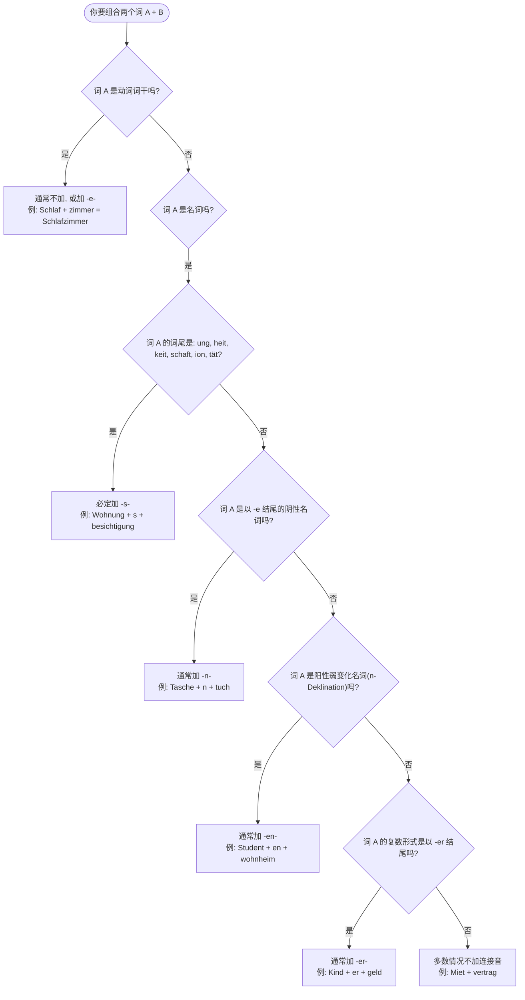

# 复合词 1+1

### 第一部分：所有的词都可以随意组合吗？

**简短的回答是：在语法上，是的；在逻辑上，不是。**

你可以把德语单词想象成**乐高积木**。

理论上，你可以把任意数量的积木拼在一起，只要它们能传达一个具体、有逻辑的意思。但在这个拼凑的过程中，有一个不可撼动的铁律：

- **火车头（Bestimmungswort / 限定词）：** 提供具体信息，说明这个东西“是什么样的”、“用来做什么的”。它可以是名词、动词、形容词。
- **火车尾（Grundwort / 基础词）：** 永远是**名词**！它决定了这个复合词的**词性（der/die/das）**和**复数形式**。

**【生活场景举例：找工作】**

- _die Arbeit_ (工作) + _der Vertrag_ (合同) = **der** Arbeitsvertrag (工作合同) -> 词性跟着 _Vertrag_ 走。
- _probe_ (试用的，来自动词 probieren) + _die Zeit_ (时间) = **die** Probezeit (试用期)。

所以，只要符合生活常理，你甚至可以==自己“发明”词汇==。比如在疫情期间，德国人就发明了 _Geisterspiel_（幽灵+比赛=无观众比赛）。

---

### 第二部分：让人头疼的“连接音”（Fugenlaute）

把两个坚硬的乐高积木硬塞在一起，有时候会“硌牙”（发音拗口）。为了让发音顺畅，或者因为历史词源的保留，德国人会在两个词中间涂一点“润滑剂”——这就是**连接音（Fugenlaute）**，主要有 **-s-, -n/en-, -e-, -er-**。

虽然没有 100%完美的数学公式（总有例外），但掌握以下几个核心规律，就能解决你 90%的问题。

为了让你更直观地理解，我为你绘制了一张决策图表：

代码段

我们来详细拆解这些规律，并结合你未来在德国的移民生活场景：

#### 1. 绝对要加 `-s-` 的情况（最常见）

当第一个词（名词）的后缀是 **-ung, -heit, -keit, -schaft, -ion, -tät, -tum** 时，**100% 必须加上 -s-**。
- [!] 注意， 这里指的不是所有阴性名词，而是上面这些以特定后缀结尾的单词

- _die Wohnung_ (公寓) + _die Besichtigung_ (看房) = **die Wohnungsbesichtigung** (看房活动，租房必备)
- _die Gesundheit_ (健康) + _die Karte_ (卡) = **die Gesundheitskarte** (医保卡，看病必备)
- _die Qualität_ (质量) + _die Kontrolle_ (控制) = **die Qualitätskontrolle** (质量控制)

_注：有时候==即使不是这些后缀，一些阴性名词也会加 -s-==，比如 die Arbeit + s + vertrag = der Arbeitsvertrag。_

#### 2. 通常要加 `-n-` 或 `-en-` 的情况

这通常与名词的复数形式有关，或者为了发音流畅。

- **以 -e 结尾的阴性名词：** 加上 `-n-`
    - _die Tasche_ (口袋) + _das Tuch_ (布) = **das Taschentuch** (纸巾)
    - _die Woche_ (周) + _das Ende_ (结束) = **das Wochenende** (周末)
- **阳性弱变化名词（n-Deklination）：** 加上 `-en-` （这类词本身在变格时就需要加 en）
    - _der Student_ (大学生) + _das Wohnheim_ (宿舍) = **das Studentenwohnheim** (学生宿舍)
    - _der Patient_ (病人) + _die Akte_ (档案) = **die Patientenakte** (病历)

#### 3. 通常要加 `-er-` 的情况

如果第一个词的**复数形式**本身就是以 -er 结尾的，通常直接把复数形式拿来当词头。

- _das Kind_ (孩子，复数是 Kinder) + _das Geld_ (钱) = **das Kindergeld** (儿童金，去政府部门申请)
- _das Bild_ (照片，复数是 Bilder) + _das Buch_ (书) = **das Bilderbuch** (画册)

#### 4. 什么都不加的情况（Nullfuge）

如果第一个词是形容词，或者第一个词在发音上已经很“完整”且不易产生冲突，通常什么都不加。

- **形容词 + 名词：**
    - _alt_ (老/旧) + _der Bau_ (建筑) = **der Altbau** (老建筑，德国租房常见房型)
    - _kalt_ (冷) + _die Miete_ (租金) = **die Kaltmiete** (冷租金/基础租金)
- **部分动词词干 + 名词：**
    - _schlafen_ (睡觉，去掉 en) + _das Zimmer_ (房间) = **das Schlafzimmer** (卧室)
    - _mieten_ (租，去掉 en) + _der Vertrag_ (合同) = **der Mietvertrag** (租房合同)

---

### 给你的六个月 B 2 学习规划建议

要在半年内拿下 B 2，你需要极高的纪律性和策略：

- **第 1-2 个月（突破 A 1-A 2）：** 不要死磕复合词的连接音！遇到一个记一个（把 _Arbeitsvertrag_ 当作一个全新单词背，而不是背 _Arbeit_ + _s_ + _vertrag_）。重点放在基础语法：动词变位、名词性数格（der/die/das 是你的命脉）、介词。
- **第 3-4 个月（稳固 B 1）：** 你会开始遇到大量的从句（dass, weil, obwohl）和带 zu 的不定式。这时候你必须掌握动词放在句子最后的规则。复合词方面，利用我上面教你的后缀规律（-ung, -heit 等）去反推长单词的意思。比如看到 _Aufenthaltserlaubnis_，立刻拆成 _Aufenthalt_ (居留) + _s_ + _Erlaubnis_ (许可) = 居留许可。