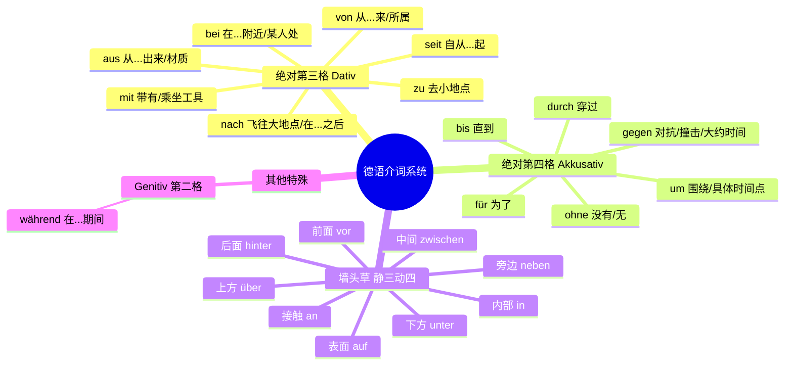
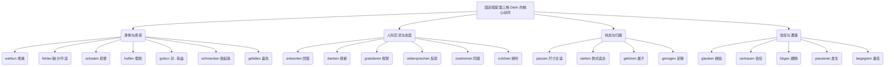
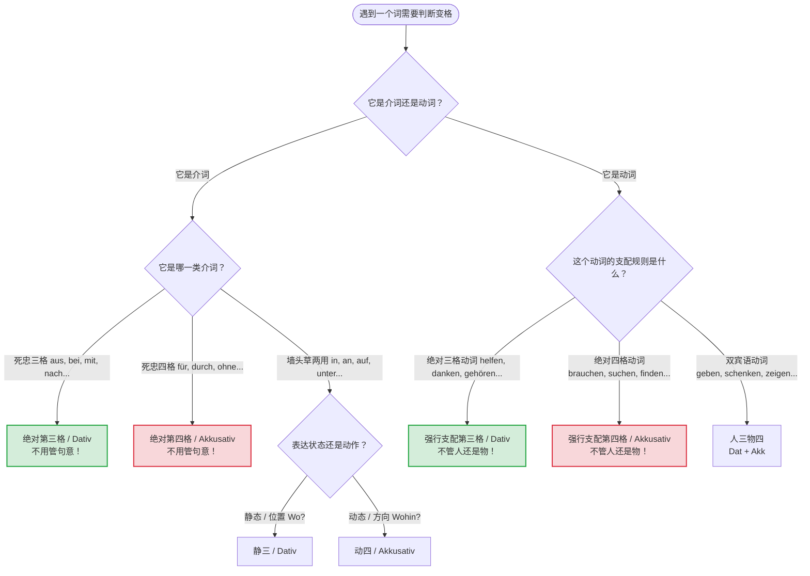
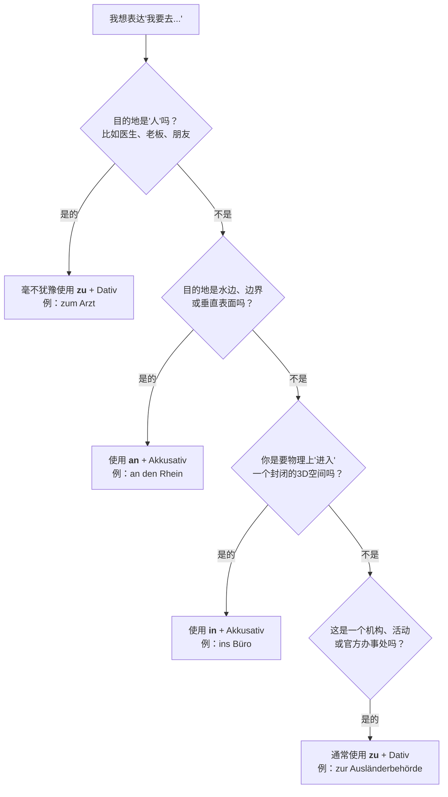

# 格 与 介词 动词的固定搭配

### 🗺️ 第一模块：时空导航仪 —— 介词的绝对法则

我们先用一张图把你的介词笔记梳理清楚。在德国生活，找路、看时间、理解合同全靠它们。

变格时刻

双宾：人三物四

动词：利害三受四，

介词：静三动四

固定动介要牢记

![[40 第四格补足语及定冠词的变化#^009vkj]]

- ? 标准德语语法这本书里面，要求四格的介词就有七个三格单词就有二十个

### 一、 第四格 (Akkusativ) 介词：从5个到7个

核心5将你已经熟记了：_durch, für, gegen, ohne, um_。 书上多出来的往往是这几个：

1. **bis (直到):** * _大师解析：_ 我之前没把它算进“死忠四格”，是因为它是个“渣男”。它在实际生活中**极少单独使用**，经常和其他介词混在一起变成混合体（比如 _bis zu + Dativ_, _bis auf + Akkusativ_）。只有在直接加无冠词的地名/年份时，它才是纯正的第四格（如 _Der Zug fährt bis Berlin._）。
2. **wider (违背/反对):**
    - _大师解析：_ 这是一个非常书面、甚至有些文言文色彩的词。日常生活中我们用 _gegen_。你只需要在B2阅读里认识它就行，比如固定搭配：_wider Willen_ (违背意愿)。
3. **entlang (沿着):**
    - _大师解析：_ 这是一个“叛逆者”！它要求第四格时，**必须放在名词的后面**！比如：_Wir gehen die Straße entlang._ (我们沿着这条街走。)

---

### 二、 第三格 (Dativ) 介词：那浩浩荡荡的20个大军

核心8将：_aus, außer, bei, mit, nach, seit, von, zu_。（这8个你每天开口都要用） 书上多出来的10几个，大部分是你在**看新闻、读合同、收到外管局公函**时才会遇到的“高级词汇”。我给你挑几个B2级别必须要认识的：

1. **ab (从...起 - 表时间或地点):**
    - _场景：_ _Ab dem 1. Oktober_ (从10月1日起)。非常常用！
2. **gegenüber (在...对面 / 对待...):**
    - _场景：_ 指路必备！而且它和 _entlang_ 一样喜欢作妖，常放在名词或代词**后面**。_Er sitzt mir gegenüber._ (他坐在我对面。)
3. **entgegen (迎着 / 与...相反):**
    - _场景：_ 高级表达。_Entgegen allen Erwartungen..._ (出乎所有人的意料...)
4. **dank (多亏了 / 因为):**
    - _场景：_ _Dank seiner Hilfe..._ (多亏了他的帮忙...)
5. **根据/依照类 (公文最爱):** * _gemäß, laut, zufolge, entsprechend..._ 这些在B2的阅读理解里会疯狂出现，告诉你“根据法律规定...”。
6. **老古董类 (连同/以及):**
    - _samt, nebst..._ 这些词你这辈子大概率不会在口语里用，它们的意思和 _mit_ 差不多，只存在于极为正式的法律文件或古早文学里。

#### 🛠️ 核心场景实战：

* **时间法则（精确到分秒）：**
    * `um` (定点): **um** 14:00 Uhr (在两点整)
    * `am` (天/日期/星期/时段): **am** Montag, **am** Morgen, **am** 1. Oktober.
    * `im` (月/季/年内): **im** Januar, **im** Sommer, **in** fünf Minuten (5 分钟**后**).
    * `seit` (过去持续到现在, 加三格): **Seit** einem Monat lebe ich in Berlin. (我在柏林住了一个月了。)
    * `von... bis...` (从... 到...): Das Rathaus ist **von** 9 **bis** 12 Uhr geöffnet. (市政厅 9 点到 12 点开门。)
    * `vor` (在... 之前, 加三格): **Vor** zehn Uhr haben wir keinen Unterricht. (10 点前没课。)
    * `während` (高级语法，第二格): **Während** der Arbeit darf man nicht rauchen. (工作期间不许抽烟。)
* **地点法则（去哪办事）：**
    * `an` (接触/水边): **am** Meer (在海边), **am** Ausgang (在出口).
    * `auf` (广场/市场): **auf** dem Markt (在市场上).
    * `in` (建筑内部): **in** der Fabrik (在工厂里).
    * `um die Ecke` (在拐角处 - 静态); `in die Ecke` (到角落里去 - 动态).
* **动作补充：**
    * `durch`: **durch** die Stadt (穿过城市).
    * `gegen`: Er fährt **gegen** den Baum. (他撞树上了。)
    * `ohne` (后常无冠词): Kaffee **ohne** Zucker. (不加糖的咖啡。)

---

### 动词与静三动四

你笔记里的 `liegen/legen`, `stehen/stellen` 等是非常经典的难点。记住大师的绝招：

**“动作（Akk）像录像，状态（Dat）像照片。”**

* **Akkusativ (第四格) = 录像 (Wohin? 去哪里?)** -> 你在做一个有方向的动作。
* **Dativ (第三格) = 照片 (Wo? 在哪里?)** -> 动作已经完成，东西稳稳地停在那儿。

| 动作动词 (动四 - 录像) | 状态动词 (静三 - 照片) | 移民生活场景应用 |
| :--- | :--- | :--- |
| **legen** (平放) | **liegen** (平躺着) | **A:** Ich **lege** den Vertrag auf **den** Tisch. **D:** Der Vertrag **liegt** auf **dem** Tisch. (合同在桌上) |
| **stellen** (竖放) | **stehen** (竖立着) | **A:** Er **stellt** die Lampe auf **den** Schreibtisch. **D:** Die Lampe **steht** auf **dem** Schreibtisch. |
| **setzen** (使坐下) | **sitzen** (坐着) | **A:** Ich **setze** mich an **den** Tisch. **D:** Sie **sitzt** am (an+dem) Tisch. |
| **hängen** (挂上去) | **hängen** (悬挂着) | **A:** Ich **hänge** die Landkarte an **die** Wand. **D:** Die Landkarte **hängt** an **der** Wand. |

---

### 大量动词与格的示例

你列出了一大堆动词。为了让你的大脑能装下它们，我把它们按照“支配规律”和“生活场景”重新分装。

#### 1. 霸道总裁：只支配第三格 (Dativ)

* **es geht + D:** Wie geht es **Ihnen**? Es geht **mir** sehr gut. (您好吗？我很好。)
* **es gefällt + D:** Die Wohnung gefällt **mir**. (我很喜欢这个公寓。)
* **es schmeckt + D:** Es schmeckt **ihm** gut. (这很合他的胃口。) *注：也可说 schmecken + Adj.*
* **helfen + D (+ bei D):** Ich helfe **dir** bei der Arbeit. (我帮你工作。)
* **danken + D (+ für A):** Ich danke **Ihnen** für die Hilfe. (感谢您的帮助。)
* **gratulieren + D (+ zu D):** Ich gratuliere **dir** zum Geburtstag. (祝你生日快乐。)

#### 2. 慷慨老板：双宾语 (人三物四 Dat + Akk)

口诀：**给予、讲述、展示类动作，通常对人（三格），给物（四格）。**

* **anbieten:** Wir bieten **Ihnen** (三) viele Reisen (四) an. (我们为您提供很多旅行。)
* **mitbringen:** Bringst du **mir** (三) einen Kaffee (四) mit? (你能给我带杯咖啡吗？)
* **schenken:** Er schenkt **ihr** (三) Blumen (四). (他送她花。)
* **schreiben:** Ich schreibe **ihm** (三) einen Brief (四). (我给他写信。)
* **wünschen:** Ich wünsche **Ihnen** (三) viel Erfolg (四). (祝您成功。)
* **zeigen:** Können Sie **mir** (三) den Weg (四) zeigen? (能给我指路吗？)
* **erzählen (+ D + über A / von D):** Er erzählt **mir** (三) von seiner Heimat. (他向我讲述他的家乡。)

#### 3. 绝对主力：支配第四格 (Akkusativ)

你笔记里的词绝大多数都在这里，我按生活场景帮你分类打包，方便你写作文和口语直接用：

* **🏢 行政/办事类：**
    * **ausfüllen** (填写): das Formular ausfüllen (填表格)
    * **aufschreiben** (写下): die Adresse aufschreiben (记下地址)
    * **aufgeben** (交付/放弃): ein Telefax aufgeben (发传真) / Ich gebe auf (我放弃了)
    * **bekommen** / **zurückbekommen** (收到/拿回): den Pass zurückbekommen (拿回护照)
    * **buchen** (预订): ein Ticket buchen (订票)
    * **brauchen** / **gebrauchen** (需要/使用): Ich brauche Zeit. (我需要时间。)
* **🤝 社交/日常互动：**
    * **besuchen** (拜访): einen Freund besuchen (拜访朋友)
    * **begrüßen** (问候): den Chef begrüßen (向老板问候)
    * **kennen lernen** (认识): neue Leute kennen lernen (认识新朋友)
    * **treffen** (遇见): einen Kollegen treffen (碰见同事)
    * **verstehen** (理解): Ich verstehe dich nicht. (我不理解你。)
* **🛒 消费/生活类：**
    * **kaufen** (买), **kosten** (花费/价值): Das Auto kostet viel Geld.
    * **essen** (吃), **trinken** (喝), **kochen** (煮), **rauchen** (抽烟)
    * **holen** (取/拿): das Paket holen (取包裹)
    * **sparen** (节约): Geld sparen (存钱/省钱)
* **👀 感官/思维类：**
    * **sehen** (看见), **lesen** (阅读), **sagen** (说), **singen** (唱歌)
    * **finden** (找到/觉得): Ich finde dich schön. (我觉得你很美。)
    * **vergessen** (忘记 - 换元音 e->i: du vergisst): den Termin vergessen (忘记预约)
    * **lernen** (学习技能), **studieren** (大学学习)
    * **erleben** (经历/体验): etwas Neues erleben
* **🏃 动作/物理类：**
    * **nehmen** (拿/取), **mitnehmen** (捎带)
    * **halten** (握着/停下), **tragen** (扛/穿戴), **werfen** (投掷 - wirft, hat geworfen)
    * **brechen** (折断 - bricht, brach, ist/hat gebrochen)
    * **öffnen** (打开), **einschalten** (接通/打开电器): Schalten Sie das Radio ein!
    * **herumblättern** (浏览)
* **🔄 特殊反身动词 (加第四格反身代词 sich)：**
    * **sich ausruhen** (休息)
    * **sich fühlen** (感觉): Sie fühlen sich gesund und munter! (他们感觉健康又精神！)
    * **sich freuen** (使高兴): Es freut mich. (我很高兴 - 这里 mich 是 Akk)
    * **sich waschen** (洗脸/洗澡): Waschen Sie sich kalt! (您用冷水洗吧！)
    * **sich tasten** (摸索)
    * *(注：`sich D + A holen` 意思是“给自己招惹/染上...”，如 Ich habe mir eine Erkältung geholt 我染上了感冒。)*
* **🌟 存在句型：**
    * **es gibt + A** (有...): Es gibt hier einen Supermarkt. (这儿有个超市。)

#### 4. 固定介词搭配 (动词的死党)

* **einverstanden sein + mit (D):** Wenn Sie mit dieser Reise einverstanden sind. (如果您同意这次旅行。)
* **zufrieden sein + mit (D):** Ich bin mit dem Gehalt zufrieden. (我对薪水很满意。)
* **sprechen + über (A):** Wir sprechen über das Wetter. (我们谈论天气。)
* **hoffen + auf (A):** Ich hoffe auf eine schnelle Antwort. (我希望能尽快收到回复。)

---

### 🧩 第四模块：句子中的红绿灯 —— 连词与副词

* **不占位连词 (ADUSO):** `aber` (但是), `denn` (因为), `und` (和), `sondern` (而是), `oder` (或者)。
    *大师提示：* 这些词在句首时，**不占句子的第一位**，后面的主语仍然算第一位，动词依然雷打不动放在第二位！
* **日常口语副词：**
    * `aus` (结束/关着): Um diese Zeit sind die Schulen aus. (这个时候学校已经放学了。)
    * `zu` (关闭): Sonntags sind in der Regel Geschäfte zu. (周日商店通常是关门的。)

---

### 🎤 大师的随堂测验 (轮到你出招了)

为了检验你是否掌握了今天的“死忠粉介词”、“墙头草静三动四”和“霸道总裁动词”，请你用德语帮我翻译下面这个**“去市政厅办户口登录”**的场景：

1.  **我乘公交车去市政厅 (Rathaus)。** (提示：用 mit 和 zu)
2.  **我把我的护照 (Pass) 放在了桌子上。** (提示：动作！用 legen 和 auf)
3.  **工作人员 (der Mitarbeiter) 帮我填写了表格。** (提示：用 helfen 和 bei，填表格用 ausfüllen)

试着写一下，写错了不要紧，你的“德语大师”会为你精准分析！告诉我你的答案吧！

# 1 背变格动介词就看这里

- 变格时刻
	- 双宾：人三物四
	- 动词：利害三受四，
	- 介词：静三动四
	- 动词，进行状态用第三，状态结束用第四

固定动介要牢记

### 一、 介词篇：“死忠粉” vs “墙头草”

在德语的介词世界里，并不是所有词都在乎你是“静止”还是“运动”。大部分介词都是**“死忠粉”**，它们一辈子只认一个格，天王老子来了（句意再怎么变）也不改！

#### 1. 绝对第三格（Dativ）的“死忠粉”介词

这些介词只要一出场，后面的名词/代词**必须、一定、绝对**是第三格。你完全不需要考虑动作是动态还是静态。

- **口诀记忆：** [aus]{来自; 由于}, [außer]{除了, 除... 以外}, bei, mit, [nach]{在... 以后; 根据}, [seit]{自从, 从... 起, 从... 以来}, von, zu
	- 故事记忆:	“我出自（aus）一个偏远小镇，出发时除了（außer）一条狗什么也没有。 但在（bei）家人的支持下，我带着（mit）行李， 坚定地前往（nach）柏林。 自从（seit）那天起，我从（von）早努力到晚， 最终走向（zu）了人生的巅峰。”
- **【移民生活场景 - 去外管局办事】：**
    - Ich fahre **mit dem Bus** **zum Ausländeramt**. (我乘公交车去外管局。)
    - _大师解析：_ 这里明明有一个强烈的位移（动），但因为遇到了死忠粉 `mit` (带有、乘) 和 `zu` (去...)，它们后面必须牢牢钉死在第三格（dem Bus, dem Ausländeramt）。绝对不能用第四格！

#### 2. 绝对第四格（Akkusativ）的“死忠粉”介词

这些介词出场，后面**必须**是第四格，毫无商量余地。

- **口诀记忆：** durch, für, [gegen]{反对; 朝; 向}, [ohne]{没有; 除... 以外}, [um]{关于; 围绕}
	- **D-O-G-F-U （狗功夫）** 提取这5个介词的首字母，你会得到：
		- **D** urch (穿过)
		- **O** hne (没有)
		- **G** egen (反对/撞上)
		- **F** ür (为了)
		- **U** m (围绕)
		- **组合记忆：“DOG-FU”（狗功夫）**。 _联想画面：_ 想象一只霸道的狗（Dog）在打中国功夫（Fu）。这套“狗功夫”非常刚猛、充满力量和动作感，所以它**绝对霸占代表直接宾语的第四格（Akkusativ）**！
- **【移民生活场景 - 租房】：**
    - Dieser Mietvertrag ist nur **für ein Jahr** gültig. (这份租房合同仅一年有效。)
    - _大师解析：_ `für` (为了/对于) 是第四格死忠粉，不管句子什么意思，后面一律第四格（ein Jahr）。

#### 3. 只有它们才是“墙头草”：九大两用介词

你的口诀**“静三动四”仅仅且唯一适用于这9个介词**。它们像墙头草一样，会根据你的动作状态改变阵营。

- **九大护法：** _in, an, auf, neben, hinter, über, unter, vor, zwischen_
- **【移民生活场景 - 找工作与入职】：**
    - **动态 (Wohin? 去哪里? -> 动四)：** Ich lege den Arbeitsvertrag **auf den Tisch**. (我把工作合同放到桌子上。) -> ==伴随动作方向，第四格。==
    - **静态 (Wo? 在哪里? -> 静三)：** Der Arbeitsvertrag liegt **auf dem Tisch**. (工作合同躺在桌子上。) -> ==状态已定，第三格==。

---

## 二、 动词篇：“霸道总裁”自己定规矩

你的口诀“双宾人三物四”非常准确，但它只适用于**能带两个宾语的动词**（比如 geben 给, zeigen 展示, schenken 赠送）。

如果是只带一个宾语的动词，它们就像是**“霸道总裁”**——它们天生自带属性，强行规定后面的宾语必须是第三格还是第四格，**根本不管你后面跟的是“人”还是“物”**！

### 1. 绝对第三格动词（霸道总裁A型）

这类动词数量相对较少，必须死记硬背。它们大多表达一种“利益、归属或交互关系”（即你口诀里的“利害三”），但语法上，它们后面的人或物就是焊死在第三格的。

- **常见词：** _helfen_ (帮助), _danken_ (感谢), _gehören_ (属于), _passen_ (合适),_gefallen/mögen/lieben (喜欢, 注意只有 gefallen 第三格)
- 记住:“【感谢】(danken) 你的【帮助】(helfen)，衣服【合适】(passen)，我【喜欢】(gefallen)，它【属于】(gehören) 我了！”
- **【移民生活场景 - 医疗看病】：**
    - Der Arzt hilft **dem Patienten**. (医生帮助这位病人。)
    - _大师解析：_ `helfen` 这个总裁只招第三格员工，所以病人必须是 `dem Patienten`。
- 三种喜欢的区别: gefallen/mögen/lieben
	- Dativ（第三格）俱乐部： 像 helfen, danken, gehören, passen, gefallen 这些词，确实是必须加第三格的！在德语逻辑里，这些动作不是直接“击中”对象的，==而是“朝着”某个对象的==。比如 gehören（属于），是“这个东西归属于你”；gefallen（讨人喜欢），其实是“这个东西让你感到愉悦”。
	- Akkusativ（第四格）俱乐部： 但是！mögen (喜欢) 和 lieben (爱)，它们跟 haben (有) 一样，是非常直接的动作。==你喜欢一个东西，你爱一个人==，这个东西或人就是你情感的直接靶子，所以它们必须加第四格！

---

#### 1. 身体状况与切身感受 (The "How do you feel" Group)

这类词直接关乎你的健康和感受，第三格通常是“你”这个人（mir, dir, Ihnen）。

- **wehtun (疼痛):** * _医生问：_ Wo tut **es Ihnen** weh? (您哪里痛？_直译：哪里对您产生疼痛？_)
    - _你答：_ Der Magen tut **mir** furchtbar weh. (我胃疼得厉害。)
- **fehlen (缺少/哪里不舒服):** * _医生经典开场白：_ Was fehlt **Ihnen** denn? (您哪里不舒服？)
    - _你答：_ **Mir** fehlt nichts, ich brauche nur ein Rezept. (我没事，我只需要开个处方。)
- **schaden (损害/对...有害):** * _医生嘱咐：_ Zu viel Stress schadet **Ihrer Gesundheit**. (压力过大有损您的健康。)
- **guttun (对...有益):**
    - _医生建议：_ Frische Luft und Ruhe werden **Ihnen** guttun. (新鲜空气和休息会对您有好处。)
- **helfen (帮助):**
    - _你反馈：_ Die Schmerzmittel haben **mir** leider nicht geholfen. (这些止痛药对我没起作用。)

#### 2. 人际交流与态度 (The "Communication" Group)

当你在诊所或外管局办事时，交流对象通常就是第三格。

- **antworten (回答):** Bitte antworten Sie **dem Arzt** genau. (请您准确地回答医生。)
- **zuhören (倾听):** Der Arzt hört **dem Patienten** geduldig zu. (医生耐心地听病人讲述。)
- **zustimmen (同意):** Ich stimme **Ihnen** zu, wir sollten ein Blutbild machen. (我同意您的看法，我们应该验个血。)
- **widersprechen (反驳):** Man sollte **dem Chefarzt** nicht sofort widersprechen. (人们不应该立刻反驳主任医师。)

#### 3. 信任与遭遇 (The "Trust & Happenings" Group)

- **vertrauen / glauben (信任 / 相信):** Sie können **unserem medizinischen Team** vertrauen. (您可以信任我们的医疗团队。)
- **passieren (发生):** Was ist **Ihnen** genau passiert? (您究竟出什么事了/怎么受的伤？)
- **begegnen (遇见/相遇 - 助动词用 sein):** Ich bin heute **meinem Hausarzt** im Supermarkt begegnet. (我今天在超市碰见我的家庭医生了。)

#### 4. 状态与归属 (The "Fit & Belong" Group)

这类词在买衣服或描述物品属性时最常用，但在看病时也会用到。

- **passen (尺寸/时间合适):** Passt **Ihnen** der Termin am Freitag? (周五的预约时间对您合适吗？)
- **gehören (属于):** Gehört diese Versichertenkarte (医保卡) **Ihnen**? (这张医保卡是您的吗？)

---

### 🧠 德语大师的独家记忆口诀 (进阶版)

在你的那句口诀基础上，我们把它扩充为一个完整的小故事，帮你把这些顽固的第三格动词一次性打包带走：

> "【感谢】(**danken**) 你的【帮助】(**helfen**)，衣服【合适】(**passen**)，款式【适合】(**stehen**) 我很【喜欢】(**gefallen**)，现在它【属于】(**gehören**) 我了！
> 
> 去看病时，医生问我哪里【不舒服】(**fehlen**)，哪里【痛】(**wehtun**)，出什么事【发生】(**passieren**) 了。
> 
> 我如实地【回答】(**antworten**) 他，我【相信】(**glauben**) 并【信任】(**vertrauen**) 他的医术，【同意】(**zustimmen**) 他的方案，按照嘱咐【跟随】(**folgen**) 治疗，相信药物一定能对我【有益】(**guttun**)！"

## 2. 绝对第四格动词（霸道总裁B型 - 占绝大多数）

德语中绝大多数及物动词，不管后面跟的是人还是物，统统要求第四格（即你口诀里的“受四”）。

- **常见词：** _brauchen_ (需要), _suchen_ (寻找), _finden_ (找到), _besuchen_ (拜访)
- 记忆: 小女孩在寒冬中【需要】(brauchen) 温暖，她四处【寻找】(suchen) 机会，终于【找到】(finden) 了一份工作，去【拜访】(besuchen) 她的新老板。
- **【移民生活场景 - 社交与求职】：**
    - Ich besuche **meinen Chef**. (我拜访我的老板。) -> 老板是人，但 `besuchen` 要求第四格，所以不用第三格，用第四格！
    - Ich brauche **einen Termin**. (我需要一个预约。) -> `brauchen` 要求第四格。

---

为了让你在脑海中形成绝对清晰的条件反射，我为你制作了一个 Mermaid 决策图表。下次遇到需要变格的时候，请在脑海里走一遍这个流程：

代码段

### 总结大师箴言：

**“静三动四”和“人三物四”是很好的辅助工具，但德语变格的终极BOSS是词汇本身的“词性支配（Rektion）”。** 想要快速达到B2，在背单词的时候，**绝对不能只背中文意思**，必须连着它的“死忠格”一起背（比如：不要只背 _helfen = 帮助_，要背 _jemandem(D) helfen_）。

---

# 介词 in, zu 和 an 区别

我想给你出3道关于“去市政厅办理户口登录 (Anmeldung)”的实战造句题，里面故意混杂了“死忠粉”和“墙头草”。**你需要我把题目发出来，让你试着填空并讲解吗？**

今天我们来啃一块硬骨头：**空间介词 `in` , `zu` , `an` 的区别与用法**。

很多初学者在表达“去哪儿”时，往往会被这三个词搞晕。其实，你只要在脑海中建立一个**“3 D 空间与 GPS 导航”**的模型，就能轻松破解这个难题。

在我们详细拆解之前，不妨先看看这张为你准备的决策流程图。当你想说“我要去……”时，按照这个逻辑走，几乎不会出错：
人用 zu
边界垂直用 an
封闭 3 D 空间用 in(绝不能用于人)
具体地点用 zu

---

### 1. `in`：进入内部的“3 D 穿梭机”

**核心概念**：`in` 强调的是**穿越边界，进入一个封闭的、三维立体的内部空间**（就像你钻进了一个盒子里）。

**语法重点**：表达“去里面”（动态），后面必须加 **第四格（Akkusativ）**。

**移民生活实战场景**：

- **🏥 医疗**：当你真的要走进一家医院的大门时。
    - _Ich fahre jetzt **ins Krankenhaus**._ (我正在去医院的路上。-> 强调我要进到这栋建筑里面去。)
- **🏠 租房**：当你搬进一个新的四面有墙的物理空间。
    - _Nächsten Monat ziehen wir **in eine neue Wohnung**._ (下个月我们要搬进一套新公寓。)
- **🛒 日常**：走进超市购物。
    - _Ich gehe **in den Supermarkt**._ (我走进超市。)

---

### 2. `an`：接触边界的“贴纸”

**核心概念**：`an` 强调的是**来到某个事物的边缘、水边，或者贴在某个表面上**，但你**没有**钻进去。就像你把一张贴纸贴在墙上，或者你走到悬崖边停下来。

**语法重点**：表达“去边缘/水边”（动态），后面加 **第四格（Akkusativ）**。

**移民生活实战场景**：

- **💼 找工作/办公**：你去到办公桌前坐下（你不可能钻进桌子内部，对吧？你是靠在桌子边缘）。
    - _Ich setze mich **an den Schreibtisch**, um meinen Lebenslauf zu schreiben._ (我坐到书桌前写我的简历。)
- **🗺️ 行政/地理**：来到德国的边境，或者周末去莱茵河畔散步。
    - _Wir fahren am Wochenende **an den Rhein**._ (我们周末去莱茵河边。)
- **🏢 办事**：走到接待窗口前（停在玻璃或者柜台前）。
    - _Bitte treten Sie **an den Schalter**._ (请走到窗口前。)

---

### 3. `zu`：设定 GPS 目标的“导航仪”

**核心概念**：`zu` 是最抽象的。它就像你在谷歌地图上输入了一个目的地，它只强调**“朝着那个方向和目标去”**，并不关心你最后有没有真的走进去。

**⚠️ 德语大师绝对法则**：**去见“人”，永远只能用 `zu`！**（千万别用 `in`，如果你说 _Ich gehe in den Arzt_，德国人会以为你要钻进医生的肚子里去，这太惊悚了！）

**语法重点**：`zu` 是一个“死硬派”介词，无论动态静态，**它后面永远、永远只能加第三格（Dativ）！**

**移民生活实战场景**：

- **👨‍⚕️ 医疗（看人）**：去看医生。
    - _Ich muss morgen **zum Arzt** gehen._ (我明天得去看医生。 -> `zu dem` 缩写为 `zum` )
- **🏢 行政办事（去机构）**：去外管局延签、去面试。强调去参与某项事务或找办事员。
    - _Ich fahre **zur Ausländerbehörde**, um mein Visum zu verlängern._ (我去外管局为了延签。 -> `zu der` 缩写为 `zur` )
    - _Ich bin **zum Vorstellungsgespräch** eingeladen._ (我受邀去参加面试。)
- **🙋‍♂️ 社交**：去朋友家。
    - _Ich gehe heute Abend **zu Thomas**._ (我今晚去托马斯家/找托马斯。)

---

### 💡 德语大师的“防错避坑指南”

很多同学会问：“老师，医院是封闭建筑，外管局也是封闭建筑，为什么去医院用 `in` (ins Krankenhaus)，去外管局却常用 `zu` (zur Ausländerbehörde) ？”

**大师解答**：

- 当你使用 ** `in` **，你强调的是**建筑的物理属性**（我要进去避雨，我要进去住院）。
- 当你使用 ** `zu` **，你强调的是**机构的功能属性**（我要去办事，办理签证）。
- 所以：你可以说 _Ich gehe ins Büro._ (我走进办公室这个房间)；也可以说 _Ich gehe zur Arbeit._ (我去上班，这是去一项活动/功能)。

---

### 🏋️‍♂️ 你的实战演练（B 1-B 2 过渡期测试）

不要光听不练，现在请你运用上面的“3 D 空间与 GPS 逻辑”，帮我填入正确的介词（注意格的变位：ins / in die / zum / zur / an den 等）：

1. 肚子疼得受不了，我要去找医生。

    _Ich gehe _____ Arzt._

2. 我刚租了房子，现在要把沙发搬进客厅。

    _Ich trage das Sofa _____ Wohnzimmer._

3. 面试官让我坐到桌子旁边。

    _Der Interviewer bittet mich, mich _____ Tisch zu setzen._

请在回复中告诉我你的答案！如果你能在六个月里坚持这种“逻辑推导+场景实战”的学习法，B 2 考试的完形填空和口语表达对你来说就是小菜一碟。

**下一步，你想先测试一下上面的三个小题让我为你批改，还是希望我直接为你量身定制这六个月冲击 B 2 的学习规划建议表？**
