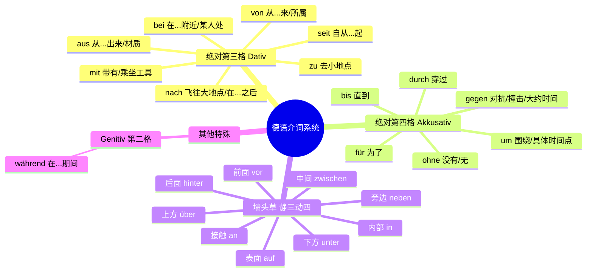

# 格 与 介词 动词的固定搭配

### 🗺️ 第一模块：时空导航仪 —— 介词的绝对法则

我们先用一张图把你的介词笔记梳理清楚。在德国生活，找路、看时间、理解合同全靠它们。

#### 🛠️ 核心场景实战：

* **时间法则（精确到分秒）：**
    * `um` (定点): **um** 14:00 Uhr (在两点整)
    * `am` (天/日期/星期/时段): **am** Montag, **am** Morgen, **am** 1. Oktober.
    * `im` (月/季/年内): **im** Januar, **im** Sommer, **in** fünf Minuten (5 分钟**后**).
    * `seit` (过去持续到现在, 加三格): **Seit** einem Monat lebe ich in Berlin. (我在柏林住了一个月了。)
    * `von... bis...` (从... 到...): Das Rathaus ist **von** 9 **bis** 12 Uhr geöffnet. (市政厅 9 点到 12 点开门。)
    * `vor` (在... 之前, 加三格): **Vor** zehn Uhr haben wir keinen Unterricht. (10 点前没课。)
    * `während` (高级语法，第二格): **Während** der Arbeit darf man nicht rauchen. (工作期间不许抽烟。)
* **地点法则（去哪办事）：**
    * `an` (接触/水边): **am** Meer (在海边), **am** Ausgang (在出口).
    * `auf` (广场/市场): **auf** dem Markt (在市场上).
    * `in` (建筑内部): **in** der Fabrik (在工厂里).
    * `um die Ecke` (在拐角处 - 静态); `in die Ecke` (到角落里去 - 动态).
* **动作补充：**
    * `durch`: **durch** die Stadt (穿过城市).
    * `gegen`: Er fährt **gegen** den Baum. (他撞树上了。)
    * `ohne` (后常无冠词): Kaffee **ohne** Zucker. (不加糖的咖啡。)

---

### 🪑 第二模块：“孪生兄弟” —— 姿势动词与静三动四

你笔记里的 `liegen/legen`, `stehen/stellen` 等是非常经典的难点。记住大师的绝招：

**“动作（Akk）像录像，状态（Dat）像照片。”**

* **Akkusativ (第四格) = 录像 (Wohin? 去哪里?)** -> 你在做一个有方向的动作。
* **Dativ (第三格) = 照片 (Wo? 在哪里?)** -> 动作已经完成，东西稳稳地停在那儿。

| 动作动词 (动四 - 录像) | 状态动词 (静三 - 照片) | 移民生活场景应用 |
| :--- | :--- | :--- |
| **legen** (平放) | **liegen** (平躺着) | **A:** Ich **lege** den Vertrag auf **den** Tisch. **D:** Der Vertrag **liegt** auf **dem** Tisch. (合同在桌上) |
| **stellen** (竖放) | **stehen** (竖立着) | **A:** Er **stellt** die Lampe auf **den** Schreibtisch. **D:** Die Lampe **steht** auf **dem** Schreibtisch. |
| **setzen** (使坐下) | **sitzen** (坐着) | **A:** Ich **setze** mich an **den** Tisch. **D:** Sie **sitzt** am (an+dem) Tisch. |
| **hängen** (挂上去) | **hängen** (悬挂着) | **A:** Ich **hänge** die Landkarte an **die** Wand. **D:** Die Landkarte **hängt** an **der** Wand. |

---

### 👑 第三模块：动词的“王权支配” (全面收录你的词库)

你列出了一大堆动词。为了让你的大脑能装下它们，我把它们按照“支配规律”和“生活场景”重新分装。

#### 1. 霸道总裁：只支配第三格 (Dativ)

* **es geht + D:** Wie geht es **Ihnen**? Es geht **mir** sehr gut. (您好吗？我很好。)
* **es gefällt + D:** Die Wohnung gefällt **mir**. (我很喜欢这个公寓。)
* **es schmeckt + D:** Es schmeckt **ihm** gut. (这很合他的胃口。) *注：也可说 schmecken + Adj.*
* **helfen + D (+ bei D):** Ich helfe **dir** bei der Arbeit. (我帮你工作。)
* **danken + D (+ für A):** Ich danke **Ihnen** für die Hilfe. (感谢您的帮助。)
* **gratulieren + D (+ zu D):** Ich gratuliere **dir** zum Geburtstag. (祝你生日快乐。)

#### 2. 慷慨老板：双宾语 (人三物四 Dat + Akk)

口诀：**给予、讲述、展示类动作，通常对人（三格），给物（四格）。**

* **anbieten:** Wir bieten **Ihnen** (三) viele Reisen (四) an. (我们为您提供很多旅行。)
* **mitbringen:** Bringst du **mir** (三) einen Kaffee (四) mit? (你能给我带杯咖啡吗？)
* **schenken:** Er schenkt **ihr** (三) Blumen (四). (他送她花。)
* **schreiben:** Ich schreibe **ihm** (三) einen Brief (四). (我给他写信。)
* **wünschen:** Ich wünsche **Ihnen** (三) viel Erfolg (四). (祝您成功。)
* **zeigen:** Können Sie **mir** (三) den Weg (四) zeigen? (能给我指路吗？)
* **erzählen (+ D + über A / von D):** Er erzählt **mir** (三) von seiner Heimat. (他向我讲述他的家乡。)

#### 3. 绝对主力：支配第四格 (Akkusativ)

你笔记里的词绝大多数都在这里，我按生活场景帮你分类打包，方便你写作文和口语直接用：

* **🏢 行政/办事类：**
    * **ausfüllen** (填写): das Formular ausfüllen (填表格)
    * **aufschreiben** (写下): die Adresse aufschreiben (记下地址)
    * **aufgeben** (交付/放弃): ein Telefax aufgeben (发传真) / Ich gebe auf (我放弃了)
    * **bekommen** / **zurückbekommen** (收到/拿回): den Pass zurückbekommen (拿回护照)
    * **buchen** (预订): ein Ticket buchen (订票)
    * **brauchen** / **gebrauchen** (需要/使用): Ich brauche Zeit. (我需要时间。)
* **🤝 社交/日常互动：**
    * **besuchen** (拜访): einen Freund besuchen (拜访朋友)
    * **begrüßen** (问候): den Chef begrüßen (向老板问候)
    * **kennen lernen** (认识): neue Leute kennen lernen (认识新朋友)
    * **treffen** (遇见): einen Kollegen treffen (碰见同事)
    * **verstehen** (理解): Ich verstehe dich nicht. (我不理解你。)
* **🛒 消费/生活类：**
    * **kaufen** (买), **kosten** (花费/价值): Das Auto kostet viel Geld.
    * **essen** (吃), **trinken** (喝), **kochen** (煮), **rauchen** (抽烟)
    * **holen** (取/拿): das Paket holen (取包裹)
    * **sparen** (节约): Geld sparen (存钱/省钱)
* **👀 感官/思维类：**
    * **sehen** (看见), **lesen** (阅读), **sagen** (说), **singen** (唱歌)
    * **finden** (找到/觉得): Ich finde dich schön. (我觉得你很美。)
    * **vergessen** (忘记 - 换元音 e->i: du vergisst): den Termin vergessen (忘记预约)
    * **lernen** (学习技能), **studieren** (大学学习)
    * **erleben** (经历/体验): etwas Neues erleben
* **🏃 动作/物理类：**
    * **nehmen** (拿/取), **mitnehmen** (捎带)
    * **halten** (握着/停下), **tragen** (扛/穿戴), **werfen** (投掷 - wirft, hat geworfen)
    * **brechen** (折断 - bricht, brach, ist/hat gebrochen)
    * **öffnen** (打开), **einschalten** (接通/打开电器): Schalten Sie das Radio ein!
    * **herumblättern** (浏览)
* **🔄 特殊反身动词 (加第四格反身代词 sich)：**
    * **sich ausruhen** (休息)
    * **sich fühlen** (感觉): Sie fühlen sich gesund und munter! (他们感觉健康又精神！)
    * **sich freuen** (使高兴): Es freut mich. (我很高兴 - 这里 mich 是 Akk)
    * **sich waschen** (洗脸/洗澡): Waschen Sie sich kalt! (您用冷水洗吧！)
    * **sich tasten** (摸索)
    * *(注：`sich D + A holen` 意思是“给自己招惹/染上...”，如 Ich habe mir eine Erkältung geholt 我染上了感冒。)*
* **🌟 存在句型：**
    * **es gibt + A** (有...): Es gibt hier einen Supermarkt. (这儿有个超市。)

#### 4. 固定介词搭配 (动词的死党)

* **einverstanden sein + mit (D):** Wenn Sie mit dieser Reise einverstanden sind. (如果您同意这次旅行。)
* **zufrieden sein + mit (D):** Ich bin mit dem Gehalt zufrieden. (我对薪水很满意。)
* **sprechen + über (A):** Wir sprechen über das Wetter. (我们谈论天气。)
* **hoffen + auf (A):** Ich hoffe auf eine schnelle Antwort. (我希望能尽快收到回复。)

---

### 🧩 第四模块：句子中的红绿灯 —— 连词与副词

* **不占位连词 (ADUSO):** `aber` (但是), `denn` (因为), `und` (和), `sondern` (而是), `oder` (或者)。
    *大师提示：* 这些词在句首时，**不占句子的第一位**，后面的主语仍然算第一位，动词依然雷打不动放在第二位！
* **日常口语副词：**
    * `aus` (结束/关着): Um diese Zeit sind die Schulen aus. (这个时候学校已经放学了。)
    * `zu` (关闭): Sonntags sind in der Regel Geschäfte zu. (周日商店通常是关门的。)

---

### 🎓 你的“六个月冲刺 B 2”专属学习规划

要达到在德国顺畅生活和通过 B 2 考试的要求，光背单词是不够的。你需要按照以下节奏进行：

* **第 1-2 个月（夯实 B 1 骨架）：** 把今天整理的**介词**和**静三动四**彻底融入肌肉记忆。
    * *任务：* 每天用新学的动词造 3 个完整的句子，必须包含“介词+地点/时间”。
* **第 3-4 个月（攻克 B 2 长难句与从句）：** 重点学习带 **zu 的不定式**、**关系从句 (Relativsatz)** 以及本文提到的**固定介词搭配动词**。
    * *任务：* 尝试把两个简单的句子用连词（weil, dass, obwohl）或关系代词连起来。
* **第 5-6 个月（高级表达与应试技巧）：** 引入**被动语态 (Passiv)** 和 **虚拟式 (Konjunktiv II)**。
    * *任务：* 模拟真实场景，比如用虚拟式写一封委婉的“租房申请信” (Ich hätte gern... / Könnten Sie mir bitte...)。

### 🎤 大师的随堂测验 (轮到你出招了)

为了检验你是否掌握了今天的“死忠粉介词”、“墙头草静三动四”和“霸道总裁动词”，请你用德语帮我翻译下面这个**“去市政厅办户口登录”**的场景：

1.  **我乘公交车去市政厅 (Rathaus)。** (提示：用 mit 和 zu)
2.  **我把我的护照 (Pass) 放在了桌子上。** (提示：动作！用 legen 和 auf)
3.  **工作人员 (der Mitarbeiter) 帮我填写了表格。** (提示：用 helfen 和 bei，填表格用 ausfüllen)

试着写一下，写错了不要紧，你的“德语大师”会为你精准分析！告诉我你的答案吧！
