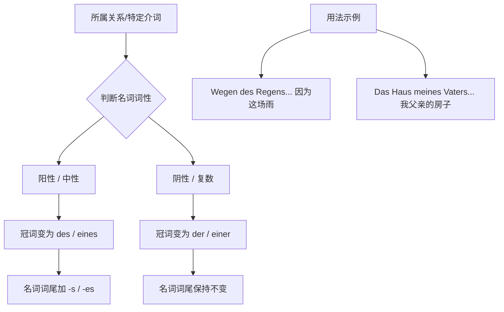
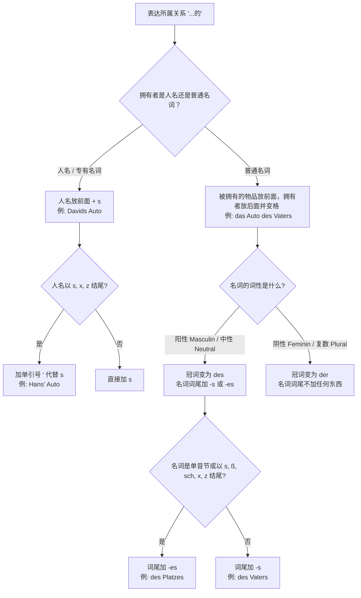
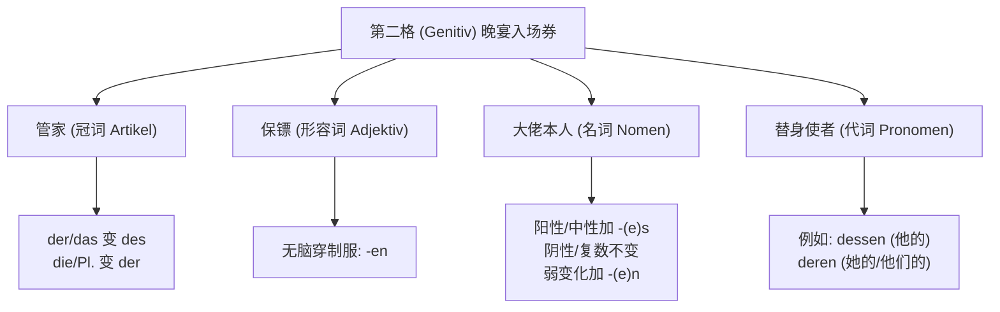
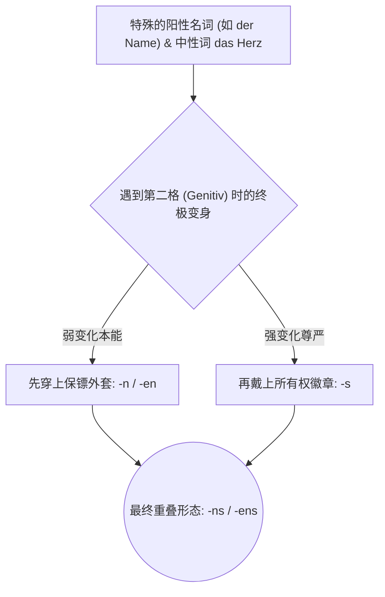

# 第二格

既然你的目标是**6 个月冲刺 B 2 并成功移民**，那我们今天就要攻克德语语法中极具“贵族气质”，但在 B 1/B 2 阅读和商务书信中无处不在的关卡——**第二格 (Genitiv)**。

在德语的四兄弟里，第一格（Nominativ）是“主角”，第四格（Akkusativ）是“受气包”，第三格（Dativ）是“受益者”，而这**第二格（Genitiv）**，就是妥妥的**“持宝人”**或者说**“所属权大佬”**。

---

## 什么是第二格？（形象类比）

想象一下，你正在德国办理落户（Anmeldung）。办事员指着桌上的一叠文件说：“这是**那个男人的**护照。”

在中文里，我们用一个“的”字解决所有所属关系；在德语里，为了体现这个“的”，名词必须变身。**第二格的核心功能就是表示“所属关系”，相当于英语中的 "of" 或 "'s"**。

### 核心变格表：第二格的“变装秀”

掌握第二格，其实就是记住这张表。请注意，**阳性**和**中性**名词在第二格中非常特别，它们不仅冠词要变，**屁股后面还要加个 "-s" 或 "-es"**。

|**词性**|**冠词 (der/die/das)**|**不定冠词 (ein...)**|**否定冠词 (kein...)**|**名词词尾变化**|
|---|---|---|---|---|
|**阳性 (Maskulin)**|**des**|**eines**|**keines**|**+(e)s**|
|**中性 (Neutral)**|**des**|**eines**|**keines**|**+(e)s**|
|**阴性 (Feminin)**|**der**|**einer**|**keiner**|无变化|
|**复数 (Plural)**|**der**|**-**|**keiner**|无变化|

> **大师敲黑板：**
> 
> - **阳性/中性：** 冠词变 **des**，名字后面加 **-s** (如：des Vater**s**)。
> - **阴性/复数：** 冠词变 **der**，名字本身不动。
> - **什么时候加 -es？** 如果单词很短（单音节）或者以 s, ss, z, x 结尾，为了发音清楚，要加 -es (如：des Haus**es**)。

---

## 第二格的四大实战场景

为了让你在 B 2 水平游刃有余，我们需要掌握它在移民生活中的四大用法：

### 1. 表示所属关系 (The Owner)

这是最基础的用法。

- **场景：** Die Hilfe **des Nachbarn** (邻居的帮助)。
- **场景：** Die Adresse **der Vermieterin** (女房东的地址)。

### 2. 配合“特定介词” (The VIP Prepositions)

在 B 1/B 2 的考试和正式文档中，有一批介词**必须**接第二格。这些词能瞬间提升你的德语档次：

- **während** (在...期间)：_Während **des Praktikums** (在实习期间)_。
- **wegen** (因为)：_Wegen **eines Termins** (因为一个预约)_。
- **trotz** (尽管)：_Trotz **der Kälte** (尽管天气寒冷)_。
- **statt/anstelle** (代替)：_Statt **eines Autos** (代替一辆汽车)_。

### 3. 表示时间（不定指时间）

虽然初级常用第四格表示特定时间，但第二格常用于表示“习惯性”或“非特定”的时间点：

- **eines Tages** (某一天)。
- **eines Abends** (某个晚上)。

### 4. 专有名词的第二格

如果是人名，直接加 **-s**，不需要冠词：

- **Lukas'** Auto (Lukas 的车，结尾有 s 了只加撇)。
- **Goethes** Werke (歌德的作品)。

---

## 逻辑结构图 (Mermaid)

为了让你直观理解第二格在句子里的构造，我们来看这个逻辑链条：

代码段

---

## 移民生活例句 (B 1-B 2 水平)

1. **租房场景：**

    "Die Höhe **der Miete** ist im Vertrag festgelegt."

    (房租的数额在合同中已规定。—— _die Miete 阴性变 der_)

2. **职场场景：**

    "Während **meines Studiums** habe ich als Werkstudent gearbeitet."

    (在大学学习期间，我做过工读学生。—— _das Studium 中性变 des...s_)

3. **行政办事：**

    "Trotz **des Fehlers** in den Unterlagen wurde das Visum erteilt."

    (尽管材料中有个错误，签证还是签发了。—— _der Fehler 阳性变 des...s_)

---

## 6 个月 B 2 冲刺计划建议：第一周重点

针对你移民的目标，本周请按以下节奏练习：

- **Day 1-2:** 熟记变格表。尤其是“阳性/中性要加 s”这个点，这是很多 B 2 学生也会犯的低级错误。
- **Day 3-4:** 攻克 4 个神级介词：**wegen, während, trotz, statt**。尝试用它们描述你今天的工作。
- **Day 5-7:** 尝试在写作（尤其是求职信/投诉信）中，把用 "von + Dativ" 表示的所属关系全部替换为 "Genitiv"。
    - _普通版：_ Die Farbe **von dem** Auto (Dativ)
    - _高级版：_ Die Farbe **des** Auto**s** (Genitiv) —— **这就是 B 2 的味道！**

---

### ✍️ 大师互动练习

现在，轮到你了！请尝试用 **第二格 (Genitiv)** 翻译下面这个移民生活场景中的句子：

> **“由于 (wegen) 那个工作 (der Job)，我搬到了德国。”**

（提示：注意 `wegen` 后面名词的变化，以及 `Job` 这个词是否需要加词尾。）

请写下你的句子，我会为你即时批改！加油，未来德国的准移民！

# 变形：

为了让你一目了然，我先给你画一张“第二格变形决策图”，在进入具体规则前，你可以先顺着这张图理清思路：

阳中， 有一个 s 就有第二个 s->des Vaters

---

### 一、 什么是第二格？（“产权所有证”）

在德语里，第二格主要用来表达**所属关系**，翻译成中文就是**“……的”**。你可以把它想象成德语世界里的“产权证”或“VIP 归属标签”。

比如：“爸爸的车”，爸爸是拥有者，车是被拥有的物品。

---

### 二、 普通名词的第二格变形秘籍

当拥有者是普通名词（比如爸爸、小孩、妈妈、父母）时，公式是：**名词 + 第二格名词（有冠词）**。例如：_das Auto des Vaters_。

我们来看看冠词和词尾到底怎么变：

|**词性**|**阳性 (Masculin)**|**中性 (Neutral)**|**阴性 (Feminin)**|**复数 (Plural)**|
|---|---|---|---|---|
|**定冠词**|**des** Vater**s**|**des** Kinde**s**|**der** Mutter|**der** Eltern|
|**不定冠词**|eine**s** Vater**s**|eine**s** Kinde**s**|eine**r** Mutter|_(见下方高能预警)_|
|**物主代词**|ihre**s** Vater**s**|unsere**s** Kinde**s**|seine**r** Mutter|meine**r** Eltern|

**德语大师的趣味记忆法：**

1. **“富养儿（阳/中），穷养女（阴/复）”**：你看，阳性和中性名词在第二格时，不仅冠词要变（变成 **des**），名词后面还要挂个小尾巴（加 **-s** 甚至 **-es**），阳性和中性名词的单数第二格形式词尾要加上 **s**！而阴性和复数就非常独立，名词本身完全不加词尾，只要把冠词变成 **der** 就行了。
2. ⚠️ **高能预警（复数不定冠词的坑）**：第二格复数不能直接位于不定冠词后！它只可能位于形容词后，比如 _guter Eltern_ （好父母的...）。如果你想表达“一些父母的”，用 _von Eltern_ 来代替。

#### 细节扣分项：加 -s 还是 -es？

既然阳性和中性名词要加小尾巴，到底什么时候加 **-s**，什么时候加 **-es** 呢？

- **必须加 -es 的情况**：以 **s, ß, sch, x, z** 结尾的名词，以及**大多数单音节（短）名词**后需加上 **-es**。
    - _举例_：位置的号码 -> _die Nummer des Platz**es**_ （Platz 是单音节，且以 z 结尾）。
    - _举例_：男人的年龄 -> _das Alter des Mann**es**_ （Mann 是单音节短名词）。

---

### 三、 人名的特权（专有名词）

如果拥有者是一个具体的人名，德语就变得像英语一样简单粗暴了：公式是 **人名 -s + 名词（零冠词）**。

- 大卫的车：_David**s** Auto_

**特殊情况：**

如果这个人的名字本身就以 **-s** 或 **-x** 结尾，那就不要再加 -s 了，否则发音会像蛇吐信子一样奇怪。正确做法是**加上单引号表示第二格**。

- 汉斯的车：_Hans_*'** Auto*
- 贝娅特丽克丝的车：_Beatrix_*'** Auto*

---

### 四、 口语里的“平替”（von + Dativ）

在德国的日常口语里，你可能会发现德国人其实很懒，他们经常用 **von + 第三格 (Dativ)** 来代替高贵的第二格。

- _Davids Auto_ = _das Auto **von** David_
- _das Auto seines Vaters_ = _das Auto **von** seinem Vater_

**大师贴士（备考 B 2 必读）**：虽然口语可以用 `von + 第三格`，但在你接下来的 **B 2 写作和正式交流（如给外管局发邮件、写求职信）中，请务必使用真正的第二格！** 这是展现你德语高级感（B 2 水平）的关键标志。

---

### 五、 移民生活实战演练

让我们把第二格放进你在德国找工作、租房、看病时会用到的句子里：

1. **🏥 医疗场景 (Arztpraxis)**
    
    - _Die Öffnungszeiten **der Praxis** sind von 8 bis 12 Uhr._ * (诊所的营业时间是 8 点到 12 点。 -> _die Praxis_ 是阴性，变 _der_)
        
2. **🏠 租房场景 (Wohnungssuche)**
    
    - _Ich habe den Mietvertrag **der Wohnung** noch nicht unterschrieben._
    - (我还没签那套公寓的租房合同。 -> _die Wohnung_ 是阴性，变 _der_)
        
3. **💼 工作/行政场景 (Ausländerbehörde/Arbeit)**
    
    - _Wir brauchen eine Kopie **Ihres Passes**._
    - (我们需要一份您护照的复印件。 -> _der Pass_ 是阳性单音节，加 _-es_，物主代词加 _-es_)

---

### 你的六个月 B 2 冲刺规划建议：

为了在半年内达到 B 2，我们的战术必须清晰：

- **第 1-2 个月（夯实地基）**：彻底搞定四大格（像今天讲的第二格必须成为肌肉记忆）、动词过去时/现在完成时、以及基础的从句结构（weil, dass, wenn）。
- **第 3-4 个月（B 2 核心壁垒）**：攻克被动语态（Zustandspassiv / Vorgangspassiv）、第二虚拟式（Konjunktiv II，表达礼貌和非真实条件），以及要求接第二格的介词（wegen, während, trotz, aufgrund）。
- **第 5-6 个月（输出与应试）**：大量进行口语对练（针对租房、投诉、辩论等 B 2 考试题型）和写作修改，将之前学过的语法融会贯通。

---

好了，理论学完，该你上场了！为了测试你是否掌握了今天的知识，请你利用刚才学的规则，帮我把下面这句在**办理签证时**一定会用到的话翻译成德语（提示：护照 der Pass；有效性 die Gültigkeit）：

**“我必须检查这名男子的护照的有效性。”** (Ich muss die Gültigkeit ________ überprüfen.)

空缺的部分你应该怎么填呢？大胆写出来，错了大师来帮你兜底！

# 第二格只能作用于名词吗?其他词是不能有第二格的

简单直接地回答你：**绝对不是！** 第二格（Genitiv）绝对不仅仅只作用于名词。

这是一个很多初学者都会有的误区，因为我们在背单词的时候，字典里总是把名词和它的第二格词尾绑在一起（比如 _das Auto, -s_）。但事实上，德语里的“格”（Kasus）不是针对某一个孤立的词，而是针对**整个“名词家族”（Nominalphrase）**。

你可以把“第二格”想象成一场**高级的 VIP 晚宴**。名词是收到邀请函的“大佬”，但他出门绝不孤单，身边总是带着“管家”（冠词）和“贴身保镖”（形容词）。既然要出席 VIP 晚宴，**所有随行人员都必须统一换上第二格的“专属制服”**。

不仅如此，甚至连代替大佬出场的“替身”（代词）也有自己的第二格形态！

为了让你一眼看懂这场“换装秀”，我为你画了一张家族换装图：

代码段

在 6 个月冲刺 B 2 的过程中，你需要掌握除了名词之外，第二格在以下 **3 类词** 身上的终极应用：

### 1. 冠词（Artikel）与形容词（Adjektiv）的连带变化

在真实语境中，第二格极少单独出现，它总是伴随着前置词（如 _wegen_ 因为, _trotz_ 尽管, _während_ 在...期间）或者作为定语。此时，**冠词和形容词必须首当其冲地发生变化**。

- **阳性/中性变装规则：** `des` + 形容词加 `-en` + 名词加 `-(e)s`
- **阴性/复数变装规则：** `der` + 形容词加 `-en` + 名词不变

**🏠 租房/投诉场景 (B 2 必备)：**

- _Trotz **des** laut**en** Lärm**s** konnte ich gut schlafen._ (尽管有**巨大的噪音**，我还是睡得很好。)

    > 拆解：_Lärm_ 是阳性名词。管家变 _des_，保镖 _laut_ 加上 _-en_，大佬 _Lärm_ 加上 _-s_。一家人整整齐齐。

- _Wegen **der** kaputt**en** Heizung rufe ich den Hausmeister an._ (因为**坏掉的暖气**，我给楼管打了电话。)

    > 拆解：_Heizung_ 是阴性名词。管家变 _der_，保镖 _kaputt_ 加 _-en_，阴性大佬不用变。

### 2. 关系代词（Relativpronomen）的第二格 —— B 2 核心大招

这是你考取 B 2 证书的**必杀技**！当你想表达“**某人的**（whose）”时，你要使用关系代词的第二格来引导从句。这时候，第二格完全作用在代词身上。

- 阳性/中性：**dessen** (他的/它的)
- 阴性/复数：**deren** (她的/他们的)

**💼 职场/人际交往场景：**

- _Das ist der Kollege, **dessen** Auto gestern gestohlen wurde._ (这就是那位**他的**车昨天被偷了的同事。)

    > 拆解：这里根本没有名词的第二格变化，而是代词 _der_ 变成了第二格 _dessen_，用来表示“同事的”。

- _Ich spreche mit der Chefin, **deren** Büro im 3. Stock ist._ (我正在和那位**她的**办公室在三楼的女老板谈话。)

### 3. 人称代词（Personalpronomen）的第二格 —— 极具高级感的表达

虽然在现代日常口语中，大家喜欢用 _von + 第三格_ 来代替第二格，但在正式的官方信件或高级德语表达中，动词有时候会强行要求**人称代词**变成第二格。

- 人称代词的第二格：_meiner_ (我的), _deiner_ (你的), _seiner_ (他的), _ihrer_ (她的)

**🏛️ 行政/法庭/高级表达场景：**

- _Wir gedenken **der** Opfer._ (我们悼念受害者。) -> _gedenken_ (纪念/悼念) 后面直接跟第二格。
- _Ich erinnere mich **seiner**._ (我回想起**他**。) -> 这是一个非常文学/正式的 B 2/C 1 级别表达。日常我们说 _Ich erinnere mich an ihn_，但在高级文风中，_sich erinnern_ 可以直接加代词的第二格 _seiner_。

---

**大师总结：**

不要把第二格当成“名词专属的尾巴”。它是一种**“财产所有权”或“从属关系”的语法滤镜**。只要加上了这个滤镜，整个名词组里的每一个词（冠词、形容词），或者代替它们的代词，全都要换上这套名为“第二格”的制服！

# 第二格和名词阳性弱变化 的混合变化

Hallo！遇到这种“叠 buff”的情况，很多同学会觉得大脑瞬间宕机了。你的问题非常精准，直接切中了 B 1 升 B 2 阶段的一个经典“语法大 Boss”——**混合变化（Gemischte Deklination）**。

当“第二格的强变化属性”撞上“弱变化名词的粘人属性”时，该怎么办？

别慌，德语大师给你一个最简单的解法：**成年人不做选择，它们全都要！**

你可以把这类名词想象成语法世界里的**“双重间谍”**。它们表面上混在“弱变化 VIP 俱乐部”里（需要保镖 `-n`），但骨子里又保留着普通硬汉名词的骄傲（在第二格时必须挂上代表所有权的徽章 `-s`）。

我们用一张图表来看看这个“叠 buff”的过程是怎么发生的：

代码段

### 核心解密：如何应对这群“双重间谍”？

好消息是，这群叠了双重 buff 的词**数量非常少**，在日常生活中常用的只有不到 10 个。它们通常是一些抽象的、看不见摸不着的概念，或者极特殊的词。

应对它们的策略就是：只要在第二格（Genitiv）遇到它们，**词尾直接变成 `-ns` 或 `-ens` **。

为了让你在 6 个月内能自如应对德国的行政、医疗和生活，我们把它们分入三大真实场景：

#### 1. 填表与行政事务 (Bürokratie)

在德国，填错表格、搞错名字是家常便饭，这时候你极其需要用到以下两个词的第二格重叠变化。

- **出场词汇：** `der Name` (名字), `der Buchstabe` (字母)
- **原形与变化：** der Name -> des Name**ns** / der Buchstabe -> des Buchstabe**ns**
- **B 2 实战例句：**
    - _Die Schreibweise des Name**ns** auf meinem Visum ist falsch._ (我签证上这个**名字的**拼写是错的。) -> _Name 先加 n 满足弱变化，再加 s 满足第二格。_
    - _Die Bedeutung dieses Buchstabe**ns** ist mir unklar._ (我不清楚这个**字母的**含义。)

#### 2. 表达思想与精神状态 (Mentalität)

在职场沟通、看医生做心理咨询，或者和德国朋友深度交流时，这些抽象词汇能瞬间提升你的德语高级感。

- **出场词汇：** `der Gedanke` (思想/想法), `der Wille` (意志), `der Glaube` (信仰), `der Friede` (和平)
- **原形与变化：** der Gedanke -> des Gedanke**ns** / der Wille -> des Wille**ns**
- **B 2 实战例句：**
    - _Die Umsetzung dieses Gedanke**ns** kostet viel Zeit._ (落实这个**想法**需要花很多时间。)
    - _Aus eigenem Antrieb und aus der Kraft meines Wille**ns** habe ich Deutsch gelernt._ (凭借自身的动力和我**意志的**力量，我学会了德语。)

#### 3. 医疗场景的“终极卧底” (Medizin)

这里必须再次单独拎出**唯一的中性词 `das Herz` (心脏)**。它是个彻头彻尾的异类：第一、第四格是硬汉（不加 n），第三格变弱小（加 en），到了第二格直接叠满 buff（加 ens）。

- **原形与变化：** das Herz -> (Akk) das Herz -> (Dat) dem Herzen -> (Gen) des Herz**ens**
- **B 2 实战例句：**
    - _Die Operation des Herz**ens** war sehr riskant._ (这个**心脏的**手术风险非常大。)

---

### 德语大师的避坑总结

当你看到 `der Name`, `der Gedanke`, `das Herz` 这些词时，在脑海中立刻贴上**“-ns”**的标签。它们在第一格是原形，在第三、第四格只加 `-n`（Herz 第四格不加），**唯独在第二格时，必须把 `-n` 和 `-s` 两个特征全部亮出来**。

这就是应对“重叠变化”的唯一心法：既然规则冲突了，那就把两套规则的词尾都穿在身上。

为了测试你是否真正掌握了这位“双重间谍”，请你试着用今天学的知识翻译这句话（场景：你在德国外管局处理签证问题）：

**“由于这个名字的拼写错误（der Fehler），我遇到了麻烦。”**

（提示：由于... 可以用介词 _wegen_ + 第二格）

准备好接受挑战写出你的答案了吗？
