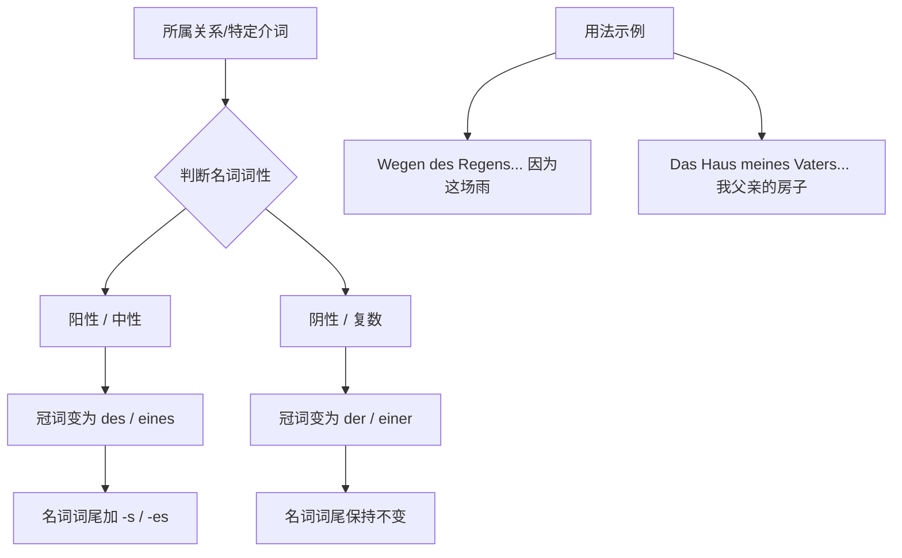

# 第二格

你好！很高兴能陪伴你开启这段通往德国的“冲刺之旅”。我是你的德语大师。

既然你的目标是**6 个月冲刺 B 2 并成功移民**，那我们今天就要攻克德语语法中极具“贵族气质”，但在 B 1/B 2 阅读和商务书信中无处不在的关卡——**第二格 (Genitiv)**。

在德语的四兄弟里，第一格（Nominativ）是“主角”，第四格（Akkusativ）是“受气包”，第三格（Dativ）是“受益者”，而这**第二格（Genitiv）**，就是妥妥的**“持宝人”**或者说**“所属权大佬”**。

---

## 什么是第二格？（形象类比）

想象一下，你正在德国办理落户（Anmeldung）。办事员指着桌上的一叠文件说：“这是**那个男人的**护照。”

在中文里，我们用一个“的”字解决所有所属关系；在德语里，为了体现这个“的”，名词必须变身。**第二格的核心功能就是表示“所属关系”，相当于英语中的 "of" 或 "'s"**。

### 核心变格表：第二格的“变装秀”

掌握第二格，其实就是记住这张表。请注意，**阳性**和**中性**名词在第二格中非常特别，它们不仅冠词要变，**屁股后面还要加个 "-s" 或 "-es"**。

|**词性**|**冠词 (der/die/das)**|**不定冠词 (ein...)**|**否定冠词 (kein...)**|**名词词尾变化**|
|---|---|---|---|---|
|**阳性 (Maskulin)**|**des**|**eines**|**keines**|**+(e)s**|
|**中性 (Neutral)**|**des**|**eines**|**keines**|**+(e)s**|
|**阴性 (Feminin)**|**der**|**einer**|**keiner**|无变化|
|**复数 (Plural)**|**der**|**-**|**keiner**|无变化|

> **大师敲黑板：**
> 
> - **阳性/中性：** 冠词变 **des**，名字后面加 **-s** (如：des Vater**s**)。
>     
> - **阴性/复数：** 冠词变 **der**，名字本身不动。
>     
> - **什么时候加 -es？** 如果单词很短（单音节）或者以 s, ss, z, x 结尾，为了发音清楚，要加 -es (如：des Haus**es**)。

---

## 第二格的四大实战场景

为了让你在 B 2 水平游刃有余，我们需要掌握它在移民生活中的四大用法：

### 1. 表示所属关系 (The Owner)

这是最基础的用法。

- **场景：** Die Hilfe **des Nachbarn** (邻居的帮助)。
- **场景：** Die Adresse **der Vermieterin** (女房东的地址)。

### 2. 配合“特定介词” (The VIP Prepositions)

在 B 1/B 2 的考试和正式文档中，有一批介词**必须**接第二格。这些词能瞬间提升你的德语档次：

- **während** (在...期间)：_Während **des Praktikums** (在实习期间)_。
- **wegen** (因为)：_Wegen **eines Termins** (因为一个预约)_。
- **trotz** (尽管)：_Trotz **der Kälte** (尽管天气寒冷)_。
- **statt/anstelle** (代替)：_Statt **eines Autos** (代替一辆汽车)_。

### 3. 表示时间（不定指时间）

虽然初级常用第四格表示特定时间，但第二格常用于表示“习惯性”或“非特定”的时间点：

- **eines Tages** (某一天)。
- **eines Abends** (某个晚上)。

### 4. 专有名词的第二格

如果是人名，直接加 **-s**，不需要冠词：

- **Lukas'** Auto (Lukas 的车，结尾有 s 了只加撇)。
- **Goethes** Werke (歌德的作品)。

---

## 逻辑结构图 (Mermaid)

为了让你直观理解第二格在句子里的构造，我们来看这个逻辑链条：

代码段

---

## 移民生活例句 (B 1-B 2 水平)

1. **租房场景：**

    "Die Höhe **der Miete** ist im Vertrag festgelegt."

    (房租的数额在合同中已规定。—— _die Miete 阴性变 der_)

2. **职场场景：**

    "Während **meines Studiums** habe ich als Werkstudent gearbeitet."

    (在大学学习期间，我做过工读学生。—— _das Studium 中性变 des...s_)

3. **行政办事：**

    "Trotz **des Fehlers** in den Unterlagen wurde das Visum erteilt."

    (尽管材料中有个错误，签证还是签发了。—— _der Fehler 阳性变 des...s_)

---

## 6 个月 B 2 冲刺计划建议：第一周重点

针对你移民的目标，本周请按以下节奏练习：

- **Day 1-2:** 熟记变格表。尤其是“阳性/中性要加 s”这个点，这是很多 B 2 学生也会犯的低级错误。
- **Day 3-4:** 攻克 4 个神级介词：**wegen, während, trotz, statt**。尝试用它们描述你今天的工作。
- **Day 5-7:** 尝试在写作（尤其是求职信/投诉信）中，把用 "von + Dativ" 表示的所属关系全部替换为 "Genitiv"。
    - _普通版：_ Die Farbe **von dem** Auto (Dativ)
    - _高级版：_ Die Farbe **des** Auto**s** (Genitiv) —— **这就是 B 2 的味道！**

---

### ✍️ 大师互动练习

现在，轮到你了！请尝试用 **第二格 (Genitiv)** 翻译下面这个移民生活场景中的句子：

> **“由于 (wegen) 那个工作 (der Job)，我搬到了德国。”**

（提示：注意 `wegen` 后面名词的变化，以及 `Job` 这个词是否需要加词尾。）

请写下你的句子，我会为你即时批改！加油，未来德国的准移民！
