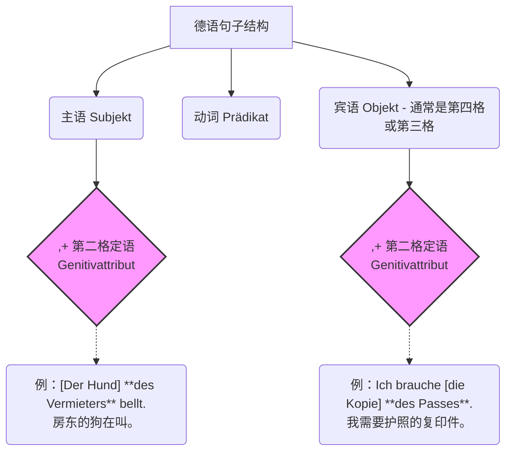

# 第二格
为了让你彻底搞懂，我们把第二格的“职场分布”全面拆解一下。第二格在德语句子里主要在三个岗位上发光发热：

---

### 岗位一：作为“所属定语”（绝对的主力军！）

这就是你提到的“类似于英语所属格”的用法。在这里，**第二格不是宾语，它是像“502强力胶”一样，死死粘在另一个名词后面的“小尾巴”**，用来补充说明这个名词是谁的。

- **类比：** 想象一个汉堡。面包是主语或宾语（主要名词），而里面的那层牛肉饼就是“第二格定语”。牛肉饼不能单独存在，它必须夹在面包里。

**【移民生活实战场景：行政事务】**

- _中文：_ **外管局的**地址在哪？
- _英语：_ Where is the address **of the immigration office**?
- _德语：_ Wo ist die Adresse **der Ausländerbehörde**?
    - _解析：_ 这里的 `die Adresse` 是主语（面包），而 `der Ausländerbehörde` （外管局的）就是粘在它后面的第二格定语（牛肉饼）。它不是动词“是 (ist)”的宾语，它是 `Adresse` 的专属配件。

为了让你更直观地看清句子结构，我们用图表来拆解一下：

代码段

_大师敲黑板：看图！第二格定语既可以粘在主语后面，也可以粘在宾语后面，它自己本身不是句子的主干骨架。_

---

### 岗位二：作为“介词的宾语”（B2考试的得分机器）

这就是第二格真正充当“宾语”的时候了，但它是**介词的宾语**。

在德语里，有些介词就像是“霸道总裁”，它们规定：“只要你跟在我后面，你就必须穿上第二格的制服！”

**【移民生活实战场景：看病请假】**

- _中文：_ **因为发烧的缘故**，我今天不能来上班。
- _德语：_ **Wegen des Fiebers** kann ich heute nicht zur Arbeit kommen.
    - _解析：_ 介词 `wegen` (因为) 后面直接跟了第二格 `des Fiebers` (发烧，中性 das 变 des 加 -s)。这里的第二格就是介词 wegen 的宾语。

**B1/B2阶段你必须拿下的“霸道总裁”介词（建议抄在便利贴上）：**

- **wegen** (因为) + 第二格
- **während** (在...期间) + 第二格
- **trotz** (尽管) + 第二格
- **innerhalb** (在...内部/期限内) + 第二格 —— _例：innerhalb eines Monats (在一个月内)_

---

### 岗位三：作为“动词的宾语”（稀有保护动物，了解即可）

这是最符合你问题中“充当宾语部分”的猜测，即**直接作为动词的宾语**。

但是！在现代德语中，直接要求加第二格宾语的动词**极度稀少**。它们多见于非常正式的法律文书或古典文学中，日常生活中几乎绝迹。这也是为什么我们在A1-B1阶段很少提及的原因。

**【B2/C1级别装X专用词汇】**

- **bedürfen** (需要 - 极其正式，相当于 brauchen 的高级版)
    - _例句：_ Dieser Vertrag **bedarf der Unterschrift** beider Parteien. (这份合同**需要双方的签字**。)
    - _解析：_ 这里的 `der Unterschrift` 就是动词 `bedarf` 的直接第二格宾语。
    - - Vertrag 协议
- **gedenken** (纪念)
    - _例句：_ Wir **gedenken der Opfer**. (我们**纪念受害者**。)
---

### 你的6个月B2学习规划建议（第二格进阶版）

既然你已经理解了第二格的核心逻辑，在接下来的学习中，你的精力分配应该这样安排：

1. **花 70% 的精力** 练习把第二格作为**定语**使用（名词 + 名词第二格）。尤其是在填写表格、看租房合同（Mietvertrag）时，刻意去寻找这种结构。
2. **花 25% 的精力** 死磕那几个要求第二格的**高频介词**（wegen, trotz, während, innerhalb）。只要你在B2口语和写作中用出来，考官直接给你打高分。
3. **只花 5% 的精力** 了解要求第二格的**动词**。遇到认识就行，不用刻意去背诵怎么用。

---

### 下一步：大师的随堂测验 (Hausaufgabe)

现在，让我们把今天的知识结合起来，做一个移民场景的实战演练！

假设你正在找工作，你需要给HR发一封邮件解释一点情况。请你尝试将下面这句话翻译成德语，这句话里既包含了**“所属定语”**，又包含了**“霸道总裁介词”**：

**中文：** “由于**面试的**缘故（_wegen_ + 面试），我需要**这位经理的**邮箱地址（邮箱地址 + _经理的_）。”

_(提示词：面试 = das Interview ; 邮箱地址 = die E-Mail-Adresse ; 经理 = der Manager)_

你可以尝试写一下吗？写错完全没关系，我会帮你精修打磨！你要不要现在试着写出这句话发给我？
