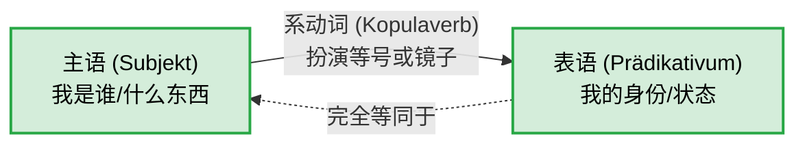

---
aliases:
  - sein
  - werden
  - bleiben
---

# 系动词

今天，我们来系统地攻克德语中的一个核心枢纽——**系动词（Kopulaverben）**。

为了让你秒懂，我们先建立一个生动的类比：**系动词不是用来“做动作”的，它是数学里的“等号（=）”，或者是一面“镜子”。**

在普通的德语句子里（比如“我吃苹果”），有一个动作的发出者（我）和承受者（苹果）。但是系动词不同，它没有真正的动作，它只是在主语和主语的身份、状态之间架起一座桥梁。

你可以看看下面这个关系图，理解一下这面“镜子”的结构：

---

### 一、 德语系动词的“三巨头”

德语里的纯正系动词非常少，主要就是三个。它们分别代表了状态的三种不同阶段：

#### 1. sein (是) —— 状态的“存在”

这是最基础的等号，表示你现在是什么状态或身份。

- **[职场场景]** Ich **bin** ein erfahrener Ingenieur. (我**是**一名经验丰富的工程师。)
- **[医疗场景]** Das Kind **ist** krank. (这孩子病**了**。)

#### 2. werden (成为 / 变) —— 状态的“变化”

表示从一种状态过渡到另一种状态，或者身份的转变。

- **[移民场景]** Er **wird** bald deutscher Staatsbürger. (他很快就要**成为**德国公民了。)
- **[租房场景]** Die Miete **wird** jedes Jahr teurer. (房租每年都在**变**贵。)

#### 3. bleiben (保持 / 停留) —— 状态的“延续”

表示拒绝改变，状态继续维持。

- **[行政场景]** Die Regeln bei der Ausländerbehörde **bleiben** streng. (外管局的规定**依然**严格。)
- **[生活场景]** Wir **bleiben** gute Nachbarn. (我们**继续做**好邻居。)

---

### 二、 系动词与其他成分结合时的“化学反应” (核心考点)

当这三大系动词与其他词性或时态相遇时，会发生一些非常独特的变化。这也是很多初学者容易掉坑的地方。我们总结了四个“大师法则”：

#### 法则 1：与名词结合的“双重第一格（Nominativ）法则”

**口诀：照镜子，你还是你，绝不变格！**

普通的动词后面通常接第四格（Akkusativ，宾语）。但系动词是镜子，镜子外面的主语是第一格，镜子里的身份**也必须是第一格（Gleichsetzungsnominativ）**。

- ❌ 错误：Das ist _einen_ teuren Mietvertrag. (把租房合同当成了第四格宾语)
- ✅ **正确：Das ist _ein_ teurer Mietvertrag.** (这是一份昂贵的租房合同。主语和表语都是第一格。)
- ✅ **正确：Herr Müller bleibt _mein_ bester Freund.** (米勒先生依然是我最好的朋友。第一格！)

#### 法则 2：与形容词结合的“裸奔法则”

**口诀：做表语的形容词，坚决不穿衣服（不加词尾）！**

当形容词跟在系动词后面，用来描述主语的状态时（做表语），它绝对不能加任何词尾变形。

- **[租房场景]** Die Wohnung **ist** sehr _hell_ und _geräumig_. (这套公寓很明亮宽敞。_hell_ 和 _geräumig_ 没有任何词尾。)
- 对比一下如果形容词跟在名词前面（定语）：Das ist eine _helle_ und _geräumige_ Wohnung. (这里就要穿衣服加词尾了)。

#### 法则 3：与介词结合的“状态转移法则”

系动词后面也可以接介词短语，此时介词短语充当状态。

- **[求职场景]** Ich **bin** _auf der Suche nach_ einem Vollzeitjob. (我正处于寻找全职工作的状态中 = 我正在找工作。)
- **[日常场景]** Wir **sind** _gegen_ diese Entscheidung. (我们反对这个决定。_gegen_ 表示处于对立面。)

#### 法则 4：与时态结合的“同流合污法则”

当我们需要把这三个系动词变成**完成时 (Perfekt)** 时，它们有一个惊人的共性：**它们的助动词全部使用 _sein_，而不是 _haben_！** (因为它们都表示状态的存续或变化)。

- **sein 的完成时：** Ich **bin** gestern in der Klinik **gewesen**. (我昨天在诊所来着。)
- **werden 的完成时：** Das Wetter **ist** plötzlich kalt **geworden**. (天气突然变冷了。)
- **bleiben 的完成时：** Mein Visum **ist** glücklicherweise gültig **geblieben**. (我的签证幸运地保持了有效。)

---

### ⚠️ 大师的特别警告：`werden` 的多重人格

在 B 1/B 2 阶段，你必须看穿 `werden` 的伪装。它不仅仅是系动词（变成），它还是德语语法里的“超级打工仔”（助动词）。

1. **当系动词（变/成为）：** 后面接形容词或名词。
    
    - _Mein Deutsch **wird** besser._ (我的德语**变**好了。)
        
2. **当将来时助动词：** `werden` + 动词原形（放在句末）。
    
    - _Ich **werde** den Vertrag morgen **unterschreiben**._ (我明天**将要**签这份合同。)
        
3. **当被动语态助动词：** `werden` + 动词第二分词（Partizip II，放在句末）。
    
    - _Das Formular **wird** vom Beamten **geprüft**._ (这份表格正在**被**官员审查。)

---

### 下一步：实战演练

理解了理论，我们马上来测试一下你的吸收情况。这不仅能巩固知识，也是你这六个月 B 2 冲刺计划中的第一步。

请尝试用今天学的**系动词（sein, werden, bleiben）**，将下面这两个和德国生活息息相关的句子翻译成德语。记住我们的“双重第一格”和“裸奔”法则哦！

1. **这套公寓（die Wohnung）太贵了（teuer），但我会保持乐观（optimistisch）。**
2. **他曾经是一名医生（der Arzt），但现在他成了一名护士（der Krankenpfleger）。** _(提示：前半句用 sein 的过去时/完成时，后半句用 werden 的现在时/完成时)_

你先试着翻译一下，我会帮你精准纠错并分析！准备好了吗？
