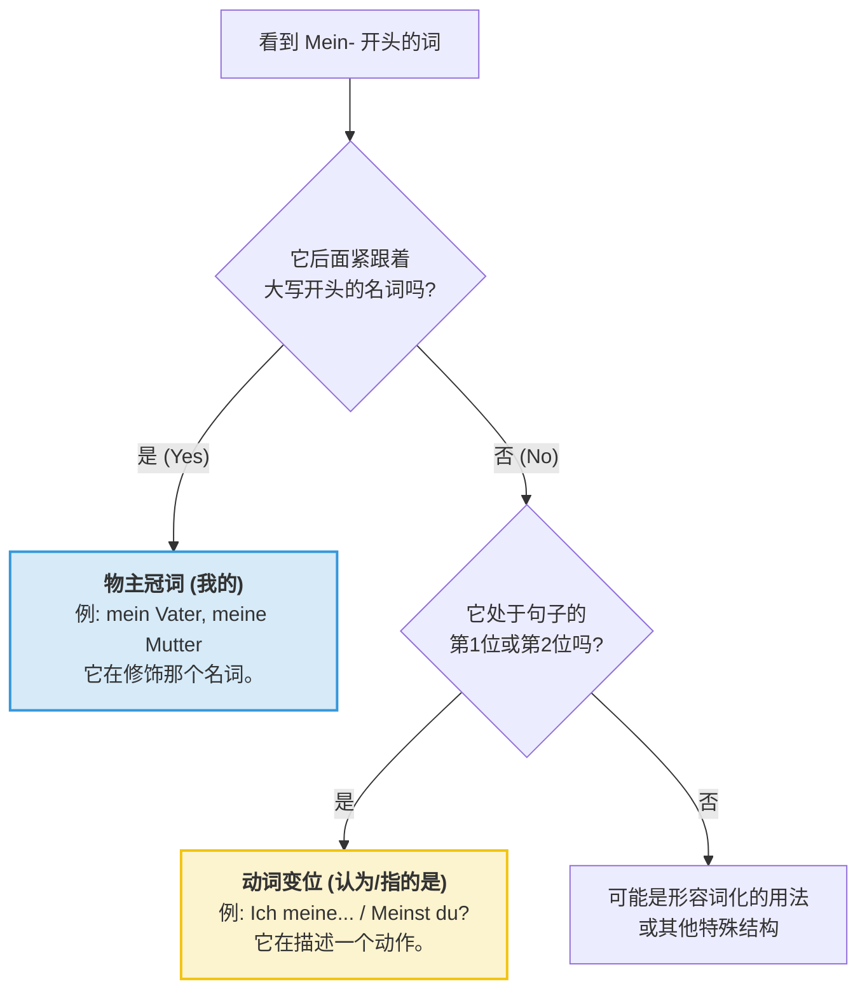

---
aliases:
  - mein
  - meine
  - meinst
  - meinen
---

# mein

要区分 **mein-** 到底是在说“我的”（物主冠词）还是在说“觉得/认为”（动词），我们不需要死记硬背，只需要看它在句子里的“位置”**和**“邻居”。

这就像在中文里区分“手”是身体部位，还是动词“手（手持）”一样，语境决定一切。

---

### 1. 核心区分指南：看“位置”与“邻居”

|**维度**|**作为物主冠词 (Meinas Article)**|**作为动词 (Meinen as Verb)**|
|---|---|---|
|**翻译**|我的 (My)|认为、觉得、指的是 (To mean/think)|
|**位置**|总是和**名词**粘在一起。|占据句子的**核心动作位**（陈述句第 2 位）。|
|**邻居**|后面紧跟一个**名词**。|后面通常跟一个**从句**或**代词**，或者独立存在。|
|**变号**|尾巴随名词变 (-e, -en, -er...)。|尾巴随人称变 (-e, -st, -t, -en)。|

---

### 2. 场景模拟：一眼看穿它

#### **场景 A：它后面跟着一个“大写字母的名词”**

- **例子**：Das ist **mein** **H**und.
- **分析**：看到 Hund（狗）这个名词了吗？这时候 `mein` 就像一个挂件，挂在狗身上。
- **结论**：它是**物主冠词**（我的）。

#### **场景 B：它后面跟着一个“小写字母的人称代词”或“逗号”**

- **例子**：Ich **meine**, dass... / Was **meinst** **d**u?
- **分析**：它占据了动作的位置，后面跟着“你（du）”或者引导了一个想法。
- **结论**：它是**动词**（认为/指的是）。

---

### 3. 特别警示：长得最像的情况

最容易弄混的是 **meinen**。因为它既可能是动词原形，也可能是物主冠词的阳性第四格。

- **情况 1（动词）**：Wir **meinen** das ernst. (我们是说认真的。)
    - _判断：它在第二位，主语是 wir。这是动词。_
- **情况 2（物主冠词）**：Ich sehe **meinen** Hund. (我看见了我的狗。)
    - _判断：它后面跟着名词 Hund。这是“我的”在第四格下的变身。_

---

### 4. 逻辑判定流程图

代码段

---

### 5. 导师终极考核：火眼金睛

请告诉我，下面两个句子里的 `meine` 分别是什么身份？

1. Ich **meine**, das Wetter ist heute schön.
2. Das ist **meine** Tasche.

**💡 提示：** 看看谁后面跟着大写字母的名词，谁后面跟着逗号。

(如果你能分清这两个，德语里最容易混淆的词性关卡你就已经闯过去一半了！)
