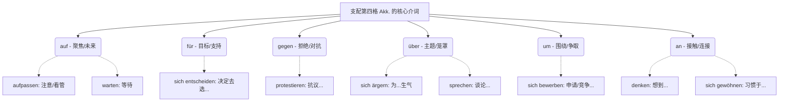

# 动词、形容词、名词与介词的固定搭配

^1hwhf1

今天你上传的这张图，可谓是 B 1-B 2 阶段的“重头戏”，也是很多同学的“梦魇”——**动词、形容词、名词与介词的固定搭配（Nomen-Verb-Verbindungen）**，而且专门聚焦于支配第四格（Akkusativ）的介词。

别怕，大师今天不用枯燥的理论折磨你。咱们把德语想象成一个精密的电器系统：**动词（Verb）就像是电器插头，而宾语（Objekt）是电源。介词（Präposition）就是那个必不可少的“转换插头”**。不同的电器（动词含义）需要配对特定的转换插头（介词），才能通上第四格（Akkusativ）的电！

为了让你更直观地理解这些“转换插头”的底层逻辑，我先为你生成一张思维导图：

下面，我们将结合你在德国生活、求职、看病等真实场景，把这些看似死板的搭配变成你脑海中鲜活的肌肉记忆！

---

### 第一部分：核心介词的“性格密码”与实战场景

其实，介词搭配并不是毫无规律的。每个介词都有自己的“性格”和空间感。

#### 1. **auf** (目标焦点 / 面向未来)

_auf_ 本意是“在...上面”，引申为**目光的聚焦**或**对未来事物的期盼**。

- **生活场景（等待与期盼）：** `warten auf` (等待), `sich freuen auf` (对未来的事感到高兴/期待)。
    - _例句：_ Ich **warte auf** den Brief von der Ausländerbehörde. (我正在等外管局的信。) —— _你的目光死死盯着未来那封信。_
- **生活场景（警惕与关注）：** `aufpassen auf` (照顾/注意), `achten auf` (注意)。
    - _例句：_ Bitte **passen** Sie **auf** Ihr Gepäck **auf**! (请看管好您的行李！) —— _你的注意力全部聚焦在行李上。_

#### 2. **für** (目标对象 / 绝对支持)

_für_ 代表为了某个目标、利益或者立场。

- **求职与生活场景：** `sich interessieren für` (对...感兴趣), `sich entscheiden für` (决定选择...)。
    - _例句：_ Ich **interessiere mich für** diese Wohnung. (我对这套公寓感兴趣。) —— _你的心已经偏向（为了）这个房子了。_

#### 3. **gegen** (拒绝 / 物理与心理的对抗)

_gegen_ 是一股逆向的力量，代表反击、抗议。

- **维权与行政场景：** `protestieren gegen` (抗议), `sich verteidigen gegen` (自我防御)。
    - _例句：_ Wir **protestieren gegen** die hohe Miete. (我们抗议高昂的租金。) —— _你站在高租金的对立面。_

#### 4. **über** (理性探讨 / 感性情绪的主题)

_über_ 有一种“在上方盘旋/俯瞰”的感觉。不管是我们在“谈论”一件事，还是“为某事生气”，这件事都在我们的脑海上方盘旋。

- **职场沟通（理性）：** `sprechen über` (谈论), `sich informieren über` (了解关于...)。
    - _例句：_ Wir müssen **über** den Arbeitsvertrag **sprechen**. (我们得谈谈这份工作合同。)
- **情绪表达（感性）：** `sich ärgern über` (对...生气), `sich freuen über` (对已发生的事感到高兴)。
    - _例句：_ Er **ärgert sich über** die Verspätung des Zuges. (他为火车晚点感到生气。)

#### 5. **um** (围绕 / 努力争取某物)

_um_ 画了一个圈，代表你围绕着一个中心在努力，想要把它“拿下”或者“照顾好”。

- **求职与家庭场景：** `sich bewerben um` (申请/应聘), `sich kümmern um` (照顾/负责)。
    - _例句：_ Ich **bewerbe mich um** die Stelle als Ingenieur. (我正在申请这个工程师的职位。) —— _众星拱月，你在争取那个核心的位置。_
    - _例句：_ Keine Sorge, ich **kümmere mich um** den Termin beim Arzt. (别担心，我会搞定医生预约的事。)

#### 6. **an** (思想或习惯的“物理接触”)

_an_ 强调的是一种边界的接触，引申为“脑电波的连接”或“习惯的贴合”。

- **融入与思乡场景：** `denken an` (想念/想到), `sich gewöhnen an` (习惯于...)。
    - _例句：_ Ich muss **mich an** das deutsche Wetter **gewöhnen**. (我必须得习惯德国的天气。) —— _你的身心需要慢慢去“贴合、接触”这种新环境。_
    - _例句：_ Ich **denke** oft **an** meine Familie in der Heimat. (我经常想到国内的家人。) —— _脑电波的连接。_

---

### 第二部分：教材底部的“武功秘籍” (两大黄金法则)

仔细看你上传的图片的下半部分，这里藏着德语考试和学习的捷径！

#### 黄金法则一：“一词多配”改变命运 (语义的微调)

同一个动词，换一个“转换插头（介词）”，意思会有微妙的改变。图中举了 `kämpfen` (战斗) 的绝佳例子：

1. Der Kampf **für** die Freiheit. (为了自由而战 -> **正向争取**)
2. Der Kampf **gegen** die Ungerechtigkeit. (反抗不公而战 -> **反向抵抗**)
3. Zwei Männer kämpfen **um** eine Frau. (两个男人为一个女人而战 -> **围绕一个目标的争夺**)

#### 黄金法则二：“一家人就是要整整齐齐” (词根连带记忆法)

**⚠️ 划重点：这能帮你省去 70% 的背单词时间！**

意义相同的动词、名词和形容词，往往**共享同一个介词**！

- **动词：** `sich ärgern über` (为...生气)
- **名词：** `der Ärger über` (对...的愤怒)
- **形容词：** `verärgert über` (对...感到生气的)
- **动词：** `sich interessieren für` (对...感兴趣)
- **名词：** `das Interesse an` (等等！图中这里出现了一个著名的“特例”陷阱：动词是 für，但名词 das Interesse 固定搭配 **an** + Dativ，形容词 interessiert 也是搭配 **an**。教材用红色的警告符号 ⚠️ 标出来了，考试极爱考这个例外！)

---

### 德语大师的半年 B 2 备考建议 (针对介词搭配)

1. **绝不孤立背诵：** 从今天起，你的词汇本里不能只有 "warten - 等待"。必须记成 `warten auf + Akk. (等待...)`。连带着介词和格位一起背！
2. **情境造句法：** 每天选 3 个搭配，结合你未来在德国的租房、找工作场景造句。自己写的句子，大脑最不容易忘。
3. **注意区分格位：** 这页讲的都是第四格 (Akk.)，但德语中也有搭配第三格 (Dativ) 的（比如 teilnehmen an）。一定要把“动作的方向感”和格位联系起来。

语言的规律一旦被看破，就只剩下熟练度的问题了。

那么，今天我们先来实战检验一下：如果你想用德语向面试官表达“我正在为下周的德语 B 2 考试做准备”（提示：使用动词 `sich vorbereiten`，它的介词插头和 `warten` 是一样的），你会怎么造这个句子呢？
