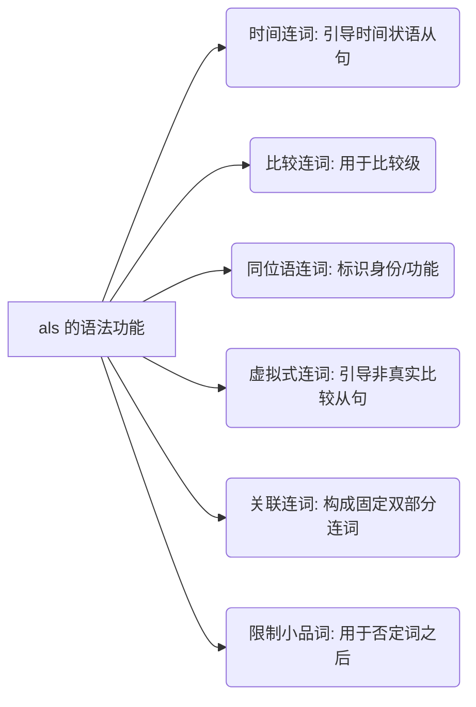

# als所有用法

`als` 在德语中是一个高度灵活且功能多样的词，贯穿了从 A 1 到 C 1 的各个学习阶段。为了在六个月内达到 B 2 水平，你必须绝对精确地掌握它在不同语境下的词性、格的支配以及对句子语序的影响。

为了清晰梳理其语法体系，这里参照 "The Mermaid Guide to Text-Based Diagramming and Visualization" 的可视化原则，先用结构图为你拆解 `als` 的六大核心用法：

代码段

以下是各项用法的详尽剖析。

## 一、 时间连词 (Temporale Subjunktion)

作为从属连词，`als` 引导时间状语从句，**必须同时满足两个条件**：

1. 描述发生在**过去**的事件或状态。
2. 该事件或状态是**一次性**的（非重复发生）。

    _语法规则：引导从句，动词必须放在从句句末。_

- **Als** ich gestern beim Ausländerbehörde war, fehlte mir ein wichtiges Dokument.
    （昨天我去外管局的时候，少带了一份重要文件。）

- Ich hatte schon drei Jahre Berufserfahrung, **als** ich nach Deutschland kam.
    （当我来到德国时，我已经有了三年的工作经验。）

## 二、 比较连词 (Vergleichspartikel / Konjunktion)

用于比较级（Komparativ）之后，表示两个事物在某方面**不相等**（对应英文的 "than"）。

_语法规则：通常不改变原有句子的语序，直接连接被比较的对象。_

- Die Kaltmiete in München ist deutlich höher, **als** ich erwartet habe.
    （慕尼黑的冷租比我预期的要高得多。）

- Es ist für Einwanderer oft schwerer, eine Wohnung zu finden **als** einen Job.
    （对移民来说，找房子往往比找工作更难。）

## 三、 同位语连词/身份标识 (Apposition / Gleichsetzungsfunktion)

这是 B 1-B 2 考试中最常设陷阱的考点。此时 `als` 意为“作为”，用于说明身份、职业、角色或功能。

_语法规则（极度重要）：**格的一致性 (Kasuskongruenz)**。`als` 后面的名词或代词，必须与其所指代的名词/代词在“格”上保持绝对一致。_

- **第一格 (Nominativ) 保持一致：**
    Ich arbeite hier **als** diplomierter Krankenpfleger.
    （我在这里作为注册护士工作。—— `als` 指代主语 `Ich`，故用第一格）

- **第四格 (Akkusativ) 保持一致：**
    Der Arzt hat mir dieses Medikament **als** starkes Schmerzmittel verschrieben.
    （医生给我开了这种药作为强效止痛药。—— `als` 指代宾语 `dieses Medikament`，故用第四格）

- **第三格 (Dativ) 保持一致：**
    Bei diesem Problem spreche ich mit dir **als** meinem Berater.
    （在这个问题上，我是把你当作我的顾问来交谈的。—— `als` 指代介词宾语 `dir`，故用第三格 `meinem Berater`）

## 四、 引导非真实比较从句 (Irrealer Vergleichssatz)

用于表达“好像……”、“仿佛……”，**必须与第二虚拟式 (Konjunktiv II) 连用**。此用法有三种变体，语序规则各不相同：

1. **als ob + 动词尾语序：**
    Der Beamte tat so, **als ob** er meinen Akzent nicht _verstanden hätte_.
    （那个签证官表现得好像他没听懂我的口音一样。）

2. **als + 动词第二位语序（强烈推荐掌握，最地道）：**
    省略 `ob`，此时变位动词必须紧跟在 `als` 之后。
    Der Beamte tat so, **als** _hätte_ er meinen Akzent nicht verstanden.
    （句意同上。注意 `hätte` 的位置提前了。）

3. **als wenn + 动词尾语序（较少用，等同于 als ob）：**
    Er sieht so aus, **als wenn** er drei Nächte nicht _geschlafen hätte_.
    （他看起来好像三天没睡觉了。）

## 五、 构成固定关联词组 (Mehrteilige Konnektoren)

用于表达“既……又……”或“不仅……而且……”，连接两个平行的句子成分。

_语法规则：固定搭配 `sowohl ... als auch ...`。连接的两个部分没有主次之分。_

- Für die Niederlassungserlaubnis brauchen Sie **sowohl** ein festes Einkommen **als auch** das B 1-Zertifikat.
    （为了获得永久居留许可，您既需要稳定的收入，也需要 B 1 语言证书。）

## 六、 用于否定词之后的限制 (Einschränkung nach Negation)

当 `als` 出现在 `nichts`（什么也没有）、`niemand`（没有人）、`kein-`（没有）等否定词之后，意为“除了……（没有别的）”。

- Ich habe auf dem Amt heute **nichts als** Ärger gehabt!
    （我今天在局里除了惹了一肚子气，什么也没得到！）

- **Niemand anders als** der Vermieter hat den Ersatzschlüssel.
    （除了房东，没有任何人有备用钥匙。）

`als` 的核心就在于：看到它，先判断它是连句子（注意语序）、连比较级，还是连身份（注意对格）。

你现在对“同位语连词的格一致性 (Kasuskongruenz)”理解得如何？需要我给出几个带陷阱的填空题来测试一下你的肌肉记忆吗？

## 七、 表语性成分 (als-Prädikativum)

这是 `als` 在德语中最常被误判、但在你未来工作生活中最核心的用法。它**不是**同位语，而是一种独立的表语性说明成分。

**语法定义与规则：** `als` 引导一个名词短语，用来补充说明句子中的主语或宾语在**谓语动词发生时**所处的身份、角色、状态或功能。

1. **非紧贴性**：它不需要像同位语那样紧贴着被修饰的名词，它可以灵活地放在句首（占据第一位）或被谓语动词隔开。
2. **核心可删减性**：它在句法上是补充说明，删掉后句子的主谓宾核心结构依然成立。
3. **格的一致性 (Kasuskongruenz)**：这是它唯一和同位语表现相似的地方。`als` 后的名词必须与它所说明的主语或宾语在“格”上保持绝对一致。

**实战场景解析：**

- **修饰第一格主语 (Subjektsprädikativum)：** **Als 18-jähriger Entwickler** habe ich mein erstes Konto bei Amazon Web Services registriert. （作为 18 岁的开发者，我注册了我的第一个 AWS 账户。） _解析：`als` 引导的成分修饰主语 `ich`，说明主语在注册账户时的身份状态，因此 `Entwickler` 使用第一格（强变化形容词词尾 -er）。即便它被放在了句首，依然是独立说明主语的表语性成分。_
- **修饰第四格宾语 (Objektsprädikativum)：** Das IT-Unternehmen stellt mich **als Administrator für Oracle Cloud** ein. （这家 IT 公司聘用我作为 Oracle Cloud 的管理员。） _解析：`als` 成分修饰第四格宾语 `mich`，说明“我”被聘用后的职位角色，因此 `Administrator` 必须跟随使用第四格。_
- **修饰介词宾语（常与特定动词搭配）：** Die Ausländerbehörde sieht dieses Zertifikat **als einen gültigen Nachweis** an. （外管局将这份证书视为有效的证明。） _解析：这是由动词 `ansehen als` 构成的固定搭配，`als` 修饰前面的第四格宾语 `dieses Zertifikat`，因此后续的 `Nachweis` 也是第四格。_
