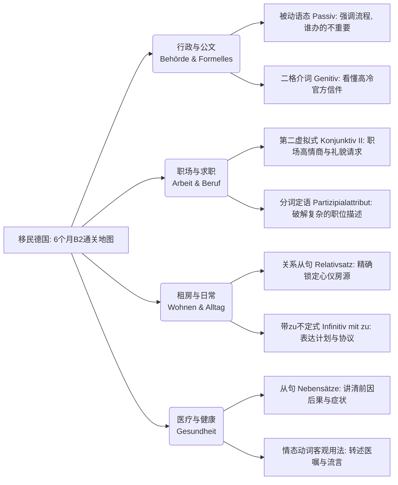

---

### 🏛️ 核心语法与生活场景全总结

为了让您彻底理解这些抽象概念，我们把它们全部转化为**生活中的“潜规则”**：

**1. 被动语态 (Das Passiv)**

* **大师类比：** “无影手”。就像魔术一样，东西变了，但你不知道（或不在乎）是谁变的。
* **适用场景：** 行政审批（外管局延签）、办事大厅、警局报案。在这些地方，**流程大于个人**。
* **实战例句：** *Das Visum wird gerade bearbeitet.* (签证正在被处理中。——至于到底是哪个官员在处理，曹无此人，完全不重要。)

**2. 第二虚拟式 (Der Konjunktiv II)**

* **大师类比：** “社交润滑剂”与“白日梦”。它用来表达没发生的事、假设，或者在求人办事时，刻意拉开距离以显示极高的礼貌。
* **适用场景：** 找工作面试、跟房东砍价、请求同事/政府人员帮忙。
* **实战例句：** *Könnten Sie mir bitte das Formular geben?* (您能把表格给我吗？——比直接用祈使句“给我表格！”听起来顺耳一万倍。)

**3. 关系从句 (Relativsätze)**

* **大师类比：** “超级放大镜”。当一个名词不足以描述你要的东西时，加上一个句子来精确定位它。
* **适用场景：** 租房看房（挑剔房子的细节）、二手市场交易。
* **实战例句：** *Ich suche eine Wohnung, die einen Balkon hat und in der Nähe der U-Bahn liegt.* (我在找一个带阳台且靠近地铁的房子。)

**4. 带 zu 的不定式 (Infinitiv mit zu)**

* **大师类比：** “目标锁定器”。表示一种企图、计划、建议或规则。
* **适用场景：** 签订合同、表达个人职业规划、理解德国人的各类“规矩”。
* **实战例句：** *Es ist verboten, hier das Fahrrad abzustellen.* (把自行车停在这儿是被禁止的。) / *Ich habe vor, einen Sprachkurs zu besuchen.* (我打算去上个语言班。)

**5. 各类从句 (Nebensätze - weil, obwohl, dass, wenn)**

* **大师类比：** “火车头与车尾”。德语从句就像一列把最重要的动词踢到车尾的火车。用来建立逻辑关系（因果、让步、条件）。
* **适用场景：** 医疗问诊（描述病情因果）、向上级汇报工作、请假。
* **实战例句：** *Ich brauche heute einen Termin, weil ich starke Kopfschmerzen habe.* (我今天需要一个预约，因为我头疼得厉害。)

**6. 分词定语与长定语 (Partizipialattribute)**

* **大师类比：** “套娃”。把一长串动作压缩成一个形容词，塞在名词前面。这是 B 2 乃至 C 1 的标志性难点，德国人极爱在书面语里用。
* **适用场景：** 阅读繁琐的雇佣合同、理解长篇大论的职位描述 (Stellenbeschreibung)。
* **实战例句：** *Die von mir unterschriebenen Dokumente liegen auf dem Tisch.* (那些“被我签过字的”文件在桌上。)

**7. 支配第二格的介词 (Präpositionen mit Genitiv)**

* **大师类比：** “燕尾服”。穿上它，你的德语立刻显得极其正式、官方、有教养。
* **适用场景：** 收发各种政府信函 (Briefe vom Amt)、保险理赔。
* **实战例句：** *Wegen des schlechten Wetters fällt der Flug aus.* (由于恶劣天气，航班取消。——政府或公司的正式通知一定会这么写。)
