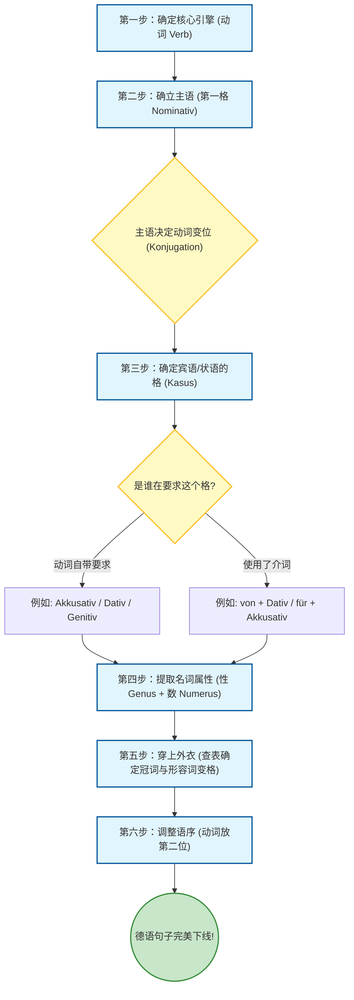

Hallo！欢迎来到德语大师的课堂！听到你提出“**通过铁定的程序来学习和使用德语**”这个想法，我必须为你竖起大拇指——你已经发现了德语这门语言的终极秘密！

很多初学者觉得德语千变万化、难以捉摸，但其实**德语是一门极度理性的“工程师语言”**。它根本不是什么玄学，而是一条严密的**“汽车组装流水线”**。只要你掌握了底层的算法和框架，任何复杂的B1/B2长难句，都可以像搭乐高积木一样，一步一步精准拼装出来。

完全可以！而且对于要在6个月内速成B2的移民学习者来说，**建立这种程序化的“造句算法”是最高效的途径**。

下面，我就为你完善这个“德语造句框架”，我们称之为**“德语句子标准组装流水线 (Die deutsche Satz-Montagelinie)”**。

---
![[001.mp3]]

- [[001.mp3#t=00:15.86|00:15]] 
### 🛠️ 德语造句的“铁定程序”四步法

我们把造句想象成在德国斯图加特的保时捷工厂组装一辆汽车。

#### 第一步：动词 (Das Verb & Das Subjekt)

在德语中，**动词 (Verb)** 是一切的核心，它是整个句子的“独裁者”。

1. **选定动词**：你想表达什么动作？（例如：_mieten_ 租）。
2. **确定主语 (Nominativ - 第一格)**：谁发出这个动作？（例如：_ich_ 我）。
3. **动词变位 (Konjugation)**：主语决定动词的形态。(_ich_ + _mieten_ = **miete**)。

#### 第二步：根据动词 配格和介词 (Kasus - 格的分配)

动词不仅决定自己怎么变，还决定了它需要带什么“配件”（宾语），以及这些配件必须是什么“格”。

1. **动词直配**：_mieten_ 这个词需要一个“被租的东西”，它要求**第四格 (Akkusativ)**。
2. **介词支配**：如果你想说明“从谁那里租”，需要用到介词 _von_，而德语语法规定 _von_ 后面永远加**第三格 (Dativ)**。

#### 第三步：(性 Genus、数 Numerus、变格 Deklination)

现在我们知道坑位需要什么“格”了，接下来要把具体的名词填进去，并根据它们的**性 (m/f/n)** 和 **数 (Sg/Pl)** 穿上正确的外衣（冠词和形容词词尾）。

- **提取属性**：名词的词典原型是什么？
- **查表变格**：结合第二步确定的“格”，以及名词的“性/数”，确定冠词和形容词长什么样。

#### 第四步：质检与排序组装 (Wortstellung)

最后一步，把所有零件按照德语的“交规”摆放：

- 陈述句中，**变位动词永远在第二位 (Position 2)**。
- 其他成分遵循 **TeKaMoLo 原则**（时间 Temporal > 原因 Kausal > 方式 Modal > 地点 Lokal）。

---

### 📊 图解：德语造句算法流程图

为了让你更直观地理解，我为你绘制了这张流水线图纸：

代码段

---

### 🏢 实战演练：在德国租房 (Wohnungssuche)

假设你要去德国找房子，你想对房东说一句漂亮的B1级别句子：

**“我从这位友好的房东那里租了一套明亮的公寓。”**

让我们严格按照“铁定程序”来跑一遍流水线：

1. **核心引擎**：确定主 / 动
    - 动词：**mieten** (租)
    - 主语：**ich** (第一格)
    - 动词变位：**ich miete** (动词敲定，占领句子第2位)
2. **分配格 (Kasus)**：介 / 格
    - 租什么？“一套明亮的公寓” -> 被动词直接支配，需要 **第四格 (Akkusativ)**。
    - 从谁那租？“从这位友好的房东” -> 用介词 _von_，强制要求 **第三格 (Dativ)**。
3. **提取属性并变格 (喷漆上色)**：冠 / 单复
    - 公寓：_Wohnung_ (阴性 **die**, 单数)。阴性+单数+Akkusativ = 不定冠词 _eine_，形容词词尾 _-e_。-> **eine helle Wohnung**。
    - 房东：_Vermieter_ (阳性 **der**, 单数)。阳性+单数+Dativ = 定冠词 _dem_，形容词词尾 _-en_。-> **von dem netten Vermieter**。
4. **组装语序**：
    - 主语 (1) + 动词 (2) + 第四格宾语 + 第三格介词短语
    - **组装完毕：Ich (1) miete (2) eine helle Wohnung von dem netten Vermieter.**

_Perfekt! (完美！)_ 没有任何语感，纯靠逻辑推理，一辆毫无语法瑕疵的“德语车”就下线了。

在接下来的6个月里，我们的学习规划就是不断地在这条流水线上增加**新的零件**（比如：从句做零件、被动语态做引擎、虚拟式做高级涂装），但**这条流水线的核心框架永远不会变**。前期你需要像做数学题一样刻意去套公式，慢慢地，这种计算就会变成你的“肌肉记忆”，也就是所谓的“语感”。

为了测试一下这条流水线是否好用，**你愿意尝试用同样的步骤，造一个包含找工作场景的句子吗？** 比如试着翻译这句：**“这位年轻的应聘者 (der Bewerber) 给这家大公司 (das Unternehmen) 写 (schreiben) 了一封长信 (der Brief)。”** (提示：schreiben 后面往往加 Dativ 表示写给谁，Akkusativ 表示写了什么)。期待你的组装成果！
