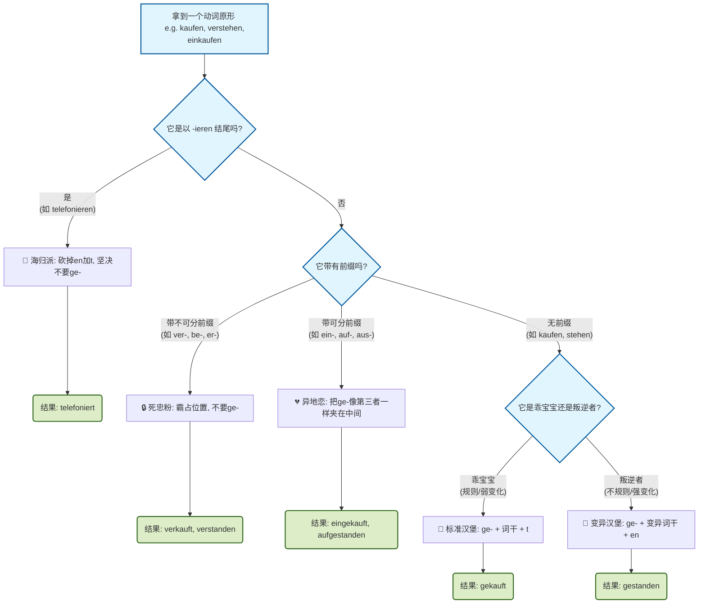

[[语言学习/德语/公共知识语法/⭐✍️语法快查必背语法，表格canvas.md#^XH8MlJDj]]

![[image-33.png|894x548]]
### 🌟 什么是“过去分词”？它有啥用？

在德语里，动词就像是一个个打工人。为了适应不同的工作场合，它们需要换上不同的“工作服”。
**过去分词（Partizip II）**就是动词的一套非常重要的特殊工作服。它主要用于两个极其高频的场景：

1.  **讲述过去的故事（完成时 Perfekt / Plusquamperfekt）：** 比如跟外管局解释“我已经交了材料”（Ich habe die Unterlagen **abgegeben**）。
2.  **表达被动状态（被动语态 Passiv - B 1/B 2 重点）：** 比如看房时说“这套房子已经被租出去了”（Die Wohnung wird **vermietet**）。

---

### 🍔 过去分词的“汉堡包”锻造法则

怎么把一个原形动词变成过去分词？大多数情况下，我们要给动词词干（肉饼）加上前后缀，做成一个“汉堡包”。
根据动词的性格不同，我们可以把它们分为三大门派（完美对应你截图里的三大列）：

#### 第一派：乖宝宝（规则动词 / 弱变化动词）
**【公式】**：顶层面包 ** `ge-` ** + 词干肉饼 + 底层面包 ** `-t` **
**【特征】**：它们非常听话，中间的肉饼（词干）绝对不变形。截图里左边第一列“以 -t 结尾”说的就是它们！

**🏢 移民生活实战（购物/租房场景）：**
* **kaufen**（买）：去掉 en 剩下词干 kauf。加上汉堡包外壳 ➡️ **ge-kauf-t**。
    * *Ich habe ein Auto **gekauft**.* (我买了一辆车。)
* **mieten**（租）：词干是 miet。加上外壳 ➡️ **ge-miet-et** （注意：因为 miet 以 t 结尾，为了发音方便加了个 e，这叫发音缓冲垫）。

#### 第二派：叛逆者（不规则动词 / 强变化动词）
**【公式】**：顶层面包 ** `ge-` ** + **变异的**词干肉饼 + 底层面包 ** `-en` **
**【特征】**：它们生性叛逆，中间的肉饼（词干里的元音字母）通常会发生改变，而且底部的面包坚持要用 ** `-en` **。截图里右边那一列说的就是它们！这部分没办法，只能在平时的阅读中积累语感。

**🏥 移民生活实战（生病/排队场景）：**
* **stehen**（站立）：词干 steh 变异成了 stand。加上外壳 ➡️ **ge-stand-en**。
    * *Ich habe zwei Stunden bei der Ausländerbehörde **gestanden**.* (我在外管局站了两个小时。)
* **finden**（找到）：词干变异成 fund。加上外壳 ➡️ **ge-fund-en**。
    * *Ich habe endlich einen Job **gefunden**.* (我终于找到了一份工作。)

#### 第三派：海归精英（以 -ieren 结尾的动词）
**【公式】**：词干肉饼 + 底层面包 ** `-t` ** （**绝对不要 `ge-` **）
**【特征】**：这些词通常是外来语（长得很像英语或法语），自带高级感。它们**拒绝戴 `ge-` 这个平民帽子**，直接在后面加个 `-t` 就完事了。

**📞 移民生活实战（行政沟通）：**
* **telefonieren**（打电话） ➡️ **telefoniert**
* **kopieren**（复印） ➡️ **kopiert**
    * *Haben Sie Ihren Pass **kopiert**?* (您复印您的护照了吗？)

---

### 💥 当“过去分词”遇到我们上节课的“前缀”

你截图里的中间两行（可分动词 / 不可分动词），其实就是我们在上一节课学过的内容的升级版！当带前缀的动词需要变成过去分词时，会发生什么化学反应？

**1. 遇到“死忠粉”（不可分前缀：be-, emp-, ent-, er-, ge-, miss-, ver-, zer-）**
上节课我说过，死忠粉前缀绝不和动词分开。当动词需要加 `ge-` 变成过去分词时，**死忠粉前缀会霸占 `ge-` 的位置，把 `ge-` 一脚踢开！**
* **ver**kaufen（卖 / 规则动词）：没有 ge-，只有词干和尾巴 ➡️ **ver-kauf-t**
* **ver**stehen（理解 / 不规则动词）：没有 ge-，只有变异词干和尾巴 ➡️ **ver-stand-en**
    * *Ich habe den Arzt gut **verstanden**.* (我很好地理解了医生的话。)

**2. 遇到“异地恋”（可分前缀：ab-, an-, auf-, aus-, ein-, mit-, zu- 等）**
这类前缀平时喜欢跑来跑去，做过去分词时，** `ge-` 会像个第三者一样，硬生生挤在可分前缀和动词词干的中间！** 形成一个“超级巨无霸汉堡”。
* **ein**kaufen（采购 / 规则动词）：ein 加上 gekauft ➡️ **ein-ge-kauf-t**
* **auf**stehen（起床 / 不规则动词）：auf 加上 gestanden ➡️ **auf-ge-stand-en**
    * *Ich bin heute um 6 Uhr **aufgestanden**.* (我今天早上 6 点起床了。)

---

### 📊 大师护体：过去分词变形决策树

为了让你不再被那张死板的表格困扰，我为你做了一个动态的思考流程图。以后每次遇到动词变过去分词，就在脑海里走一遍这个流程：

---

### 📝 你的下一步实战练习 (Next Step)

理论看懂了，但我们学德语是为了真刀真枪地去生活和工作！现在，我们要把这个知识点用在 B 1/B 2 级别极其重要的 **“现在完成时 (Perfekt)”** 里面。

（提示：完成时的主句结构是：** `haben / sein` (变位放第二位) + ...... + 过去分词 (扔到句尾)**）

假设你正在处理移民初期的烦心事，请试着用上面学到的规则，把下面这三句话翻译成德语：

1.  **场景：向房东抱怨。** (用规则、无前缀动词：**machen**，过去分词是 ge-mach-t)
    * *中文：我已经做(machen)了这件事。*
2.  **场景：在外管局交涉。** (用不可分、不规则动词：**bekommen**，词干不变，过去分词是 be-komm-en)
    * *中文：我没有得到(bekommen)签证(das Visum)。*
3.  **场景：和 HR 面试。** (用可分、规则动词：**vorbereiten** 准备，vor 是可分前缀，bereiten 是规则词干)
    * *中文：我已经准备(vorbereiten)了面试(das Interview)。*

**不要怕出错，大胆造句发给我！你会发现，一旦掌握了这种像拼乐高一样的逻辑，德语语法其实充满了严谨的美感。期待你的答案！**