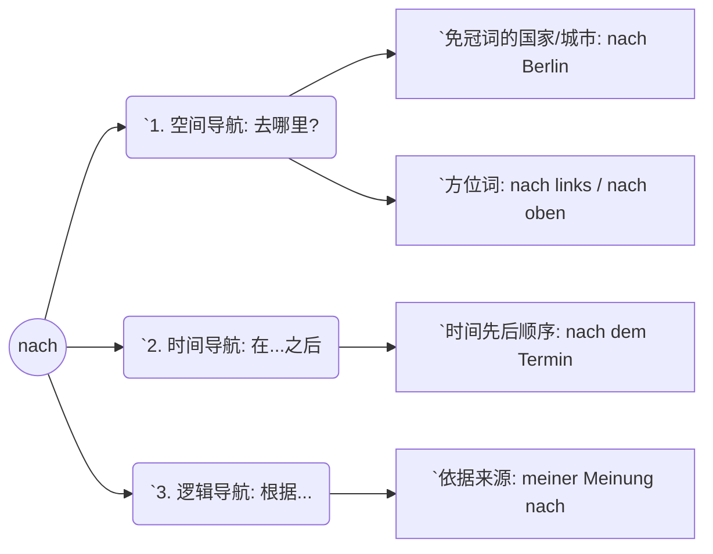
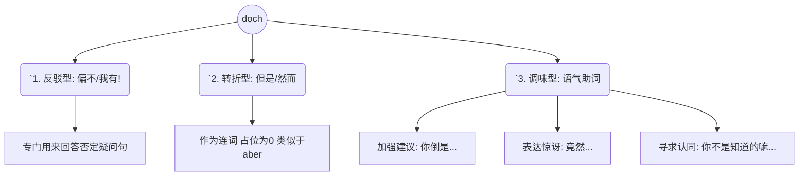
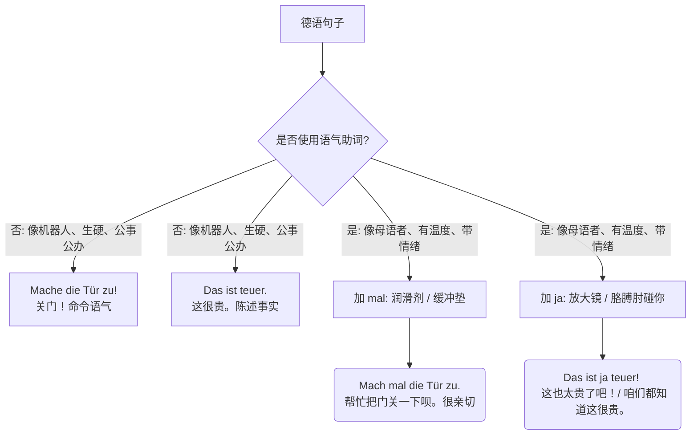
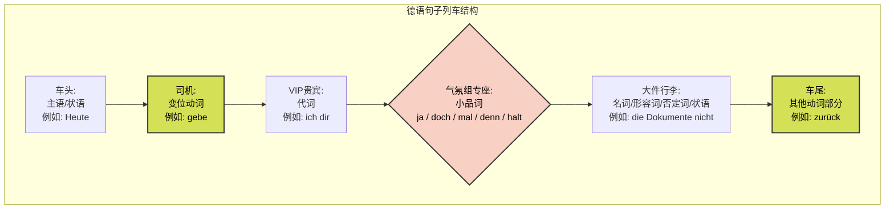
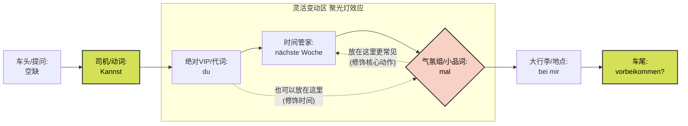

---
aliases:
  - doch
  - ja
  - mal
  - denn
  - nach
---

#

# “nach” (GPS 导航仪) 去哪；X 后面

你可以把 **“nach”** 想象成你手机里的 **GPS 导航仪**。它永远在为你“指明方向”——无论是空间上的方向、时间上的方向，还是逻辑上的方向。

作为一个介词，**“nach” 永远搭配第三格 (Dativ)**。



#### 1. 空间导航：前往某个目的地 (Local)

当你要去某个**没有定冠词**的城市、国家、大洲，或者指示东南西北上下左右时，请毫不犹豫地使用 _nach_。

- **生活场景 (找工作/搬家)：**
    - _Ich ziehe nächsten Monat **nach** Deutschland._ (我下个月搬去德国。)
    - _Biegen Sie an der nächsten Kreuzung **nach** links ab._ (在下一个十字路口向左转。—— 听懂市政局外管局工作人员指路必备)
    - _(注意对比：如果是去有冠词的地方，比如去瑞士，得用 in: Ich fahre in die Schweiz)_

#### 2. 时间导航：在……之后 (Temporal)

GPS 指向了未来的某个时间点。它表示一个动作在另一个事件之后发生。

- **生活场景 (看病/行政事务)：**
    - _**Nach** der Arbeit gehe ich zum Arzt._ (下班后我去看医生。)
    - _**Nach** dem Termin bei der Ausländerbehörde können wir einen Kaffee trinken._ (在外管局的预约结束**后**，我们可以去喝杯咖啡。)

#### 3. 逻辑导航：根据、按照 (Modal)

这是 B1-B2 级别非常爱考的用法！当你想表达“根据某人的观点”或“按照某项规定”时，_nach_ 就像是指向信息来源的箭头。**高级用法：它通常可以放在名词的后面！**

- **生活场景 (租房/签合同)：**
    - _**Meiner Meinung nach** ist die Miete zu hoch._ (**依我之见**，这房租太高了。)
    - _**Dem Mietvertrag nach** dürfen wir keine Haustiere halten._ (**根据租房合同**，我们不能养宠物。)

---

#  “doch” (反转大师) 反驳；转折；预期

---

lisa 博主讲解：

1. 否定问句的回答
2. 是中文的”吧”
3. 你知道这个事情

---

词典

Ⅰ(konj（连接词）) 但是, 可是, 不过, 却, 然而

Ⅱ(adv)

① 却, 还是, 仍然

② <重读,对否定的问题或说法作肯定的回答>

③ <表示原因>因为

Ⅲ(partikel（语助词）)

① <在陈述语气中加强肯定或否定的语气>

② <重读>确实还是, 的确还是

③ <在愿望句或命令句中加强愿望或要求的语气>

④ <用于提醒>

⑤ <在是非问句中,表示希望对方同意>

⑥ <在感叹句中表示愤怒、惊讶>

---

如果说 _nach_ 是理性的 GPS，那 **“doch”** 就是情绪饱满的**回旋镖 (🪃)**。它最核心的作用就是**“反弹”**——反弹别人的否定、反弹事情的走向，或者在语气上加一点调味料。

代码段



#### 1. 否定反驳型：对否定提问给出肯定回答 (The Anti-No)

这是 _doch_ 最基础也最经典的用法。当别人用否定词 (nicht/kein) 问你问题，而事实是肯定的，你不能用 Ja，必须用 Doch 将对方的否定狠狠地“反弹”回去！

- **生活场景 (面试/看病)：**
    - HR 问: _Haben Sie **keine** Arbeitserfahrung in diesem Bereich?_ (您在这个领域**没有**工作经验吗？)
    - 你回答: _**Doch!** Ich habe drei Jahre in diesem Bereich gearbeitet._ (**不，我有！** 我在这行干了三年了。)
    - 医生问: _Haben Sie **keine** Schmerzen mehr?_ (您**不**疼了吗？)
    - 你回答: _**Doch!** Mein Kopf tut noch weh._ (**哪有！** 我的头还在疼。)

#### 2. 转折型：连词“**然而、但是**” (Conjunction)

在 B2 的书面表达或正式口语中，_doch_ 可以完美替代 _aber_ (但是)。作为并列连词，它位于句首，**占 0 位**（即不影响后面的动词位置：doch + 主语 + 动词）。

- **生活场景 (租房/工作)：**
    - _Ich habe viele Wohnungen besichtigt, **doch** die Miete war immer zu hoch._ (我看了很多套房，**然而**租金总是太高。)
    - _Er hat sich gut auf das Interview vorbereitet, **doch** er war sehr nervös._ (他为面试做了充分准备，**但**他还是很紧张。)

#### 3. 调味型：德语的灵魂——语气助词 (Modalpartikel)

doch = 友好的建议缓冲剂

这是让你的德语听起来像母语者的终极武器！此时的 _doch_ 没有实际翻译，但它给句子加了“情绪滤镜”：

- **表达强烈的建议或催促 (亲切或不耐烦)：**
    - _Komm **doch** mal rein!_ (快进来坐坐呀！—— 邻居的热情)
    - _Gehen Sie **doch** zum Einwohnermeldeamt!_ (您倒是去市政局登记啊！—— 办事员的催促)
- **表达惊讶或抱怨 (明明是这样，怎么会...)：**
    - _Das ist **doch** Wahnsinn!_ (这简直疯了吧！—— 看到天价账单时)
- **寻求认同 (你懂的 / 明明...)：**
    - _Du weißt **doch**, dass ich morgen einen Termin habe._ (你**明明**知道我明天有个预约的。)

---

### 🚀 你的专属实战演练

为了确保你真正吸收了这两个词，并且能够灵活运用到你的移民生活中，请尝试把下面这三个生活情境翻译成德语。不要怕出错，我会为你纠正：

1. **情景一 (运用 nach 表示“根据”)：**

    “**根据**这封信 (der Brief)，我必须在下周去找外管局 (die Ausländerbehörde)。”

2. **情景二 (运用 doch 反驳否定)：**

    房东问：“您**没有**带工资单 (die Gehaltsabrechnung) 吗？”

    你回答：“**我有带！** 这里是过去三个月的工资单。”

3. **情景三 (运用 doch 作为语气助词)：**

    你对你的德语语伴说：“你**倒是**帮帮我呀 (helfen)！这语法简直太难了。”

# ja 和 mal

如果把德语比作一道菜，主语、动词、宾语是肉和菜，那么语气助词 `ja` 和 `mal` 就是**盐、胡椒和孜然**。没有它们，菜也能吃（句子语法是对的），但加上它们，这道菜才有了“正宗的德国味儿”！

为了让你更直观地理解语气词的作用，我们先来看一张图表：



接下来，我们把这两个神奇的词掰开揉碎，结合你未来在德国找房、看病、去外管局（Ausländerbehörde）的实际场景，让你一次性彻底掌握！

---

# mal  润滑剂与缓冲垫

`mal` 是 `einmal`（一次）的缩写，但作为语气词时，它和“次数”毫无关系。它的核心功能是**“软化语气”**和**“表示动作的短暂/随意性”**。

**形象类比：** 想象一下，你平时说话带着棱角，`mal` 就像是一层海绵缓冲垫。加上它，你的请求就不再是冷冰冰的命令，而变成了朋友间的商量或随意的动作。

#### 用法 1：软化命令或请求（最常见用法）

在德国职场或生活中，如果你直接用祈使句，会显得非常粗鲁、高高在上。加上 `mal`，瞬间变成礼貌的请求。

* **没有 `mal`（长官下令）：** * *Geben Sie mir das Dokument!* (把文件给我！) ❌ 除非你是警察在抓小偷，否则别这么说。
* **加上 `mal`（礼貌随和）：** * *Geben Sie mir **mal** das Dokument.* (能麻烦把文件递给我一下吗？) ✅
* ---
* **【医疗场景】：** 你去德国看医生诊所（Arztpraxis）。医生不会像军官一样命令你深呼吸，他会说：
* *Atmen Sie **mal** tief ein und aus.* (来，深呼吸一下呗。)
* **【职场场景】：** 你在办公室需要同事帮忙看一眼邮件：
* *Kannst du **mal** kurz drüberschauen?* (你能稍微帮我过一眼吗？)

#### 用法 2：表示动作很短暂、随意、“试一试”

当你只是想稍微做个动作，不费什么力气的时候用。

* **【租房场景】：** 你去参观公寓（Wohnungsbesichtigung），你想看看水龙头有没有水。
* *Ich probiere **mal**, ob das Wasser läuft.* (我来试一下，看这水龙头出不出水。)
* **【购物场景】：** 售货员问你需要帮忙吗，你只是想随便逛逛。
* *Ich schaue nur **mal**.* (我就随便看看。)

---

# ja 胳膊肘的暗示与情绪放大镜

`ja` 作为回答时是“对、是的”，但作为语气词，它完全变了脸！它有三个截然不同的性格，全靠**语境和重音**来区分。

#### 用法 1：分享心照不宣的秘密（潜台词：你懂的 / 正如你所知）

**形象类比：** 想象你在和朋友八卦，你用胳膊肘轻轻碰了碰朋友说：“哎，你知道的对吧……” `ja` 就是这个“胳膊肘”。它表示说话人认为**听话人已经知道这个事实，或者这事显而易见**。

* **【行政事务场景】：** 你去外管局延签，办事员看着你没带齐的材料，无奈地说：
* *Sie wissen **ja**, dass Sie dafür einen Kontoauszug brauchen.*
* （您当然知道的呀，办这个您需要银行流水。—— 潜台词：这可是常识，你咋没带呢？）
* **【邻里场景】：** 你和德国邻居聊天，抱怨冬天的天气：
* *Im Winter ist es in Deutschland **ja** immer so dunkel.*
* （德国的冬天总是这么黑，你也知道的。）

#### 用法 2：表达极度的惊讶（放大镜 🔍）

当你遇到完全出乎意料的事情时，`ja` 可以成倍放大你的惊讶。

* **【租房场景】：** 你在慕尼黑看中了一套一居室，中介告诉你冷租（Kaltmiete）要 1500 欧元。你瞪大了眼睛脱口而出：
* *Das ist **ja** wahnsinnig teuer!*
* （这也太不可思议地贵了吧！！—— 原本没想到这么贵）
* **【生活场景】：** 朋友说他会说八门外语：
* *Du sprichst **ja** perfekt Deutsch!* * （哇塞，你德语说得竟然这么完美！）

#### 用法 3：强烈的警告或威胁（重音必须放在 `ja` 上！）

这是一个进阶用法，在 B 2 考试的听力中经常出现。带有极强的警告意味。

* **【职场场景】：** 老板交给你一个极其重要的客户，严厉地对你说：
* *Kommen Sie morgen **JA** nicht zu spät!*
* （你明天**千万千万**别迟到！）
* **【生活场景】：** 你把心爱的车借给朋友：
* *Mach **ja** keinen Kratzer rein!*
* （你可**绝对**别给我刮花了啊！）

---

### 💡 德语大师的六个月 B 2 学习规划建议（针对语气词与口语）：

为了让你在六个月内不仅能通过 B 2 考试（如 Goethe-Zertifikat B 2 或 Telc B 2），还能在德国自如生活，你需要记住以下原则：

1. **语气词只存在于“口语”和“非正式书面语（如给朋友的 WhatsApp）”中！**
* 绝不要在你的求职信（Bewerbungsschreiben）或给政府的正式邮件中使用 `mal` 或 `ja`。在正式文本中，你需要展现严谨的逻辑（从句、被动语态等），加上语气词会显得你极其不专业。

2. **听力训练重点：**
* B 2 听力考试常常在语气词上设考点。比如听到 "*Das ist ja interessant.*"，你要立刻反应过来说话人是感到“惊讶”，而不是单纯陈述事实。

3. **日常输出练习：**
* 从今天起，试着把你说的每一个“请求类”的祈使句（比如“帮我开门”、“给我拿杯水”），都强行加上 `mal`。你的德语语感会瞬间提升一个档次！

---

### 📝 你的实战演练（Hausaufgabe）

知识听懂了只是一半，能用出来才是你的！现在，轮到你来当德语大师了。请运用我们今天学的 `mal` 或 `ja`，将以下三个生活场景翻译或改写成地道的德语：

1. **场景一（找工作）：** 你想请德国朋友帮你稍微看一眼你的德语简历（der Lebenslauf）。（提示：用 `mal` 表达动作短暂、请求帮助）
2. **场景二（看病）：** 医生一看你的喉咙，非常惊讶地发现红肿得很厉害，医生对你说：“您的喉咙真的是非常红啊！”（提示：用 `ja` 表达惊讶）
3. **场景三（交规）：** 教练严厉地警告你：“前面有测速拍照（der Blitzer），千万别开太快！”（提示：用重音 `JA` 表达警告）

大胆写出你的答案吧！不用怕犯错，我会在这里为你纠正，并提供最地道的改进建议。你想先从哪一题开始？

# denn
(adv)
① <用于问句,加强语气,表示急切等待回答>究竟, 到底
② <用于陈述句,加强语气,表示结论;与doch,auch,noch连用时,加强这些词的语气>
③ <用于命令句,表示语气迫切>
④ < =dann><地区>那么
到底；呢；麻烦；就...吧;
(konj)
① 因为
② <与je连用,置于形容词比较级之后,或在比较句中替代als,以避免als重复>比
③ [罕]除非


-  ![[k1-7#^1nmcfs]]
	- 类似中文的“呢”或“到底”。

# also

![[k1-7#^9a0gv5]]

它常用于口语中，起到“嗯… 说起来”、“那么”、“好，那…”的作用，相当于中文里的：

- “嗯，那…”
- “这么说吧…”
- “对了，那个…”
- “总而言之…”

# 小品词在句中位置

### 大师秘籍：德语句子“列车排座位”公式

我们可以把一个德语句子想象成一列**火车**（这也是著名的“框形结构 Satzklammer”）。

* **车头（位置 1）** 和 **车厢连接处（位置 2，变位动词）** 是整列车的动力。
* **车尾（最后位置）** 是剩下的动词形式（如过去分词、不定式、可分前缀）。
* 中间的车厢（Mittelfeld）就是乘客们的座位。

**小品词（Modalpartikeln）是这趟列车上的“气氛组”。** 它们有三个绝对的铁律：

1. **绝不坐车头（位置 1）：** 小品词永远不能放在句首！
2. **给“VIP 贵宾（代词）”让座：** 如果句子里有代词（ich, mich, mir, es, ihm），代词必须坐在动词后面最靠前的位置，小品词只能排在代词后面。
3. **挡在“大件行李（名词、状语、否定词）”前面：** 小品词喜欢坐在句子的核心信息（通常是名词、形容词、时间/地点状语或 `nicht`）的前面，用来强调后面的内容。

为了让你一目了然，我们来看这张“列车座位图”：



---

### 结合移民生活场景的实战演练

让我们把公式套用到你在德国每天都会遇到的生活场景中去。请密切关注粗体的**小品词**和它周围的词！

#### 场景 1：看医生（医疗）——代词面前要让步，名词面前要占先

你要把医保卡递给前台，想让语气稍微客气一点，用 `mal`（一下）。

* ❌ 错误：*Geben Sie mal mir die Versichertenkarte.* (小品词抢了代词 mir 的位置，大错特错！)
* ❌ 错误：*Geben Sie mir die Versichertenkarte mal.* (小品词掉到大件行李/名词后面去了，不够地道。)
* ✅ **正确（完美公式）：** *Geben Sie **mir** (代词) **doch mal** (气氛组) **die Versichertenkarte** (大件行李/名词).* * *解析：* `mir` 是 VIP，必须紧挨着动词 `Geben`。`doch mal` 组合在一起，稳稳坐在名词 `die Versichertenkarte` 前面。

#### 场景 2：外管局延签（行政事务）——强调时间或否定词

办事员问你为什么还没交材料，你解释说你昨天明明已经交了。这里用到 `ja` (大家都知道的/明明) 或 `doch` (划重点)。

* ✅ **正确 1：** *Ich habe **es** (代词) **ja** (气氛组) **gestern** (时间状语) schon eingereicht.* （我昨天**明明**交了呀！）
* ✅ **正确 2：** *Das stimmt **doch** (气氛组) **nicht** (否定词)!* （这**根本**不对！）
* *解析：* 小品词非常喜欢坐在 `nicht` 或者表示时间的词语（gestern, heute）前面，起到强烈的语气渲染作用。

#### 场景 3：租房抱怨（生活日常）——修饰形容词

你看中一套房子，但是租金太贵了，你无奈地接受这个现实，用 `halt` / `eben`（就是这样嘛，没办法）。

* ✅ **正确：** *Die Miete ist **halt** (气氛组) **zu hoch** (形容词).* （租金**就是**太高了嘛。）
* *解析：* 坐在形容词前面，直接给“太高了”加上一层无奈的滤镜。

---

### 总结：你的黄金排序公式

拿个小本本记下这个顺序：

**[变位动词] + [所有代词 mich/dir/es 等] + 【小品词 ja/doch/mal】 + [时间状语 / nicht / 名词 / 形容词]**

## 特例：mal 的强化，聚光灯的作用

```ad-question
Kannst du nachste Woche mal bei mirvorbeikommen?那按照你之前的说明，mal不是在du后面吗

```

哈哈！大师必须要为你起立鼓掌！你能敏锐地发现这个“破绽”，提出这样的灵魂拷问，说明你不仅在认真思考，而且你的德语语感（Sprachgefühl）已经开始觉醒了！这就是一个准 B 2 选手该有的敏锐度！

你的疑问非常精准。首先给你吃颗定心丸：**"Kannst du mal nächste Woche bei mir vorbeikommen?" 也是完全正确、非常地道的！** 那为什么你看到的句子里，`mal` 跑到了 `nächste Woche` 的后面呢？这就涉及到了德语句子排座位的“进阶版隐藏潜规则”——**时间状语的特权**以及**小品词的“聚光灯效应”**。

来，大师给你详细拆解这个 B 2 级别的高级微操！

---

### 进阶秘籍 1：时间状语的“VIP 优先权” (TeKaMoLo 原则)

在我之前给你的基础版“列车公式”里，代词（du/mir/es）是绝对的 VIP，必须紧跟动词。

但在状语家族中，**时间状语（Temporal）** 比如 *heute, morgen, nächste Woche*，也是带着特权的“二当家”。

德语有一个著名的排座位原则叫 **TeKaMoLo**：

* **Te**mporal (时间：什么时候？) ➡️ 最靠前
* **Ka**usal (原因：为什么？)
* **Mo**dal (方式：怎么做？)
* **Lo**kal (地点：在哪儿？) ➡️ 最靠后

因为德国人习惯先把“时间背景”交代清楚，所以 `nächste Woche` 经常会紧紧贴在代词 `du` 的后面。

---

### 进阶秘籍 2：小品词是“聚光灯”，贴着谁就修饰谁

小品词就像你手里拿着的一个**柔光灯**，你把它放在哪个词前面，它就把语气修饰的作用“打”在哪个词身上。

让我们来对比一下这两个位置的微妙区别（这正是 B 2 听力和口语的精髓）：

#### 句子 A（你的直觉）：

> *Kannst du **mal** nächste Woche bei mir vorbeikommen?*

* **聚光灯打在：** `nächste Woche` (下周)
* **潜台词语境：** 小品词 `mal` 软化了“时间”的要求。听起来像是：“你这周太忙了，那能不能安排在**下周**过来一趟呀？”（强调时间的协商）

#### 句子 B（你看到的例句）：

> *Kannst du nächste Woche **mal** bei mir vorbeikommen?*

* **聚光灯打在：** `bei mir vorbeikommen` (来我家一趟)
* **潜台词语境：** 先把时间背景“下周”定下来，然后 `mal` 软化了“来我家”这个请求。听起来像是：“下周的时候，你能不能**顺便/抽空**来我家一趟呀？”
* **结论：** 这种说法在日常生活中**最常见、最自然**，因为请求别人“来家里”这个动作本身比较重，更需要用 `mal` 来让它听起来随意一点，仿佛只是顺道来喝杯咖啡。

---

### 大师为你更新：B 2 进阶版列车排座图

为了让你彻底看清它们之间的灵活关系，我们把上一节课的图表升个级：



### 总结与实战

你之前的理解没有错，`mal` 确实可以紧跟在 `du` 后面！但到了 B 2 阶段，你需要知道：**代词永远是老大，而“时间状语”和“小品词”可以互相抢位置。** 谁在前面，取决于你想把语气软化的重点放在时间上，还是放在后面的动作上。

**来，大师再给你一个实战情境（找工作场景）：**

你想问 HR：“您下周能**随便/稍微**给我打个电话吗？” (软化打电话这个请求)

* 词汇：Könnten Sie (您能...) / mich (我) / nächste Woche (下周) / anrufen (打电话) / mal (稍微/一下).

**请你结合我们今天学的“时间优先，小品词聚光动作”的原则，把这句话拼出来！试试看！**
