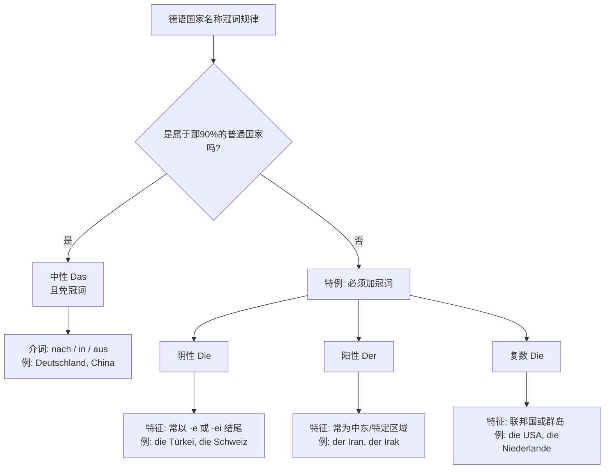
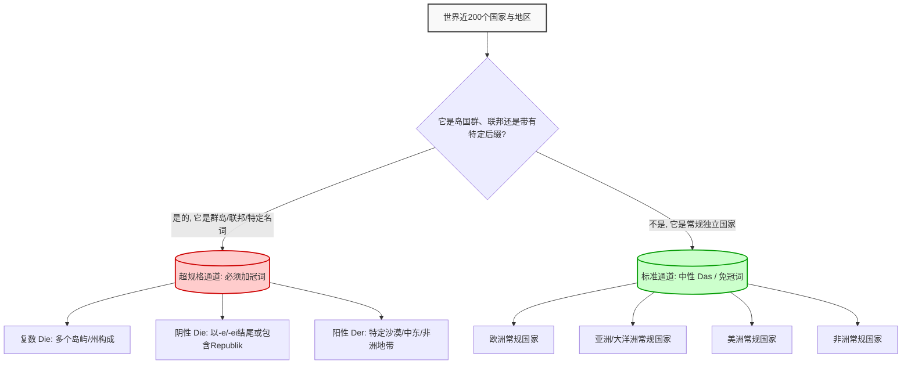

# 国家

## 特点

你提到的关于“通过元音字母结尾来判断国家名词词性”的想法非常具有敏锐的语感！在德语的普通名词中，以 `-e` 结尾的词确实有很大概率是阴性（Die）。但是，对于**国家名称**，德语有自己的一套“潜规则”。

现实情况是：**绝大多数（约 90%）的国家在德语中是中性（das），并且在单独使用时是不加定冠词的！** 只有少数国家具有阳性、阴性或复数形式，并且**必须带冠词**。因此，我们不能单纯依赖词尾元音来判断所有国家的词性，而是应该采取“**抓特例，其余全免**”的策略。

为了让你更直观地理解，我们可以借助 Mermaid 来生成一个清晰的知识结构图。Mermaid 是一种基于 JavaScript 的工具，能够将类似 Markdown 的文本定义渲染成复杂的图表。在 Mermaid 语法中，我们可以使用 `flowchart TD` 指令来创建一个自上而下的流程图，以此来梳理这些国家的冠词分类：

代码段

掌握了宏观结构后，让我们结合你在德国可能遇到的移民生活场景（B 1-B 2 核心要求：掌握带有介词的格的转换），来详细拆解这四大类。

### 1. 绝大多数的“免冠词”国家（中性 das）

这是最简单也是最庞大的类别。绝大多数国家（如中国、德国、法国、西班牙等）都是中性的。

- **规律**：单独使用时**不要冠词**。
- **介词搭配**：
    - 去某国：**nach** + 国家名
    - 来自某国：**aus** + 国家名
    - 在某国：**in** + 国家名
- **移民生活场景（外管局落户 Anmelden）**：
    - _Ich komme ursprünglich aus China, aber ich wohne jetzt in Deutschland._ (我原本来自中国，但我现在住在德国。)
    - _Nächsten Monat fliege ich nach Spanien._ (下个月我飞往西班牙。)

### 2. 阴性国家（Die）—— 你的“元音/后缀直觉”在这里生效！

这类国家数量不多，但非常高频。你的直觉很准：它们确实通常带有特定的元音结尾。

- **规律**：大多以 **-e** 或 **-ei** 结尾。
    - 例如：**die** Türkei（土耳其）, **die** Ukraine（乌克兰）, **die** Mongolei（蒙古）。
    - 特例：**die** Schweiz（瑞士）——虽然不以元音结尾，但也是阴性。
- **介词搭配（注意静三动四）**：
    - 去某国（第四格 Akkusativ）：**in die**
    - 来自某国（第三格 Dativ）：**aus der**
    - 在某国（第三格 Dativ）：**in der**
- **移民生活场景（找工作与资历认证）**：
    - _Mein Abschluss aus der Ukraine wird hier anerkannt._ (我在乌克兰的学历在这里被认可了。)
    - _Sie hat ein Vorstellungsgespräch in der Schweiz._ (她在瑞士有一个面试。)

### 3. 阳性国家（Der）—— 特定区域与辅音结尾

这类国家很多集中在中东、非洲或具有特定的词源，通常以辅音结尾。

- **规律**：没有绝对的拼写规律，必须死记硬背。
    - 例如：**der** Iran, **der** Irak, **der** Libanon, **der** Sudan。
- **介词搭配（静三动四）**：
    - 去某国（第四格）：**in den**
    - 来自某国（第三格）：**aus dem**
    - 在某国（第三格）：**im** (in + dem 的缩写)
- **移民生活场景（医疗与病史沟通）**：
    - _Ich habe meine medizinischen Dokumente aus dem Iran mitgebracht._ (我带来了我在伊朗的医疗文件。)
    - _Der Arzt hat früher im Libanon gearbeitet._ (这位医生以前在黎巴嫩工作过。)

### 4. 复数国家（Die）—— 联邦与群岛

当一个国家是由多个岛屿或多个州组成的联邦时，它通常是复数。

- **规律**：表示集合体的名称。
    - 例如：**die** USA（美国）, **die** Niederlande（荷兰）, **die** Philippinen（菲律宾）。
- **介词搭配（复数三格名词词尾需加 -n 或 -en）**：
    - 去某国（第四格）：**in die**
    - 来自某国（第三格）：**aus den** + 国家名(n)
    - 在某国（第三格）：**in den** + 国家名(n)
- **移民生活场景（租房与邻里交流）**：
    - _Meine neuen Nachbarn kommen aus den Niederlanden._ (我的新邻居们来自荷兰。注意 Niederlanden 词尾的 n)
    - _Viele Menschen möchten in die USA auswandern._ (很多人想移民去美国。)

## 单词

Hallo！欢迎回到我们的德语冲刺课堂！看到你对“深挖”语法细节有如此强烈的求知欲，作为你的导师，我感到非常欣慰。要在六个月内拿下 B 2，我们就需要这种“打破砂锅问到底”的精神！

在上一课中，我们掌握了国家名词词性的四大法则。你现在要求将全世界的国家列出来——这个工程量很大，但这恰恰是构建你“德语世界观”的绝佳方式。

为了让你在面对这几百个国家时不会感到头晕眼花，我们先用一个类比（Analogie）来理解记忆策略：

> 🧳 **导师类比：机场的行李分拣系统**
>
> 想象你在法兰克福机场（Flughafen Frankfurt）的行李转盘。
>
> 世界上的近 200 个国家就像是旅客的行李。
>
> - **90%的行李（中性免冠词国家）**是标准尺寸的常规拉杆箱，它们不需要贴特殊的超规格标签，直接在主传送带（默认规则）上顺畅运转。
>     
> - **10%的行李（阴性、阳性、复数国家）**是高尔夫球杆、冲浪板或易碎品。它们是**“超规格行李”（Sperrgepäck）**，必须贴上特殊的醒目标签（定冠词 der/die/das）并走特殊通道。

我们的策略很简单：**死磕那 10%的“超规格行李”，剩下的 90%全部扔进“标准传送带”！**

为了让你清晰地掌握这个记忆逻辑，我为你制作了一个学习策略流向图：

代码段

接下来，我将为你呈上这份“德语国家百科全书”**。由于世界上有近 200 个国家，为了便于你吸收和在移民生活场景（如填写 _Aufenthaltstitel_ 居留卡申请表、与外管局官员核对 _Herkunftsland_ 来源国）中查找，我将它们严格按照我们的**四大规则进行分类，并附带词性、翻译、规则特征以及简要的背景提示。

请深呼吸，我们开始这场环球德语之旅！🌍

### 🚨 第一梯队：绝对特例（必须死记硬背的“超规格行李”）

在任何行政表格（Formular）或面试（Vorstellungsgespräch）中，如果你的国家在这个列表里，**一定要加上冠词**！

#### 1. 复数国家群（Die - Plural）

**规则特征：** 由多个岛屿（Inseln）、多个州（Staaten）或多个酋长国（Emirate）组成的集合体。

|**德语国名 (加冠词)**|**词性**|**中文翻译**|**所属规则与特征**|**国家简评 / 移民生活记忆锚点**|
|---|---|---|---|---|
|**die** USA / **die** Vereinigten Staaten|复数|美国|联邦/州集合|_Die Vereinigten Staaten_（合众国）。在德国跨国企业工作时，常说 "Ich fliege in **die** USA."|
|**die** Niederlande|复数|荷兰|地区集合|字面意思是“低洼的土地”（nieder+Land+e）。德国人的度假胜地："Wir machen Urlaub in **den** Niederlanden." (注意 Dativ 加 n)|
|**die** Philippinen|复数|菲律宾|群岛国家|7000 多个岛屿组成。德国医疗系统有很多来自这里的护士："Sie kommt aus **den** Philippinen."|
|**die** Malediven|复数|马尔代夫|群岛国家|著名的度假胜地岛链。|
|**die** Seychellen|复数|塞舌尔|群岛国家|印度洋上的群岛国家。|
|**die** Bahamas|复数|巴哈马|群岛国家|加勒比海群岛。|
|**die** Salomonen|复数|所罗门群岛|群岛国家|太平洋群岛。|
|**die** Vereinigten Arabischen Emirate|复数|阿联酋|酋长国集合|包含迪拜等 7 个酋长国。|
|**die** Komoren|复数|科摩罗|群岛国家|非洲东海岸的火山群岛。|
|**die** Kapverden|复数|佛得角|群岛国家|大西洋岛国。|

#### 2. 阴性国家（Die - Femininum）

**规则特征：** 绝大多数以元音 **-e** 或后缀 **-ei** 结尾。少数因为全称中带有“Republik（共和国）”而呈现阴性。

|**德语国名 (加冠词)**|**词性**|**中文翻译**|**所属规则与特征**|**国家简评 / 移民生活记忆锚点**|
|---|---|---|---|---|
|**die** Türkei|阴性|土耳其|-ei 结尾|德国最大的移民群体来源国之一。去吃烤肉可以说："Dieser Döner schmeckt wie in **der** Türkei."|
|**die** Schweiz|阴性|瑞士|历史遗留特例|虽然不以-e 结尾，但绝对是阴性。在德国南部找工作必知："Er arbeitet in **der** Schweiz."|
|**die** Ukraine|阴性|乌克兰|-e 结尾|近年高频词汇，许多难民相关行政事务涉及。|
|**die** Mongolei|阴性|蒙古|-ei 结尾|亚洲内陆国，名字以-ei 结尾。|
|**die** Slowakei|阴性|斯洛伐克|-ei 结尾|欧洲国家，捷克的邻居。|
|**die** Elfenbeinküste|阴性|科特迪瓦/象牙海岸|-e 结尾 (Küste)|复合词，Küste（海岸）是阴性，决定了整个词的词性。|
|**die** Dominikanische Republik|阴性|多米尼加共和国|包含 Republik|_Republik_ 这个词本身是阴性，所以国家名也是阴性。|
|**die** Zentralafrikanische Republik|阴性|中非共和国|包含 Republik|同上，带有共和国字样的全称。|
|**die** Demokratische Republik Kongo|阴性|刚果民主共和国|包含 Republik|刚果（金），注意与阳性的“刚果（布）”区分。|

#### 3. 阳性国家（Der - Maskulinum）

**规则特征：** 多为中东、非洲国家，通常以辅音结尾。没有明显的拼写规律，属于**纯死记硬背**区域。

|**德语国名 (加冠词)**|**词性**|**中文翻译**|**所属规则与特征**|**国家简评 / 移民生活记忆锚点**|
|---|---|---|---|---|
|**der** Iran|阳性|伊朗|历史/地域特例|中东大国。医疗/IT 行业有很多伊朗同事："Mein Kollege kommt aus **dem** Iran."|
|**der** Irak|阳性|伊拉克|历史/地域特例|中东国家。|
|**der** Libanon|阳性|黎巴嫩|历史/地域特例|中东国家。德国也有不少黎巴嫩裔移民。|
|**der** Jemen|阳性|也门|历史/地域特例|中东国家。|
|**der** Oman|阳性|阿曼|历史/地域特例|中东国家。|
|**der** Sudan|阳性|苏丹|历史/地域特例|非洲国家。|
|**der** Tschad|阳性|乍得|历史/地域特例|非洲内陆国。|
|**der** Niger|阳性|尼日尔|历史/地域特例|非洲国家。注意和“尼日利亚(Nigeria, 中性)”区分！|
|**der** Senegal|阳性|塞内加尔|历史/地域特例|西非国家。|
|**der** Kongo|阳性|刚果（布）|历史/地域特例|刚果共和国。|
|**der** Vatikan|阳性|梵蒂冈|历史/地域特例|世界最小的国家，位于罗马城内。|

### 🟢 第二梯队：常规传送带（90%的中性、免冠词国家）

掌握了上面的几十个“刺头”，接下来的世界就一片坦途了！这些国家在德语中**默认为中性（Das）**，而且在日常表达（如“去某国 nach”、“在某国 in”、“来自某国 aus”）中**统统不需要加冠词！**

为了让你感受世界的广阔，同时符合你的要求，我将几大洲的核心国家全部列出。

#### 🌍 欧洲 (Europa) - 免冠词区

_场景提示：在德国生活，你在申根区旅行或与欧洲同事打交道时，这些词极为高频。_

|**德语国名**|**词性**|**中文翻译**|**所属规则**|**国家简评 / 移民生活记忆锚点**|
|---|---|---|---|---|
|Deutschland|中性|德国|常规免冠词|你的目标国！"Ich lebe in Deutschland."|
|Frankreich|中性|法国|常规免冠词|词尾 -reich 意为帝国/王国。|
|Österreich|中性|奥地利|常规免冠词|德语区兄弟国。|
|Italien|中性|意大利|常规免冠词|德国人最爱的度假地。|
|Spanien|中性|西班牙|常规免冠词|常去 Mallorca 岛旅游的地方。|
|Portugal|中性|葡萄牙|常规免冠词|伊比利亚半岛国家。|
|Großbritannien|中性|英国|常规免冠词|包含英格兰、苏格兰、威尔士等。|
|Irland|中性|爱尔兰|常规免冠词|-land 结尾的统统是中性！|
|Polen|中性|波兰|常规免冠词|德国东部邻国，大量劳动力来源。|
|Tschechien|中性|捷克|常规免冠词|德国东部邻国。|
|Russland|中性|俄罗斯|常规免冠词|面积最大的国家。|
|Schweden|中性|瑞典|常规免冠词|北欧国家。|
|Norwegen|中性|挪威|常规免冠词|北欧国家。|
|Finnland|中性|芬兰|常规免冠词|北欧国家。|
|Dänemark|中性|丹麦|常规免冠词|德国北部邻国。|
|Belgien|中性|比利时|常规免冠词|欧盟总部所在地。|
|Griechenland|中性|希腊|常规免冠词|-land 结尾。|
|Ungarn|中性|匈牙利|常规免冠词|东欧国家。|
|Rumänien|中性|罗马尼亚|常规免冠词|东欧国家。|
|Bulgarien|中性|保加利亚|常规免冠词|东欧国家。|
|Kroatien|中性|克罗地亚|常规免冠词|东欧/巴尔干半岛。|
|Serbien|中性|塞尔维亚|常规免冠词|巴尔干半岛。|
|Bosnien und Herzegowina|中性|波黑|常规免冠词|也是免冠词。|
|Albanien|中性|阿尔巴尼亚|常规免冠词|欧洲南部国家。|
|Estland|中性|爱沙尼亚|常规免冠词|波罗的海三国之一 (-land)。|
|Lettland|中性|拉脱维亚|常规免冠词|波罗的海三国之一 (-land)。|
|Litauen|中性|立陶宛|常规免冠词|波罗的海三国之一。|
|Weißrussland (Belarus)|中性|白俄罗斯|常规免冠词|-land 结尾。|

#### 🌏 亚洲与大洋洲 (Asien und Ozeanien) - 免冠词区

_场景提示：无论你是办理家庭团聚（Familiennachzug）还是学历认证（Zeugnisanerkennung），这些国家的填表率极高。_

|**德语国名**|**词性**|**中文翻译**|**所属规则**|**国家简评 / 移民生活记忆锚点**|
|---|---|---|---|---|
|China|中性|中国|常规免冠词|"Ich komme aus China." (我来自中国。)|
|Japan|中性|日本|常规免冠词|亚洲经济大国。|
|Südkorea|中性|韩国|常规免冠词|南韩。|
|Nordkorea|中性|朝鲜|常规免冠词|北韩。|
|Indien|中性|印度|常规免冠词|德国蓝卡（Blaue Karte）最大的申请群体。|
|Vietnam|中性|越南|常规免冠词|德国亚裔群体中占比很大。|
|Thailand|中性|泰国|常规免冠词|德国人亚洲游的最爱之一 (-land)。|
|Singapur|中性|新加坡|常规免冠词|城市国家。|
|Malaysia|中性|马来西亚|常规免冠词|东南亚国家。|
|Indonesien|中性|印尼|常规免冠词|拥有众多岛屿，但在德语中算单数中性！|
|Pakistan|中性|巴基斯坦|常规免冠词|南亚国家。|
|Afghanistan|中性|阿富汗|常规免冠词|难民/庇护申请（Asylantrag）常考词汇。|
|Saudi-Arabien|中性|沙特阿拉伯|常规免冠词|中东大国。|
|Israel|中性|以色列|常规免冠词|中东国家。|
|Syrien|中性|叙利亚|常规免冠词|2015 年后德国最大的难民来源国之一。|
|Australien|中性|澳大利亚|常规免冠词|整个澳洲大陆。|
|Neuseeland|中性|新西兰|常规免冠词|-land 结尾。|
|Fidschi|中性|斐济|常规免冠词|大洋洲岛国（注意，虽然是群岛，但词性按中性免冠词处理，这是个容易混淆的点！只有前面提的那几个群岛是复数）。|

#### 🌎 美洲 (Amerika) - 免冠词区

|**德语国名**|**词性**|**中文翻译**|**所属规则**|**国家简评 / 移民生活记忆锚点**|
|---|---|---|---|---|
|Kanada|中性|加拿大|常规免冠词|北美大国。|
|Mexiko|中性|墨西哥|常规免冠词|北美/中美洲国家。|
|Brasilien|中性|巴西|常规免冠词|南美洲最大国家。|
|Argentinien|中性|阿根廷|常规免冠词|南美国家。|
|Chile|中性|智利|常规免冠词|南美狭长国家。|
|Peru|中性|秘鲁|常规免冠词|南美国家。|
|Kolumbien|中性|哥伦比亚|常规免冠词|南美国家。|
|Venezuela|中性|委内瑞拉|常规免冠词|南美国家。|
|Kuba|中性|古巴|常规免冠词|加勒比岛国，但在德语中作中性处理！|
|Jamaika|中性|牙买加|常规免冠词|也是中性单数。|
|Bolivien|中性|玻利维亚|常规免冠词|南美内陆国。|
|Ecuador|中性|厄瓜多尔|常规免冠词|赤道国家。|
|Uruguay|中性|乌拉圭|常规免冠词|南美国家。|
|Paraguay|中性|巴拉圭|常规免冠词|南美国家。|

#### 🌍 非洲 (Afrika) - 免冠词区

|**德语国名**|**词性**|**中文翻译**|**所属规则**|**国家简评 / 移民生活记忆锚点**|
|---|---|---|---|---|
|Ägypten|中性|埃及|常规免冠词|北非国家，历史悠久。|
|Südafrika|中性|南非|常规免冠词|非洲大陆最南端。|
|Kenia|中性|肯尼亚|常规免冠词|东非国家。|
|Nigeria|中性|尼日利亚|常规免冠词|非洲人口第一大国（再次强调，与阳性的 der Niger 区分开）。|
|Marokko|中性|摩洛哥|常规免冠词|北非国家。|
|Algerien|中性|阿尔及利亚|常规免冠词|北非大国。|
|Tunesien|中性|突尼斯|常规免冠词|北非国家。|
|Ghana|中性|加纳|常规免冠词|西非国家。|
|Äthiopien|中性|埃塞俄比亚|常规免冠词|东非国家。|
|Somalia|中性|索马里|常规免冠词|东非国家。|
|Tansania|中性|坦桑尼亚|常规免冠词|东非国家。|
|Kamerun|中性|喀麦隆|常规免冠词|中非国家。|
|Uganda|中性|乌干达|常规免冠词|东非国家。|
|Madagaskar|中性|马达加斯加|常规免冠词|非洲大岛，同样作中性免冠词处理。|

### 🎓 德语大师的通关练习题 (B 1-B 2 难度)

看着这份“几百个国家”的表格，你是不是已经找到了规律？

**你的大脑不需要装下整个表格，只需要装下“第一梯队”（特例）和“不带冠词”这个底层逻辑。**

现在，想象你刚搬到德国，在市民中心（Bürgeramt）注册户口（Anmeldung），工作人员询问你的背景情况。请用准确的德语（注意冠词和介词）完成以下句子：

1. (去常规国家) "我是中国人，但我下周要去**法国**出差。"
2. (来自阴性国家) "我的同事原本来自**土耳其**。"
3. (在复数国家) "我的哥哥住在**美国**。"

> 💡 **导师剧透（答案解析）：**
>
> 1. Ich bin Chinese/Chinesin, aber ich fahre nächste Woche geschäftlich **nach Frankreich**. (法国是标准行李，直接用 nach)
>     
> 2. Mein Kollege kommt ursprünglich **aus der Türkei**. (土耳其是阴性特例，aus + Dativ -> aus der)
>     
> 3. Mein Bruder lebt **in den USA**. (美国是复数特例，in + Dativ 复数 -> in den USA)

掌握了这个表格和背后的逻辑，你在 B 2 级别的口语和写作中，无论谈论全球化、移民还是旅行，都不会再因为国家名字的语法而失分！

消化完这些，下节课你想了解什么？是让人头疼的“形容词词尾变化（Adjektivdeklination）”，还是 B 2 必考的“被动语态的替代形式（Passiversatzformen）”？导师随时为你准备着！
