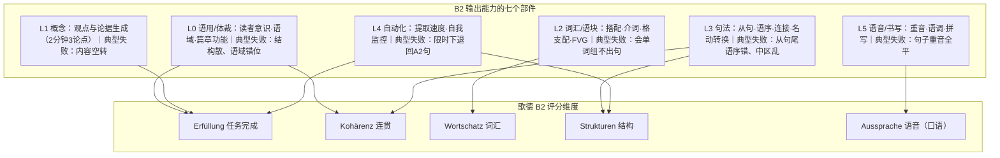
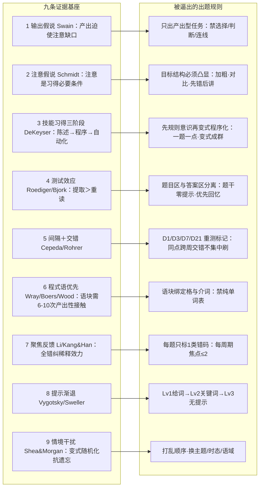
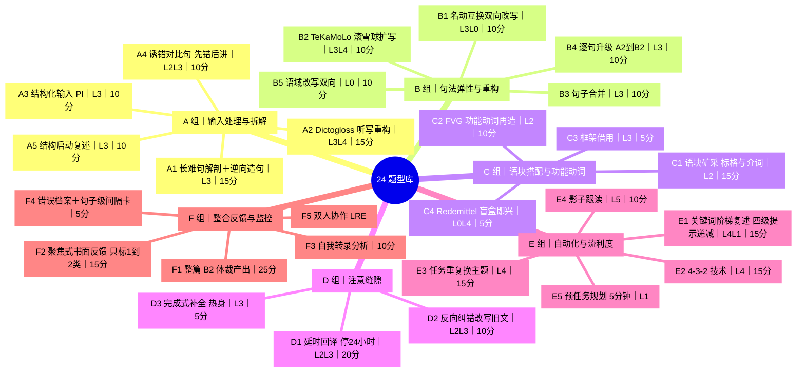
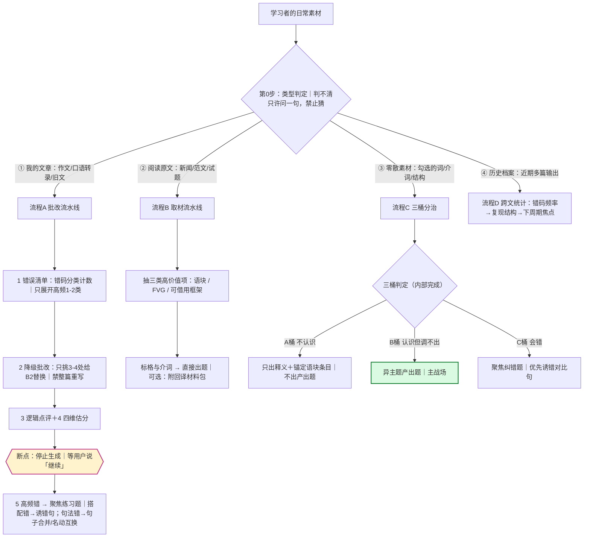
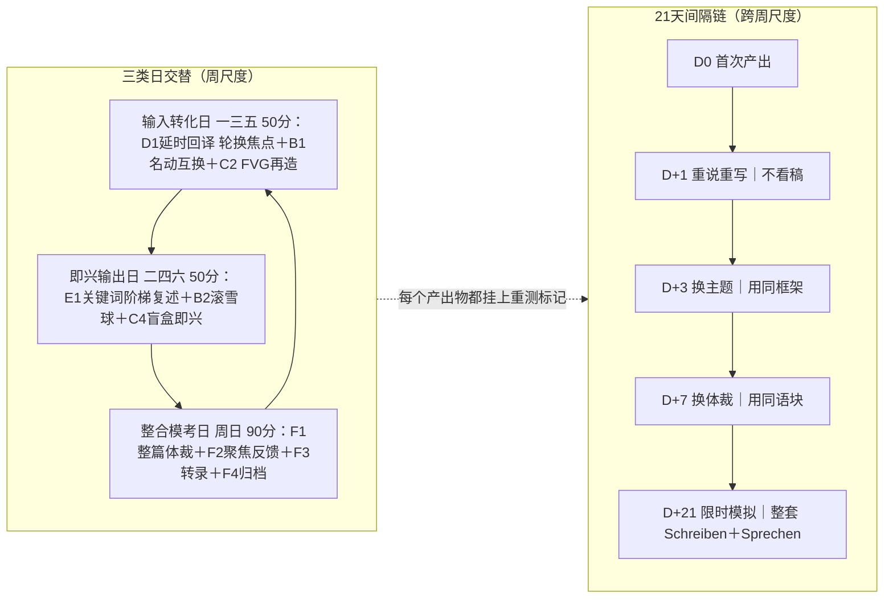
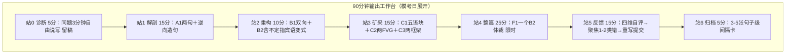
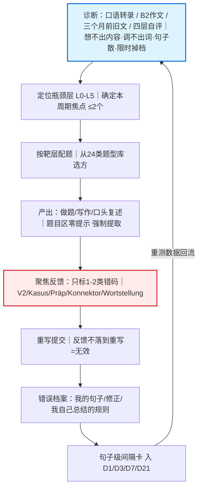
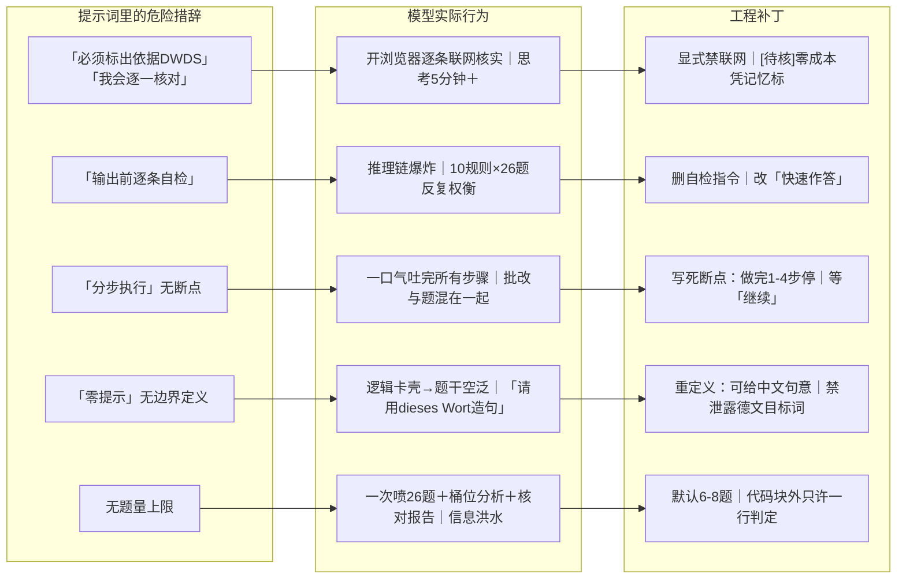

# 德语 B 2 科学出题法 · 知识地图

本文把散落于多轮讨论的方法论材料消化为七张图：能力构念 → 证据基座 → 题型库 → 素材路由 → 训练编排 → 反馈闭环 → 反模式与工程陷阱。核心命题只有一句：**出题不是出"题"，是设计一次"有反馈的产出事件"。**

**目录**
1. 能力构念：B 2 输出能力的 L 0–L 5 拆解
2. 证据基座：九条学习科学原理 → 出题规则
3. 题型库：六组 24 类
4. 素材路由：四种输入 → 四条流水线
5. 训练编排：三类日 × 21 天间隔
6. 反馈闭环：从诊断到重测
7. 反模式与工程陷阱

---

## ① 能力构念：B 2 输出能力的 L 0–L 5 拆解

一切出题的起点是"考什么"。歌德 B 2 的公开评分维度是 **Erfüllung（任务完成）、Kohärenz（连贯）、Wortschatz（词汇）、Strukturen（结构）**，口语另加 Aussprache。训练靶必须照抄这四维，而不是模糊的"多学德语"。把"输出能力"拆成七层部件后，每类题型才有明确的打击目标：

> [!note] 铁律：一个训练周期只压 1–2 个层
> 认知负荷理论与"专长逆转效应"表明：同时压词汇＋句法＋语篇，三者都无法程序化（自动化）。分层图的价值不在分类本身，而在**排他**——它逼你承认"这周只练 L 2＋L 3"。

---

## ② 证据基座：九条学习科学原理 → 出题规则

九条原理不是装饰，每一条都直接翻译成一条可检查的出题规则。左边是原理与出处，右边是它逼你做出的设计决策：

> [!note] 怎么用这张图
> 验收任何一道 AI 出的题，就是反向走这张图：这题强制我产出了吗（R 1）？题干泄露答案了吗（R 4）？语块带格和介词吗（R 6）？解析是不是又全错纠了（R 7）？——任何一条断掉，这题的训练价值就显著下降。

补充一条同构框架：**产出导向法（POA，文秋芳）**的"驱动—促成—评价"与上述九条完全同构，且专为中国学习者设计——它解释了中国学习者最典型的瓶颈（输入充足、产出断裂），可直接当课型骨架。

---

## ③ 题型库：六组 24 类

题型库按"输入处理 → 句法弹性 → 语块 → 注意缝隙 → 自动化 → 整合反馈"的加工深度排列。每个节点标注靶层（L 0–L 5）与建议时长：

### 三组必须记住的"为什么"

> [!tip] B 1 名动互换：得分的真正来源是"双向"
> 能把 `die Ablehnung des Antrags durch den Vorstand` 还原成 `Der Vorstand hat den Antrag abgelehnt`，才算掌握德语的信息打包机制。**名词化不是单向崇拜**——它只对学术/行政语域成立，过度名词化抬高信息密度、削弱施动关系，直接伤害 Kohärenz 得分（Wolf Schneider 的 Verbalstil 主张）。正确姿势：双向可控、按语域选择。

> [!tip] B 2 TeKaMoLo：是回退规则，不是定律
> 中区（Mittelfeld）真实排序：①代词 ＞ ②定指名词 ＞ ③不定指名词；已知信息先于新信息；TeKaMoLo 只在副词性成分**内部**套用。B 2 最容易扣分的点：**不定指宾语被推到最后**—— `Ich habe gestern in der Bibliothek ein Buch gelesen`，而不是 `…ein Buch in der Bibliothek gelesen`。

> [!tip] C 2 FVG：名词化与动词化之间的桥梁
> 功能动词结构（eine Entscheidung treffen / Kritik an etw. üben / in Frage stellen）是升级句的预制件——D 2 的升级句 90% 由语块与框架拼装而成，这就是 C 组必须先做的原因。纠错靶：`Entscheidung machen`、`Kritik machen` 这类中式直译。

---

## ④ 素材路由：四种输入 → 四条流水线

日常使用中，素材只有四种来源，每种走一条不同的流水线。核心盲区：**"文章"有两类，处理方向相反**——别人写的绝不能按"我的作文"批改打分。零散素材内部还要先做三桶分治：

> [!note] 为什么断点（红框）是物理必需
> LLM 是单次生成模型，没有"内部暂停"机制。不写死"执行 1–4 步后停止、等用户回复再继续"，它一定一口气把批改和出题混吐在一起。断点不是风格偏好，是对模型物理限制的工程适配。

---

## ⑤ 训练编排：三类日 × 21 天间隔

单个题型再好，没有编排就是随机努力。编排分两个尺度：**周内**用三类日交替（转化与输出分开），**跨周**用 21 天间隔链抗遗忘：

**配比红线**：产出 60% / 输入处理 25% / 显性反馈 15%；每周期焦点 ≤2；新旧材料比 6:4。题量不能替代间隔——一周 200 题，不如三周各 40 题。

---

## ⑥ 反馈闭环：从诊断到重测

把全部零件组装起来，得到整个系统的总循环。**"先诊断，再配题"是唯一不能省的一步**——不知道瓶颈在哪一层，24 类题型就只是菜单而不是处方：

> [!warning] 闭环上最贵的两个断点
> ① **无反馈的自由输出**＝错误固化（fossilization），练得越多错得越稳；② **反馈了但不重写**＝知道和做到之间的鸿沟没有被跨越，Li (2010) 的 d≈0.6 效应量只对"提示型＋重写"成立。这就是为什么错误档案第三列必须是"我总结的规则"——自己写规则比看讲解有效。

---

## ⑦ 反模式与工程陷阱

方法论的一半是"做什么"，另一半是"不做什么"。陷阱分两个世界：**教学侧**（题出错了）和**工程侧**（AI 执行崩了）。

### 教学侧反模式（明确排除）

| 反模式 | 为什么是毒 |
|---|---|
| 只做识别（多选/连线/判断） | 迁移最弱——识别≠提取，识别路径练不出产出路径 |
| 一次讲清全部语法点 | 认知过载，零程序化 |
| 无反馈的自由写作/口语重复 | 错误固化，越练越稳 |
| 纯单词表背诵 | 无搭配无格，产出时调不出来 |
| 只刷逐句翻译不做篇章规划 | Sprechen Teil 1 结构必崩 |
| 用题量替代间隔 | 一周 200 题 ＜ 三周各 40 题 |
| 每次全错纠 | 抑制输出、切碎注意力（Li 2010 / Kang & Han 2015） |
| 名词化单向崇拜 | 伤 Kohärenz；要双向可控、按语域选择 |
| TeKaMoLo 当定律背 | 真实排序是 代词＞定指＞不定指；不定指宾语靠后 |

### 工程侧陷阱（LLM 出题的实测教训）

> [!caution] 给带工具的推理模型写提示词的两条元规则
> ① "核实/查证"类措辞 ＝ 联网指令；② "自检"类措辞 ＝ 思考链放大器。这两条是从 5 分钟等待和 26 题洪水里换来的，适用于所有 reasoning 模型，不止 DeepSeek。

---

**一句话总纲：AI 管"变式与覆盖面"，你管"提取与判断"；题目让你产出，答案永远事后对照；反馈必须落到重写；[待核] 一律人工过一遍。**
