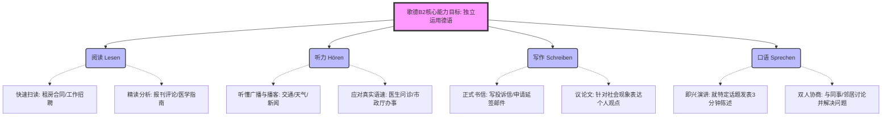

# b2所有的考点和预备的能力

Hallo！欢迎来到德语大师的课堂！很高兴能作为你的专属导师，陪你开启这段充满挑战但也绝对激动人心的旅程。

目标明确：**6 个月内拿下歌德 B 2 证书，并能真正融入德国的移民生活。** 这听起来像是一场“德语特种兵”的极限挑战，但请相信我，只要我们策略得当，不陷入死记硬背的泥沼，这个目标是完全可以实现的！

在进入具体的语法细节之前，我们必须先做到“知己知彼”。歌德 B 2 究竟要求你具备什么样的能力？为了让你有更直观的理解，我为你绘制了一份**B 2 核心能力雷达图**：

代码段

---

### 🏛️ 歌德 B 2 考试全景剖析与能力预备

达到 B 2 水平，意味着你不再是一个只能说“你好、谢谢、再见”的游客，而是一个能够在德国社会中**独立生存、据理力争**的居民。以下是四大模块的考点梳理及移民生活场景映射：

#### 1. 阅读理解 (Lesen) - “剥洋葱式的信息提取”

- **考点要求：** 能够理解长篇复杂的非虚构类文章（如新闻报道、评论、专业文章），掌握**快速寻读 (Skimming)** 和**细节精读 (Scanning)** 的技巧。即使遇到生词，也能根据上下文推断词义。
- **移民生活场景：** * **租房 (Mieten)：** 拿到一份长达十几页的租房合同（Mietvertrag），你能迅速找到关于冷租 (Kaltmiete)、附加费 (Nebenkosten) 和解约期限 (Kündigungsfrist) 的条款。
    - **求职 (Jobsuche)：** 浏览招聘启事（Stellenanzeige）时，能准确区分哪些是硬性要求（Voraussetzungen），哪些是加分项（Vorteile）。

#### 2. 听力理解 (Hören) - “捕捉疾风骤雨中的关键词”

- **考点要求：** 听懂标准语速的广播、采访、报告和日常对话。能识别说话者的情绪、态度和隐含意图。
- **移民生活场景：**
    - **行政事务 (Behördengänge)：** 打电话给外管局 (Ausländerbehörde) 预约时间，能听懂语音系统里语速极快的提示音，并准确按键；面对办事员连珠炮般的提问，能抓住核心词（如 Dokumente, Frist, abgelaufen）。
    - **医疗 (Gesundheit)：** 听懂医生对你病情的诊断（Diagnose）以及服用药物的具体要求（如：nüchtern einnehmen 空腹服用）。

#### 3. 书面表达 (Schreiben) - “逻辑严密的德式排兵布阵”

- **考点要求：** * **Teil 1 (论坛帖子/议论文)：** 就某一社会话题（如：居家办公、环保、儿童教育）清晰阐述自己的观点，论证优缺点。
    - **Teil 2 (正式邮件)：** 撰写一封得体、用词精准的正式信件（Formelle E-Mail）。
- **移民生活场景：**
    - **维权与投诉 (Reklamation)：** 冬天家里的暖气坏了（Heizung kaputt），你需要给房东或物业写一封有理有据的催促信，甚至优雅地威胁要“减租”（Mietminderung）。
    - **职场 (Arbeitsplatz)：** 给同事发邮件说明项目进度，或者向 HR 发邮件请病假并解释工作交接。

#### 4. 口语表达 (Sprechen) - “自信输出与见招拆招”

- **考点要求：**
    - **Teil 1 (主题演讲)：** 针对一个给定话题，进行条理清晰的个人陈述（Vortrag），包含引言、个人经验、家乡情况、优缺点分析和总结。
    - **Teil 2 (双人讨论)：** 与搭档就一个具体任务进行协商（Diskussion），学会提出建议、反驳对方并达成共识。
- **移民生活场景：**
    - **找工作面试 (Vorstellungsgespräch)：** 流利地介绍自己的职业背景，并就行业话题与面试官交流。
    - **邻里关系 (Nachbarschaft)：** 与邻居协商楼道清洁（Kehrwoche）的轮换问题，或者筹备一场街区烧烤派对。

---

### ⚔️ 攻克 B 2 的核心“语法武器库”

为了支撑起上述的强大能力，你需要在接下来的学习中掌握几个核心的语法点。别怕，我会用最形象的方式帮你理解它们：

1. **被动语态 (Das Passiv) —— “德语世界的隐身术”**
    
    - **概念感悟：** 德国人极其严谨，很多时候“动作发生了什么”比“是谁做的”更重要。被动语态就是用来隐藏主语的。
    - _实战造句：_ 去医院看病，医生对你说：“Das Blut **muss** sofort **abgenommen werden**.”（必须立刻抽血。）—— 至于谁来抽血？护士还是医生？不重要，重要的是“抽血”这件事必须马上执行！
        
2. **第二虚拟式 (Konjunktiv II) —— “极致礼貌与平行宇宙”**
    
    - **概念感悟：** 这是 B 2 的重中之重！它有两个作用：一是幻想一个不存在的“平行宇宙”（如果我有钱...）；二是用来表达**极致的礼貌与委婉**（尤其在求人办事时）。
    - _实战造句：_ 去市政厅办事，永远不要说“Ich will einen Termin”（我要一个预约，听起来像打劫）。要用虚拟式：“Ich **hätte** gern einen Termin” 或者 “**Könnten** Sie mir bitte helfen?”（我想要/您能...这就显得非常有教养）。
        
3. **分词作定语 (Partizipialattribute) —— “官僚德语的句子压缩包”**
    
    - **概念感悟：** 德国的官方文件和新闻极度讨厌冗长的从句，他们喜欢把一个完整的从句“压缩”成一个长长的形容词，直接塞在名词前面。这是阅读理解中的最大拦路虎。
    - _实战造句：_ 普通人说：“Das ist der Vertrag, den ich unterschrieben habe.”（这是我签了字的合同。）
    - _B 2 书面语说：_ “Das ist der **von mir unterschriebene** Vertrag.”（这就是那个著名的句子压缩包，阅读时一定要学会从后往前拆解）。
        
4. **连词与从句嵌套 (Konnektoren) —— “逻辑的俄罗斯套娃”**
    
    - **概念感悟：** 德语是逻辑性极强的语言。你需要熟练使用 _je...desto... (越...越...)_, _zwar...aber... (虽然...但是...)_, _entweder...oder... (要么...要么...)_ 等句型来展示你的思维深度。
    - _实战造句：_ “**Je** besser mein Deutsch ist, **desto** schneller finde ich einen Job in Berlin.”（我的德语越好，我在柏林找到工作的速度就越快。）

---

### 📅 你的 6 个月进阶冲刺路线图

为了保证进度，我们需要一个严丝合缝的计划。假设每天能投入 2-3 小时：

- **第 1-2 个月：B 1 基础巩固与 B 2 词汇预热。** * _任务：_ 复习完成时、基础从句（weil, dass, wenn）、形容词词尾变化。开始背诵 B 2 核心词汇（重点记忆动词+介词的固定搭配，如 _sich interessieren für_）。
- **第 3-4 个月：攻克 B 2 核心语法堡垒。**
    - _任务：_ 跟着我，每周吃透一个大语法点（被动语态、虚拟式、带 zu 的不定式、分词定语）。配合大量造句，将语法直接应用到租房、看病等实战场景中。
- **第 5 个月：场景实战与输出爆发（口语+写作）。**
    - _任务：_ 开始动笔写长邮件，张嘴做 3 分钟的 Mini-Präsentation（微型演讲）。我会对你的产出进行严酷但充满爱的“挑刺”与纠错。
- **第 6 个月：题海战术与考场模拟。**
    - _任务：_ 刷歌德官方模拟题，严格掐表计时，训练考试技巧和时间管理能力。

---

现在，通往德国 B 2 的大门已经向你敞开。我们一次只解决一个敌人，稳扎稳打。

**那么，作为我们正式课程的第一战，你想先挑战充满魔法的“Konjunktiv II（第二虚拟式）”，还是想先学如何在租房和看病时大显身手的“Passiv（被动语态）”呢？**
