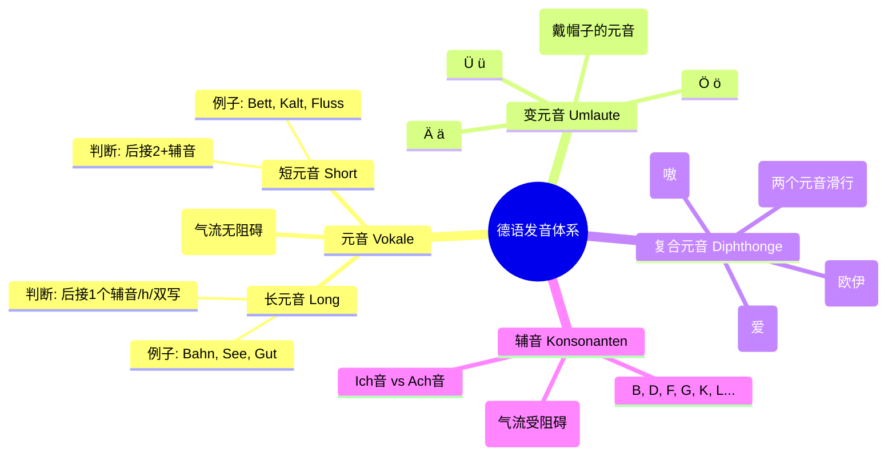

![[新求精德语强化教程 初级1 第5版.pdf#page=17&rect=97,510,282,588|📖]]

```audio-player
[[02 Lek01-1a.mp3]]
```

你好！很高兴能为你揭开德语语音的神秘面纱。我是你的德语导游。

不要被这些术语吓倒，其实德语的发音规则比英语要“诚实”得多——**怎么写就怎么读**（绝大多数情况）。我们把口腔想象成一个乐器，来看看怎么演奏这些音符。

---

## 第一部分：什么是元音？（灵魂歌者） #ak

**定义**：
什么是**元音（Vokale）**？
想象你的口腔是一条隧道。当你发音时，气流从喉咙出来，**一路畅通无阻**，直接冲出口腔，这就是元音。声带震动，声音响亮。它们是单词的“灵魂”。


*   **基础元音**：A, E, I, O, U。（就这5个金刚）。

**形象记忆**：
就像你去医院检查喉咙，医生让你张大嘴喊“啊——”，气流没有任何阻挡。

---
<!--ID: 1769240515198-->
<!--ID: 1769491195972-->
<!--ID: 1771319860518-->
### 长短元音
#### 💡 场景举例：一字之差，谬以千里

为什么要区分长短音？因为意思完全不同！


**案例 1：国家 vs. 城市**
*   **Staat** (国家): `aa` 双写元音 $\rightarrow$ **长音**。读作 "施大——特"。
*   **Stadt** (城市): `dt` 两个辅音 $\rightarrow$ **短音**。读作 "施大特"（短促）。 ^j0n9bg
*   *场景*：你想说“我去城里”，结果发成了长音，别人以为你要去“接管国家”。

**案例 2：这种 vs. 甚至**
*   **Weg** (道路): 只有一个 `g` $\rightarrow$ **长音** /e:/。
*   **weg** (离开/消失): 虽然长得一样，但在口语和特定习惯中，这个副词通常读**短音** /ɛ/。
    *   *Mein Weg* (我的路 - 长)
    *   *Geh weg!* (走开 - 短)

**案例 3：租房 vs. 中间** ^jx09xq
*   **Miete** (租金): `ie` 算长音 $\rightarrow$ /i:/.
*   **Mitte** (中间): `tt` 双写辅音 $\rightarrow$ /i/ 短音。
#### 第五部分：长元音 Vs. 短元音（时间的魔法）

这是德语发音中最**关键**、最容易决定你是否“地道”的部分。


**核心区别**：不是音调高低，而是**持续时间的长短**。
*   **长元音**：把音拉长，肌肉紧张有力。
*   **短元音**：短促有力，像被烫了一下马上收回。

**✨ 黄金判断法则（费曼技巧简化版） ✨**
##### 长元音
我们用“数辅音”的方法来判断：


1.  **它是长元音，如果...**
    *   元音后面没有辅音（结尾）：*da* (在那里)
    *   元音后面只有 **1个** 辅音：*gut* (好)
    *   元音双写：*See* (湖/海)
    *   元音后面跟着 **h**（h在这里是拉长器，不发音）：*Bahn* (铁路)

![[image-133.png|727x305]]
啊~ 亿~ 衣~ 哦~  悟~
![[Recording 20260122155725.m4a]]
![[image-134.png|725x283]]
![[image-135.png|793x172]]


[[2 元音, 辅音#^jx09xq]]

##### 跟随元音的h 不发音 A, Aa, Ah

![[image-121.png|742x306]]


![[Recording 20260122144911.m4a]]
##### 单独出现的元音
![[image-122.png|736x336]] ^a1611o


![[Recording 20260122145512.m4a]]

![[image-123.png|522x301]]

![[Recording 20260122145600.m4a]]

![[image-124.png|539x334]]

![[Recording 20260122145740.m4a]]
![[image-125.png|488x150]]

![[Recording 20260122145823.m4a]]

#### 短元音发音规则 （单元音后面跟两个以上的辅音）

2.  **它是短元音，如果...**
    *   元音后面跟着 **2个或更多** 辅音：*kalt* (冷 - l和t两个辅音)
    *   元音后面跟着 **双写辅音**：*Bett* (床 - tt两个辅音)
![[image-126.png|786x356]]


![[Recording 20260122153531.m4a]]


![[image-127.png|701x301]]
![[Recording 20260122153735.m4a]]

#### 元音短发音 特殊情况
![[image-128.png|714x335]]


![[Recording 20260122153900.m4a]]

#### 元音长音 特殊发音
![[image-129.png|646x169]]
![[Recording 20260122153927.m4a]]


通过规律观察，发现元音后面的两个辅音都是Ch
#### 练习
![[image-130.png|384x294]]

![[Recording 20260122154021.m4a]]
![[image-131.png|360x282]]![[image-132.png|324x161]]
![[Recording 20260122154049.m4a]]


### 第二部分：什么是辅音？（节奏大师）

**定义**：
什么是**辅音（Konsonanten）**？
如果元音是畅通无阻的河水，辅音就是河里的**石头、水坝**。发音时，气流在口腔里受到了**阻碍**（比如嘴唇闭合、舌头顶住牙齿、喉咙收缩）。


*   **例子**：B, P, M, F, S, T, K...
*   **场景**：发 `P` (泼) 的时候，你的双唇必须先紧闭，然后爆破把气流放出来。这就是“阻碍”。

---

### Ä Ö **Ü变元音（Umlaute）

**定义**：
这是德语的特色菜。它们是基础元音 A, O, U 戴上了“两点”帽子，发生了**变异**。


*   **Ä (ä)**: 发音介于 A 和 E 之间。
*   **Ö (ö)**: 发音嘴型像 O，舌位像 E。（恶心时发出的“呃...”再圆润一点）。
*   **Ü (ü)**: 也就是中文拼音的 ü（迂）。嘴型像 U，舌位像 I。

**形象记忆**：
想象这些字母戴了副墨镜（两点），所以它们不得不装酷，声音变得更“扁”或更“圆”。

---

### 复合元音：AU, Ei / Ai, Eu / A: U #ak
你提到的“半元音”在德语教学中通常对应两个概念：


1.  **复合元音 (c)**：这是最常见的理解。
    *   **定义**：两个元音手拉手，快速滑过。从一个音**滑向**另一个音，中间不断开。
    *   **Au**: 像一声叹息 “嗷”。
    *   **Ei / Ai**: 像中文的 “爱”。
    *   **Eu / Äu**: 发音像中文的 “欧-油” 快读，接近英语 "Boy" 的 "oy"。

2.  **真正的半元音**：
    *   主要是字母 **J**。它既像元音 I，又起到了辅音的作用（摩擦气流）。比如 *Ja* (读作：呀)。
<!--ID: 1769491195975-->
<!--ID: 1771319860521-->
#### En / A: U 发音

![[image-162.png|474x142]]


[[assets/157df206e6822ecf790fc6cce9ab7e0e_MD5.m4a|Open: Recording 20260125222142.m4a]]
![[assets/157df206e6822ecf790fc6cce9ab7e0e_MD5.m4a]]

#### **Ei / Ai**
- **Ei / Ai**
- ie
- 在单词中
[[assets/4dd9ced2829a47c88f79e24784e640fc_MD5.m4a|Open: Recording 20260125223854.m4a]]
![[assets/4dd9ced2829a47c88f79e24784e640fc_MD5.m4a]]


[[assets/0feef5ceb301f4f57b3f6c1ed3a72dd3_MD5.jpg|Open: image-180.png]]
![[assets/0feef5ceb301f4f57b3f6c1ed3a72dd3_MD5.jpg|715x159]]


[[assets/7360687bf66d16ab9e504fdadaa109ef_MD5.m4a|Open: Recording 20260125222858.m4a]]
![[assets/7360687bf66d16ab9e504fdadaa109ef_MD5.m4a]]

[[assets/71cd5a80eedb07fc07cbf7f064b60682_MD5.m4a|Open: Recording 20260125222901.m4a]]
![[assets/71cd5a80eedb07fc07cbf7f064b60682_MD5.m4a]]

#### **Eu / Äu**
*   **Eu / Äu**: 发音像中文的 “欧-油” 快读，接近英语 "Boy" 的 "oy"。
[[assets/2c08576f8c60ba0d454ae1a3dd7ad4ec_MD5.jpg|Open: image-181.png]]
![[assets/2c08576f8c60ba0d454ae1a3dd7ad4ec_MD5.jpg|559x58]]


[[assets/072d54775cbcfff6da8635e51b621740_MD5.m4a|Open: Recording 20260125224033.m4a]]
![[assets/072d54775cbcfff6da8635e51b621740_MD5.m4a]]

---
<!--ID: 1769344903355-->
### 第五部分：长元音 Vs. 短元音（时间的魔法）

这是德语发音中最**关键**、最容易决定你是否“地道”的部分。

**核心区别**：不是音调高低，而是**持续时间的长短**。
*   **长元音**：把音拉长，肌肉紧张有力。
*   **短元音**：短促有力，像被烫了一下马上收回。

**✨ 黄金判断法则（费曼技巧简化版） ✨**

我们用“数辅音”的方法来判断：

1.  **它是长元音，如果...**
    *   元音后面没有辅音（结尾）：*da* (在那里)
    *   元音后面只有 **1个** 辅音：*gut* (好)
    *   元音双写：*See* (湖/海)
    *   元音后面跟着 **h**（h在这里是拉长器，不发音）：*Bahn* (铁路)

2.  **它是短元音，如果...**
    *   元音后面跟着 **2个或更多** 辅音：*kalt* (冷 - l和t两个辅音)
    *   元音后面跟着 **双写辅音**：*Bett* (床 - tt两个辅音)

---

### 📷 知识图谱 (Mermaid)

为了让你一眼看懂，我画了一张图：




---

---

### 🚀 拓展学习：由浅入深

当你掌握了上面的基础，可以进一步研究：


1.  **Ich-Laut 和 Ach-Laut**：
    *   德语的 `ch` 有两种发音。在 i, e 后面是“小猫哈气声”（Ich）；在 a, o, u 后面是“深喉咳痰声”（Buch）。
2.  **词末送气**：
    *   b, d, g 在单词末尾时，要读成 p, t, k。例如 *Tag* (日子) 读起来像 *Tak*。
3.  **喉塞音 (Knacklaut)**：
    *   德国人说话之所以听起来“铿锵有力”、“断断续续”，是因为以元音开头的单词前，声带会先闭合再爆破。

---

### ✅ 费曼强化练习：我来考考你

请尝试回答以下两道题目，来确认你是否真的掌握了**长短元音**的区分规则。


**题目 1：**
请看单词 **"Kam"** (来，过去式) 和 **"Kamm"** (梳子)。
*   哪一个是长元音？哪一个是短元音？
*   **为什么？** (请用“辅音数量”的规则解释)

**题目 2：**
请看单词 **"Hahn"** (公鸡) 和 **"Hand"** (手)。
*   **Hahn** 中的 a 是长还是短？依据是什么？
*   **Hand** 中的 a 是长还是短？依据是什么？

*(请你在心里想好答案，或者说出来，然后再看下面的答案)*

...
...
...

**💡 答案揭晓：**

*   **题目 1 答案**：
    *   **Kam** 是**长元音**。因为 `m` 只有一个辅音。
    *   **Kamm** 是**短元音**。因为 `mm` 是双写辅音（算两个）。
*   **题目 2 答案**：
    *   **Hahn** 是**长元音**。因为 `h` 在元音后不发音，作用是**拉长**元音。
    *   **Hand** 是**短元音**。因为 `nd` 是两个不同的辅音组合，所以前面的 a 必须读短。

希望这次讲解能让你对德语的元音系统豁然开朗！还有哪里不明白吗？

![[image-136.png|447x367]]
![[Recording 20260122184635.m4a]]


## 半元音
定义：虽然是辅音，但是却起到了元音的作用


### Y 鱼~
[[assets/5a10c954dddff444f5b752ad344dbbda_MD5.jpg|Open: image-181.png]]
![[assets/5a10c954dddff444f5b752ad344dbbda_MD5.jpg|572x210]]


[[assets/b00716b1372e374cd76a7f5ab9180864_MD5.m4a|Open: Recording 20260125224839.m4a]]
![[assets/b00716b1372e374cd76a7f5ab9180864_MD5.m4a]]

# 辅音字母组合 词条
注意辅音出现在单词开头和单词结尾它们的发音是不一样的
外来词和辅音组合也有区别


[[assets/e84a40f65b7c3a8c8cf1c06254f68d30_MD5.jpg|Open: image-181.png]]
![[assets/e84a40f65b7c3a8c8cf1c06254f68d30_MD5.jpg|672x345]]


[[assets/22d5b0b9b1e8b3700b6d5de055fb328e_MD5.m4a|Open: Recording 20260125225330.m4a]]
![[assets/22d5b0b9b1e8b3700b6d5de055fb328e_MD5.m4a]]

[[assets/9d95adcc2133c5b2a8b95d6cc181bb58_MD5.jpg|Open: image-181.png]]
![[assets/9d95adcc2133c5b2a8b95d6cc181bb58_MD5.jpg|521x296]]

[[assets/1293b53e0f2ef327ce2628c47864a5c2_MD5.m4a|Open: Recording 20260125225704.m4a]]
![[assets/1293b53e0f2ef327ce2628c47864a5c2_MD5.m4a]]

## 双辅
[[assets/d89e914f4269120cc30ec65920e68056_MD5.jpg|Open: image-181.png]]
![[assets/d89e914f4269120cc30ec65920e68056_MD5.jpg|679x377]]


[[assets/70aaba8ede2da21e5cbdec446a9deb84_MD5.m4a|Open: Recording 20260125233627.m4a]]
![[assets/70aaba8ede2da21e5cbdec446a9deb84_MD5.m4a]]
#### 区别
1. **单辅音（比如 f, p, m）**： 这是一个**性格温和的门卫**。他把门开得大大的，允许你的“元音小车”悠闲地、长长地开过去。
    - **例子**：_Schlaf_ (睡眠) -> 元音 `a` 拉得很长，像你在伸懒腰。
2. **双辅音（比如 ff, pp, mm）**： 这是两个**凶神恶煞的“双门神”**！当你的“元音小车”看到前面站着两个一模一样的壮汉（ff 或 pp），它吓坏了，必须**“急刹车”**！
    - **规则**：**双写辅音不发长音，它的作用是让前面的元音变短、变急促！**

> **大师口诀：见双辅，元音短；见单辅，元音长。**

#### 1. 双“F”系列 (ff) - 那个急刹车的 `o` 和 `e`
- **错误读法**：o-f-f-e-n (拖长音)
- **正确读法**：`o` 像短跑冲刺一样短，紧接着发出干净利落的 `f` 音。
- **场景词汇**：
    - **Offen** (开着的) -> 商店门上的牌子。读作 `[ɔfən]`，`o` 要短！
    - **Treffen** (见面/会议) -> 工作面试叫 _Vorstellungsgespräch_，但平时约朋友叫 _Treffen_。`e` 要短促。
    - **Hoffen** (希望) -> _Ich hoffe..._ (我希望...)。
        


#### 2. 双“P”系列 (pp) - 嘴唇的快速爆破

- **场景词汇**：
    - **Die Mappe** (文件夹) -> 你去外管局（Ausländerbehörde）延签时，手里拿的那个装满材料的夹子。`a` 要短，嘴唇迅速闭合爆破 `p`。
    - **Doppel** (双人的) -> 比如租房时的 _Doppelbett_ (双人床)。`o` 要短促。
    - **Die Suppe** (汤) -> 餐厅点餐必备。
        


#### 3. 黄金对比组（感受区别）

为了让你耳朵“醒”过来，请大声朗读这两组词（注意元音长度的变化）：


- **组A（长 vs 短）**：
    - _Der Ofe**n**_ (烤箱，单f，元音O拉长) —— 想象烤箱热气慢慢冒出来。
    - _Offe**n**_ (开着的，双f，元音O急刹车) —— 想象门“砰”地开了。
- **组B（长 vs 短 - 经典易错）**：
    - _Biete**n**_ (提供，单t，ie发长音) —— 房东提供家具。
    - _Bitte**n**_ (请求，双t，i发短音) —— 请求帮忙。

---

### 💡 额外的小秘密 (B2 进阶伏笔)

除了 _ff, pp, tt_，德语里还有两个**“伪装者”**，它们其实也是双辅音的变体，同样会让前面的元音变短：


1. **ck** = 其实就是 kk (比如 _Bä**ck**er_ 面包师 -> ä 读短音)
2. **tz** = 其实就是 zz (比如 _Pla**tz**_ 广场/位子 -> a 读短音)

## B D G

[[assets/cf3628bdac2fdf69d47c382b5df357fe_MD5.jpg|Open: image-181.png]]
![[assets/cf3628bdac2fdf69d47c382b5df357fe_MD5.jpg|642x138]]
![[2b77df1729ecf84061529172c911b19d_MD5.m4a]]


>  在词尾，而且没有元音的读法

[[assets/4596c61bf87719cc6abe45e00592945f_MD5.m4a|Open: Recording 20260125234312.m4a]]
![[assets/4596c61bf87719cc6abe45e00592945f_MD5.m4a]]

> 有元音的读法 

[[assets/5bcd3e02a57dcc63c1015c659145f494_MD5.jpg|Open: image-181.png]]
![[assets/5bcd3e02a57dcc63c1015c659145f494_MD5.jpg|636x265]]
[[assets/8412c7cb00ef6e0fac47d8b774c798d4_MD5.m4a|Open: Recording 20260125234604.m4a]]
![[assets/8412c7cb00ef6e0fac47d8b774c798d4_MD5.m4a]]
## Th, Ck Ph Dt

[[assets/73e01e654331c32ca17ec1a90704e50d_MD5.jpg|Open: image-181.png]]
![[assets/73e01e654331c32ca17ec1a90704e50d_MD5.jpg|455x382]]


[[assets/741e2be3b853ffcfb7620a810930ab1d_MD5.m4a|Open: Recording 20260126132927.m4a]]
![[assets/741e2be3b853ffcfb7620a810930ab1d_MD5.m4a]]

## V
[[assets/c3de4c081ef78724e9f2d6be58f80106_MD5.jpg|Open: image-181.png]]
![[assets/c3de4c081ef78724e9f2d6be58f80106_MD5.jpg|596x447]]


第三排是外来词
[[assets/bf04df3ff663a6afe0519b8f20d4fc79_MD5.m4a|Open: Recording 20260126171506.m4a]]
![[assets/bf04df3ff663a6afe0519b8f20d4fc79_MD5.m4a]]

### J W

[[assets/accd2105ff1dcb1d8d21eef2333a4cde_MD5.jpg|Open: image-181.png]]
![[assets/accd2105ff1dcb1d8d21eef2333a4cde_MD5.jpg|500x167]]
[[assets/092e409dc37f4d38de943d391e2416d9_MD5.m4a|Open: Recording 20260126173633.m4a]]
![[assets/092e409dc37f4d38de943d391e2416d9_MD5.m4a]]


[[assets/f8d8205d095b598ed817f0f04c175880_MD5.jpg|Open: image-181.png]]
![[assets/f8d8205d095b598ed817f0f04c175880_MD5.jpg|504x213]]

乌~

[[assets/b3bfce378fa72a2a716f91b1a5352f71_MD5.m4a|Open: Recording 20260126174044.m4a]]
![[assets/b3bfce378fa72a2a716f91b1a5352f71_MD5.m4a]]

## 小练习
[[assets/a9839312a42f9b5ffaecf96f82bc8e14_MD5.jpg|Open: image-181.png]]
![[assets/a9839312a42f9b5ffaecf96f82bc8e14_MD5.jpg|672x318]]


[[assets/bd243767a864a44988617c4761a2fdf7_MD5.m4a|Open: Recording 20260126182858.m4a]]
![[assets/bd243767a864a44988617c4761a2fdf7_MD5.m4a]]

## L
[[assets/dbf4b71324b105abd737a2786b0927af_MD5.jpg|Open: image-181.png]]
![[assets/dbf4b71324b105abd737a2786b0927af_MD5.jpg|713x288]]


[[assets/d2fcdd84bcca25a7ef1c814822370265_MD5.m4a|Open: Recording 20260126184029.m4a]]
![[assets/d2fcdd84bcca25a7ef1c814822370265_MD5.m4a]]

## R
[[assets/53470a17bb68d96c2262d8110ea8456e_MD5.jpg|Open: image-181.png]]
![[assets/53470a17bb68d96c2262d8110ea8456e_MD5.jpg|584x316]]


[[assets/247ece2a07b906e8d90082bc330bf2eb_MD5.m4a|Open: Recording 20260126200812.m4a]]
![[assets/247ece2a07b906e8d90082bc330bf2eb_MD5.m4a]]

## Z (tz)

tz： 吃


[[assets/5dc3dbafe620978901ee3cf5a9120848_MD5.jpg|Open: image-181.png]]
![[assets/5dc3dbafe620978901ee3cf5a9120848_MD5.jpg|696x325]]

## Β (ss)

放在单词就发 s 史
[[assets/da43e204712a868e1fcffa7ba45c5ed4_MD5.jpg|Open: image-181.png]]
![[assets/da43e204712a868e1fcffa7ba45c5ed4_MD5.jpg|634x250]]


[[assets/fb3d6404ccdaae80fbe6ce203e1132d2_MD5.m4a|Open: Recording 20260126202727.m4a]]
![[assets/fb3d6404ccdaae80fbe6ce203e1132d2_MD5.m4a]]

## S
[[assets/7953e1cde39148146988977d5de98b15_MD5.jpg|Open: image-181.png]]
![[assets/7953e1cde39148146988977d5de98b15_MD5.jpg|469x63]]


[[assets/9a1b747498d2dfb247f74bad0af97192_MD5.jpg|Open: image-181.png]]
![[assets/9a1b747498d2dfb247f74bad0af97192_MD5.jpg|595x302]]


[[assets/e08f91d09ccbb933f5349600e61bf4c3_MD5.m4a|Open: Recording 20260126203102.m4a]]
![[assets/e08f91d09ccbb933f5349600e61bf4c3_MD5.m4a]]

## 小练习

[[assets/f4080f3792ba2e8d89abae7ae56e9614_MD5.jpg|Open: image-181.png]]
![[assets/f4080f3792ba2e8d89abae7ae56e9614_MD5.jpg|625x376]]

[[assets/0dade56f955fc58380f2d45992c6fc78_MD5.m4a|Open: Recording 20260126203435.m4a]]
![[assets/0dade56f955fc58380f2d45992c6fc78_MD5.m4a]]

## 辅音规则小结
[[assets/740696e910043813fb91f964f45c2454_MD5.jpg|Open: image-181.png]]
![[assets/740696e910043813fb91f964f45c2454_MD5.jpg|674x248]]


s

[[assets/02b3377026b52771c791a619e7b84e1c_MD5.m4a|Open: Recording 20260126204144.m4a]]
![[assets/02b3377026b52771c791a619e7b84e1c_MD5.m4a]]

l


[[assets/d2b69565fe14a0fd0cb0df5e7206f825_MD5.m4a|Open: Recording 20260126204212.m4a]]
![[assets/d2b69565fe14a0fd0cb0df5e7206f825_MD5.m4a]]


r
[[assets/f09ab3f591269fdd99d8fca28ba2584a_MD5.m4a|Open: Recording 20260126204217.m4a]]
![[assets/f09ab3f591269fdd99d8fca28ba2584a_MD5.m4a]]

b
[[assets/13e60dbbe7ae57aaf420a084be5f44c5_MD5.m4a|Open: Recording 20260126204227.m4a]]
![[assets/13e60dbbe7ae57aaf420a084be5f44c5_MD5.m4a]]

d
[[assets/63706a0b137fe233bb3c97fcb5a31826_MD5.m4a|Open: Recording 20260126204232.m4a]]
![[assets/63706a0b137fe233bb3c97fcb5a31826_MD5.m4a]]
g
[[assets/a47919d87e390987c2a5b50ff119519b_MD5.m4a|Open: Recording 20260126204237.m4a]]
![[assets/a47919d87e390987c2a5b50ff119519b_MD5.m4a]]
h
[[assets/3c1a75fd2af14fb0b2dfa0829f158c9b_MD5.m4a|Open: Recording 20260126204247.m4a]]
![[assets/3c1a75fd2af14fb0b2dfa0829f158c9b_MD5.m4a]]


## Ch
本地和外来语（多国外来鱼）有多种发音


#### 读法一：呵~
[[assets/484f227c04cb1b429a1ddf715424cd58_MD5.jpg|Open: image-181.png]]
![[assets/484f227c04cb1b429a1ddf715424cd58_MD5.jpg|869x197]]


[[assets/1a492c03dbebf2932184bd87ace34573_MD5.m4a|Open: Recording 20260126204954.m4a]]
![[assets/1a492c03dbebf2932184bd87ace34573_MD5.m4a]]


#### 读法二：西~
[[assets/0ef80c4c654adae70e21cff16454a361_MD5.jpg|Open: image-181.png]]
![[assets/0ef80c4c654adae70e21cff16454a361_MD5.jpg|837x188]]


[[assets/fa8a160d536f433131e80f5b0feed4a0_MD5.m4a|Open: Recording 20260126205040.m4a]]
![[assets/fa8a160d536f433131e80f5b0feed4a0_MD5.m4a]]

## Ig
两种发音都有很多人用，所以都要掌握
[[assets/7720f9a0ad5c8fbed55cbda4c48ba129_MD5.m4a|Open: Recording 20260126205915.m4a]]
![[assets/7720f9a0ad5c8fbed55cbda4c48ba129_MD5.m4a]]


[[assets/8a3642f965ca4e58923e649d4d808137_MD5.jpg|Open: image-181.png]]
![[assets/8a3642f965ca4e58923e649d4d808137_MD5.jpg|436x312]]

正面分别用两种发音来阅读
[[assets/b48e44648ddc2d10c0bd3ed5d7cae152_MD5.m4a|Open: Recording 20260126215928.m4a]]
![[assets/b48e44648ddc2d10c0bd3ed5d7cae152_MD5.m4a]]


[[assets/0121bdd6c521845547540f5592fd9bd1_MD5.m4a|Open: Recording 20260126220012.m4a]]
![[assets/0121bdd6c521845547540f5592fd9bd1_MD5.m4a]]

## Sch (xhi~ / 洗~)  Tsch（骑~）
[[assets/81aca10f1fdbb952f548c6a8b79090d0_MD5.jpg|Open: image-181.png]]
![[assets/81aca10f1fdbb952f548c6a8b79090d0_MD5.jpg|760x344]]
[[assets/d5ac6303d0a12e757c28763de3b9506f_MD5.m4a|Open: Recording 20260126220806.m4a]]
![[assets/d5ac6303d0a12e757c28763de3b9506f_MD5.m4a]]


## X  ks  chs
[[assets/1514f383879c6a4efa63d5bda57bea92_MD5.jpg|Open: image-181.png]]
![[assets/1514f383879c6a4efa63d5bda57bea92_MD5.jpg|527x251]]


[[assets/1efab308c2d93324fb2b7b0affaf7025_MD5.m4a|Open: Recording 20260126221535.m4a]]
![[assets/1efab308c2d93324fb2b7b0affaf7025_MD5.m4a]]

## Ng Nk

[[assets/7516e809aaea5ad1d7103795a8135902_MD5.jpg|Open: image-181.png]]
![[assets/7516e809aaea5ad1d7103795a8135902_MD5.jpg|622x415]]


[[assets/92a0bff203eec0154f639a1add447fa6_MD5.m4a|Open: Recording 20260126230712.m4a]]
![[assets/92a0bff203eec0154f639a1add447fa6_MD5.m4a]]

## Pf Qu
#### Pf
位置不同的时候可以发现 P 和 F 这两个读音的侧重点不同
[[assets/90c559674cea65f07d7374d11b9ab117_MD5.jpg|Open: image-181.png]]
![[assets/90c559674cea65f07d7374d11b9ab117_MD5.jpg|415x242]]


[[assets/77b4cb224a1e6406397d8c06132a6f20_MD5.m4a|Open: Recording 20260126231114.m4a]]
![[assets/77b4cb224a1e6406397d8c06132a6f20_MD5.m4a]]

#### Qu
常出现在外来词
[[assets/dd36f6729c4d3e5b7d048a5deb12b84b_MD5.jpg|Open: image-181.png]]
![[assets/dd36f6729c4d3e5b7d048a5deb12b84b_MD5.jpg|471x312]]


[[assets/5f26540a9165a18ddd0ae194d5c74f0b_MD5.m4a|Open: Recording 20260126231305.m4a]]
![[assets/5f26540a9165a18ddd0ae194d5c74f0b_MD5.m4a]]

## Tion
常出现在外来词
[[assets/b1eb7ad9bab7e2054ccf8b247ea67d64_MD5.jpg|Open: image-181.png]]
![[assets/b1eb7ad9bab7e2054ccf8b247ea67d64_MD5.jpg|369x240]]


[[assets/b6441018b28ee83d67f1eedc00e6880e_MD5.m4a|Open: Recording 20260126231744.m4a]]
![[assets/b6441018b28ee83d67f1eedc00e6880e_MD5.m4a]]

