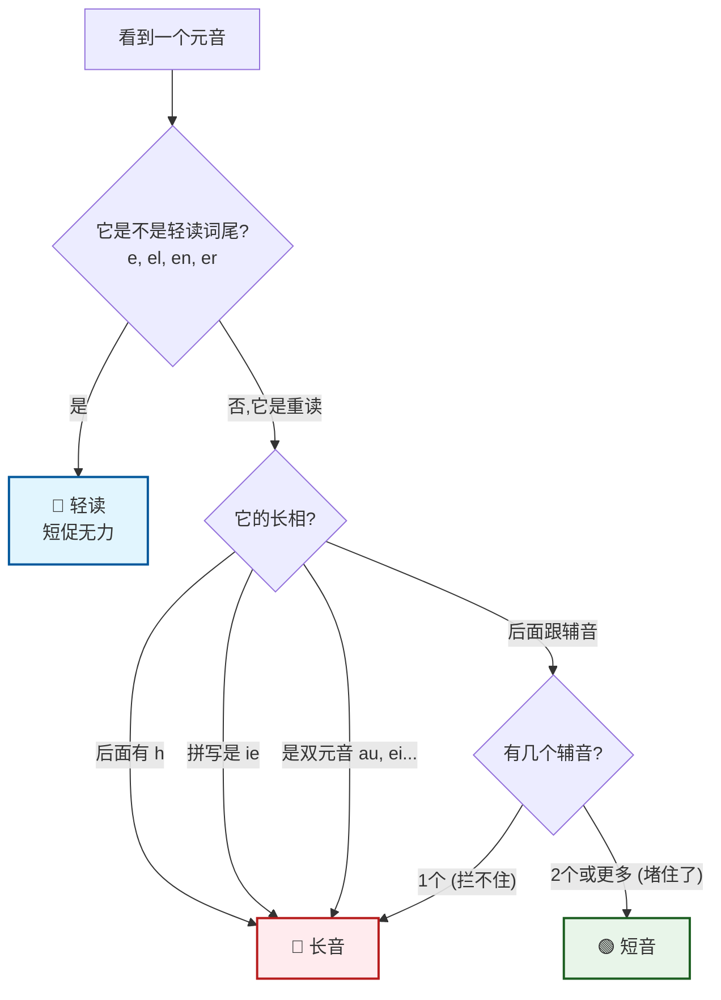

太棒了！你能自己总结口诀，说明你已经开始在大脑里“重新编码”知识了，这是最高效的学习方式！👍

你的初稿抓住了核心，但稍微有点“漏网之鱼”（比如 `h` 和 `ie`，以及单辅音的情况）。

来，老师帮你把你这块璞玉打磨成一颗**“无敌发音顺口溜”**。我们要做到：**不仅押韵，而且涵盖99%的情况。**

---

### 🎵 德语元音发音口诀 #ak

请大声朗读三遍（注意括号里的解释）：
ID: 1774612226265

> **哈(h) 艾(ie) 双元 都要长，**
> **一个保镖 拦不住 (长)。**
> **两个保镖 堵死路 (短)，**
> **尾巴轻念 轻快过路 (轻)。**

---
<!--ID: 1769344903374-->
<!--ID: 1773560527481-->
### 🔬 口诀拆解与举例

我们一句一句拆开看，配合你熟悉的单词：
ID: 1774612226268

#### 1. “哈(h) 艾(ie) 双元 都要长”
这三种情况，就像拿了**VIP金卡**，无条件发长音！
*   **哈 (h):** 元音后有 `h` (静音h)，前面的元音拉长。
    *   🌰 例子：**Bahn** (火车), **Stuhl** (椅子), **gehen** (去).
*   **艾 (ie):** `i` 和 `e` 在一起，发长长的 [i:]。
    *   🌰 例子：**Liebe** (爱), **Sie** (您), **Bier** (啤酒).
*   **双元:** 所有的双元音 (au, ei, eu/äu) 天然就是长音。
    *   🌰 例子：**Haus** (房子), **Wein** (酒), **Auto** (汽车).
ID: 1774612226271

#### 2. “一个保镖 拦不住 (长)”
这是最容易搞错的！如果重读元音后面只有**1个辅音**，它拦不住元音，元音就会“溜出去”变长。
*   🌰 例子：
    *   **Tag** [a:] (天) $\rightarrow$ 后面只有 `g`。
    *   **Gut** [u:] (好) $\rightarrow$ 后面只有 `t`。
    *   **le-sen** [e:] (读) $\rightarrow$ 第一音节后只有 `s`。
ID: 1774612226275

#### 3. “两个保镖 堵死路 (短)”
如果元音后面有**2个或更多辅音**（不管是双写 `tt`, `mm` 还是组合 `ft`, `nk`），路被堵死了，只能急刹车！
*   🌰 例子：
    *   **Ball** (球) $\rightarrow$ `ll` 双保镖 $\rightarrow$ `a` 短音。
    *   **Kommen** (来) $\rightarrow$ `mm` 双保镖 $\rightarrow$ `o` 短音。
    *   **Luft** (空气) $\rightarrow$ `f`+`t` 两个保镖 $\rightarrow$ `u` 短音。
    *   *注意：`ck` 和 `tz` 也是双保镖的变体！* (**Zucker**, **Platz**).
ID: 1774612226279

#### 4. “尾巴轻念 别在这住 (轻)”
这就是我们在前面说的“轻读音节”。看到词尾这些小跟班，千万别用力，轻轻带过，不要停留（不住在这里）。
*   **e:** **Nam-e**
*   **el:** **Ap-fel**
*   **en:** **lauf-en**
*   **er:** **Vat-er** (注意 `er` 在词尾发“阿”音，但是是极轻极短的“阿”)
ID: 1774612226282

---

### 🖼️ 逻辑流程图 (Mermaid)

用一张图把这个口诀印在脑子里：
ID: 1774612226286

---

### 🧠 费曼拓展：特殊情况（进阶防坑）

当你掌握了上面的口诀，你已经拿下了90%的单词。为了防止你以后踩坑，老师再给你两个**“补丁”**：
ID: 1774612226289

1.  **“ß” 是个大骗子**
    *   以前的德语写法里，`ß` 有时候算双辅音，有时候不算。
    *   **新正字法规定：**
        *   看到 **ss** $\rightarrow$ 前面一定是**短音** (Wasser, muss)。
        *   看到 **ß** $\rightarrow$ 前面一定是**长音** (Fuß, Straße)。
    *   *记忆：`ß` 长得像个孕妇，肚子大，所以发音长。*

2.  **单音节词的特权**
    *   有些极短的介词或代词，虽然只有一个辅音，但因为它们地位太低（通常不重读），所以也是短音。
    *   例子：**an**, **in**, **mit**, **das**, **es**. (别去拉长它们，读短一点)。

---

### ⚔️ 课后实战测试

请利用**“口诀”**判断下列单词划线元音的长短（长/短/轻）：
ID: 1774612226292

1.  **B<u>u</u>tter** (黄油)
    *   *分析：* `u` 后面跟着 `tt`。口诀怎么说？“两个保镖...”
    *   *答案：* \_\_\_\_\_\_\_\_

2.  **Z<u>a</u>hn** (牙齿)
    *   *分析：* `a` 后面有个 `h`。口诀怎么说？“哈 艾 双元...”
    *   *答案：* \_\_\_\_\_\_\_\_

3.  **H<u>a</u>se** (兔子)
    *   *分析：* `a` 后面只有 `s`。口诀怎么说？“一个保镖...”
    *   *答案：* \_\_\_\_\_\_\_\_

4.  **Mant<u>el</u>** (大衣)
    *   *分析：* `el` 在词尾。口诀怎么说？“尾巴轻念...”
    *   *答案：* \_\_\_\_\_\_\_\_

**(自己先心里想一遍答案，再看下面)**

.
.
.
.

**参考答案：**
1.  **短** (两个保镖堵死路)
2.  **长** (哈h艾ie...都要长)
3.  **长** (一个保镖拦不住)
4.  **轻** (尾巴轻念别在这住)

这个口诀背下来了吗？明天起床刷牙的时候默念一遍！🦷