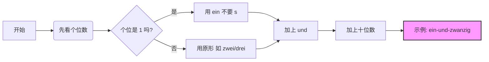

以下为AI生成的图文笔记的内容

#### 一、数字00:05

##### 1. 课前热身00:08

###### 1）复习动词nehmen00:11

- ![[assets/f91793af73062abfd67424059705c424_MD5.jpg]]
- 用法复习：nehmen表示"拿、取、喝"等意思，变位形式为：
    - ich nehme
    - du nimmst
    - sie nehmen
- 例句：
    - Ich nehme Kaffee. (我喝咖啡)
    - Ich nehme Saft. (我喝果汁)
    - Ich nehme Cola. (我喝可乐)
    - Sie nehmen Kaffee mit Milch. (他们喝咖啡加奶)
    - Nimmst du Kaffee mit Zucker? (你喝咖啡加糖吗)

##### 2. 重点讲解01:05

###### 1）数字0-1201:09

![[Recording 20260131190334.m4a]]

- 发音要点：
    - 0 null：注意双l发音
    - 1 eins：注意n的发音，不要漏掉
    - 2 zwei：口语中可读作"zwo"以区别于drei(3)
    - 3 drei：注意与zwei区分
    - 4 vier：注意v发音要咬唇
    - 5 fünf：注意ü发音
    - 6 sechs：发"zex"音
    - 7 sieben：德国人常简读为"zim"
    - 8 acht：注意ch发音
    - 9 neun
    - 10 zehn
    - 11 elf
    - 12 zwölf
- 发音技巧：数字连读时要注意区分相近发音的数字，如2和3
[[数字]] 

###### 2）练习电话号码04:56

- ![[assets/d0bc3a6f862e387c9fc4121195ecf167_MD5.jpg]]
- 练习方法：
    - 先逐个数字朗读
    - 然后尝试两位或三位一组朗读
- 示例：
    - 13764098302：eins drei sieben sechs vier null neun acht drei null zwei
    - 84356453：acht vier drei fünf sechs vier fünf drei
    - 19247051920：eins neun zwei vier sieben null fünf eins neun zwei null
    - 78236474：sieben acht zwei drei sechs vier sieben vier
    - 67543921：sechs sieben fünf vier drei neun zwei eins
    - 739217490：sieben drei neun zwei eins sieben vier neun null

###### 3）听说读写09:23

- ![[assets/cf44a93d56e12c0ec72b8c43cfdcf17a_MD5.jpg]]
- 练习内容：
    - 听写数字练习
    - 电话号码听写
- 答案参考：
    - 数字听写：2(zwei), 5(fünf), 9(neun), 11(elf), 1(eins), 3(drei), 0(null), 8(acht), 6(sechs), 12(zwölf), 10(zehn), 4(vier), 7(sieben)
    - 电话号码：
        - Handy 1：0175/2569138
        - Handy 2：0173/9768541

###### 4）奇数、偶数11:27

- ![[assets/980d09d2e33193126fa5344b405e0ab5_MD5.jpg]]
- 表达方式：
    - 偶数：gerade Zahl
    - 奇数：ungerade Zahl

##### 3. 国情文化11:53

###### 1）重要的数字

- ![[image-213.png|773x436]]
- 银行相关：
    - 账户号码：Kontonummer
    - 银行代码：Bankleitzahl (缩写：BLZ)
    - 账户名：Inhaber
- 其他重要号码：![[image-214.png|722x482]]
    - 会员号码：Mitgliedsnummer
    - 合同编号：Vertragsnummer
    - 邮政编码：Postleitzahl (缩写：PLZ)
- 注意事项：在德国生活时，这些号码信息非常重要，需要准确记忆和使用

#### 二、知识小结

|   |   |   |   |
|---|---|---|---|
|知识点|核心内容|考试重点/易混淆点|难度系数|
|数字发音（0-12）|德语数字发音示范与练习（null, eins, zwei, drei...zwölf）|易混淆发音：zwei（/tsvai/）vs. drei（/dʁai/）；sieben（/ˈziːbən/）口语简化为"zim"|⭐⭐|
|动词"name"的用法|例句翻译练习（"我喝咖啡"→"Ich trinke Kaffee"）|错误示例："迪士尼没咖啡"（语音混淆导致翻译错误）|⭐⭐|
|数字连读技巧|口语中数字组合的连读规则（如"zwei drei"→"fly die"需区分）|重点：个位与十位搭配读法（后续课程延伸）|⭐⭐|
|生活场景词汇|银行账户（Kontonummer）、银行代码（Bankleitzahl）、邮编（Postleitzahl）等|缩写形式：PLZ（邮编）、BLZ（银行代码）|⭐⭐⭐|
|奇数/偶数表达|gerade Zahl（偶数） vs. ungerade Zahl（奇数）|词缀记忆：un-表否定|⭐|
|语音强化训练|数字发音纠音（如"sechs"的/xs/音、"neun"的/nɔɪ̯n/音）|常见错误：遗漏鼻音（如"neun"读成"neu"）|⭐⭐⭐|
|国情知识补充|德国生活必备号码（会员号Mitgliedsnummer、合同编号Vertragsnummer）|应用场景：银行、邮局、健身房|⭐⭐|

# 德语数字：13–100 计数规律与发音全解

你好！Hallo！我是你的“德语大师”。

看到你整理的笔记，我非常欣慰！你已经抓住了德语数字的核心骨架。但是，要想在德国生活（比如听懂超市收银员的语速，或者搞定银行存款），我们需要把这个骨架填充得更完整、更强壮。

特别是**大数字（百、千、百万）以及“倒着读”的逻辑**，是很多中国学生直到 B1 级别还在犯错的“重灾区”。

来，我们把你的笔记升级为 **《德语数字终极生存指南》**。

---

# 🔢 德语数字终极指南 (0 - 无穷大)

## 零、 基础中的基础：0–12 (死记硬背区)

这 13 个数字是所有大数字的基石，没有任何逻辑，必须像背自家电话号码一样滚瓜烂熟。

|**数字**|**德语**|**发音提示/记忆点**|
|---|---|---|
|0|**null**|像英语 null|
|1|**eins**|爱因斯坦的“爱因”|
|2|**zwei**|茨歪|
|3|**drei**||
|4|**vier**|**v** 发 [f]|
|5|**fünf**|注意元音 ü|
|6|**sechs**|chs 发 [ks]|
|7|**sieben**||
|8|**acht**||
|9|**neun**||
|10|**zehn**||
|11|**elf**|特殊！不是 "einszehn"|
|12|**zwölf**|特殊！不是 "zweizehn"|

---

## 一、 青春期的数字：13–19 (个位 + zehn)

这一块你掌握得很好，逻辑就是“个位 + 10”。

- **公式**：$个位数 + zehn$
- **⚠️ 两个“整容”特例**：
    - **16 (sechzehn)**：`sechs` 去掉 **s**，为了发音顺滑。
    - **17 (siebzehn)**：`sieben` 去掉 **en**，变得更干练。

---

## 二、 成熟的整十数：20–90 (-zig)

- **公式**：$个位数 + zig$
- **⚠️ 四个“特殊分子”**：
    - **20 (zwanzig)**：变身为 `zwan-`。
    - **30 (dreißig)**：唯一使用 **ß** (Scharfes S) 的数字！**绝对不是 dreizig**。
    - **60 (sechzig)**：同 16，去掉 **s**。
    - **70 (siebzig)**：同 17，去掉 **en**。

---

## 三、 让人头秃的复合数：21–99 (倒着读！)

这是德语数字最“反人类”的地方，也是你必须攻克的难关。**德语是先说个位，再说十位。**

- **想象场景**：你付钱时，不仅要说“20”，还要说“1 和 20”。
- **核心结构**：$个位 + und (和) + 十位$
	- 45：fünf-und-vierzig
- **书写规则**：所有单词连在一起写，**不留空格**！

#### 🧠 逻辑图解 (Mermaid)

代码段

- **特例中的特例：21, 31, 41...**
    - 单独数数说“1”是 `eins` (带s)。
    - 但在组合里（21-99），它变成了 `ein` (不带s)。
    - **例**：21 = **ein**undzwanzig (✅ 正确) / einsundzwanzig (❌ 错误)

---

## 四、 进阶：百与千 (100 - 9,999)

好消息！从 100 开始，德语逻辑回归正常，**从左往右读**。

### 1. 百位数 (hundert)

- **逻辑**：$几百 + (末尾两位数)$
- 100 可以说 `hundert` 或 `einhundert`。
- **例子**：
    - 101: hunderteins (注意：这里的1又变回 eins 了，因为它是最尾巴)
    - 106：Einhundertsechs
    - 245: zweihundert + fünfundvierzig (先百，后个位+十位)
    - **技巧**：把百位切开，后面剩下的按 1-99 的规则读。

### 2. 千位数 (tausend)

- **逻辑**：$几千 + 几百 + (末尾两位数)$
- **例子**：
    - 1000: (ein)tausend
    - 2026: zweitausendsechsundzwanzig (2000 + 6 + 20)
    - 两千一百零六：Zweitausend-ein-hundert-sechs

---

## 五、 高阶：百万与亿 (小心陷阱！)

这里有一个巨大的**“假朋友” (False Friend)** 陷阱，英语和德语在这里分家了，移民处理税务和买房时千万别搞错！

|**数字**|**德语**|**英语 (对比)**|**⚠️ 注意事项**|
|---|---|---|---|
|1,000,000|**eine Million**|Million|它是名词，**首字母大写**，复数加-en (zwei Millionen)。|
|1,000,000,000 (10亿)|**eine Milliarde**|**Billion**|**最大陷阱！** 德语的10亿不是 Billion！|
|1,000,000,000,000 (1兆/万亿)|**eine Billion**|Trillion|德语的 Billion 是英语的 Trillion。|

- **记忆口诀**：德语是“百万(Million) -> 亿(Milliarde) -> 兆(Billion)”，像阶梯一样上升。

---

## 六、 移民生活实战场景

作为以移民为目标的学习者，你不需要像数学家一样数数，但你需要搞定以下两个场景：

### 1. 年份 (Das Jahr)

- **2000年以前**：切成两半读。
    - 1990 = 19 | 90 = neunzehn**hundert**neunzig (19个百+90)
- **2000年以后**：按正常数字读。
    - 2026 = zweitausendsechsundzwanzig

### 2. 价格 (Der Preis)

在超市或租房时，人们经常偷懒。

- € 14,99 (vierzehn Euro neunundneunzig)
- **口语速读**：vierzehn neunundneunzig (省略 Euro)

---

## 🎯 你的“德语大师”挑战任务

为了巩固记忆，请你尝试用德语写出（或读出）以下这几个对你未来生活至关重要的数字。

1. **你的出生年份**（例如：1985 或 1992）
2. **德国基本免税额**：11,604 (elf-tausend...)
3. **一个假想的暖租房租**：845 (acht-hundert...)

**试着回复我，我来帮你纠音和检查拼写！**

# 一、数字"百"和加减乘除00:06

##### 1. 课前热身00:23

###### 1）复习数字00:33

- ![[image-221.png|469x408]]
- 数字读法规则：德语数字读法需注意个位与十位之间先说个位，再用十位连读。例如60的正确读法不是"一和几十结合"，而是遵循特定连读规则。
- 常见数字示例：
    - 13: dreizehn
    - 21: einundzwanzig
    - 60: sechzig

##### 2. 重点讲解01:51

###### 1）数字"百"01:54

- ![[image-222.png|390x424]]
- 基本构成：数字+hundert，如200=zweihundert，300=dreihundert
- 特殊读法：
    - 100可读为(ein)hundert
    - 900=neunhundert
    - 1000=tausend或eintausend
- 连接规则：百位与个位直接连接，不加und，如201=zweihunderteins；只有当出现十位时才用und连接，如231=zweihunderteinunddreißig
- 例题:数字与百组合的练习02:59
    - ![](https://bdcu01.baidupcs.com/file/p-238495c51c549d09716328b28cd8ffb9-40-2025042100-3?bkt=en-3de6f374fcad9f514a94920d227b7f50&fid=282335-250528-&time=1770037910&sign=FDTAXUVGEQlBHSKfWqij-GBWOGYTBgG0KqHy7wNbwoLTVMyJyK6xE-AZ8Eq%2BFq2KLlLk5wt%2BaZLgA2ivs%3D&to=136&size=10&sta_dx=10&sta_cs=0&sta_ft=&sta_ct=7&sta_mt=7&fm2=MH%2CBaoding%2CAnywhere%2C%2C%E8%B4%B5%E5%B7%9E%2Ccnc&ctime=0&mtime=0&dt3=0&resv0=-1&resv1=0&resv2=rlim&resv3=5&resv4=10&vuk=0&iv=2&vl=0&htype=&randtype=&newver=1&newfm=1&secfm=1&flow_ver=3&pkey=en-09f676435cec809f296472dc3baaf878f76e54370380a37db81277b6b4965affa00fba9be2d71f2f2786fbb8b0d2caf497f87a65225cfddd305a5e1275657320&expires=8h&r=767393235&vbdid=-&fin=p-238495c51c549d09716328b28cd8ffb9-40-2025042100-3&fn=p-238495c51c549d09716328b28cd8ffb9-40-2025042100-3&rtype=1&dp-logid=8833105206652726835&dp-callid=0.1&hps=1&tsl=0&csl=0&fsl=-1&csign=dmayhhcqdS1jXSxjkf6DN1P7N8o%3D&so=0&ut=1&uter=-1&serv=-1&uc=3378626776&ti=058e25ce645ae596a60da53938fe8a7f30c6de791e3aeeb2&hflag=30&from_type=&adg=n&reqlabel=250528_n_581e4a1ef39feb6f4d0a98b03f9bf277_0_348e66b7e001919f879fcd526c94aa3b&chkv=5&bid=250528&by=themis)
    - 练习重点：掌握13-200的数字读法
    - 关键数字示例：
        - 13: dreizehn
        - 27: siebenundzwanzig
        - 101: (ein)hunderteins
        - 200: zweihundert

###### 2）加减乘除04:39

- ![](https://bdcu01.baidupcs.com/file/p-238495c51c549d09716328b28cd8ffb9-40-2025042100-4?bkt=en-3de6f374fcad9f514a94920d227b7f50&fid=282335-250528-&time=1770037910&sign=FDTAXUVGEQlBHSKfWqij-GBWOGYTBgG0KqHy7wNbwoLTVMyJyK6xE-4V5qnnYV8unKD6PzuhxB0Kl932w%3D&to=136&size=10&sta_dx=10&sta_cs=0&sta_ft=&sta_ct=7&sta_mt=7&fm2=MH%2CBaoding%2CAnywhere%2C%2C%E8%B4%B5%E5%B7%9E%2Ccnc&ctime=0&mtime=0&dt3=0&resv0=-1&resv1=0&resv2=rlim&resv3=5&resv4=10&vuk=0&iv=2&vl=0&htype=&randtype=&newver=1&newfm=1&secfm=1&flow_ver=3&pkey=en-f1e66fa1c2bd4f152ca6059915e1f038f47250cb1b47c2475fe43085c16901a9ed2bd2f3f6a0431735c68000815acce39bacb788aa5026a8305a5e1275657320&expires=8h&r=263198106&vbdid=-&fin=p-238495c51c549d09716328b28cd8ffb9-40-2025042100-4&fn=p-238495c51c549d09716328b28cd8ffb9-40-2025042100-4&rtype=1&dp-logid=8833105206652726835&dp-callid=0.1&hps=1&tsl=0&csl=0&fsl=-1&csign=dmayhhcqdS1jXSxjkf6DN1P7N8o%3D&so=0&ut=1&uter=-1&serv=-1&uc=3378626776&ti=058e25ce645ae596f29f5430320510448e1794a0eac49bd7305a5e1275657320&hflag=30&from_type=&adg=n&reqlabel=250528_n_581e4a1ef39feb6f4d0a98b03f9bf277_0_348e66b7e001919f879fcd526c94aa3b&chkv=5&bid=250528&by=themis)
- 运算符表达：
    - 加：plus
    - 减：minus
    - 乘：mal或multipliziert mit
    - 除：geteilt durch/durch/dividiert durch
- 例题:数字加减乘除的练习05:16
    - 加法示例：
        - 5+5=10：fünf plus fünf ist zehn
        - 3+7=10：drei plus sieben ist zehn
    - 减法示例：
        - 5-4=1：fünf minus vier ist eins
        - 9-5=4：neun minus fünf ist vier
    - 乘法示例：
        - 5×2=10：fünf mal zwei ist zehn 或 fünf multipliziert mit zwei ist zehn
        - 3×2=6：drei mal zwei ist sechs
    - 除法示例：
        - 8÷2=4：acht durch zwei ist vier 或 acht geteilt durch zwei ist vier
        - 6÷2=3：sechs durch zwei ist drei
        - ![[image-223.png|701x406]]
![[Recording 20260202214538.m4a]]

- 例题:德语对话理解11:34
    - ![](https://bdcu01.baidupcs.com/file/p-238495c51c549d09716328b28cd8ffb9-40-2025042100-5?bkt=en-3de6f374fcad9f514a94920d227b7f50&fid=282335-250528-&time=1770037910&sign=FDTAXUVGEQlBHSKfWqij-GBWOGYTBgG0KqHy7wNbwoLTVMyJyK6xE-kNLVpFpYClapcDDzhB5xWlKTz40%3D&to=136&size=10&sta_dx=10&sta_cs=0&sta_ft=&sta_ct=7&sta_mt=7&fm2=MH%2CBaoding%2CAnywhere%2C%2C%E8%B4%B5%E5%B7%9E%2Ccnc&ctime=0&mtime=0&dt3=0&resv0=-1&resv1=0&resv2=rlim&resv3=5&resv4=10&vuk=0&iv=2&vl=0&htype=&randtype=&newver=1&newfm=1&secfm=1&flow_ver=3&pkey=en-293c35ae2d41ee58e674198bc7012b33e8e44650377010fe46389555f4b0347f2f1c8e202291f1ba6b90cc228131a63a8c0390be6a973db1305a5e1275657320&expires=8h&r=970301403&vbdid=-&fin=p-238495c51c549d09716328b28cd8ffb9-40-2025042100-5&fn=p-238495c51c549d09716328b28cd8ffb9-40-2025042100-5&rtype=1&dp-logid=8833105206652726835&dp-callid=0.1&hps=1&tsl=0&csl=0&fsl=-1&csign=dmayhhcqdS1jXSxjkf6DN1P7N8o%3D&so=0&ut=1&uter=-1&serv=-1&uc=3378626776&ti=f85402de027831277034fd2a49d415908e1794a0eac49bd7305a5e1275657320&hflag=30&from_type=&adg=n&reqlabel=250528_n_581e4a1ef39feb6f4d0a98b03f9bf277_0_348e66b7e001919f879fcd526c94aa3b&chkv=5&bid=250528&by=themis)
    - 关键句型：
        - "Hallo, ist hier frei?"（这里有空位吗？）
        - "Ja, klar."（是的，当然）
        - "Das sind Beata und Maria."（这是Beata和Maria）
        - "Seid ihr im Deutschkurs B?"（你们在B德语班吗？）
    - 语法重点：
        - 复合词Deutschkurs（德语课）的词性由kurs决定
        - 介词in与定冠词der的第三格变化：in dem → im
        - 动词machen的变位：ich mache, du machst, er/sie/es macht, wir machen, ihr macht, Sie/sie machen
        - lernen（学习）与studieren（上大学）的区别
![[image-224.png|713x476]]
![[image-225.png|611x287]]
![[image-226.png|640x383]]

![[image-227.png|636x408]]

###### 3）应用案例17:09

- 例题:德语单词拼写
    - ![](https://bdcu01.baidupcs.com/file/p-238495c51c549d09716328b28cd8ffb9-40-2025042100-6?bkt=en-3de6f374fcad9f514a94920d227b7f50&fid=282335-250528-&time=1770037910&sign=FDTAXUVGEQlBHSKfWqij-GBWOGYTBgG0KqHy7wNbwoLTVMyJyK6xE-ilxgiqcgHVpYs8s1MthhFNJoGIE%3D&to=136&size=10&sta_dx=10&sta_cs=0&sta_ft=&sta_ct=7&sta_mt=7&fm2=MH%2CBaoding%2CAnywhere%2C%2C%E8%B4%B5%E5%B7%9E%2Ccnc&ctime=0&mtime=0&dt3=0&resv0=-1&resv1=0&resv2=rlim&resv3=5&resv4=10&vuk=0&iv=2&vl=0&htype=&randtype=&newver=1&newfm=1&secfm=1&flow_ver=3&pkey=en-0abf8748d7bd81431edfdd562f2c908fbe92c9ee96f5d1489f834d6eba47305ec6c8e57abdd323eb5fb8537d5d00c2499a93cab79676cd66305a5e1275657320&expires=8h&r=534981173&vbdid=-&fin=p-238495c51c549d09716328b28cd8ffb9-40-2025042100-6&fn=p-238495c51c549d09716328b28cd8ffb9-40-2025042100-6&rtype=1&dp-logid=8833105206652726835&dp-callid=0.1&hps=1&tsl=0&csl=0&fsl=-1&csign=dmayhhcqdS1jXSxjkf6DN1P7N8o%3D&so=0&ut=1&uter=-1&serv=-1&uc=3378626776&ti=0cce998314b34a67d6746041abd4f1b712b01c8c4ab67fdd&hflag=30&from_type=&adg=n&reqlabel=250528_n_581e4a1ef39feb6f4d0a98b03f9bf277_0_348e66b7e001919f879fcd526c94aa3b&chkv=5&bid=250528&by=themis)
    - 例题：Drei plus acht ist elf（3加8等于11）
    - 重点：掌握数字的德语拼写及简单运算表达

#### 二、知识小结

|   |   |   |   |
|---|---|---|---|
|知识点|核心内容|考试重点/易混淆点|难度系数|
|百位数字表达|200-900：数字+hundert（如zweihundert）；1000：tausend/eintausend|无连词规则：仅十位与个位间用und（如231→zweihunderteinunddreißig）|⭐⭐|
|加减乘除表达|加：plus；减：minus；乘：mal/multipliziert mit；除：geteilt durch/dividiert durch|除法三种说法：durch/geteilt durch/dividiert durch|⭐⭐⭐|
|数字发音规则|个位先说，十位后说（如21→einundzwanzig）|易错点：60正确发音为sechzig（非sechsundzwanzig）|⭐⭐|
|对话场景解析|互惠生（Au-pair）文化背景：德语学习与家务互助|动词变位：machen（mache/machst/macht）与lernen（lerne/lernst/lernt）|⭐⭐|
|复合词结构|Deutschkurs（德语课）：词性由后置词Kurs决定（阳性）|介词搭配：im Deutschkurs（in+dem缩写）|⭐⭐|

# 听力练习

 - [[k1-6-1#4 Was kostet wie viel]]
 - 

