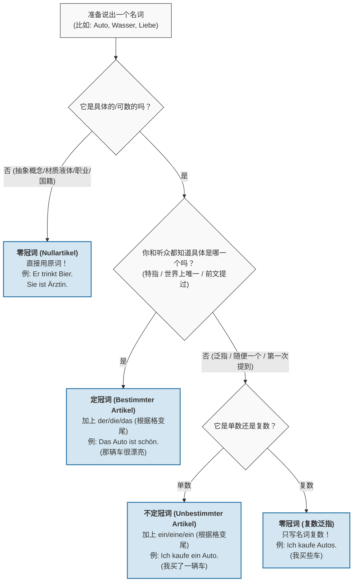

# 区别

你好！欢迎来到德语学习的快车道。我是你的“德语大师”。既然我们的目标是六个月拿下 B 2，那我们就不能在死记硬背上浪费时间，必须用**最直观的逻辑**去破解它。

你的直觉非常敏锐！把“不定冠词”理解为“一个”，把“定冠词”理解为“那个/特定的”，这不仅完全正确，而且是掌握德语思维的第一把钥匙。

我们来剥开这两个“术语”的外衣，看看它们的本质。

---

### 1. 通俗解码：手电筒理论

想象你在一个漆黑的房间里，房间里堆满了东西（这些东西就是名词）。

#### **不定冠词 (Ein/Eine) = 随机摸一个**

- **含义：** 就像你在黑暗中随手一抓，抓到了**一个**苹果。你不关心它是红的还是绿的，是大是小，反正它就是“一个苹果”。
- **你的理解：** 对！它就是数学上的“1”。
- **场景：** 你走进面包店，你并不在乎只要是起酥面包就行。
    - 🇩🇪 _Ich möchte **ein** Croissant._ (我想要**一个**羊角包。) —— 随便拿一个给我就行。

#### **定冠词 (Der/Die/Das) = 聚光灯锁定**

- **含义：** 就像你打开了强力手电筒，光束死死地打在**某一个特定的**苹果上。你和听你说话的人都知道，光圈里的这一个，不是别的。
- **你的理解：** 对！它代表“特定的”。
- **场景：** 面包师拿给你一个羊角包，结果你发现那一个是焦的。
    - 🇩🇪 * **Das** Croissant ist verbrannt.* (**这个/这只**羊角包是焦的。) —— 不是店里其他的，而是你手里拿的这一个。

### 使用场景

怎么用?

名词本身没有“特指”或“泛指”的固有属性，冠词大多数取决于说话人的“主观意图”以及他和听话人之间的“默契”。

- **不定冠词 (ein/eine/ein) = “建立新信息”**
    - 当导游指着远处的某个建筑，游客还不知道那是什么时，导游是在**引入一个新事物**。
    - 中文逻辑：“大家看，左边有**一座**塔 / 那里有**一个**体育场”。
    - 只要是首次提及、泛指的“一个”某物，必须用**不定冠词**。
- **定冠词 (der/die/das) = “确认已知信息 / 特定专有名词”**
    - 当导游紧接着说出这个建筑的具体名字时，这个建筑就从“随便一座塔”变成了“大家眼前的、独一无二的这座特定建筑”。
    - 中文逻辑：“**这座**（塔）就是电视塔 / **这个**（体育场）就是奥林匹克体育场”。
    - 当事物被具体指明、有专有名称（如 Fernsehturm 电视塔），或者是世界上独一无二的事物时，必须用**定冠词**。

**泛指** vs **特指**。

想象一下这两种场景： ^32hl0y

- **不定冠词 (ein/eine/ein) = “一个” (泛指)：** 就像是从茫茫人海中随便拉出来一个。当你想表达“我拥有**某一样/某一种**东西”时，用不定冠词。
- **定冠词 (der/die/das) = “那个” (特指)：** 聚光灯打在它身上，你和听话人都知道具体是在说哪一个。

**我们来看信里的那句话：**

> "Du weißt, ich habe auch **eine** Katze..." (你知道的，我也有一只猫......)

**如果用不定冠词 (eine Katze)：** 珍妮在向朋友交代自己养宠物的总体情况，意思是“我养了**一只**猫”。这只猫第一次在这里被当作一个类别提出来。 **如果用定冠词 (die Katze)：** 句子变成了“我拥有**那只**猫”。这听起来非常奇怪，好像她和朋友之前共同策划去偷了某一只特定的猫，或者朋友完全知道是哪一只著名的猫一样。

# 什么时候不用冠词

在德语中，“不使用冠词”的情况在语法上被统称为**零冠词 (der Nullartikel)**。能否熟练并准确地运用零冠词，是检验你的德语是否已经真正扎根于 B 1 水平的重要标准。

以下为你梳理德语中**必须省略冠词**的核心场景与具体规则：

### 1. 不定冠词的复数形式 (Plural unbestimmter Nomen)

当你想泛指某些事物，并且在单数时会使用不定冠词 (ein/eine/ein) 时，它的复数形式直接省略冠词。

* **Ich kaufe einen Apfel.** (我买一个苹果。)
  -> **Ich kaufe Äpfel.**
    - 我买一些苹果。（泛指苹果这种水果）

### 2. 表示职业、国籍或身份 (Berufe und Nationalitäten)

在与动词 **sein** (是)、**werden** (成为) 或 **bleiben** (保持) 连用，介绍某人的职业、国籍或身份时，不加冠词。

* **Sie ist Lehrerin.**
    - 她是一名女老师。
* **Er ist Spanier.**
    - 他是西班牙人。
* *(💡 B 1 进阶考点：如果职业或国籍前面有形容词进行具体修饰，则**必须**加冠词！例如：Sie ist **eine sehr gute** Lehrerin.)*

### 3. 物质名词 (Materialien und Stoffe)

表示材料、液体、金属、食品等不可数名词，在泛指时不需要加冠词。

* **Der Tisch ist aus Holz.**
    - 这张桌子是木头做的。
* **Ich trinke morgens gerne Kaffee mit Milch.**
    - 我早上喜欢喝加牛奶的咖啡。

### 4. 抽象名词 (Abstrakte Nomen)

表示感觉、情感、品质、状态等不可触摸的抽象概念（通常作为普遍现象时）不加冠词。

* **Ich habe heute keine Zeit, aber ich habe Lust, morgen ins Kino zu gehen.**
    - 我今天没时间，但我有兴致明天去电影院。
* **Er braucht viel Geduld.**
    - 他需要很多耐心。
* *(💡 注意：像 Hunger, Durst, Angst, Glück, Pech 这些常见的状态名词，即使有形容词修饰，通常也保持零冠词：Er hat großen Hunger.)*

### 5. 大多数国家、城市和洲的名称 (Länder, Städte, Kontinente)

德语中绝大多数的国家、城市和洲都是中性 (das) 的。在没有形容词修饰的情况下，它们前面**绝对不加冠词**。

* **Wir reisen nach Europa, genauer gesagt nach Deutschland.**
    - 我们去欧洲旅行，准确地说是去德国。
* *(💡 B 1 核心考点：遇到阴性、阳性或复数形式的国家，**必须**加定冠词！如：**die** Schweiz, **die** Türkei, **die** USA, **die** Niederlande, **der** Iran, **der** Irak.)*

### 6. 人名 (Personennamen)

在标准书面德语中，人名前不加冠词。

* **Das ist das Auto von Thomas.**
    - 这是托马斯的车。
* *(💡 提示：只有当人名前面带有形容词修饰时，才需要加定冠词。如：**Der arme** Thomas ist krank. 可怜的托马斯生病了。)*

### 7. 乐器、体育运动与固定短语 (Feste Wendungen)

许多日常活动、疾病名词在固定搭配中不用冠词。

* **Sport / Musik:** Er spielt gerne **Fußball** und sie spielt **Klavier**.
    - 他喜欢踢足球，她喜欢弹钢琴。
* **Feste Ausdrücke:** Wir fahren **Auto**. / Ich gehe **nach Hause**.
    - 我们开车。 / 我回家。
* **Krankheiten:** Er hat **Kopfschmerzen** / **Fieber**.
    - 他头痛 / 发烧。

---

**建议复习的知识点总结：**

当你写作文时，如果遇到**泛指的复数**、**介绍职业/国籍**、**提及普通国家名/城市名**、或是描述**抽象的情感/物质**，请务必停下来想一想：这里是不是应该使用 **Nullartikel (零冠词)**。把这些规则刻在脑海里，你的德语表达会变得非常纯正！

# 一、复习回顾00:17

- ![[image-265.png|858x459]]
- 数字复习：回顾昨日学习的数字组合：3.45296、25874.196、329.7169、876.534

# 二、语法讲堂01:12

##### 1. 不定冠词01:26

- ![[image-266.png|886x434]]
- 词形变化：
    - 阳性/中性名词：ein（如ein Mann, ein Buch）
    - 阴性名词：eine（如eine Frau）
- 使用场景：![[image-267.png|912x415]]
    - ![[image-268.png|804x461]]
    - 首次提及：引出新的人或物（例：Das ist ein Buch）
    - 泛指类别：表示同类事物中的一种（例：Eine Wohnung in Shanghai kostet 3 Millionen RMB）
    - 中性示例：Das ist ein Mädchen（Mädchen是中性名词）
    - 阴性示例：Das ist eine Blume（Blume是阴性名词）

###### 1）不定冠词的否定形式05:18

- ![[image-269.png|448x363]]
- 否定规则：
    - 阳性/中性：kein（如kein Buch）
    - 阴性：keine（如keine Lampe）
- 实例对比：
    - 肯定：Das ist ein Fernseher → 否定：Das ist kein Fernseher
    - 肯定：Das ist eine Lampe → 否定：Das ist keine Lampe
    - 肯定：Das ist ein Handy → 否定：Das ist kein Handy

###### 2）名词不定冠词否定词总结07:45

- ![[image-270.png|851x501]]
- 特殊注意：
    - 复数形式不使用不定冠词，否定直接用keine（例：Das sind keine Bücher）
    - 记忆口诀："阳性中性用ein，阴性要把e加，否定前面加个k"

##### 定冠词的使用

###### 1）独一无二的事物10:18

![[image-271.png|878x362]]

- 天体示例：
    - der Mond（月亮）
    - die Sonne（太阳）
- 特殊称谓：
    - der Papst（教皇）
    - die Erde（地球）

###### 2）在某个地方或环境大家所熟知的名词11:24

- 地点示例：
    - der Bahnhof（火车站）
    - 问路句型：Wo ist der Bahnhof?（火车站在哪？）

###### 3）已经在上下文提及的名词12:14

![[image-272.png|748x441]]

- 上下文衔接：
    - 首次出现：Auf dem Tisch liegt ein Buch（桌上有本书）
    - 再次提及：Das Buch kostet 15 Euro（这本书值15欧）

###### 4）最高级13:43

- 结构公式：der/die/das + 最高级
- 实例：Das ist der beste Kneipe in der ganzen Stadt（这是全城最好的酒馆）

###### 5）大家已经知道的名词14:41

![[image-273.png|389x410]]

- 语境示例：
    - Hast du die Frau gesehen?（你见过那个女人吗？）
    - 用于邻里间谈论新搬来的人等共同知晓的对象

###### 6）日期、月份和季节15:31

![[image-274.png]]

- 月份词汇：
    - Januar（一月）到Dezember（十二月）均为阳性
    - 记忆点：所有月份名词都带定冠词die

###### 7）一类事物当中的一种16:56

![[image-275.png|653x337]]

- 互换规则：
    - 定冠词：Der Zug ist ein Verkehrsmittel
    - 不定冠词：Ein Zug ist ein Verkehrsmittel
    - 两者均可表示"火车是一种交通工具"

###### 8）固定说法17:31

![[image-276.png|399x421]]

- 地理名称：
    - die Alpen（阿尔卑斯山）
    - der Rhein（莱茵河）
    - die Donau（多瑙河）
- 国家名称：
    - die Schweiz（瑞士）
    - der Iran（伊朗）
- 报刊名称：
    - Der Spiegel（明镜周刊）
    - Die Welt（世界报）

##### 3. 例题：冠词填空练习

- ![[assets/2f5895372aaa406f88d3a126900c1e95_MD5.jpg]]
- 题目解析
    - 关键词："一只"表示不定冠词
    - Koffer是阳性名词
    - 答案：ein
    - ![[assets/a41f350c502e307f14d7a2d1a3f81098_MD5.jpg]]
- 题目解析
    - 前句已出现Buch
    - 后句需用定冠词特指
    - 答案：Das

#### 三、知识小结

|        |                                                              |                                                 |      |
| ------ | ------------------------------------------------------------ | ----------------------------------------------- | ---- |
| 知识点    | 核心内容                                                         | 考试重点/易混淆点                                       | 难度系数 |
| 不定冠词   | 阳性/中性名词用 ein，阴性名词用 eine；否定形式为 kein/keine                     | 阴性名词 die 对应不定冠词 eine（如 eine Million）            | ⭐⭐   |
| 定冠词    | 阳性 der、中性 das、阴性 die、复数 die；用于特指、最高级、专有名词等                   | 最高级结构 der/die/das beste...（如 der beste Kneiper） | ⭐⭐   |
| 否定用法   | 不定冠词否定：kein（阳/中）、keine（阴/复数）；复数无冠词时否定用 keine                 | 例句：Das ist kein Buch（非 nicht ein Buch）          | ⭐⭐⭐  |
| 专有名词冠词 | 山川/河流/带冠词国家名需固定定冠词（如 die Alpen, die Schweiz）                 | 月份/季节均为阳性（如 der Januar）                         | ⭐⭐   |
| 语境区分   | 首次提及用不定冠词，已知信息用定冠词（如 Ein Buch liegt... → Das Buch kostet...） | 泛指一类事物时两者可互换（如 Ein/Der Zug ist...）              | ⭐⭐⭐  |

# 冠词（2）

#### 一、冠词00:13

##### 1. 复习回顾00:36

###### 1）例题:句子翻译00:43

![[assets/90fc7a87ba94c7ff40cc2f2f86c917df_MD5.jpg]]

- 定冠词与不定冠词用法：
    - 阳性名词：der Tisch（这张桌子），ein Tisch（一张桌子）
    - 阴性名词：die Schere（这把剪刀），eine Schere（一把剪刀）
    - 中性名词：das Bügeleisen（这台熨斗），ein Bügeleisen（一台熨斗）
- 记忆要点：定冠词（der/die/das）用于特指，不定冠词（ein/eine）用于泛指，需根据名词词性选择
![[image-277.png|938x380]]

##### 2. 定冠词与人称代词的互换02:08

- ![[image-278.png|791x445]]
- 阳性名词：
    - 定冠词：der → 人称代词：er
    - 动词变化：单数ist（如：Der Drucker ist billig → Er ist billig）
- 中性名词：
    - 定冠词：das → 人称代词：es
    - 动词变化：单数ist（如：Das Bügeleisen ist neu → Es ist neu）
- 阴性名词：
    - 定冠词：die → 人称代词：sie
    - 动词变化：单数ist（如：Die Lampe ist teuer → Sie ist teuer）
- 复数名词：
    - 定冠词：die → 人称代词：sie
    - 动词变化：复数sind（如：Die Scheren sind billig → Sie sind billig）

##### 3. 听说读写04:19

###### 1）例题:灯的价格对话理解

- ![[assets/8caa41a137d4c6403a966e3379855877_MD5.jpg]]
- 口语表达：![[image-279.png|816x478]]
    - "Na, die da!"：南德方言否定表达，相当于"Nein"，"die da"指"那边的那盏灯"
    - 价格询问："Was kostet sie?"中"sie"指代前文"die Lampe"
- 语法现象：![[image-280.png|430x358]]
    - 定冠词die可作指示代词使用（die da = 那边的）
    - 人称代词sie避免重复名词（不说Was kostet die Lampe?）

###### 2）例题:打印机价格对话理解05:43

- ![[image-281.png|934x463]]
- 口语特点：
    - "Schau mal"：口语祈使句，相当于"你看"
    - "ist ja billig"：ja表示惊讶语气
- 代词使用：
    - "Er kostet..."中er指代der Drucker
    - "Der ist..."省略名词，仅用定冠词der指代已知打印机

###### 3）例题:电视机和熨斗的价格对话理解07:06  

- ![[image-282.png]]
- 数量表达：
    - "viel"修饰不可数名词表示"多"（180 ist sehr viel）
    - "wenig"与"viel"相反表示"少"（das ist sehr wenig）
- 省略用法：
    - "fast neu"=几乎全新，fast表示程度
    - 还价时直接使用数字省略Euro（130→140→OK）
![[image-283.png]]

###### 4）例题:名词性及人称代词使用08:47

- ![[assets/9ca483863af1fab739f52f6863a27ca9_MD5.jpg]]
- 中性名词：
    - "das Handy" → 用es指代（Wie viel kostet es?）
    - "kein"否定不定冠词ein（das ist kein Fernseher）
- 复合词性判断：
    - "Digitalkamera"词性由基础词"Kamera"决定（阴性→用sie指代）
![[image-284.png]]

![[image-285.png]]

![[image-286.png|758x729]]

##### 4. 口语练习12:27

![[image-287.png]]

![[Recording 20260204124251.m4a]]

---

- ![[image-288.png]]

![[Recording 20260204124528.m4a]]

- 复数指代：
    - "Das sind..."用于多个物品（铅笔+本子）
    - 共享主语用und连接（sie kosten...und sind...）
- 否定形式：
    - "kein"对应不定冠词否定（kein Fernseher）
    - "nicht"否定整个句子（Das ist nicht teuer）

#### 二、知识小结

|   |   |   |   |
|---|---|---|---|
|知识点|核心内容|考试重点/易混淆点|难度系数|
|名词性别与人称代词替换|中性、阳性、阴性名词对应人称代词 er/sie/es 及复数 sie 的用法|区分阴性单数 die 与复数 die 的动词变化（单数 ist/复数 sind）|⭐⭐|
|定冠词与不定冠词|der/die/das 与 ein/eine 的否定形式 kein/keine|不定冠词否定需与名词性别一致（如 kein Tisch）|⭐⭐|
|价格表达与购物对话|Was kostet...? 结构及货币单位 Euro；还价场景中的数字表达（如 hundertachtzig）|zu teuer 与 billig 的反义对比；fast neu 等程度副词|⭐⭐|
|物主代词初步|mein/dein 等物主代词的性别变化（下节课重点）|Ist das dein Handy? → Nein, das ist meine Digitalkamera（复合词性别由后半部分决定）|⭐⭐⭐|
|口语省略规则|主语一致时可省略重复主语（如 Das ist ein Drucker und (er) ist billig）|共享主语的连词 und 使用；Wie ist es? → Super! 的简答形式|⭐|

# 怎么判断到底什么时候加定冠词还是不加还是加其他冠词呢

**一、 到底什么时候加什么冠词？（核心三大逻辑）**

**1. 定冠词 (Bestimmter Artikel): der / die / das**

- **核心逻辑**：**“特指”**与**“已知”**。
- **使用场景**：当说话人和听话人都明确知道你在说世上的哪一个具体东西时。比如前文刚刚提到过的东西，或者世界上独一无二的东西（太阳、月亮）。
- **生活类比**：就像舞台上的**追光灯**，精准地打在某一个特定的演员身上。
- _例句_：_Ich lese **das** Buch._ (我在读**这本**书。——听话人知道是桌上的那本书，或者我刚刚跟你借的那本书。)

**2. 不定冠词 (Unbestimmter Artikel): ein / eine / ein**

- **核心逻辑**：**“泛指”**与**“首次提及”**。
- **使用场景**：当你随便指代同类事物中的某一个，或者在故事里第一次引出一个新事物，听众还不知道具体是哪一个时。
- **生活类比**：就像去超市盲抓，只要是苹果就行，随便哪一个都无所谓。
- _例句_：_Ich lese **ein** Buch._ (我在读**一本**书。——随便哪本书，只要是书就行，不需要明确是哪本。)
- _注意_：这里它同样是宾语（第四格），但它用了不定冠词。这就破除了你“宾语一定要用定冠词”的假设！

**3. 零冠词 (Nullartikel): 什么都不加！**

- **核心逻辑**：**“材质/液体”**、**“抽象概念”**、**“职业/国籍身份”**、**“不定冠词的复数”**。
- **使用场景**：当名词不可数，或者表示一种概念属性，而不是一个具体的“物件”时。
- **生活类比**：就像空气和水，你无法拿出一个具体的“个”来。
- _例句 A (物质/液体)_：_Ich trinke Wasser._ (我喝水。——水不可数，直接做宾语，不加冠词。)
- _例句 B (抽象概念)_：还记得我们上一句的 _Gerechtigkeit_ 吗？_Gerechtigkeit wurde diskutiert._ (公平被讨论了。——公平是抽象概念，直接做主语，不加冠词！)
- _例句 C (不定冠词复数)_：_Ich lese Bücher._ (我在读一些书。——ein Buch 的复数没有冠词。)

---

**二、 逻辑决策可视化（Mermaid 判定流程图）**

以后当你要说出一个名词（不管是做主语还是宾语），只要在脑海里快速过一遍这张“通关决策图”，你就永远不会选错：

代码段

---

**三、 针对你的疑问：“不用定冠词，怎么确定它们的词性？”**

这是一个非常敏锐的问题！ 德语的逻辑是：**词性（性、数、格）是名词出厂自带的基因，而不是靠定冠词赋予的。** 即使名词前面什么都不加（零冠词），或者加了不定冠词（ein），它本身的阴、阳、中性依然存在，只是有些时候在字面上没有那么“显眼”罢了。

当它带有形容词时，为了弥补前面没有定冠词的遗憾，**形容词就会挺身而出，通过强变化词尾把它的词性大声喊出来**！ （比如上一课里的 _als **zentrales** Prinzip_，因为 Prinzip 是中性且前面没有定冠词，形容词 zentral 就加上了代表中性的 -es 词尾。）
