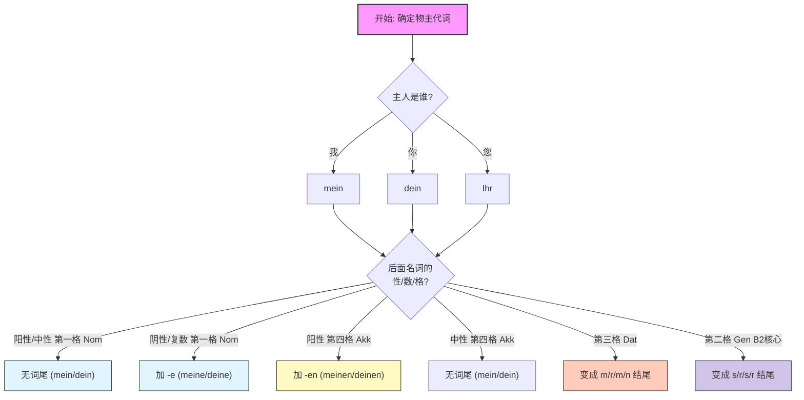

# 24 物主代词

> [!important]
可以理解为英语的所属格（your/my/her）, 但是德语多了+e 的变形.
> 

---

### 1. 核心概念：物主代词是“贴标签”

把每一个物主代词想象成你贴在物品上的**条形码标签**。这个标签由两部分组成，缺一不可：

1. **前半部分（词干）：** 代表**“谁是主人”**。（例如：是我的？还是你的？）
2. **后半部分（词尾）：** 代表**“贴在什么东西上”**。（这取决于后面那个名词的性、数、格）。

#### 第一步：认领“主人” (前半部分)

这就像是“出厂设置”，根据人称代词，我们有对应的词干。这部分永远不变：

| **人称 (主人)**             | **词干 (出厂设置)** | **记忆钩子/类比**          |
| ----------------------- | ------------- | -------------------- |
| **ich** (我)             | **mein**      | **Mine** (我的)        |
| **du** (你)              | **dein**      | D开头，对应Du             |
| **er** (他) / **es** (它) | **sein**      | **S**on (儿子) 是**他**的 |
| **sie** (她)             | **ihr**       | 想象"Her" (她的) 发音有点像   |
| **wir** (我们)            | **unser**     | "US" (我们) 在中间        |
| **ihr** (你们)            | **euer**      | 发音像 "Oyster"，你们的生蚝   |
| **sie** (他们)            | **ihr**       | 和“她”一样，看上下文区分        |
| **Sie** (您 - 尊称)        | **Ihr**       | **大写的I**，代表VIP待遇     |

> **⚠️ 大师提示**：B2备考重点！一定要区分清楚 **sein** (他的/它的) 和 **ihr** (她的/他们的/您的)。
> 
> - 场景：你要去外管局续签。签证官问你：“这是**您太太的**护照吗？” 你必须反应过来是用 **ihr** (她的)，而不是 **dein** (你的) 或 **sein** (他的)。

---

### 2. 进阶难点：“变色龙”尾巴 (词尾变化)

这就是让初学者头疼的地方。物主代词像**变色龙**，它虽然知道“主人”是谁，但为了融入句子，它必须根据它**修饰的名词**改变尾巴（词尾）。

**规则非常简单：物主代词的词尾变化 = 不定冠词 (ein/eine) 的变化规则！**

为了让你一眼看懂这个决策过程，我为你生成了一张逻辑图：

代码段

---

### 3. 实战演练：移民场景中的“变色龙”

我们不要空谈语法，直接放入你在德国生活最常见的场景中。

#### 场景一：租房 (Wohnungssuche)

_你需要区分：名词是主语（Nom）还是宾语（Akk）。_

- **句子**：这是**我的**公寓。(公寓 _Wohnung_ 是阴性，做主语)
    - **德语**：Das ist **meine** Wohnung. (阴性加 -e)
- **句子**：我需要**您的**签名。(签名 _Unterschrift_ 是阴性，做宾语)
    - **德语**：Ich brauche **Ihre** Unterschrift. (阴性第四格，还是 -e)
- **句子**：我想看**您的**租赁合同。(合同 _Mietvertrag_ 是阳性，做宾语)
    - **德语**：Ich möchte **Ihren** Mietvertrag sehen. (阳性第四格，变成 **-en**！就像 _einen_)

#### 场景二：看病 (Beim Arzt) - B2级别重点

_你需要掌握：第三格 (Dative)，因为痛感、身体部位常涉及Dativ。_

- **句子**：**我的**头很痛。(字面：头痛令我痛苦)
    - **德语**：**Mein** Kopf tut weh. (Nom. 阳性，无词尾)
- **句子**：这也是B2常考点——介词后接第三格。
    - **句子**：我带**我的**孩子去看医生。(mit + Dativ)
    - **德语**：Ich gehe mit **meinem** Kind zum Arzt. (中性第三格，词尾 **-em**)

#### 场景三：行政/职场 (Im Büro) - B2/C1 高级感

_你需要掌握：第二格 (Genitive)，这是区分B1和B2的关键！表示“......的”。_

- **句子**：这是**我**老板**的**车。
    - **德语**：Das ist das Auto **meines** Chefs. (阳性第二格，词尾 **-es**，注意名词Chef也要加s)
- **句子**：由于**我的**疾病，我不能工作。(Wegen + Genitive)
    - **德语**：Wegen **meiner** Krankheit kann ich nicht arbeiten. (阴性第二格，词尾 **-er**)

---

### 4. 你的“课后作业” (Next Step)

只有输出才能巩固输入。作为你的导师，我给你布置**三个**具体的造句任务。请尝试翻译下面这三句话（包含了B2必须掌握的格的变化）：

1. **(找工作场景)**：我也许可以把**我的**简历（_der Lebenslauf_）发给您吗？
2. **(社交场景)**：你一定要见见**我的**新邻居们（_die Nachbarn_ - 复数）。
3. **(B2挑战题 - 第二格)**：**我的**逗留（_der Aufenthalt_）期限（_die Dauer_）是六个月。
    
    - _提示：句型是 "The duration of my stay is..."_

**请写下你的答案，我会像批改雅思作文一样，为你指出语法细节并修正！**

# 柏林广场 1

#### 一、物主代词

##### 1. 复习回顾

###### 人称代词用法
- 中文区别：中文用"它"表示物体，德语需根据名词性别使用不同人称代词
- 阳性代词：er（对应 der/die 阳性名词）
- 阴性代词：sie（对应 die 阴性名词）
- 中性代词：es（对应 das 中性名词）
- 示例：
    - Die Waschmaschine → sie（洗衣机，阴性）
    - Der Computer → er（电脑，阳性）
    - Das Handy → es（手机，中性）
![[image-289.png|1735x1218]]

- ![[assets/5fc4c38f5a2fcb04617539eb517aab04_MD5.jpg|1715x1086]]

![[image-291.png|1735x784]]

###### 2）祈使句结构

- ![[image-292.png|1715x870]]
- ![[image-293.png]]
- 基本规则：动词在陈述句位于第二位，在祈使句位于第一位
- 尊称形式：对Sie（您/各位）的祈使句结构
    - Lesen Sie die Dialoge（请读对话）
    - Markieren Sie die Personalpronomen（请标记人称代词）
- 变位示例：
    - lesen变位：ich lese, du liest, er/sie/es liest
    - markieren变位：ich markiere, du markierst, er/sie/es markiert
![[image-294.png]]
![[image-295.png]]
![[image-296.png]]
![[image-297.png]]
![[image-298.png]]
![[image-299.png]]

##### 2. 物主代词详解

###### 1）词尾变化规律
- 阴性名词：物主代词加词尾-e（如deine Brille）
- 复数名词：同样加词尾-e（如deine Taschen）
- 阳性/中性名词：
    - 作主语/表语时无词尾（如dein Kugelschreiber）
    - 作其他成分时可能有变化（后续课程讲解）
- 记忆口诀："阴性复数要加e，阳中主语要考虑"
- 下面是所有的物主代词
![[image-309.png|809x414]]

###### 2）常见动词搭配

10:51

- kaufen（购买）：
    - 变位：ich kaufe, du kaufst, er/sie/es kauft
    - 语序特点：购买对象可放第一位（Die Lampe kaufe ich）
- mögen（喜欢）：![[image-300.png|800x360]]
    - 变位：ich mag, du magst, er/sie/es mag
    - 不规则变化：wir mögen, ihr mögt
    - 与gern区别：mögen是实义动词，gern是副词
![[image-301.png|800x465]]

![[image-302.png|800x560]]

![[image-303.png|800x352]]

##### 3. 应用练习

###### 1）例题：物主代词填空

- 题目解析：
    - 关键名词：der Computer（阳性）
    - 应选代词：er（替代阳性单数名词）
    - 完整句子：Der Computer ist sehr teuer. Er kostet fast 300 Euro.
    - 易错点：勿混淆er/es/sie的使用场景
- 题目解析：
    - 关键名词：das Handy（中性）
    - 应选代词：es
    - 数字表达：100 Euro = hundert Euro（书写可用阿拉伯数字）

###### 2）例题：物主代词造句

- ![[assets/1e48dbe721affe71ced6f2b87e9e5018_MD5.jpg]]
- 题目解析：
    - 阳性名词：das Buch → dein Buch（无词尾）
    - 阴性名词：die Schere → deine Schere（加-e）
    - 中性名词：das Portemonnaie → dein Portemonnaie（无词尾）
    - 疑问句转换：Ist das dein/deine...?

##### 4. 重点总结

![[image-304.png]]

- 核心规则：
    - 物主代词需与名词性别、数一致
    - 词尾变化遵循"阴性复数加e"原则
    - 阳性/中性名词作主语时保持原形
- 常见错误：
    - 混淆物主代词与人称代词
    - 错误添加或省略词尾-e
    - 疑问句中忘记动词提前
![[image-305.png]]

#### 二、知识小结

|         |                                                                                                          |                                   |      |
| ------- | -------------------------------------------------------------------------------------------------------- | --------------------------------- | ---- |
| 知识点     | 核心内容                                                                                                     | 考试重点/易混淆点                         | 难度系数 |
| 物主代词    | 德语中物主代词（如dein）在阴性名词前加词尾-a（例：deine Tasche），阳性和中性名词前无词尾（例：dein Kugelschreiber/dein Handy）                  | 复数名词前词尾规则与阴性单数相同（例：deine Scheren） | ⭐⭐⭐  |
| 人称代词    | 阳性单数用er，阴性单数用sie，中性单数用es（例：Der Computer – er kostet... / Die Lampe – sie ist... / Das Handy – es ist...） | 需严格匹配名词性别，易混淆中文无性别区分的“它”          | ⭐⭐   |
| 动词变位    | 不规则动词mögen（喜欢）的变位：ich mag/du magst/er mag；规则动词kosten（价值）第三人称单数统一为kostet                                  | mögen变位特殊（如wir mögen而非wir mögt）   | ⭐⭐⭐⭐ |
| 祈使句语序   | 动词位于句首，主语第二位（例：Lesen Sie den Dialog! vs 陈述句Sie lesen den Dialog.）                                        | 尊称Sie的祈使句与一般陈述句语序对比               | ⭐⭐   |
| 价格表达    | kosten + 金额（例：Das kostet 20 Euro）；提问用Wie teuer ist...?或Was kostet...?                                    | 数字单位书写（hundert vs tausend）        | ⭐    |
| 形容词用法   | sehr（非常）修饰形容词（例：sehr schön）；toll/super为口语化褒义表达                                                           | sehr与viel（多）的用法区分                 | ⭐⭐   |
| 名词性别与冠词 | 阳性der/阴性die/中性das（例：der Drucker/die Lampe/das Handy）                                                     | 冠词与代词需同步变化（易漏词尾）                  | ⭐⭐⭐  |

# 柏林广场 二

以下为AI生成的图文笔记的内容

#### 一、物主代词00:00

##### 1. 复习回顾00:22

###### 1）例题:你的眼镜00:30

- ![[image-306.png|1715x845]]
- 主语省略规则: 通过连词来省略，当两个分句主语一致时，可用**连词连接并省略第二个主语**。例："这是一台打印机，它要10欧元，很便宜"中"很便宜"前省略了"它"。
- 物主代词使用: "我喜欢你的眼镜"中"你的"用"diner"，"它很好看"中"它"指代前文提到的眼镜。

###### 2）例题:你的灯吗01:13

- 疑问句结构: "这是你的灯吗？"对应德语"ist das deine Lampe?"，注意物主代词"deine"在阴性名词前的词尾变化。
- 价格询问: "花了多少钱"用"wieviel kostet das"表达。

###### 3）例题:你的手机01:38

- 新旧询问: "你的手机是新的吗？"译为"ist dein Handy neu?"，注意"Handy"为中性名词，物主代词用"dein"无词尾变化。

# 2. 语法讲堂01:55

###### 1）例题:动词原形与动词词尾变化02:03
![[image-307.png|1577x659]]
- ![[image-308.png|1715x825]]
- 框架结构: 德语陈述句以动词为核心，动词位于第二位。例："das ist dein Buch"中"ist"为动词，"dein Buch"是表语。
- 表语成分: 可以是形容词、名词或副词，如"dein Buch"是对主语"das"的说明。

###### 2）规则03:04 #ak

- 阴性名词及名词复数前物主代词需要加词尾03:14
    - 阳性/中性规则: 在阳性(das)、中性(das)名词前，物主代词无词尾。例："dein Buch"(你的书)、"sein Stuhl"(他的椅子)。
    - 阴性/复数规则: 在阴性(die)及复数名词前需加词尾-e。例："deine Lampe"(你的灯)、"meine Taschen"(我的包)。
- 物主代词的用法05:07[[巧背物主代词]]
    - ![[assets/4919173a099741289552596816d90ab9_MD5.jpg|1689x1069]]
    - 人称对应:
        - 我的：mein/meine
        - 你的：dein/deine
        - 他的(阳性)：sein/seine
        - 她的：ihr/ihre
        - 我们的：unser/uns(e)re
        - 你们的：euer/eu(e)re
        - 他们的：ihr/ihre
        - 您的(尊称)：Ihr/Ihre(首字母大写)
<!--ID: 1771319860505-->
###### 3）ihr/Ihr的区分06:58

- ![[assets/65144d80328fa282a86dc9c06ad0600e_MD5.jpg|1715x1086]]
- 人称代词ihr: 表示"你们"，可直接作主语，如"Seid ihr Studenten?"(你们是学生吗)。
- 物主代词
	- ![[image-310.png|1689x952]]
	- 物主代词ihr: 必须接名词，小写表示"她的/他们的"，大写"Ihr"表示尊称"您的"。例："das ist ihr Buch"(这是她的书) vs "das ist Ihr Buch"(这是您的书)。

###### 4）unser和euer的写法08:56

- ![[assets/06b34419162e83a3cbefef1f9feae231_MD5.jpg|1559x987]]
- 拼写变体:
    - unser：新正字法"unsere"，旧写法"unsre"
    - euer：新正字法"euere"，旧写法"eure"
- 改革背景: 新正字法旨在简化书写，但两种形式目前均可接受。

##### 3. 听说读写10:24

###### 1）物主代词mein
![[image-311.png|1909x979]]
- 阳性名词: "这是我的笔"→"das ist mein Stift"(无词尾)
- 阴性名词: "这是我的灯"→"das ist meine Lampe"(加-e)
- ![[image-312.png]]
	- 复数形式: "这些是我的包"→"das sind meine Taschen"，注意动词变为复数"sind"。

###### 2）物主代词sein12:14
![[image-313.png]]
- 中性名词: "这是他的书"→"das ist sein Buch"(无词尾)
- 阴性名词: "这是他的剪刀"→"das ist seine Schere"(加-e)
- 复数形式: "这些是他的书"→"das sind seine Bücher"，注意"Bücher"为复数形式。

###### 3）物主代词ihre13:24

- ![[image-314.png]]
- 阴性单数: "这是她的咖啡机"→"das ist ihre Kaffeemaschine"
- 阳性名词: "这是她的椅子"→"das ist ihr Stuhl"(无词尾)![[image-315.png]]
- 复数形式: "这些是她的DVD"→"das sind ihre DVDs"，注意发音时"ihr"的"r"要顶住上齿龈。

##### 4. 内容回顾14:42

- ![[assets/1c7b9d84b1e153dbd72703fcf7fc3aad_MD5.jpg]]
- 核心规则: 阳性/中性名词前物主代词无词尾，阴性/复数前加-e。
- 易混点: 区分动词原形"sein"和物主代词"sein"；注意"ihr/Ihr"的大小写区别。
- 发音要点: "ihr"发音时需快速完成"r"的舌位动作。

#### 二、知识小结

|   |   |   |   |
|---|---|---|---|
|知识点|核心内容|考试重点/易混淆点|难度系数|
|物主代词基础|介绍物主代词（my, zion, thy, e等）及其在阳性/中性/阴性/复数名词前的词尾变化规则|区分物主代词与动词原形（如thy vs. zion）；大小写区分（e表示“您的”需大写）|⭐⭐|
|句子结构|陈述句框架（动词第二位，主语+表语结构）|表语成分可为形容词/名词/副词；复数主语需匹配复数动词|⭐⭐|
|词尾变化规则|阳性/中性名词前无词尾，阴性/复数名词前加词尾（如minor→minora）|不定冠词词尾变化对比（ein vs. eine）；新旧正字法拼写差异（如onser→onsera）|⭐⭐⭐|
|物主代词应用|造句练习（“这是我的笔”“这是他的书”等）|阴性名词与复数名词的词尾混淆（如thyne vs. thy）；谓语动词单复数匹配|⭐⭐|
|特殊注意事项|尊称“您的”需大写（Ihre）；e的多义性（“你们”/“他们的”）|句首e的语境判断；物主代词必须接名词（与人称代词区别）|⭐⭐⭐|
|新旧正字法对比|物主代词onser的两种拼写（带/不带a）均有效|新正字法简化规则（直接加词尾，无需去a）|⭐|

# 柏林广场 三

#### 一、物主代词00:06

##### 1. 内容复习00:13

- ![[image-316.png]]
- 单数形式:
    - 这是我的包：Das ist meine Tasche
    - 这是你的笔：Das ist dein Stift
    - 这是她的光盘：Das ist ihre CD
- 复数形式:
    - 这些是我的照片：Das sind meine Fotos
    - 这些是你的照片吗？：Sind das deine Fotos?
- 特殊注意:
    - 问句结构：动词位于第一位，如"Sind das..."
    - 名词复数变化：Foto→Fotos，注意重音在第一个音节
    - 语调：疑问句末尾用升调

##### 2. 物主代词ihr02:32

- ![[image-317.png]]
- 阴性名词:
    - 这是他们的洗衣机：Das ist ihre Waschmaschine
    - 规则：阴性名词前加词尾-e
- 中性名词:
    - 这是他们的字典：Das ist ihr Wörterbuch
    - 规则：中性名词前无词尾变化
- 复数形式:![[image-318.png]]
    - 这些是他们的字典：Das sind ihre Wörterbücher
    - 规则：复数名词前加词尾-e
    - 复合词复数：由最后部分决定，如Wörterbuch→Wörterbücher

##### 3. 物主代词unser05:40
![[image-319.png]]
- 阳性名词:
    - 这是我们的电视机：Das ist unser Fernseher
    - 规则：阳性名词前无词尾变化
- 阴性名词:
    - 这是我们的学校：Das ist unsere Schule
    - 规则：阴性名词前加词尾-e
- 复数形式:![[image-320.png]]
    - 这些是我们的照片：Das sind unsere Fotos
    - 规则：复数名词前加词尾-e
    - 发音注意：Foto复数Fotos，注意"o"的嘴型

##### 4. 物主代词euer08:28
![[image-322.png]]
- 阳性名词:
    - 这是你们的爸爸吗？：Ist das euer Vater?
    - 规则：阳性名词前无词尾变化
    - 问句结构：动词位于第一位
- 阴性名词:
    - 这是你们的妈妈吗？：Ist das eure Mutter?
    - 规则：阴性名词前加词尾-e
- 复数形式:![[image-323.png]]
    - 这是你们的孩子吗？：Sind das eure Kinder?
    - 规则：复数名词前加词尾-e
    - 名词变化：Kind→Kinder

##### 5. 题目解析11:55

###### 1）名词的单数和复数12:00
![[image-324.png]]
- ![[image-325.png]]
- 基本概念:
    - 单数der Gegenstand
    - 复数die Gegenstände
- 动词变位:![[image-326.png]]
    - schreiben：ich schreibe, du schreibst, er/sie/es schreibt
    - sprechen：ich spreche, du sprichst, er/sie/es spricht

###### 2）应用案例13:45

- 例题:物品描述示例
    - ![[image-327.png]]
    - 基本句型:
        - 这是我的钢笔：Das ist mein Kuli
        - 这支钢笔坏了：Der Kuli ist kaputt
    - 形容词用法:![[image-329.png]]
        - 便宜的：billig
        - 昂贵的：teuer
        - 实用的：praktisch
        - 时尚的：modern
- 例题:形容词造句示例14:16
    - ![[assets/825046133927933147b501dfd1c774f7_MD5.jpg]]
    - 形容词发音:
        - billig/teuer
        - kaputt
        - praktisch
        - neu/alt
        - schön
        - modern
- 例题:物品描述练习14:59
    - ![[image-330.png]]
    - 阳性名词示例:
        - 这是我的电视机：Das ist mein Fernseher
        - 这台电视机很旧：Der Fernseher ist alt
        - MP3播放器很贵：Der MP3-Player ist teuer
        - 钢笔很漂亮：Der Kuli ist schön
- 例题:物品描述练习16:01
    - ![[image-331.png]]
    - 中性名词示例:
        - 手机很时尚：Das Handy ist modern
        - 书很便宜：Das Buch ist billig
        - 本子很实用：Das Heft ist praktisch
    - 阴性名词示例:![[image-332.png]]
        - 洗衣机很旧：Die Waschmaschine ist alt
        - 包很时尚：Die Tasche ist modern
        - 灯很贵：Die Lampe ist teuer

#### 二、结束17:50

- ![[assets/ca99f2ec89ad0c25548e430e20c0d2ab_MD5.jpg]]
- 下节预告:
    - 定冠词、不定冠词
    - 人称代词
    - 物主代词综合复习

#### 三、知识小结

|   |   |   |   |
|---|---|---|---|
|知识点|核心内容|考试重点/易混淆点|难度系数|
|物主代词|讲解物主代词（my/your/his/her/our/their）在阳性、阴性、中性及复数名词前的词尾变化规则|阴性名词前需加词尾（如：eure Waschmaschine），中性名词无词尾（如：euer Wörterbuch）|⭐⭐⭐|
|名词复数形式|复合词复数由最后部分决定（如：Wörterbücher），单复数物主代词搭配（如：eure Fotos）|复合词词性与复数规则（如：Foto → Fotos）|⭐⭐|
|疑问句结构|一般疑问句动词首位（如：Ist das euer Vater?），语调需升调|动词位置与名词复数配合（如：Sind das eure Kinder?）|⭐⭐⭐|
|词汇发音|重点词汇读音（如：Waschmaschine、Fotos、Vater/Mutter 的 colloquial 形式）|易错发音（如：Fotos 的 "o" 嘴型、practisch 的 "pr" 音）|⭐⭐|
|形容词应用|描述物品的形容词（billig/teuer/kaputt/modisch 等）与名词性数格匹配|形容词词尾变化（如：der teure MP3-Player）|⭐⭐|
|复习重点|下节课将复习定冠词、不定冠词、人称代词及物主代词|综合运用难点（如：冠词+物主代词+名词的复合结构）|⭐⭐⭐⭐|

## 提问：为什么无论是阴性名词和阳性名词还是中性名词他们统一全部都用 das 开头，das 不是中性吗

- 这里的 **Das** 就像是英语里的 "This"。它是一个“指路牌”，用来指向某个东西。无论指的东西是男是女、是猫是狗，作为指路牌时，它通通都用 **Das**。
- 一旦指路牌后面出现了具体的名词，物主代词就要立刻切换到“精确模式”。

