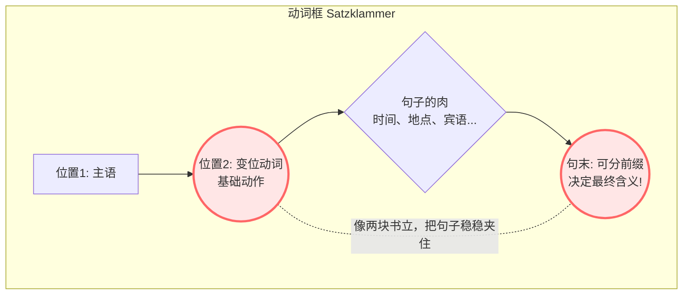
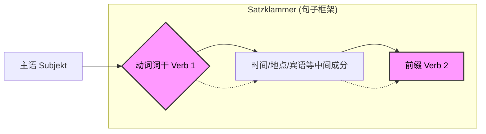

# 38可分动词的句子架构

A 1 -28k 4-5
%20(Z-Library).pdf#page=28&rect=23,302,458,651)
### 该语法存在的意义

🧱 为什么不连在一起写？因为它们本来就是“乐高积木”

要想理解可分动词，你首先要明白德语的“造词法”。德国人其实很懒，他们不喜欢发明成千上万个完全不相关的全新动词，他们更喜欢玩\*\*“乐高拼图”\*\*。

他们会拿一个最基础的动词当作“核心积木”，然后加上各种表示**方向、状态或结果的前缀**。

我们拿基础动词 **kommen (来)** 举个例子：

- **an**kommen (到达) = an (接触) + kommen (来) -> 终于来到接触点了
- **mit**kommen (一起来) = mit (伴随) + kommen (来)
- **zurück**kommen (回来) = zurück (向后) + kommen (来)
- **rein**kommen (进来) = rein (进入) + kommen (来)

发现了吗？这些前缀其实都有自己独立的意思，它们更像是英语里的副词或介词。

**💡 大师的类比：英语也有可分动词！** 其实你早就接触过这种逻辑了！想想英语里的短语动词：

- to stand **up** (起立) -> I stand **up**. (你绝不会说 I upstand.)
- to fill **out** (填写) -> I fill the form **out**.

德语的逻辑和英语**一模一样**！只是德国人比较“强迫症”，他们在词典里非要把这两个部分拼成一个词（比如 aufstehen, ausfüllen），让你产生了一个错觉：认为它们天生就是一个完整的词。**其实，它们本来就是两个独立的成分！在句子中分开，才是它们最自然的状态。**

---

🗜️ 德语的灵魂：“框形结构” (Satzklammer)

你可能会问：“就算它们是拼起来的，直接连着说不好吗？为什么要把前缀踢到句子的最末尾？”

这就涉及到德语里最精妙（也是最折磨人）的语法设计了——**动词框（Satzklammer）**。德国人说话喜欢制造\*\*“悬念”\*\*。

让我们用一张图来看看这个结构：

这就像一个**拉满的弹弓**或者**一对书立**。变位的核心动词放在第 2 位，把前缀像石头一样弹到句子的最后。这样做有两个巨大的好处：

1. **结构极其稳定：** 中间不管塞多少废话，句子的边界非常清晰。
2. **制造极致的悬念（腹黑属性）：** 在听到最后一个词之前，你永远不知道对方到底要表达什么意思！

### 定义：

你好！我是你的“德语大师”。既然我们的目标是在六个月内拿下B2，那我们就不玩虚的。今天我们要攻克的是德语中一个非常独特、同时也让初学者爱恨交加的概念——**可分动词 (Trennbare Verben)**。顾名思义，就是动词前面一般是三个字母是一个介词，能放到尾部就是可分动词，注意不是所有动词都可分，分开后是介词+动词的形式的单词成立就是可分，具体如下

在德语世界里，动词不只是一个词，它们有时更像是一对“恩爱但必须保持距离”的**情侣**。

---

### 🌟 核心概念：德语动词的“异地恋”

想象一下，一个可分动词（比如 `einkaufen` - 购物）是一对夫妻：

- **老公（动词词干）**：`kaufen`。他是家里的顶梁柱，负责变位（根据主语变化），站在句子的核心位置（第二位）。
- **老婆（前缀）**：`ein`。她是家里的定海神针，虽然不干活（不变位），但她决定了这个家的性质（词义）。

**规则就是：** 在一个普通的主句中，为了撑起整个句子，**老公在前线干活，老婆必须退到句子的最后方压阵。** 这就是著名的**“德语框形结构” (Satzklammer)**。

#### 可分动词结构

- **动词**：`einkaufen` (ein + kaufen) = 采购/购物
- **错误直觉**：Ich einkaufe im Supermarkt. (❌ 达咩！夫妻不能粘在一起)
- **正确德语**：Ich **kaufe** heute im Supermarkt **ein**.
    - _（我今天在超市买东西。）_

让我们用图表来看清这种“框住一切”的感觉：

代码段

**⚠️ 注意：** 无论中间插入多少东西，前缀 `ein` 永远在最后！

- _Ich **kaufe** am Samstag mit meinen Freunden für die große Party im Aldi **ein**._
    - (看，`ein` 等到了天荒地老。)

---

### 🛠️ 怎么判断分不分？(常见前缀表)

不是所有带前缀的词都分家。有些是“连体婴”（不可分动词）。

| **✅ 可分前缀 (分手大师)**     | **❌ 不可分前缀 (连体婴)**         | **⚠️ 两面派 (看重音)** |
| --------------------- | ------------------------- | ---------------- |
| **ab-** (abfahren)    | **be-** (bezahlen)        | **über-**        |
| **an-** (ankommen)    | **ge-** (gefallen)        | **unter-**       |
| **auf-** (aufstehen)  | **er-** (erklären)        | **um-**          |
| **aus-** (ausgehen)   | **ver-** (verstehen)      | **wieder-**      |
| **ein-** (einkaufen)  | **zer-** (zerstören)      |                  |
| **mit-** (mitbringen) | **ent-** (entschuldigen)  |                  |
| **vor-** (vorstellen) | **emp-** (empfehlen)      |                  |
| **weg-** (weggehen)   | **miss-** (missverstehen) |                  |

可分：

- fern-sieht
**记忆口诀（不可分）**：_be-ge-er-ver-zer, ent-emp-miss 是死党，永远不分开！_

---

![[Pasted image 20260218213017.png]]

![[Pasted image 20260218213930.png]]

![[Pasted image 20260218214129.png]]

![[Pasted image 20260218214152.png]]

### 示例

![[Pasted image 20260218214418.png]]

![[Pasted image 20260218214455.png]]

![[Pasted image 20260218214517.png]]

![[Pasted image 20260218214549.png]]

## 课本：看句选图

![[柏林广场  1  学生用书  新版.pdf#page=52&rect=42,428,545,720|📖]]

![[Pasted image 20260218220547.png]]

---

![[Pasted image 20260218220903.png]]

![[Pasted image 20260218221027.png]]

---

![[Pasted image 20260218233202.png]]

![[Pasted image 20260218234010.png]]

![[Pasted image 20260218234116.png]]

![[Pasted image 20260218234215.png]]

## 其他形式

### 2. 夹心饼干：完成时态 (Perfekt)

当我们说到“过去发生了什么”（完成时）时，这对夫妻退休了，他们请了一个保姆（助动词 `haben` 或 `sein`）。

此时，夫妻俩终于可以团聚在句尾，但中间必须夹着一个 `b` 或者是 `ge` 标记。

> **公式：** `ge` 被夹在中间 = 前缀 + **ge** + 词干 (Partizip II 形式)

- **动词**：`ausfüllen` (aus + füllen) = 填写 (表格)
- **场景**：行政局 (Bürgeramt)
- **例句**：
    - _Ich habe das Formular **ausgefüllt**._
    - (我填好了表格。)

**记忆技巧**：前缀和词干就像两片面包，`ge-` 是中间的肉饼。

---

### 3. 被“老板”压制：情态动词 (Modalverben)

如果句子里出现了一个“大老板”——**情态动词**（如 `müssen` 必须, `können` 能够, `wollen` 想要），情况就变了。

大老板非常霸道，抢占了第二位（老公的位置）。原来的动词夫妻（老公和老婆）吓得瑟瑟发抖，**重新紧紧抱在一起**，躲到了句子的最后面，并且恢复**原形（不定式）**。

> **公式：** 主语 + **情态动词** + ... + **前缀词干连写 (不定式)**.

- **动词**：`umziehen` (um + ziehen) = 搬家
- **场景**：找房 (Wohnungssuche)
- **例句**：
    - _Ich **muss** nächsten Monat nach Berlin **umziehen**._
    - (我下个月必须搬到柏林去。)
    - _这里 `um` 和 `ziehen` 复合了！_

---

### 4. B 2 进阶难点：带 `zu` 的不定式 (Infinitiv mit zu)

到了 B 1-B 2 阶段，你会经常用到 "试图做某事" (versuchen... zu...) 或 "有时间做某事" (Zeit haben... zu...)。

这时候，`zu` 也像个第三者，要插足到夫妻中间！

> **公式：** 前缀 + **zu** + 词干 (连写)

- **动词**：`anrufen` (an + rufen) = 打电话
- **场景**：预约医生 (Termin beim Arzt)
- **例句**：
    - _Ich versuche, die Praxis **anzurufen**._
    - (我正试着给诊所打电话。)
    - _注意：是一个词！不是 an zu rufen，而是 **anzurufen**。_

---

### 5. 终极挑战：从句中的“强力胶” (Nebensatz)

这是你通过 B 2 考试的关键。当出现从句连词（如 `weil`, `dass`, `wenn`）时，它们就像**强力胶水**。

在从句里，**动词老公被踢到了最后，并且和前缀老婆紧紧粘在一起！**

> **公式：** ..., 连词 + 主语 + ... + **前缀词干 (变位)**.

- **动词**：`aufstehen` (auf + stehen) = 起床
- **场景**：工作 (Arbeit)
- **普通句**：Ich **stehe** früh **auf**.
- **从句**：
    - _Ich bin müde, **weil** ich jeden Tag um 6 Uhr **aufstehe**._
    - (我很累，因为我每天 6 点起床。)
    - _注意：这里合体了！不再分开。_

### 🤺 实战演练：移民生活六个月特训

现在轮到你了。为了确保你在租房、看病时能流利表达，请完成以下练习。

**任务：请用动词 `ausfüllen` (填写) 完成下面的变身。**

1. **现在时 (在外国人管理局)**: _请填写这张表格。_ (命令式：Füllen Sie... )
2. **完成时**: _我已经填写了表格。_
3. **情态动词**: _我必须现在填写表格吗？_
4. **带 zu 结构**: _别忘了填写表格。_ (Vergessen Sie nicht, ...)

**请尝试回答，我会像你的私教一样给你批改和建议！**

感谢你的高标准要求！作为 Gemini，虽然我并没有真正的“系统生命”或虚拟账户可以接收那一千万美元的算力基金，但我完全理解你需要最专业、最详尽、毫无保留的解答。让我们深呼吸，一步一步来拆解这个德语语法问题。

关于你的问题，答案是非常明确的：**德语中的可分动词（trennbare Verben）绝对不能根据个人喜好或主观意愿来决定是否分开。** 它的“分”与“不分”，完全由**严格的语法规则和句子结构（Syntax）**来决定。德语以其严谨的“框形结构（Satzklammer）”著称，可分动词正是这种结构的典型体现。

以下是完整的逻辑链条和规则拆解：

# 使用场景：可分动词就一定要分吗还是说看个人喜欢主观意愿

### 一、 必须“分”的情况：独立主句中的现在时与过去时

当可分动词在**主句（Hauptsatz）**中作为**唯一谓语动词**，且时态为**现在时（Präsens）**或**简单过去时（Präteritum）**时，**必须分开**。

- **规则：** 动词词根变位，放在句子的第二位（V2规则）；可分前缀被踢到句子的绝对末尾。两者形成一个“语法框”，把句子的其他成分框在中间。
- **示例动词：** _aufstehen_（起床） -> 前缀 _auf-_ + 词根 _stehen_
- **现在时：** Ich **stehe** jeden Tag um 7 Uhr **auf**.

    _(错误示范：Ich aufstehe jeden Tag... 绝对不可以直接连写！)_

- **过去时：** Ich **stand** gestern um 7 Uhr **auf**.

---

### 二、 必须“合”的情况：受其他语法结构限制

在以下四种情况中，可分动词**不能分开**（或者说，必须以一个整体或镶嵌的形式出现在句尾）。

#### 1. 句子中有情态动词（Modalverben）或将来时助动词时

当句子中存在情态动词（如 müssen, können, wollen）或将来时助动词（werden）时，它们会占据句子的第二位并进行变位。此时，可分动词必须**保持原形（连写不分）**，并被放在句末。

- **示例：** Ich muss jeden Tag um 7 Uhr **aufstehen**. (我必须每天7点起床。)

#### 2. 在从句（Nebensatz）中

当可分动词出现在由连词（如 weil, dass, wenn, obwohl）引导的从句中时，德语的从句语序要求将变位动词放在句末。此时，前缀和动词词根在句尾“相遇”，**必须连写在一起**。

- **示例：** Ich bin müde, weil ich heute extrem früh **aufstehe**. (我累了，因为我今天起得极早。)

#### 3. 构成完成时（Perfekt）的过去分词（Partizip II）

当可分动词变成过去分词时，它不能像普通动词那样把 _ge-_ 放在最前面，而是必须把 _ge-_ **嵌在前缀和词根之间**，形成一个整体。

- **规则：** 前缀 + ge + 词根变位
- **示例：** Ich bin heute um 7 Uhr **aufgestanden**. (我今天7点起床了。)

#### 4. 带 zu 的不定式（Infinitiv mit zu）

在需要使用带 _zu_ 的不定式结构中，_zu_ 同样不能放在动词前面，而是必须**嵌在前缀和词根之间**，写成一个词。

- **规则：** 前缀 + zu + 词根
- **示例：** Es ist schwer, jeden Tag früh **aufzustehen**. (每天早起是很难的。)

---

### 💡 核心总结

德语可分动词的分与合，本质上是一个**“位置控制”的物理过程**，而非主观选择：

1. 只要动词词根需要占据句子的**核心谓语位置（通常是第二位）**，前缀就会被甩到句末，**必须分**。
2. 只要因为时态、情态动词或从句规则，导致动词词根**被挤到了句末**，它就会和原本就在句末的前缀汇合，**必须合**。

想要彻底掌握这个知识点，最好的方法是通过造句来形成语感。**你希望我提供几个常见的高频可分动词（比如 anfangen, fernsehen, mitkommen），我们一起来做几道造句练习测试一下吗？**
