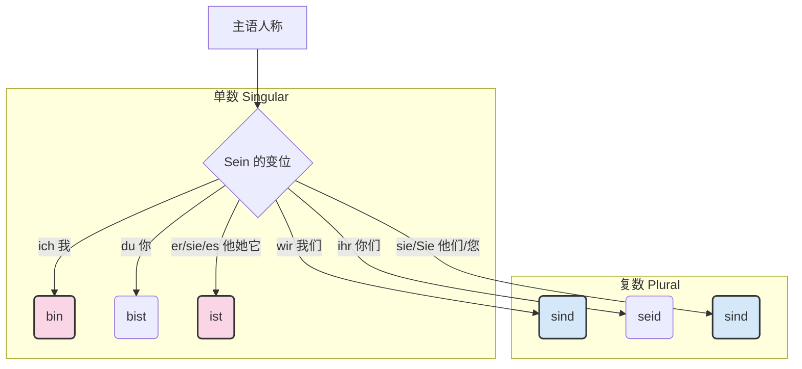

# A1 K4 动词sein和陈述句
以下为AI生成的图文笔记的内容
# 与英语类比

- 对于知识点的各种德语人称代词相当于英语的人称代词
- sein 的变化等于 Be 动词 am is are

### 1. 代词的对号入座：Ich, Du, Sie...

你可以把这些代词想象成舞台上的“角色标签”。

|**德语代词**|**对应英语**|**角色描述**|
|---|---|---|
|**ich**|I|我（永远的主角）|
|**du**|you (informal)|**你**（好哥们、家人、小孩子专用）|
|**Sie**|You (formal)|**您**（移民生存必备！对老板、邻居、陌生人，首字母大写）|
|**er / sie / es**|he / she / it|他 / 她 / 它|
|**wir**|we|我们|
|**ihr**|you guys|你们（du 的复数，对一群熟人说）|
|**sie**|they|他们|

> **⚠️ 大师提醒：** 德语里有三个 **"sie/Sie"**，这是很多初学者的“重灾区”。
> 
> 1. `sie` (她)
>     
> 2. `sie` (他们)
>     
> 3. `Sie` (您) —— 只要看到首字母大写的，无论在句中还是句首，那都是表示尊敬的“您”。

---

### 2. `sein` 的变化：动词的“变色龙”

你猜得完全正确！德语的 `sein` 对应英语的 `be` (am/is/are)。

但是，英语的 `be` 变来变去也就三个（am, is, are），而德语的 `sein` 像是个变色龙，根据主语的不同，它有**六种**基本形态：

$$\text{sein (to be) 的变位}$$

- **Ich bin** (I am) -> _Ich bin Mehmet._
- **Du bist** (You are) -> _Du bist mein Freund._
- **Er/Sie/Es ist** (He/She/It is) -> _Er ist Arzt._ (他是医生)
- **Wir sind** (We are) -> _Wir sind hier._ (我们在这里)
- **Ihr seid** (You guys are) -> _Ihr seid fleißig._ (你们很勤奋)
- **Sie/sie sind** (You/They are) -> _Sie sind Herr Schneider?_ (您是施耐德先生吗？)
# 人称代词与 Sein 变化
#### 动词sein的重点讲解 01:17

##### 1. 例题:动词sein的用法示例 01:26

- [[4198cde8ae755a03603f2f1c86188e5e_MD5.jpg|Open: image-183.png]]
![[4198cde8ae755a03603f2f1c86188e5e_MD5.jpg|826x414]]
- 基本功能：表示事物状态和特征属性，如"Ich bin Peter Bode"（我是彼得·博德）
- 翻译技巧：
    - 德语人名采用音译（如Peter→彼得）
    - 姓氏需注意约定俗成译法（如Bode→博德）
- 变形特点：根据人称代词不同而变化，例句中出现的bin/bist/ist都是sein的变形，表示事物状态以及特征属性
sein根据人称代词不同进行变形。

##### 人称代词与 sein 结合记忆

- [[a547a031f38b63acd862857291e3673a_MD5.jpg|Open: image-183.png]]
![[a547a031f38b63acd862857291e3673a_MD5.jpg|869x315]]
- 特殊形式：
    - Sie（尊称单复数）：表示"您/诸位"
    - du（第二人称单数）：表示"你"
- 第三人称单数：
    - er：阳性名词单数/男性"他"
    - sie：阴性名词单数/女性"她"
    - es：中性名词单数（定冠词为das）
- 记忆要点：名词词性必须与代词匹配记忆

## 人称代词复数
##### 4. 知识扩充 04:52

[[2693af6b03d19f6ce64c25a95251bd94_MD5.jpg|Open: image-183.png]]
![[2693af6b03d19f6ce64c25a95251bd94_MD5.jpg|800x435]]
- 复数人称：
    - wir（我们）
    - ihr（你们，小写）
    - sie（他们，小写）
- 大小写区别：
    - Ihr（大写）：物主代词"您的"
    - ihr（小写）：人称代词"你们的"
    - Sie（大写）：尊称"您/诸位"
    - sie（小写）："她/她们"

#### 二、动词sein的动词变化表 06:58 #ak

- ![[f5f8d53ad816e716f9361266e9cd99af_MD5.jpg]]
- 变位规律：
    - ich → bin
    - du → bist
    - er/sie/es → ist
    - wir/sie/Sie → sind
    - ihr → seid
- 记忆口诀："ich bin, du bist, er ist, wir sind, ihr seid, sie sind"
- 特殊规律：[[1fd5e7801097bd44480973c2a180934e_MD5.jpg|Open: image-183.png]]
![[1fd5e7801097bd44480973c2a180934e_MD5.jpg|800x396]]
    - 第三人称单数（er/sie/es）统一用ist
    - 复数人称（c）和尊称Sie都用sind

<!--ID: 1771319860501-->
#### 三、应用案例 08:45

##### 1. 例题:Vorname含义

- ![[f191179f8b66e4de5735fed9d4c8d6c6_MD5.jpg]]
- 德国姓名结构：
    - Vorname（名，如Peter）
    - Nachname（姓，如Bode）
- 文化差异：德语姓名顺序为"名+姓"，与中文相反
# 陈述句
#### 四、陈述句语序 09:02
[[2b8ebff119f86a3f3806a74839f04b00_MD5.jpg|Open: image-183.png]]
![[2b8ebff119f86a3f3806a74839f04b00_MD5.jpg|800x337]]

##### 1. 纯粹简单句 主+谓

- ![[f8bfb8f6c1bf6c2c4ad79454ea725293_MD5.jpg]]
- 结构特征：仅含主语+谓语（如"Er weint"他哭了）
- 动词位置：固定第二位（主语可前可后）

##### 2. 扩展简单句 11:45

- [[d48b4a1119a2b070420b0eab0f49eaad_MD5.jpg|Open: image-183.png]]
![[d48b4a1119a2b070420b0eab0f49eaad_MD5.jpg|775x488]]
- 典型结构：
    - "Ich heiße Peter Bode"（主语+谓语+补足语）
    - "Heute ist er zu Hause"（状语+谓语+主语+地点补足语）
- 成分顺序：动词永远第二位，其他成分可灵活调整

##### 3. 陈述句中动词的位置 12:41

- [[25fd741f2fe755f99d84129bb506cacf_MD5.jpg|Open: image-183.png]]
![[25fd741f2fe755f99d84129bb506cacf_MD5.jpg|869x463]]
- 核心规则：陈述句中动词==必须位于第二位==
    - 第一位可以是主语（Ich heiße...）
    - 第一位可以是状语（Heute ist...）
- 与英语区别：德语不遵循"主语+谓语"固定语序
- 判断技巧：先找出变位动词，确认其处于句子第二位

#### 五、结束 13:33

- ![[62b0433765203e58975ce10fc0cd8954_MD5.jpg]]
- 
[[812b7330dfda83a7d4924625fd9b8f46_MD5.m4a|Open: Recording 20260130131248.m4a]]
![[812b7330dfda83a7d4924625fd9b8f46_MD5.m4a]]

- 核心记忆点：
    - sein动词变位表（bin/bist/ist/sind/seid）
    - 陈述句动词二位原则
    - 人称代词的大小写区别意义
- 下节预告：规则动词变位和国籍表达

#### 六、知识小结

|             |                                                                                            |                                                 |      |
| ----------- | ------------------------------------------------------------------------------------------ | ----------------------------------------------- | ---- |
| 知识点         | 核心内容                                                                                       | 考试重点/易混淆点                                       | 难度系数 |
| 动词“sein”的变位 | 介绍动词“sein”在不同人称代词下的变位形式（ich bin, du bist, er/sie/es ist, wir sind, ihr seid, sie/Sie sind） | 区分大小写“sie/Sie”的变位与含义（小写“sie”=她/他们，大写“Sie”=您/诸位） | ⭐⭐⭐  |
| 德语人称代词      | 第一/二/三人称单复数形式及对应词性（er=阳性单数，sie=阴性单数，es=中性单数）                                               | “ihr”小写（你们）vs大写“Ihr”（您的）的用法差异                   | ⭐⭐   |
| 陈述句语序规则     | 动词始终位于句子第二位，主语可置于动词前或后（如“Heute ist er zu Hause”中时间副词首位）                                    | 与英语语序对比（英语主语优先，德语动词固定第二位）                       | ⭐⭐⭐⭐ |
| 名词词性指代      | 阳性/阴性/中性名词分别用er/sie/es指代，需记忆名词词性                                                           | 冠词与代词一致性（der→er, die→sie, das→es）               | ⭐⭐⭐⭐ |
| 练习与巩固       | 课堂练习：根据名字填代词（er/sie）、动词变位填空、翻译简单陈述句                                                        | 混淆点：中性名词“das Mädchen”用“es”指代（非“sie”）            | ⭐⭐   |
| 下节课预告       | 规则动词（弱变化动词）变位、国籍/籍贯表达（“Woher kommen Sie?”）                                                 | 关联知识：动词变位与疑问句语序的结合                              | ⭐⭐   |

[[f6e3c7932831ee34d9f7cb5945f6f1be_MD5.jpg|Open: image-183.png]]
![[f6e3c7932831ee34d9f7cb5945f6f1be_MD5.jpg|751x193]]

![[bcebd9d36fea3c625ac4e6ca690ac0d6_MD5.m4a]]

[[eb6fb6e2e391fe04c1483b6fbc2e450e_MD5.jpg|Open: image-183.png]]
![[eb6fb6e2e391fe04c1483b6fbc2e450e_MD5.jpg|462x214]]

你给出的句子是德语社交中的“开门红”，让我们把它们整理得更标准：

1. **Guten Tag, ich heiße Mehmet.**
    - _解析：_ `heißen` 是动词。`ich` 是老大，`heiße` 紧随其后当老二。
2. **Mein Name ist Sanchez.**
    - _解析：_ 这里 `Mein Name`（我的名字）被视为一个整体，占据第一个位置。动词 `ist` (sein) 依然是老二。
3. **Hallo, ich bin Olga.**
    - _解析：_ `Hallo` 是打招呼，不占句子成分。`ich` 是 1，`bin` 是 2。
4. **Wie bitte?**
    - _解析：_ 这是万能的“保命句”。当你没听清对方在说什么（这在移民初期会经常发生），用这一句准没错。

[[6f3e3f84faab2dfc4cbc05a338e96bea_MD5.jpg|Open: image-183.png]]
![[6f3e3f84faab2dfc4cbc05a338e96bea_MD5.jpg|787x439]]

