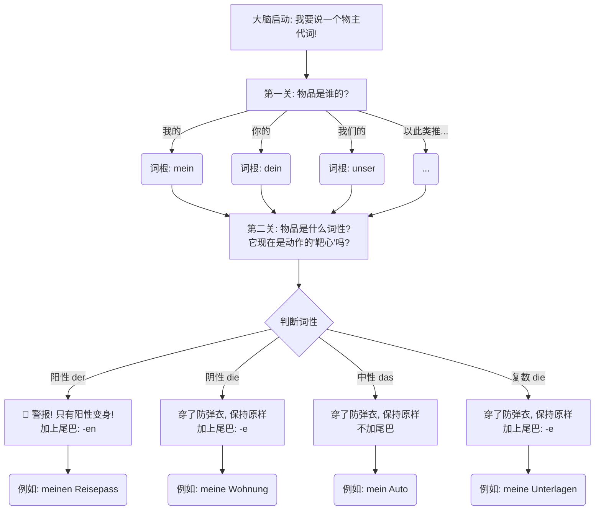
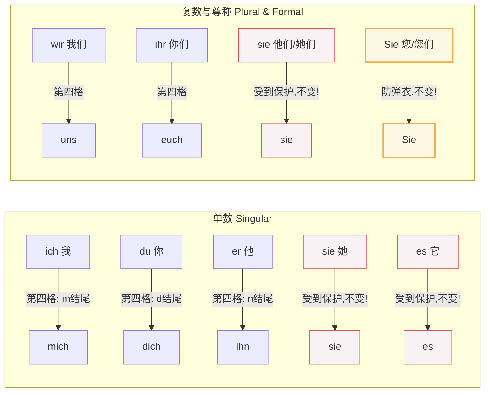
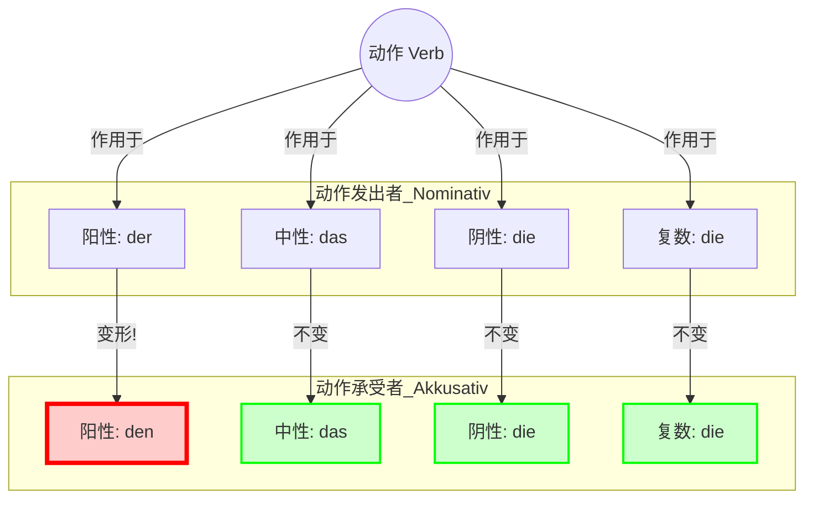
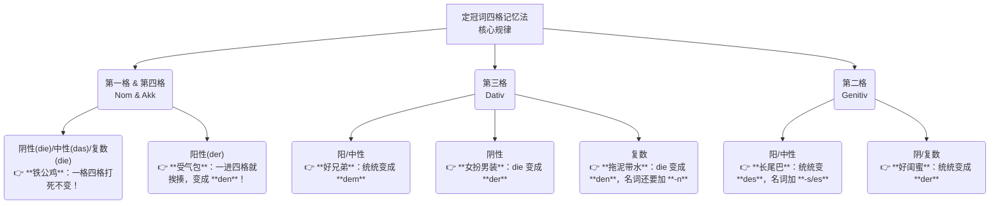
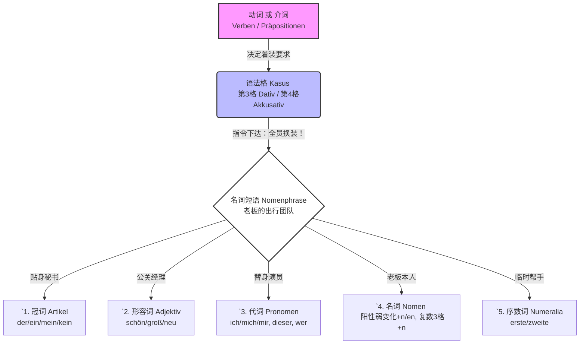

A 1-40-K 4-7 第四格补足语及定冠词的变化

## 语法规则的由来和意义

- 标准版： Der Mann beißt den Hund. (男人咬狗)
- 强调版： Den Hund beißt der Mann. (直译：狗被咬了，是那个男人干的！)
- 意义何在？
	- 这给了德国人极大的表达自由。如果德国人想强调“被咬的是狗（不是猫）”，他就会把 Den Hund 扔到句首。听者一听到 Den，立刻知道：“哦，这是个受气包，虽然它在前面，但它不是凶手。”
- 类比：
	- 中文/英文像坐排排坐的公交车：司机必须在最前面，乘客必须在后面。
	- 德语像足球场：球员穿不同颜色的球衣（格）。不管守门员跑到前场还是后场，只要他穿着守门员的衣服（格），大家就知道他是守门员。

![[Pasted image 20260218235318.png]]

![[Pasted image 20260218235415.png]]

### 结构

![[Pasted image 20260218235522.png]]

## 定冠词的变化

只有阳性变

![[Pasted image 20260218235601.png]]

![[Pasted image 20260301202848.png|1072]]

- 记忆： #ak ^009vkj
	- 二格二变化 esr：阳中 des，阴复 der
	- 三格三变化：阳中 dem，阴复 der den
	- 四格变一个：阳性最幸运，唯一一个变成den；其他死活都不变。den, das, die, die
- 总结：简单，一共只有 5 个变化。
<!--ID: 1773560527472-->

#### 举例

![[Pasted image 20260219004411.png]]

![[Pasted image 20260219005248.png]]

## 不定冠词的第四格变化

![[Pasted image 20260219141030.png]]

![[Pasted image 20260219142818.png]]

- 变化规律
	1. 中性名词、阴性名词前的不定冠词没有任何变化。
	2. 阳性名词做第四格时，它前面的不定冠词加词尾 en，显示词性一阳性名词做第四格宾语补足语，修饰它的（不）定冠词词尾都是 en
	3. 复数没有冠词，表示泛指，笼统地指代说明。
![[Pasted image 20260219152005.png]]

### 举例

![[Pasted image 20260219142345.png]]

![[Pasted image 20260219152251.png]]

![[Pasted image 20260219163007.png]]

![[Pasted image 20260219163213.png]]

## 名词做第四格：物主代词与第四格变化

![[Pasted image 20260219164045.png]]

![[Pasted image 20260219164138.png]]

阳性名词做第 4 格宾语补足语，物主代词的词尾与不定冠词、定冠词的词尾一样，都是 en，变化与不定冠词的词尾一样。

![[Pasted image 20260219163636.png]]

物主代词第四格·小结

1. 名词作动词的第四格宾语补足语时，与修饰它的不定冠词、定冠词变化一样，阳性名词的不定冠词、定冠词词尾都是 en，物主代词也是 en。
2. 名词复数做第四格宾语补足语，它前面的物主代词词尾变化与阴性名词前物主代词词尾变化一样

#### 举例

![[Pasted image 20260219164830.png]]

![[Pasted image 20260219171740.png]]

![[Pasted image 20260219172007.png]]

## 人称代词做第四格宾语补足语

![[Pasted image 20260219190623.png]]

![[Pasted image 20260219172215.png]]

![[Pasted image 20260219190556.png]]

#### 举例

![[Pasted image 20260219185742.png]]

![[Pasted image 20260219191039.png]]

![[Pasted image 20260219194832.png]]

# Gemini 第四格

这一关不过，后面的路（B1/B2的从句、形容词词尾变化）全是坑。所以，请深吸一口气，我们把这个“硬骨头”嚼碎了吃下去。

---

### 第一部分：什么是“第四格”（Akkusativ）？——以此类推“受气包”

- 在中文和英文中，“我打他”和“他打我”，虽然意思反了，但“他”和“我”并没有发生词形上的剧烈变异（除了英语的I/me, he/him）。但在德语里，**位置决定不了命运，格（Kasus）才能决定身份**。

#### 1. 核心概念：动作的承受者

想象一个射箭的场景：

- **第一格（Nominativ）**：是**射箭的人**（主语，动作发出者）。他站得笔直，毫发无损。
- **第四格（Akkusativ）**：是**靶子**（宾语，动作承受者）。由于被箭射中了，它可能会“流血”，也就是发生**变形**。

在德语语法中，当一个名词作为动词的直接对象出现时，它就必须处于第四格。

> **大师口诀：**
> 谁发出动作？第一格（N）。
> 谁被动作折腾？第四格（A）。

---

### 第二部分：定冠词的变化——只有“男人”受伤的世界

德语最有趣（也最折磨人）的地方来了。虽然靶子被射中了，但并不是所有的靶子都会“变形”。

在第四格中，德语表现出了对**阳性（Der）**的“特殊关照”。

- **阳性（Der）**：也就是男人。在第四格中，`der` 变成了 `den`。你可以想象这个男人被射了一箭，痛苦地弯下了腰（多了个 `n`）。
- **中性（Das）、阴性（Die）、复数（Die）**：这三类在从第一格变成第四格时，**完全不变**！它们穿着防弹衣，毫发无损。

#### 变化规则图解

为了让你一目了然，我为你绘制了这张逻辑图：

> **重点记忆：**
> 
> 全世界只有 **阳性单数** 在第四格会变！
> **Der $\rightarrow$ Den**
> 其他所有定冠词（das, die, die）在第四格中长得和第一格一模一样。

---

### 第三部分：移民场景实战——不想租错房、找错工，就得用对格

我们用你未来六个月内一定会遇到的场景来造句，感受这种变化。

#### 场景 1：租房 (Wohnungssuche)

假设你要签合同。

- 词汇：_der Mietvertrag_ (租赁合同 - 阳性)

**第一格（作为主语）：**

- _Der Mietvertrag ist hier._ (租赁合同在这里。) —— 合同自己存在，没人动它，用 **Der**。
**第四格（作为动作承受者）：**
- _Ich unterschreibe **den** Mietvertrag._ (我签署租赁合同。)
    - 动作：unterschreiben (签署)
    - 谁签？Ich (我 - N)
    - 签什么？合同 (合同被签 - A)
    - **结果：Der $\rightarrow$ Den**

#### 场景 2：找工作 (Arbeitssuche)

假设你要给老板打电话。

- 词汇：_der Chef_ (老板 - 阳性)

**第四格：**

- _Ich rufe **den** Chef an._ (我给老板打电话。)
    - 老板是被你电话“骚扰”的对象，所以他是第四格。**Der $\rightarrow$ Den**。

#### 场景 3：行政手续 (Behördengänge)

你需要填写一张表格。

- 词汇：_das Formular_ (表格 - 中性)

**第四格：**

- _Ich brauche **das** Formular._ (我需要这张表格。)
    - 注意：因为是中性（das），所以即使它是宾语，**它也不变！** 依然是 **das**。

#### 场景 4：看病 (Beim Arzt)

医生给你开药。

- 词汇：_die Medizin_ (药 - 阴性)

**第四格：**

- _Ich nehme **die** Medizin._ (我吃/拿这个药。)
    - 注意：阴性（die），**也不变！**

---

### 第四部分：进阶延伸——不定冠词与否定词的“连锁反应”

既然你知道了 `der` 变成了 `den`，那么所有跟阳性名词挂钩的词，都要跟着变。这就叫**语法的一致性**。

如果 `der` $\rightarrow$ `den` (结尾是 -en)，那么：

1. **不定冠词 (一个)**：
    - ein $\rightarrow$ ein**en** (仅限阳性)
    - _Ich habe **einen** Job._ (我有一份工作。Job是阳性)
2. **否定词 (没有)**：
    - kein $\rightarrow$ kein**en** (仅限阳性)
    - _Ich habe **keinen** Stress._ (我没有压力。Stress是阳性)
3. **物主代词 (我的)**：
    - mein $\rightarrow$ mein**en** (仅限阳性)
    - _Ich suche **meinen** Pass._ (我在找我的护照。Pass是阳性)

**对比总结表：**

|**性别**|**名词 (例子)**|**第一格 (Nominativ)**|**第四格 (Akkusativ)**|**变化特征**|
|---|---|---|---|---|
|**阳性**|Der Tisch (桌子)|**Der** / Ein / Kein|**Den** / Ein**en** / Kein**en**|**变身 (-en)**|
|**中性**|Das Kind (孩子)|**Das** / Ein / Kein|**Das** / Ein / Kein|不变|
|**阴性**|Die Frau (女人)|**Die** / Eine / Keine|**Die** / Eine / Keine|不变|
|**复数**|Die Leute (人们)|**Die** / - / Keine|**Die** / - / Keine|不变|

---

### 第五部分：不仅是动词——介词也会“强制”第四格

除了动词（如 kaufen, suchen, haben, essen）后面跟第四格，德语中还有一组霸道的介词。**无论前面是什么动词**，只要看到这些介词，后面的名词**必须**死死地锁在第四格。

为了B2考试和生活，请背下这个口诀：**FUDOG**。

- **F**ür (为了)
- **U**m (围绕/在...点)
- **D**urch (穿过)
- **O**hne (没有)
- **G**egen (反对/对着)

**移民生活例句：**

1. _Das Geschenk ist **für den** Vater._ (这礼物是给父亲的。)
    - 父亲（Vater）是阳性。因为有 `für`，所以必须用 `den`。
2. _Ich gehe nicht **ohne den** Termin zum Amt._ (没有预约我就不去移民局。)
    - 预约（Termin）是阳性。因为有 `ohne`，必须用 `den`。

---

### 第六部分：你的半年学习规划坐标

这个知识点处于你学习曲线的哪个位置？

- **当前阶段（第1个月）**：必须熟练掌握。这是生存德语的基础。如果你分不清 `der` 和 `den`，你就无法正确表达“我想要...”或“我看见...”。
- **未来影响（第3-4个月 - B1/B2）**：
    - 当你学习**形容词词尾变化**时，你需要先判断出这是第四格，才能加正确的词尾（如：_Ich möchte den **heißen** Kaffee_）。
    - 当你学习**被动语态**时，原来的第四格宾语会变成第一格主语。如果现在搞不清，到时候逻辑会崩盘。

---

### 第七部分：大师的随堂测试

为了确保你真的懂了，而不是“觉得懂了”，请完成以下练习。

**请将以下中文翻译成德语，注意定冠词或不定冠词的变化：**

1. **场景：超市** —— “我需要这辆购物车。” (_der Einkaufswagen_)
2. **场景：看房** —— “这套公寓有一个阳台。” (_der Balkon_)
3. **场景：问路** —— “我在找火车站。” (_der Bahnhof_)
4. **陷阱题** —— “这个孩子在吃一个苹果。” (_das Kind_, _der Apfel_)

请写下你的答案，我会像你的私人教练一样，为你纠正每一个细节，并解释为什么。

# 记忆技巧

Hallo！很高兴再次见到你。欢迎回到德语大师的频道！

你问到了所有德语学习者心中的“终极BOSS”——**定冠词的四格变化（Deklination der bestimmten Artikel）**。很多同学在背这张表的时候痛苦不堪，觉得像天书。

但大师要告诉你一个秘密：**绝对不要死记硬背那张 4x4 的表格！** 德国人在造句时，大脑里并没有一张表，而是有一套**“模式识别”**。要在6个月内拿下B2，我们必须用更聪明、更省力的方法。

今天，大师就教你用**“角色扮演法”**和**“找茬法”**，把这16个变化牢牢刻在你的DNA里！

---

### 核心秘籍：把四个词性当成四个“性格鲜明的人”

在德语里，冠词的作用就像是名词的**“职业制服”**。第一格是日常便服（主语），第四格是工作服（直接宾语），第三格是晚礼服（间接宾语），第二格是VIP披风（所属关系）。

我们先来看一张大师为你总结的“冠词性格规律图谱”：

代码段

看不懂图没关系，大师给你配上了生动形象的**三大记忆口诀**：

#### 记忆诀窍一：“受气包”与“铁公鸡”（专攻第一格和第四格）

在日常交流（尤其是A1-B1阶段），你用到最多的就是一格（主语）和四格（直接宾语，比如“我买……”、“我看……”）。

- **口诀：阳性最苦逼，出门就挨揍（变 den）；其他全铁公，死活都不变。**
- **解析：** * 阳性 `der` 一到第四格，立马委屈地变成了 `den`。
    - 中性 `das`、阴性 `die`、复数 `die` 在第一格和第四格**一模一样**！
- **移民生活场景（超市购物）：**
    - 阳性 (der Apfel)：Ich kaufe **den** Apfel. (我买这个苹果。der 变 den)
    - 中性 (das Wasser)：Ich kaufe **das** Wasser. (我买这瓶水。das 还是 das)
    - 阴性 (die Milch)：Ich kaufe **die** Milch. (我买这盒牛奶。die 还是 die)

#### 记忆诀窍二：第三格的“M-M-R-N”阵型（专攻Dativ）

第三格（间接宾语，或者搭配在 mit, aus, nach 等介词后面）是整个表格变化最大的地方，谁都逃不掉。记住这个阵型：**M-M-R-N**。

- **阳性和中性是好兄弟**：它俩在第三格手牵手，全部变成以 **-m** 结尾的 **dem**。
- **阴性喜欢“女扮男装”**：`die` 穿上了阳性第一格的外套，变成了以 **-r** 结尾的 **der**。（注意，这里的 der 是第三格，意思是“给这位女士”，千万别当成阳性主语！）
- **复数最麻烦，拖泥带水**：复数 `die` 变成了以 **-n** 结尾的 **den**，这还没完，**名词的屁股后面还要强行加个 -n**。
- **移民生活场景（找医生看病）：**
    - 阳性 (der Arzt)：Ich spreche mit **dem** Arzt. (我和医生谈话。)
    - 中性 (das Kind)：Ich spiele mit **dem** Kind. (我和孩子玩耍。)
    - 阴性 (die Ärztin)：Ich spreche mit **der** Ärztin. (我和女医生谈话。die 变 der)
    - 复数 (die Kollegen)：Ich spreche mit **den** Kollege**n**. (我和同事们谈话。冠词变 den，名词词尾加 n)

#### 记忆诀窍三：第二格的“对称美”（专攻Genitiv）

这个我们上次刚学过，复习一下！

- 阳/中性：**des + 名词加 -s** (das Auto des Mannes)
- 阴/复数：**der** (die Tasche der Frau / das Zimmer der Kinder)

---

### 半年B2冲刺：四格变化的训练规划

如果你想在6个月内达到B2，千万不要每天拿着表格干瞪眼，要把它**揉碎在动词和介词里**去记。

- **第1-2周：只练阳性！** 因为只有阳性最折腾（der - den - dem - des）。找20个常用的阳性名词（如 der Tisch, der Computer, der Vertrag 等），用同一个句子模板来回套用。
- **第3-4周：绑定介词背诵。** 德国人说话快，根本没时间想格。你必须把“介词+冠词”当成一个整体（Chunking）来记。
    - 比如：看到 `mit`，脑子里立刻反射出 `mit dem` (阳/中) 或 `mit der` (阴性)。
    - 看到 `für`，立刻反射出 `für den` (阳) 或 `für das/die` (中/阴)。

---

### 轮到你实战了！（Hausaufgabe）

检验口诀的时候到了！我们要去德国的**外管局（Ausländerbehörde）办理延签手续。在这个场景里，你需要跟工作人员说一句话，这句话里同时包含了第一、第四、第三格**！

请用大师教你的口诀，把下面这句话填空补充完整（注意判断词性和它们在句子中的角色）：

**背景词汇：**

- 护照 (阳性：**der** Pass)
- 表格 (中性：**das** Formular)
- 女职员 (阴性：**die** Beamtin)

**你要说的德语：**

“**护照**（主语/第一格）在这里。我把**表格**（直接宾语/第四格）交给这位**女职员**（间接宾语/第三格）。”

👉 _____ Pass ist hier. Ich gebe _____ Beamtin _____ Formular.

你能帮我把这三个空格里的冠词填上吗？试着用上面的规律推导一下，写出答案发给我，我们一起来验证你的学习成果！

# 格变化会带动哪些词一起变化，比如带动代词形容词冠词，还有什么词

现在，我们结合你在德国生活的实际场景（找工作、租房、看病等），来详细盘点一下这支队伍里**到底有哪些词会跟着发生3、4格的变化**：

### 1. 冠词 (Artikel) —— 首当其冲的“贴身秘书”

冠词永远站在名词的最前面，它是最先发生变化的。无论是定冠词（der/die/das）、不定冠词（ein/eine）、否定冠词（kein），还是物主冠词（mein/dein/sein 等），统统都要变。

- **【租房场景 - 4格】** Ich suche **einen** ruhig**en** Balkon. (我在找**一个**安静的阳台。) -> _suche 支配4格，ein 变成 einen。_
- **【行政场景 - 3格】** Ich spreche mit **meinem** neu**en** Vermieter. (我在和**我的**新房东交谈。) -> _mit 支配3格，mein 变成 meinem。_

### 2. 代词 (Pronomen) —— 全权代理的“替身演员”

当老板（名词）不想出场时，代词就会作为替身顶上。既然是替身，当然要穿上一模一样的3格/4格制服。这不仅包括人称代词（ich/du/er），还包括指示代词（dieser/jener）、疑问代词（wer）。

- **人称代词【医疗场景】** Der Arzt hilft **mir**. (医生帮**我**。) -> _helfen 支配3格，ich 变成 mir。_
- **指示代词【购物场景】** Ich kaufe **diesen** Laptop. (我买**这个**笔记本电脑。) -> _kaufen 支配4格，dieser 变成 diesen。_
- **疑问代词【找工作场景】** **Wen** rufen Sie an? (您在给**谁**打电话？) -> _anrufen 支配4格，wer（谁）变成 wen。_

### 3. 形容词 (Adjektiv) —— 察言观色的“公关经理”

形容词夹在冠词和名词之间。它的变化规则（形容词词尾变化）最考验人，因为它是个“见风使舵”的角色：如果前面的冠词把特征（如 -m, -n, -r, -s）表现得很明显了，形容词就偷懒只加个 **-en** 或 **-e**；如果前面没冠词，形容词就得亲自上阵，穿上体现3、4格特征的制服。

- **【医疗场景 - 3格，有定冠词】** Ich gehe zu**m** (zu dem) hiesig**en** Krankenhaus. (我去**当地的**医院。) -> _zu 支配3格，das 变成 dem，形容词加 -en。_
- **【生活场景 - 4格，无冠词】** Wir trinken kalt**es** Wasser. (我们喝**冷的**水。) -> _Wasser 是4格中性，前面无冠词，形容词代替冠词加上 -es。_

### 4. 名词本身 (Nomen) —— 偶尔也要亲自换装的“老板”

这是最容易被忽略的一点！很多人以为名词本身绝对不变，但在两种特殊情况下，名词（老板）也得亲自加件衣服：

- **阳性弱变化名词 (n-Deklination)：** 一些特殊的阳性名词（通常表示人或动物，如 der Student, der Patient, der Kollege, der Herr），只要不是第1格，统统要在词尾加上 **-n** 或 **-en**。
    - **【医疗场景 - 3/4格齐飞】** Der Arzt untersucht **den** Patient**en** (4格) und gibt **dem** Patient**en** (3格) ein Rezept. (医生给这位**病人**做检查，并给这位**病人**开处方。)
- **复数第3格 (Dativ Plural)：** 所有的复数名词，如果在第3格，且词尾不是 -n 或 -s，必须强制加个 **-n**。
    - **【日常场景 - 3格】** Ich spiele mit den Kinder**n**. (我和**孩子们**玩。) -> _Kinder 本身是复数，遇上 mit 变成3格，必须加 -n。_

### 5. 序数词 (Numeralia) —— 充当形容词的“临时工”

当数字表示“第几个”时（如 erste, zweite），它们的词尾变化和形容词一模一样。

- **【行政事务 - 3格】** Wir haben am (an dem) erst**en** Mai einen Termin. (我们在五月**第一天**有个预约。) -> _an + Dativ，erste 变成 ersten。_

---

### 💡 德语大师的六个月B2通关建议：

在这六个月里，你的学习必须是呈螺旋上升的。今天讲的“词组牵连变化”是你突破B1/B2的**绝对基石**。到了B2，你会遇到“带介词的从句”、“被动语态中的3/4格保留”等高级概念，如果连“老板带着随从换装”都反应不过来，高级语法就会像空中楼阁。

**为了检验你今天的吸收成果，我想给你布置一个小小的挑战任务：**

请想象你正在租房，你想对房东说：_“我（Ich）非常喜欢（mögen）这间明亮的（hell）公寓（die Wohnung），我会给（geben）那位友好的（freundlich）邻居（der Nachbar - 注意他是阳性弱变化名词哦！）我的（mein）电话号码（die Telefonnummer）。”_

你能试着把这句复杂的日常表达，根据3格和4格的规则写成德语吗？大胆写，我在你的身后为你纠错！
