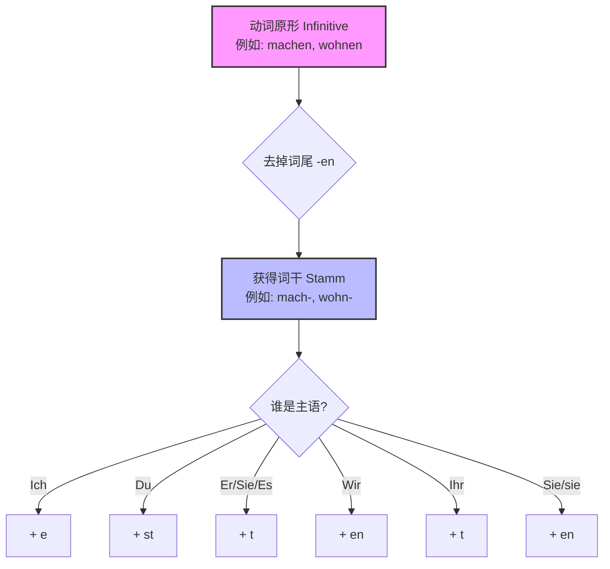

以下为AI生成的图文笔记的内容

#### 一、重点回顾00:12

##### 1. 动词sein的变位00:19

- ![[1aedc1e7ab7c77f5b092a18393de9cbb_MD5.jpg]]
- 变位形式:
    - ich → bin
    - du → bist
    - er/sie/es → ist
    - wir → sind
    - ihr → seid
    - sie/Sie → sind
- 记忆技巧：通过例句"我是学生(Ich bin Student)"等实际应用帮助记忆变位形式。

##### 2. 陈述句中动词总位于第二位01:04

- 核心规则：在德语陈述句中，动词必须位于句子第二位。
- 应用示例：
    - 我是学生 → Ich bin Student.
    - 他是单身 → Er ist ledig.
    - 我们是老师 → Wir sind Lehrer.
- 例外情况：问句中动词位置会发生变化，如"您是李先生吗？(Sind Sie Herr Li?)"

# 规则动词变化规律

Hallo！我是你的“德语大师”。欢迎来到我们在通往B2之路上的第一站。要在6个月内拿下B2，我们没有时间浪费在死记硬背上，我们需要的是**“逻辑”**和**“语感”**。

今天我们攻克最基础、但也最容易在口语中“嘴瓢”的部分：**动词的现在时变位 (Konjugation Präsens)**。

---

### 🎭 核心概念：动词的“换装游戏”

想象一下，德语动词的原形（比如 _wohnen_ - 居住）就像一个**穿着标准制服的员工**。

- **词干 (Stamm):** 身体部分 (_wohn-_).
- **词尾 (Endung):** 制服部分 (_-en_).

当这个动词进入句子，它必须根据“谁在做这件事”（主语）来换上不同的“帽子”和“鞋子”。如果你不给它变位，就像是一个人穿着睡衣去面试，非常失礼且令人困惑。

### 📊 第一步：标准变位（规则动词） #ak

这是90%的动词都遵循的规则。我们可以用一句顺口溜来记忆词尾：
- singule estt
	- 我 e
	- 你 st
	- 他 t
- plurlform enten
	- 我们 en
	- 你们 t
	- 他们 en

**“我爱 (e) 你，** **你死 (st) 缠，** **他踢 (t) 开；**我们恩 (en) 爱，** **你们推 (t) 脫，** 他们恩 (en) 准。**”** ^zqlll8
![[德语语法 活学活用 A1-B1.pdf#page=18&rect=96,421,396,554|📖]]
<!--ID: 1771319860497-->
#### 逻辑图
让我们看一张逻辑图，理清变位的过程：

代码段

#### 举例

动词：**suchen** (寻找) -> 词干：**such-**

| **人称**                | **词尾**  | **德语例句**                              | **中文含义**    |
| --------------------- | ------- | ------------------------------------- | ----------- |
| **Ich** (我)           | **-e**  | Ich **suche** eine Wohnung.           | 我在找一套公寓。    |
| **Du** (你)            | **-st** | **Suchst** du auch ein Zimmer?        | 你也在找房间吗？    |
| **Er/Sie/Es** (他/她/它) | **-t**  | Der Makler **sucht** einen Mieter.    | 房产中介在找一位租客。 |
| **Wir** (我们)          | **-en** | Wir **suchen** zusammen.              | 我们一起找。      |
| **Ihr** (你们)          | **-t**  | **Sucht** ihr in Berlin?              | 你们在柏林找吗？    |
| **Sie/sie** (您/他们)    | **-en** | **Suchen** Sie eine 3-Zimmer-Wohnung? | 您在找一套三居室吗？  |

---

### ⚠️ 第二步：强变化动词（“叛逆”的变音）

这是B1-B2考试中的**高频扣分点**。

有些动词非常“强壮”且“叛逆”（Strong Verbs）。当它们遇到单数第二人称 (**Du**) 和单数第三人称 (**Er/Sie/Es**) 这种“压力”时，它们不仅换词尾，连身体里的骨头（元音）都要变！

**口诀：只有“你”和“他”，元音发生变化。**

#### 1. 变音 a -> ä

场景：交通出行 (Verkehr)

动词：**fahren** (开车/乘坐交通工具)

- Ich fahre. (正常)
- **Du fährst.** (变音！) -> _Wann fährst du zur Ausländerbehörde?_ (你什么时候去外管局？)
- **Er fährt.** (变音！) -> _Der Bus fährt sofort ab._ (公交车马上发车。)
- Wir fahren. (正常)

#### 2. 换音 e -> i / ie

场景：日常沟通 (Kommunikation)

动词：**sprechen** (说话) / **lesen** (阅读)

- Ich spreche. (正常)
- **Du sprichst.** (换音！) -> _Sprichst du Deutsch?_ (你说德语吗？)
- **Er spricht.** (换音！) -> _Der Arzt spricht schnell._ (医生语速很快。)

---

### 🛡️ 第三步：“缓冲垫”规则（词干以 -t, -d 结尾）

如果动词的词干本身就是以 **-t** 或 **-d** 结尾（比如 _arbeiten_ 工作, _finden_ 觉得/找到），直接加 _-st_ 或 _-t_ 会导致发音极其困难（试着读一下 _arbeitst_... 舌头会打结的）。

这时候，我们需要加一个字母 **-e-** 作为缓冲垫。

场景：工作 (Arbeit)

动词：**arbeiten**

- Ich arbeite.
- Du arbeit**e**st. (加了软垫 e)
- Er arbeit**e**t. (加了软垫 e) -> _Er arbeitet bei Siemens._
- Ihr arbeit**e**t. (加了软垫 e)

---

### 🚀 你的任务 (Hausaufgabe)

为了确保你掌握了今天的“换装游戏”，请运用以下场景造句。不要害怕犯错，错误是学习的最佳捷径！

**请用动词 "bezahlen" (支付) 完成以下句子：**

1. (Ich) _______ die Miete. (我付房租。)
2. (Du - 问句) _______ du bar oder mit Karte? (你付现金还是刷卡？)

**请用不规则动词 "helfen" (e->i, 帮忙) 完成句子：**

3. (Er) Der Beamte _______ mir. (那位公务员帮了我。)

期待你的答案！如果你准备好了，我们就进入下一步。

# 1

#### 二、规则动词的现在时变位01:22
![[德语语法 活学活用 A1-B1.pdf#page=20&rect=194,426,483,644|📖]]

##### 1. 规则动词的弱变化动词01:30

- ![[2e4a4118295a9b22e6bc86c6391e545f_MD5.jpg]][[d2630bfd980fcdc632541a65ddad4ea3_MD5.jpg|Open: image-183.png]]
![[d2630bfd980fcdc632541a65ddad4ea3_MD5.jpg|770x363]]
- 基本概念：规则动词又称弱变化动词，变位时词干不变，仅词尾变化。
- 典型结构：词干+人称词尾，如lernen → lern+en

##### 轨辙二 +e

###### 1）词干加上对应的人称词尾04:13

[[664d53d93bfa54ed7df6864ca4e69ce0_MD5.jpg|Open: image-183.png]]

![[664d53d93bfa54ed7df6864ca4e69ce0_MD5.jpg|800x406]]

- 基本规则：保持词干不变，添加人称词尾：
    - ich → -e
    - du → -st
    - er/sie/es → -t
    - wir → -en
    - ihr → -t
    - sie/Sie → -en
- 示例：
    - lernen → ich lerne, du lernst, er lernt
    - buchstabieren → ich buchstabiere, du buchstabierst

###### 2）动词词干以t等结尾04:41

- [[f302be24b7747aea2861eb1afcd239c0_MD5.jpg|Open: image-183.png]]
![[f302be24b7747aea2861eb1afcd239c0_MD5.jpg|800x452]]
- 特殊规则：词干以t,d,chn,ffn等结尾时，du, 三 e，ihr需在词干后加-e再变位
- 示例：
    - arbeiten → ich arbeite, du arbeitest
    - bilden → ich bilde, du bildest
    - zeichnen → ich zeichne, du zeichnest
    - öffnen → ich öffne, du öffnest
    - trocknen → ich trockne, du trocknest

###### 3）动词词干以s等结尾09:02

- [[7d0cd51f91b41c28c8cd26e99d7c67ab_MD5.jpg|Open: image-183.png]]
![[7d0cd51f91b41c28c8cd26e99d7c67ab_MD5.jpg|800x447]]
- 特殊规则：词干以s,ß,z,tz结尾时，du形式只加-t
- 示例：
    - begrüßen → du begrüßt (非begrüßst)
    - heißen → du heißt (非heißst)

###### eln 结尾

[[22fecbdf378400335573c63b601cdcbc_MD5.jpg|Open: image-183.png]]
![[22fecbdf378400335573c63b601cdcbc_MD5.jpg|800x432]]
- wir, sie, Sie, 词尾是 n
- [[b087e6f6b5fa9cb73a5d7ed493368b1c_MD5.jpg|Open: image-183.png]]
![[b087e6f6b5fa9cb73a5d7ed493368b1c_MD5.jpg|800x373]]
- 特殊规则：以-eln结尾动词，wir/sie/Sie形式词尾为-n
- 示例：
    - entwickeln → wir entwickeln (非entwickelen)
    - 第一人称单数两种写法：ich entwickle或ich entwickele

##### 3. 如何询问您是哪里人13:26

- [[4b47aee8293c1fef742eade28883ed7e_MD5.jpg|Open: image-183.png]]
![[4b47aee8293c1fef742eade28883ed7e_MD5.jpg|869x482]]
- 

[[3a8b38720cf354439507d09c03b051ac_MD5.m4a|Open: Recording 20260130162054.m4a]]

![[3a8b38720cf354439507d09c03b051ac_MD5.m4a]]

- 正式表达：Woher kommen Sie?
- 口语表达：Wo kommst du her?
- 动词变位：
    - ich komme
    - du kommst
    - er/sie/es kommt
    - wir kommen
    - ihr kommt
    - sie/Sie kommen
[[e3a99ca3c701542f35c7efed3bae8ffa_MD5.jpg|Open: image-183.png]]
![[e3a99ca3c701542f35c7efed3bae8ffa_MD5.jpg|499x432]]

##### 4. 如何回答我是哪里人15:11

- [[6975501e627d7dad66ba70182b9b2508_MD5.jpg|Open: image-183.png]]
![[6975501e627d7dad66ba70182b9b2508_MD5.jpg|869x380]]
- 基本结构：
    - kommen + aus + 国家
    - sein + aus + 国家
- 示例：
    - Ich komme aus China.
    - Ich bin aus China.
    - Er kommt aus Deutschland.
    - Sie ist aus Österreich.

#### 三、介绍16:36

- [[6540ecf66bcfbc64d0686588fbe20a4d_MD5.jpg|Open: image-183.png]]
![[6540ecf66bcfbc64d0686588fbe20a4d_MD5.jpg|579x367]]
- 模板示例：
    - Guten Tag, ich heiße Peter Bauer.
    - Ich komme aus Deutschland.
    - Ich bin Lehrer.
- 练习建议：结合所学动词变位和国籍表达进行完整自我介绍练习。

#### 四、知识小结

|          |                                                             |                                                      |      |
| -------- | ----------------------------------------------------------- | ---------------------------------------------------- | ---- |
| 知识点      | 核心内容                                                        | 考试重点/易混淆点                                            | 难度系数 |
| 动词变位规则   | 弱变化动词现在时变位规则：词干+人称词尾（如 lennon → e lenne）                    | 词干以特定辅音结尾时需加元音（如 t, d, n 结尾加 e）                      | ⭐⭐⭐  |
| 特殊动词变位   | 词干以 s/ss/ß 或 kt 结尾时，单数第二人称 du 仅加 -t（如 heißt 而非 heißst）      | du 人称变位例外规则（对比常规 -st 词尾）                             | ⭐⭐⭐⭐ |
| 复数词尾差异   | 动词词尾为 -en 时，复数人称（wir/ihr/sie/Sie）仅保留 -n（如 wir antworten）    | 新正字法允许保留 -en（如 antworte 或 antworten 均可）              | ⭐⭐   |
| 国籍/来源表达  | 两种句型： 1. Ich komme aus [国家]; 2. Ich bin aus [国家]（sein 动词变位） | 介词 aus 固定搭配（易误用 von）; sein 变位需与主语一致（ich bin, er ist） | ⭐⭐   |
| 高频动词变位练习 | kommen（来）、arbeiten（工作）、zeichnen（画）的变位示范                     | 发音连读技巧（如 du arbeitest → du arbeit’st）                | ⭐⭐⭐  |
| 疑问句结构    | 补充疑问句（下节课内容）预告：Woher kommst du?（你从哪来？）                      | 疑问词 woher 与陈述句语序差异                                   | ⭐⭐   |

## 换音动词变位

![[德语语法 活学活用 A1-B1.pdf#page=22&rect=34,349,463,641|📖]]