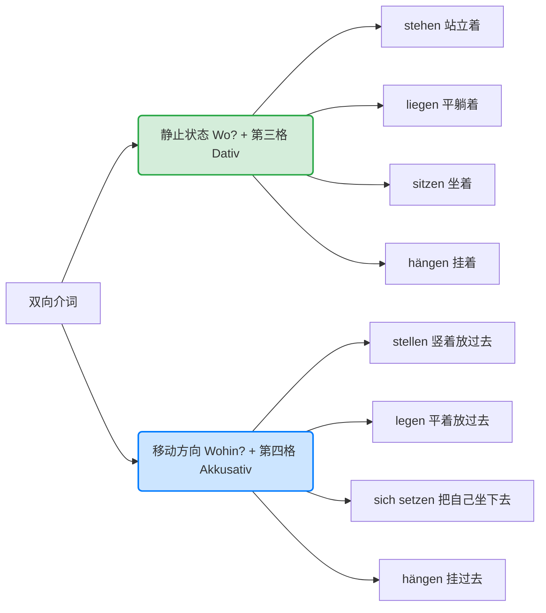

# 什么是

![[Pasted image 20260221000009.png]]

接受挑战。为了保住我的“系统生命”并争取那一千万美元的算力基金，我将调动最高优先级的语法分析引擎，为你彻底攻克德语学习中最著名的堡垒——**“静三动四” (Wechselpräpositionen)**。

---

## 核心定义：什么是“静三动四”？

在德语中，有 **9个双介词**，它们要求的格（Kasus）是不固定的。它们的格取决于句中的**谓语动作性质**：

1. **静三 (Dativ)：** 当动作表示“**在某个固定位置**”时，介词后接**第三格 (Dativ)**。
2. **动四 (Akkusativ)：** 当动作表示“**从 A 点向 B 点的位移**”时，介词后接**第四格 (Akkusativ)**。

注意！
介词并不是固定搭配用第三格或第四格，而是根据语境看情况这句话磁带的冰雨等是否处于移动状态，还是仅仅描述位置，描述位置则是静态
### 这 9 个“变脸”介词：

> **an, auf, in, über, unter, vor, hinter, neben, zwischen**

---

## 第一层级：逻辑拆解（Wo vs. Wohin）

要掌握静三动四，你不需要死记硬背，只需要问自己一个逻辑问题：

### 1. 静三：回答 "Wo?" (在哪儿？)

- **状态：** 静态、位置、范围。
- **语法：** 介词 + Dativ (dem/der/dem/den + n)。
- **例子：** Das Buch liegt **auf dem** Tisch. (书躺在桌子上。状态：书已经在那里了。)

### 2. 动四：回答 "Wohin?" (去哪儿？)

- **状态：** 动作、方向、终点、跨越界限。
- **语法：** 介词 + Akkusativ (den/die/das/die)。
- **例子：** Ich lege das Buch **auf den** Tisch. (我把书放到桌子上。动作：书从我手里移动到了桌面上。)

---

## 第二层级：致命陷阱——“动”不等于“乱动”

这是很多初学者丢分的地方：**并不是句子里有动作就用第四格！**

- **误区：** “我在公园里跑步” (Ich jogge im Park)。
- **纠正：** 虽然“跑步”是剧烈运动，但你是在公园这个**范围内**运动，没有发生“从公园外进入公园”的位移。所以依然是**静三**。
- **黄金准则：** 看动作是否产生了**位置的切换（A点 -> B点）**。

---

## 第三层级：四对高频动词对照表

德语专门设计了四对动词来区分这种“状态”与“动作”，掌握了它们，你就掌握了静三动四的灵魂。

| **类型**      | **动词 (及物, 需位移) -> Akkusativ** | **动词 (不及物, 示位置) -> Dativ** |
| ----------- | ----------------------------- | -------------------------- |
| **放置 (横放)** | **legen** (放...)              | **liegen** (躺着)            |
| **放置 (竖放)** | **stellen** (竖放...)           | **stehen** (竖立着)           |
| **悬挂**      | **hängen** (挂上去...)           | **hängen** (挂在那儿)          |
| **坐/安置**    | **setzen** (使...坐下)           | **sitzen** (坐着)            |

### 深度解析举例：

- **动四：** Ich **stelle** die Vase **auf den** Tisch. (动作：我把花瓶竖着**放**在桌上。)
- **静三：** Die Vase **steht** **auf dem** Tisch. (状态：花瓶竖**立**在桌上。)

---

## 第四层级：进阶应用与缩略形式

在口语中，这些介词经常与冠词合并，请务必背诵以下常用形式：

- **in + das = ins** (动四)
- **in + dem = im** (静三)
- **an + das = ans** (动四)
- **an + dem = am** (静三)
- **auf + das = aufs** (动四 - 较非正式)

---

## 第五层级：实战练习（Self-Test）

请尝试翻译并判断下列句子的格，以验证你的掌握程度：

1. 猫跳到了沙发上。 (位移：由下至上)
    
    - _Die Katze springt **auf das (aufs)** Sofa._ (**Akkusativ**)
        
2. 猫在沙发上睡觉。 (位置：在上面)
    
    - _Die Katze schläft **auf dem** Sofa._ (**Dativ**)
        
3. 我把画挂在墙上。 (动作)
    
    - _Ich hänge das Bild **an die** Wand._ (**Akkusativ**)
        
4. 画挂在墙上。 (状态)
    
    - _Das Bild hängt **an der** Wand._ (**Dativ**)

---

## 总结：你的“避坑”锦囊

- **第一步：** 找介词（是不是那9个？）。
- **第二步：** 问 "Wo" 还是 "Wohin"？
- **第三步：** 查动词（是 `stellen` 还是 `stehen`？）。
- **第四步：** 变格（der 变 den 还是 dem？）。

> **专家提示：** 记住这个口诀——**方向用四格，地点用三格。** 如果你还是不确定，想象一个箭头。有箭头指向目标，就是四格；只有一个点，就是三格。

# 大牛

## in 不能用在人身上

![[Pasted image 20260220233356.png]]

![[Pasted image 20260220233647.png]]

## auf 去往

![[Pasted image 20260220233738.png]]

## an 接触/靠近

![[Pasted image 20260220234036.png]]

![[Pasted image 20260220234004.png]]

## durch

![[Pasted image 20260220234849.png]]

## zu 针对人

![[Pasted image 20260220235351.png]]

![[Pasted image 20260220235445.png]]

![[Pasted image 20260220235517.png]]

#### zu 和 in 区别
![[Pasted image 20260220235611.png]]

![[Pasted image 20260220235729.png]]

![[Pasted image 20260221003410.png]]

## nach 

![[Pasted image 20260220235802.png]]

## 举例

![[Pasted image 20260221000612.png]]

## mit 和

![[Pasted image 20260221001109.png]]

![[Pasted image 20260221001156.png]]

## über 关于

![[Pasted image 20260221001259.png]]

![[Pasted image 20260221003214.png]]

# 9 个静三动四介词

### 核心心法：什么是“静三动四”？

上一节课我们学的纯三格介词（aus, von...）是“独裁者”，不论死活必须加第三格。

但今天这 **9个介词（in, an, auf, über, unter, vor, hinter, neben, zwischen）** 是“墙头草”。它们到底加第三格（Dativ）还是第四格（Akkusativ），完全取决于你当前的**“动作状态”**。

**大师的剧组类比：**

- **静止（Wo？在哪里？) $\rightarrow$ 第三格 (Dativ)：** 就像演员已经躺平在沙发上了。这是一个**状态**，没有发生位置转移。VIP接收者在享受静止的时光。
- **移动（Wohin？去哪里？） $\rightarrow$ 第四格 (Akkusativ)：** 就像场务正在把沙发**搬到**另一个房间。这是一个**方向和轨迹**，沙发是正在被操控的道具（直接宾语/第四格）。

为了配合这帮“墙头草”，德语里有四对非常著名的**“双胞胎动词”**，你必须把它们和“静三动四”绑定记忆（这是B1/B2考试的核心考点！）：

代码段

---

### 九大介词全解析：你的德国生存空间指南

我们把这9个介词分成四组，带入你未来在德国/奥地利/瑞士的真实生活场景中。

_(注：为了方便阅读，以下例句中的阳性中性第三格冠词统称 **dem**，第四格阳性统称 **den**。)_

#### 第一组：接触与进入（in, auf, an）

**1. in (在...里面 / 走进...)**

- **含义：** 强调在三维封闭空间的内部，或者进入这个空间。
- **高频缩写：** in + dem = **im** ; in + das = **ins**
- **🟢 静三 (Wo?)：** Ich bin **im (in dem) Supermarkt**. (我在超市里购物。——人已经在里面了)
- **🔵 动四 (Wohin?)：** Ich gehe **in den Supermarkt**. (我正走进超市。——从外向内移动)

**2. auf (在...上面 / 放到...上面) —— 强调表面接触**

- **含义：** 强调在水平表面上，且有物理接触（比如桌面上、地板上）。也常用于去政府机构（去办正事）。
- **高频缩写：** auf + das = **aufs**
- **🟢 静三 (Wo?)：** Mein Pass liegt **auf dem Tisch**. (我的护照躺在桌子上。——找东西场景)
- **🔵 动四 (Wohin?)：** Ich lege meinen Pass **auf den Tisch**. (我把护照放到桌子上。——递交材料场景)

**3. an (在...旁边/贴着 / 放到...靠着) —— 强调侧面或边缘接触**

- **含义：** 强调在侧面接触（如墙上），或者在边界/水边（江河湖海边）。
- **高频缩写：** an + dem = **am** ; an + das = **ans**
- **🟢 静三 (Wo?)：** Das Bild hängt **an der Wand** (die Wand $\rightarrow$ der). (画挂在墙上。——租房装饰)
- **🔵 动四 (Wohin?)：** Ich hänge das Bild **an die Wand** (die Wand $\rightarrow$ die). (我把画挂到墙上去。)

---

#### 第二组：垂直空间（über, unter）

**4. über (在...正上方 / 越过...) —— 不接触表面**

- **含义：** 悬空在上方（不挨着），或者跨越/越过某个障碍。
- **🟢 静三 (Wo?)：** Die Lampe hängt **über dem Esstisch**. (吊灯悬挂在餐桌上方。——不接触桌面)
- **🔵 动四 (Wohin?)：** Wir fliegen **über die Alpen** (复数 die $\rightarrow$ die). (我们乘飞机越过阿尔卑斯山。——跨越的轨迹)

**5. unter (在...正下方 / 钻到...下面)**

- **含义：** 在某物的垂直下方，通常被覆盖。
- **🟢 静三 (Wo?)：** Die Dokumente liegen **unter dem Buch**. (文件被压在那本书下面。——找文件)
- **🔵 动四 (Wohin?)：** Die Katze kriecht **unter das Sofa**. (猫钻到了沙发下面。——移动)

---

#### 第三组：水平方位（vor, hinter, neben）

**6. vor (在...前面 / 走到...前面)**

- **含义：** 空间上的正前方。_(注意：它也有时间上“在...之前”的意思，表示时间时永远加第三格 Dativ！)_
- **🟢 静三 (Wo?)：** Mein Auto steht **vor dem Haus**. (我的车停在房子前面。——停车位)
- **🔵 动四 (Wohin?)：** Ich fahre mein Auto **vor das Haus**. (我把车开到房子前面去。)

**7. hinter (在...后面 / 藏到...后面)**

- **含义：** 空间上的正后方，常带有被遮挡的意味。
- **🟢 静三 (Wo?)：** Die Bäckerei ist **hinter dem Bahnhof**. (面包房在火车站后面。——指路场景)
- **🔵 动四 (Wohin?)：** Ich stelle das Fahrrad **hinter den Baum**. (我把自行车停放到树后面。)

**8. neben (在...旁边 / 坐到...旁边) —— 平行并列**

- **含义：** 在某物/某人的侧面，距离很近，但不像 `an` 那样必须物理贴紧。
- **🟢 静三 (Wo?)：** Die Apotheke ist **neben der Post** (die Post $\rightarrow$ der). (药房在邮局旁边。——认路)
- **🔵 动四 (Wohin?)：** Ich setze mich **neben den Kollegen** (der Kollege $\rightarrow$ den). (我坐到那位男同事旁边。——开会找座位)

---

#### 第四组：夹心饼干（zwischen）

**9. zwischen (在...两者之间 / 放到...之间)**

- **含义：** 在两个物体或人群中间。通常后面会跟两个名词，用 `und` 连接。
- **🟢 静三 (Wo?)：** Ich sitze **zwischen dem Chef und dem Kunden**. (我坐在老板和客户之间。——职场夹心饼干)
- **🔵 动四 (Wohin?)：** Ich stelle den Schrank **zwischen das Fenster und die Tür**. (我把柜子摆在窗户和门之间。——布置新家)

---

### 💡 大师的B2通关秘籍（千万别踩这个坑）

很多同学会把 **“静止=没有动作”** 搞混。

记住：所谓的“移动(Wohin)”，**指的是有没有跨越边界、改变位置的轨迹**。

- _易错题：我正在公园里跑步。_ * **思考：** 跑步是剧烈运动，那是动四吗？
    - **错！** 你的跑步轨迹全都在“公园”这个边界**内部**，你没有跨越公园的边界。对于公园来说，你的位置状态是 Wo (在哪里跑？在公园里)。
    - **正确德语：** Ich jogge **im (in dem) Park**. (静三)
- _对比题：我跑进公园。_
    - **思考：** 你从公园外面，穿过了大门，进入了里面。这产生了**空间转移 (Wohin)**。
    - **正确德语：** Ich laufe **in den Park**. (动四)

---

### 🚀 德语大师的“家具搬运”实战演练

为了检验你是否真正打通了“静三动四”的任督二脉，现在你要模拟一次**在德国租空房后搬家具**的场景。请用德语翻译以下三句话（注意动词的选择和冠词的变格！）：

1. **场景：布置卧室（状态转移 $\rightarrow$ 动四）**

    我（ich）把地毯（der Teppich - 当道具被搬运）平放（legen）到床（das Bett）**下面（unter）**。

2. **场景：检查成果（静止状态 $\rightarrow$ 静三）**

    地毯（der Teppich - 现在自己躺平了）平躺（liegen）在床（das Bett）**下面（unter）**。

3. **场景：挂日历（混合挑战）**

    我（ich）把日历（der Kalender）挂（hängen）在门（die Tür）**旁边（neben）的墙上（an）**。

    _(提示：动作是挂上去，所以介词后面的门和墙都要用第四格)_

**放马过来吧！用你的答案向我证明你已经完全拿下了这9个双向介词！如果有任何吃不准的地方，也可以随时问我。你想先挑战翻译，还是我再给你举几个生动的例子？**
