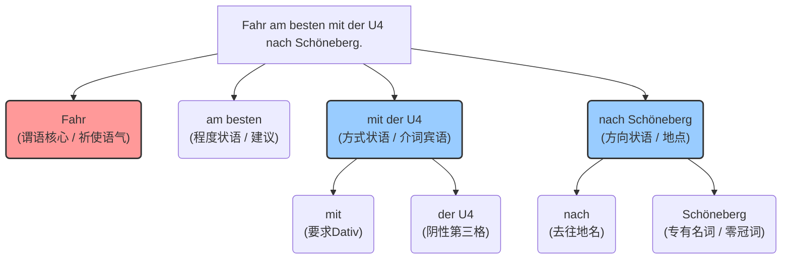

# 命令式
![[德语语法 活学活用 A1-B1.pdf#page=30&rect=27,136,476,453|📖]]

![[Pasted image 20260222171456.png]]

![[Pasted image 20260222171901.png]]

![[Pasted image 20260222171955.png]]

![[Pasted image 20260222172047.png]]

![[Pasted image 20260222172251.png]]

### 变句练习

![[Pasted image 20260222172334.png]]

![[Pasted image 20260222173846.png]]

![[Pasted image 20260222174029.png]]

![[Pasted image 20260222191458.png]]

# 祈使句

![[Pasted image 20260222200039.png]]

![[Pasted image 20260222200143.png]]

![[Pasted image 20260222200227.png]]

![[Pasted image 20260222200308.png]]

![[Pasted image 20260222200431.png]]

![[Pasted image 20260222200535.png]]

### 特定词干结尾 + e

![[Pasted image 20260222200634.png]]

### 限定物主代词

![[Pasted image 20260222200755.png]]

![[Pasted image 20260222200825.png]]

![[Pasted image 20260222200924.png]]

![[Pasted image 20260222201017.png]]

![[Pasted image 20260222202213.png]]

![[Pasted image 20260222202242.png]]

![[Pasted image 20260222203850.png]]

![[Pasted image 20260222204450.png]]

## 句型示例

### Fahr am besten mit der U4 nach Schöneberg.这是什么句子怎么==不加主语==

**一、 句子翻译与全局分析**

**德语句子**：Fahr am besten mit der U 4 nyiach Schöneberg.

**中文翻译**：你最好乘地铁 U 4 线去舍讷贝格（柏林的一个区）。

**句式判定**：这是一个 **Imperativsatz（祈使句/命令句）**，且是对“Du（你，非正式单数）”发出的指令或建议。

**全局句法分析**：

这句话之所以没有主语，正是因为它是“祈使句”。在德语中，当我们对“Du（你）”或者“Ihr（你们）”发出命令、请求或建议时，为了让语气更直接、干脆，**主语代词会被直接省略**。

* **核心谓语**：Fahr（乘车/驾驶）位于句首，奠定祈使语气。
* **程度状语**：am besten（最好），修饰建议的强烈程度。
* **方式状语**：mit der U 4（乘 U 4 线），说明交通方式。
* **方向状语**：nach Schöneberg（去舍讷贝格），说明目的地。

---

**二、 语法难点类比：为什么祈使句会“丢掉”主语和字母？**

我们可以把正常的陈述句（Du fährst. / 你在乘车）想象成一个**穿戴整齐准备去上班的人**：

* “Du”（主语）是他的公文包，标明了他的身份。
* “fährst”里的变音“ä”和词尾“-st”是他的领带和西装外套，显得非常规矩。

但是，祈使句（Fahr! / 乘车！）就像是**紧急情况下的消防员**：

当你看到着火了，你不会慢条斯理地说：“你，现在，去把灭火器拿来。”你会直接喊：“拿灭火器！”

在德语的“Du”祈使句中，动词为了追求最极致的“速度”和“力量”：

1. **扔掉了公文包**：省略主语“Du”。
2. **脱掉了外套和领带**：去掉了陈述句中的词尾“-st”，并且**强变化动词（如 fahren）在祈使句中要去掉变音（ä变回 a）**。
所以，Du fährst 就“轻装上阵”变成了干净利落的：**Fahr!**

---

**三、 单词逐一拆解（形态与功能）**

* **Fahr**：
* **词性**：Verb（动词）
* **原形**：fahren（乘车、驾驶）
* **形态变化**：第二人称单数（du）的祈使句（Imperativ）形式。正如上面所说，由陈述句“du fährst”去掉主语 du、词尾-st 和变音ä而来。
* **am besten**：
* **词性**：Adverb（副词）
* **形态变化**：这是形容词/副词 gut（好）的 **Superlativ（最高级）** 形式。原级 gut -> 比较级 besser -> 最高级 am besten。在这里作状语，表示“最好做某事”。
* **mit**：
* **词性**：Präposition（介词）
* **语法功能**：表示交通方式（搭乘...）。**硬性规则：mit 后面永远加 Dativ（第三格）**。
* **der**：
* **词性**：Bestimmter Artikel（定冠词）
* **变形依据**：这里匹配的是后面的 U 4。在德语中，所有的地铁（die U-Bahn）都是阴性（Femininum）。因为前面的介词“mit”要求第三格（Dativ），所以阴性定冠词由第一格的 **die** 变成了第三格的 **der**。
* **U 4**：
* **词性**：Substantiv（名词）
* **性数格**：阴性（Femininum），单数（Singular），第三格（Dativ）。代表“地铁 4 号线”。
* **nach**：
* **词性**：Präposition（介词）
* **语法功能**：表示前往的地理方向。当目的地是城市、国家（无冠词）或特定街区时，通常用 nach。它同样要求 **Dativ（第三格）**。
* **Schöneberg**：
* **词性**：Eigenname（专有名词）
* **形态变化**：柏林的一个地名，中性（Neutrum），但在“nach”后面作为地名直接使用，零冠词。

---

**四、 逻辑结构视觉图（句法树）**

为了让你更直观地看懂这句话的组件关系，我为你绘制了这棵语法树：

---

**五、 知识掌握考核**

既然你已经掌握了祈使句“脱掉外套（省略主语和词尾）”的规则，以及“mit + 第三格（Dativ）”的搭配，我们来做个小测试巩固一下吧！

**请尝试将下面这句话翻译成德语（对你的朋友提出建议）：**

*提示词汇*：nehmen (拿、搭乘 - 注意它是强变化动词，du nimmst) 或者继续用 fahren；公交车 (der Bus)；去火车站 (zum Bahnhof)。

**中文：你最好搭那辆公交车（der Bus）去火车站。**

你可以把你的翻译发给我，我来帮你看看变形是否完美，好吗？
