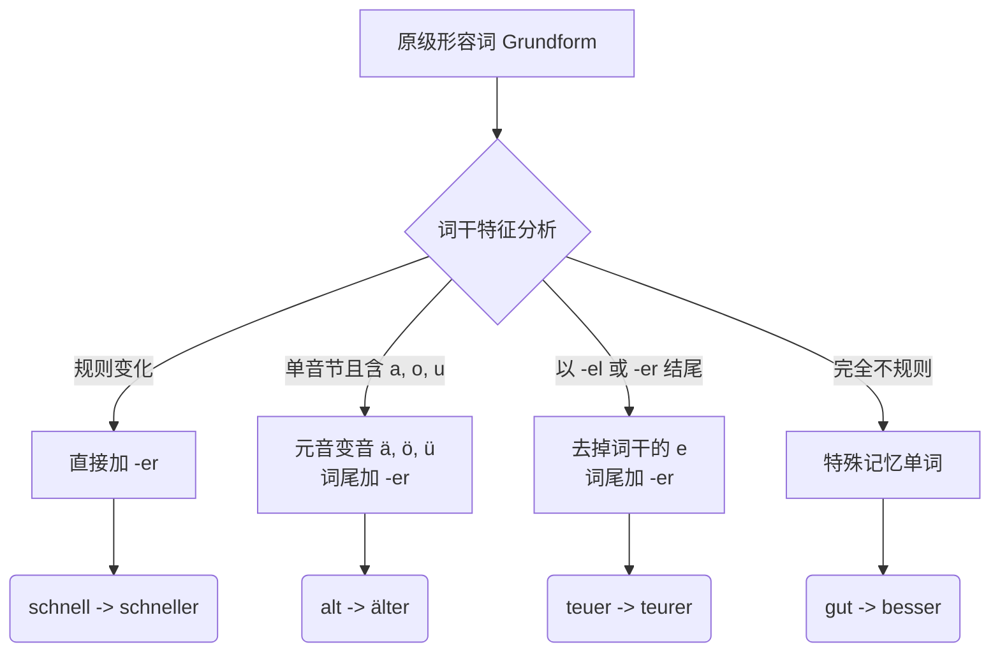
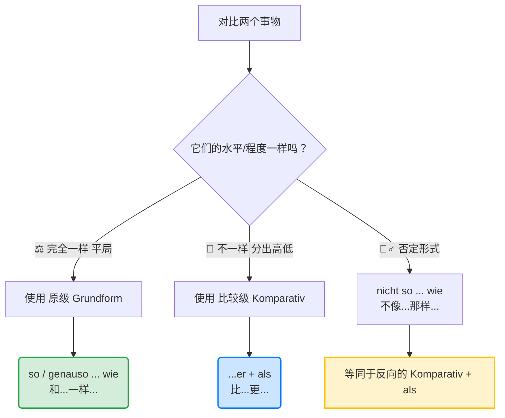

---
aliases:
  - als
  - wie
---

# 形容词和比较级

![[Pasted image 20260223180135.png]]

![[Pasted image 20260223180222.png]]

![[Pasted image 20260223180713.png]]

![[Pasted image 20260223180858.png]]

![[Pasted image 20260223181023.png]]

![[Pasted image 20260223181145.png]]

![[Pasted image 20260223181233.png]]

![[Pasted image 20260223181321.png]]

### 比较级特例变化

![[Pasted image 20260223181353.png]]

# 形容词比较级完整详细语法介绍

Hallo！欢迎来到德语大师的语法特训营！听说你计划在六个月内冲刺 B 2 水平并顺利移民？这绝对是个充满挑战但也令人热血沸腾的目标。作为你的导师，我会把那些看似像天书一样的德语语法，揉碎了、掰开了，用最接地气的方式喂给你。

我们今天的开胃主菜是**“形容词比较级（Komparativ）”**。

如果把德语原级形容词比作一辆“基础款自行车”，那么比较级就是给它装上了“电动马达”，让它有了和别人“一较高下”的能力。无论你是要租更便宜的房子、找薪水更高的工作，还是想要更短的等待时间，比较级都是你在德国生活必须掌握的生存工具。

我们先用一张图表来看看把“自行车”升级成“电动车”的整体改造流水线：

代码段

现在，我们分步骤详细拆解这套升级指南。

---

### 第一步：基础马达装配（规则变化）

最常见的规则就是简单粗暴地在形容词词尾加上 **-er**。

- **schnell** (快) -> **schneller** (更快)
- **klein** (小) -> **kleiner** (更小)
- **billig** (便宜) -> **billiger** (更便宜)

**🏥 医疗场景应用：**

> Das neue Medikament wirkt **schneller** als das alte.
> 
> (这种新药起效比旧药**更快**。)

---

### 第二步：涡轮增压系统（变音规则 Umlaut）

很多**单音节**（也就是读起来只有一个元音发音）的形容词，如果里面含有 **a, o, u**，在升级比较级时，不仅要加 **-er**，还要在头上戴上“两点”（变音符）。这就好比给马达加了涡轮增压，发音位置要更靠前、更上扬。

- **alt** (老/旧) -> **älter** (更老/更旧)
- **groß** (大) -> **größer** (更大) _注意：ß后面直接加 er，不要再加 s 了。_
- **kalt** (冷) -> **kälter** (更冷)
- **jung** (年轻) -> **jünger** (更年轻)

**🏠 租房场景应用：**

> Diese Wohnung ist **größer**, aber das Gebäude ist **älter**.
> 
> (这套公寓**更大**，但建筑**更老旧**。)

---

### 第三步：精工微调（词尾省音规则）

如果形容词是以 **-el** 或 **-er** 结尾的，为了读起来不那么大舌头（避免出现 -eler 这种发音），德国人会把词干里的那个 **e** 给偷偷扔掉。

- **teuer** (昂贵的) -> **teur** + er -> **teurer** (更贵的) _注意：不是 teuerer！_
- **dunkel** (暗的) -> **dunkl** + er -> **dunkler** (更暗的)

**🛒 生活场景应用：**

> Die Lebenshaltungskosten in München sind viel **teurer** als in Berlin.
> 
> (慕尼黑的生活成本比柏林**贵**得多。)

---

### 第四步：完全定制款（不规则变化大魔王）

有几个最高频的词，它们完全不按套路出牌，就像是脱胎换骨的定制跑车。**这五个词必须死记硬背！**

1. **gut** (好) -> **besser** (更好)
2. **viel** (多) -> **mehr** (更多)
3. **gern** (喜欢) -> **lieber** (更喜欢)
4. **hoch** (高) -> **höher** (更高) _注意：c 丢了！_
5. **nah** (近) -> **näher** (更近) _注意：直接加了 h！_

**💼 找工作场景应用：**

> Ich suche eine **besser** bezahlte Stelle mit **mehr** Urlaubstagen.
> 
> (我在找一份薪水**更好**、年假**更多**的工作。)

---

## wie als 等连接的用法

#### 1. 比较级的万能连接词：als (比)

用来对比两个**不同**的事物。

> Mein Arbeitsweg ist jetzt **kürzer als** früher.
> 
> (我现在的通勤时间**比**以前**更短**。)

_⚠️ 避坑指南：很多初学者会受英语(as...as)影响，相等比较用 "so... wie..."（和...一样），不相等比较才用 "Komparativ + als"。绝不能混用成 "besser wie"！_

#### 2. 形容词做定语（B 2 核心难点：比较级也要变格！）

当比较级直接修饰名词（放在名词前面）时，它**不仅是比较级，还要根据名词的词性、格和数量进行词尾变化（Deklination）**。

这就像你不仅换了跑车引擎，还得给车身刷上符合当地交通法规的漆。

- _普通做表语（不修饰名词，不变格）：_ Das Zimmer ist **größer**. (房间更大。)
- _做定语（修饰名词，要变格）：_ Ich brauche ein **größeres** Zimmer. (我需要一个更大的房间。)

    _(解析：Zimmer 是中性 das，ein 是第四格无词尾，所以比较级 größer 不仅保留了 er，还要加上中性第四格的强变化词尾 -es，变成了 größer-es)_

**🏢 行政事务场景：**

> Für das Visum brauche ich ein **aktuelleres** Dokument.
> 
> (为了办签证，我需要一份**更新的（日期更近的）**文件。)

#### 3. 越... 越... (Je ..., desto/umso ...) -> 💥 B 2 口语/写作提分神器！

这是一个复合句结构。前半句（Je）是从句，动词放最后；后半句（desto 或 umso）是主句，动词紧跟在比较级后面（占句子第二位）。

> **Je früher** ich den Termin beim Arzt bekomme, **desto besser** ist es für mich.
> 
> (**越早**约到医生，对我来说就**越好**。)

---

### 你的课后通关挑战 (Next Step)

理论讲完了，轮到你上机操作了。为了检验你是否真的掌握了“比较级+变格”以及“Je...desto...”的精髓，请你尝试把下面这两个你在德国一定会遇到的真实场景翻译成德语：

1. **(租房场景 - 用比较级定语)：** “我们在寻找一套**更便宜的**公寓（die Wohnung）。”
2. **(求职场景 - 用 Je... desto...)：** “我的德语（mein Deutsch）越好，我找到工作的机会（die Chancen auf einen Job）就越大（groß）。”

你可以大胆试着写出来，回复给我，我会像真正的导师一样为你批改并给出提升建议。要不要现在就来挑战一下？

Hallo！看到你主动要求补充 `wie` 和 `als` 的用法，我作为你的导师简直要为你鼓掌！这说明你的大脑不仅在疯狂吸收那2000个单词，还在主动建立语法逻辑的网。

在德国生活，无论是跟德国同事争论哪个方案更好，还是在超市对比哪种打折香肠更划算，比较连词 `wie` 和 `als` 简直就是你每天都要用到的“口粮语法”。

很多初学者（甚至一些德国本地人）都会在这里翻车。今天，我们就把这两个词彻底安排得明明白白！

为了让你秒懂，我们先把它们想象成**“法庭上的天平”**。请看这张判定逻辑图：

现在，我们把这台“天平”搬进你的德国移民生活里，分场景进行实战拆解。

---

### 第一步：端平的这碗水 —— so / genauso ... wie (和...一样...)

当你发现两件事物在某个维度上**势均力敌、打成平手**时，天平是平衡的。
这个时候，请记住一个铁律：**必须使用形容词的“原级”（Grundform），绝对不能加 -er！连词只能用 `wie`。**

* **公式：** `[事物A] + 动词 + (genau)so + 原级形容词 + wie + [事物B]`
* *(注：加了 genau 语气更强调，表示“完完全全一样”)*

**🏠 租房场景应用：**
你正在看两套房子，看完发现价格一模一样。
> Die Wohnung in Berlin ist **genauso teuer wie** die Wohnung in München.
> (柏林的这套公寓和慕尼黑的那套**一样贵**。)
> *❌ 致命错误：千万不要说 teurer wie！平局只能用原级。*

---

### 第二步：倾斜的天平 —— Komparativ + als (比...更...)

当两件事物**分出胜负、有高低之分**时，天平倾斜了。
此时的铁律是：**必须使用形容词的“比较级”（加 -er 或者变音），连词只能用 `als`。**

* **公式：** `[事物A] + 动词 + 比较级形容词 + als + [事物B]`

**💼 找工作场景应用：**
你收到了两个 Offer，你在跟朋友炫耀其中一个。
> Mein neues Gehalt ist **höher als** mein altes Gehalt.
> (我的新薪水**比**旧薪水**更高**。)
> *⚠️ 德国街头避坑指南：你在街头可能会听到德国大叔说 "Mein Auto ist besser wie dein Auto"。请注意，这是**方言和口语的错误用法**（常出现在德国南部或特定州）。在歌德或者 Telc 的 B2 考试里，如果你写出 "besser wie"，考官会毫不犹豫地扣分！记住：**有 -er 出现的地方，必须是 als！***

---

### 第三步：B2 考试必考魔术手 —— 句型转换 (nicht so ... wie = Komparativ)

在 B2 的阅读和语法考试中，考官特别喜欢玩一种“乾坤大挪移”的游戏：用否定的平局（nicht so... wie），来表达实际的不平等（...er als）。

如果你能把这个逻辑盘明白，证明你的德语逻辑已经非常德式了。

* **逻辑：** A 没有 B 那么好 = B 比 A 更好。

**🏥 医疗场景应用：**
你想表达“公立保险没有私立保险那么快能约到专科医生”。

* **用 wie 表达（否定平局）：** Die gesetzliche Krankenversicherung ist **nicht so schnell wie** die private Krankenversicherung.
    (法定医保**没有**私立医保**那么快**。)
* **用 als 转换（直接比较）：** Die private Krankenversicherung ist **schneller als** die gesetzliche Krankenversicherung.
    (私立医保**比**法定医保**更快**。)

在写 B2 论述文（比如讨论哪种保险更好）时，交替使用这两种句型，你的文章不仅高级，而且词汇量展现得淋漓尽致。

---

### 第四步：时间轴上的自己跟自己比 —— immer + 比较级 (越来越...)

比较级不一定非得是A和B比，还可以是“现在的你”和“过去的你”比。
当你想要表达“情况正在不断发展、变化”时，只需要在比较级前面加一个 **immer (总是/不断地)**。

* **公式：** `immer + 比较级形容词` (表示：越来越...)

**🛂 签证/行政场景应用：**
> Die Wartezeit bei der Ausländerbehörde wird **immer länger**.
> (外管局的等待时间变得**越来越长**。)

> Mein Deutsch wird **immer besser**!
> (我的德语变得**越来越好**！)

---
