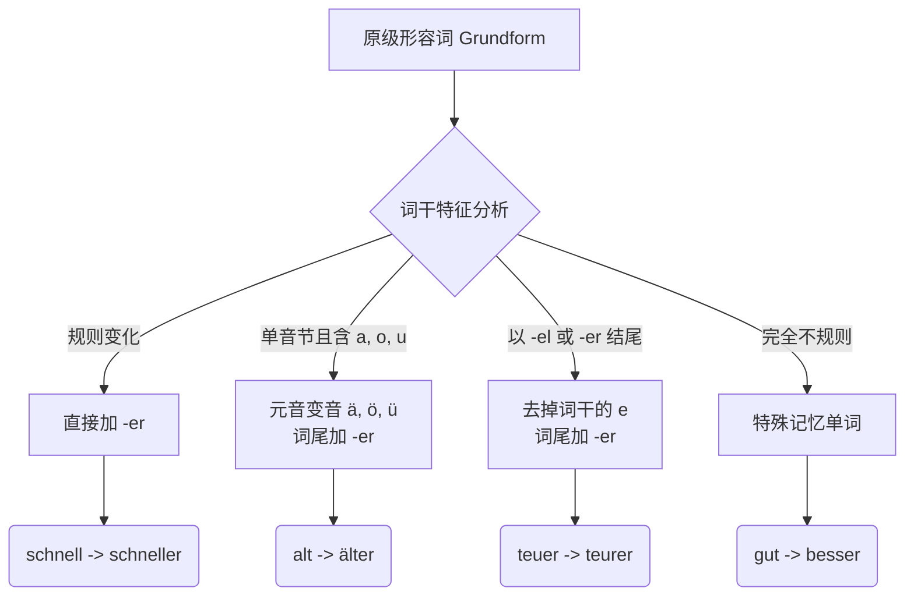
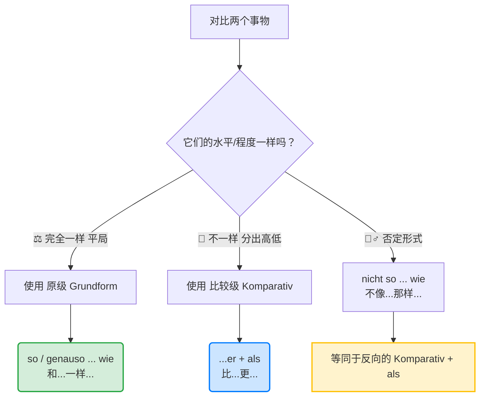
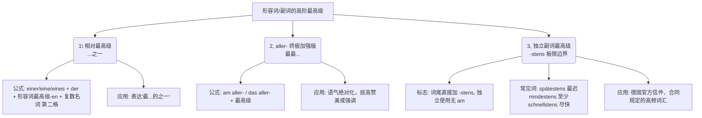
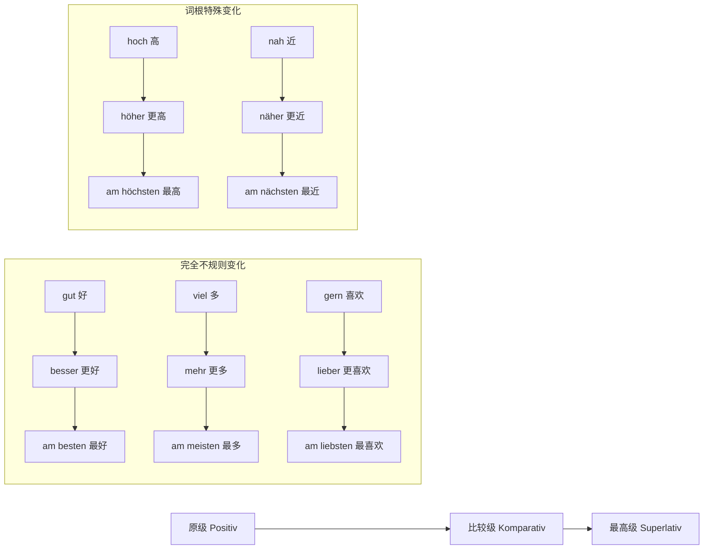
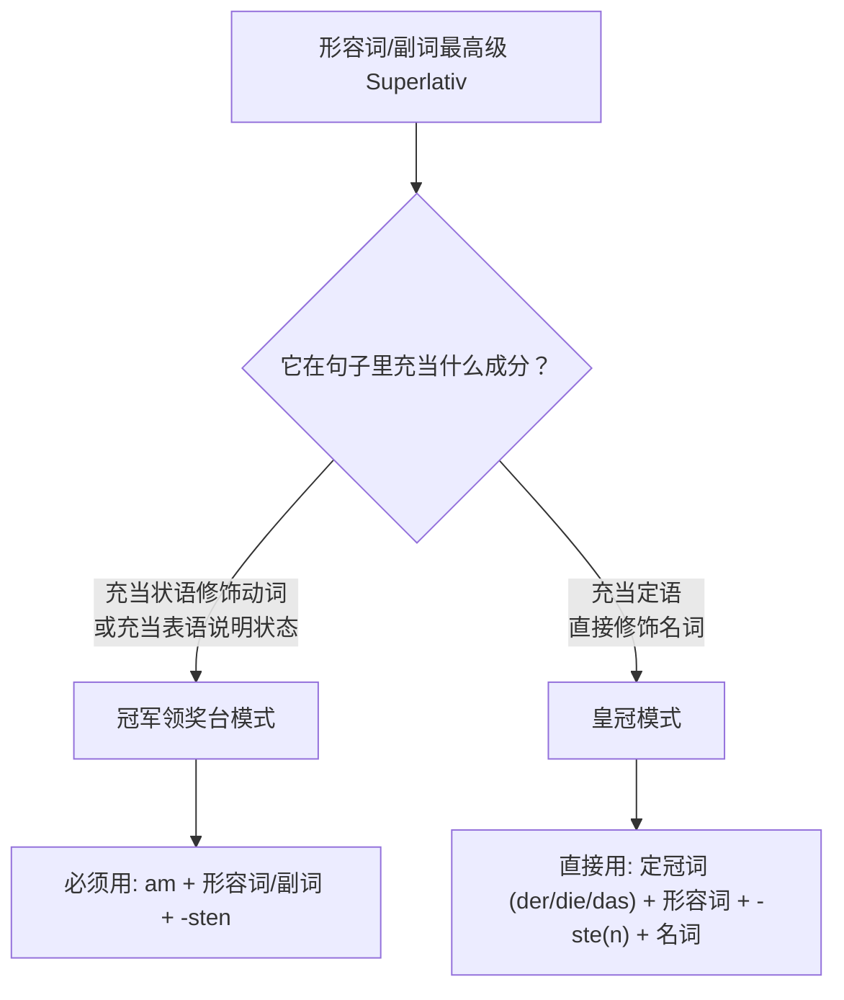

---
aliases:
  - als
  - wie
---

# 形容词比较级完整详细语法介绍

我们今天的开胃主菜是**“形容词比较级（Komparativ）”**。

如果把德语原级形容词比作一辆“基础款自行车”，那么比较级就是给它装上了“电动马达”，让它有了和别人“一较高下”的能力。无论你是要租更便宜的房子、找薪水更高的工作，还是想要更短的等待时间，比较级都是你在德国生活必须掌握的生存工具。

我们先用一张图表来看看把“自行车”升级成“电动车”的整体改造流水线：

代码段

```mermaid
graph TD
    A[原级形容词 Grundform] --> B{词干特征分析}
    B -->|规则变化| C[直接加 -er]
    B -->|单音节且含 a, o, u| D[元音变音 ä, ö, ü <br/> 词尾加 -er]
    B -->|以 -el 或 -er 结尾| E[去掉词干的 e <br/> 词尾加 -er]
    B -->|完全不规则| F[特殊记忆单词]
    
    C --> G(schnell -> schneller)
    D --> H(alt -> älter)
    E --> I(teuer -> teurer)
    F --> J(gut -> besser)
```

现在，我们分步骤详细拆解这套升级指南。

---

### 第一步：基础马达装配（规则变化）

最常见的规则就是简单粗暴地在形容词词尾加上 **-er**。

- **schnell** (快) -> **schneller** (更快)
- **klein** (小) -> **kleiner** (更小)
- **billig** (便宜) -> **billiger** (更便宜)

**🏥 医疗场景应用：**

> Das neue Medikament wirkt **schneller** als das alte.
>
> (这种新药起效比旧药**更快**。)

---

### 第二步：涡轮增压系统（变音规则 Umlaut）

很多**单音节**（也就是读起来只有一个元音发音）的形容词，如果里面含有 **a, o, u**，在升级比较级时，不仅要加 **-er**，还要在头上戴上“两点”（变音符）。这就好比给马达加了涡轮增压，发音位置要更靠前、更上扬。

- **alt** (老/旧) -> **älter** (更老/更旧)
- **groß** (大) -> **größer** (更大) _注意：ß后面直接加 er，不要再加 s 了。_
- **kalt** (冷) -> **kälter** (更冷)
- **jung** (年轻) -> **jünger** (更年轻)

**🏠 租房场景应用：**

> Diese Wohnung ist **größer**, aber das Gebäude ist **älter**.
>
> (这套公寓**更大**，但建筑**更老旧**。)

---

### 第三步：精工微调（词尾省音规则）

如果形容词是以 **-el** 或 **-er** 结尾的，为了读起来不那么大舌头（避免出现 -eler 这种发音），德国人会把词干里的那个 **e** 给偷偷扔掉。

- **teuer** (昂贵的) -> **teur** + er -> **teurer** (更贵的) _注意：不是 teuerer！_
- **dunkel** (暗的) -> **dunkl** + er -> **dunkler** (更暗的)

**🛒 生活场景应用：**

> Die Lebenshaltungskosten in München sind viel **teurer** als in Berlin.
>
> (慕尼黑的生活成本比柏林**贵**得多。)

---

### 第四步：完全定制款（不规则变化大魔王）

有几个最高频的词，它们完全不按套路出牌，就像是脱胎换骨的定制跑车。**这五个词必须死记硬背！**

1. **gut** (好) -> **besser** (更好)
2. **viel** (多) -> **mehr** (更多)
3. **gern** (喜欢) -> **lieber** (更喜欢)
4. **hoch** (高) -> **höher** (更高) _注意：c 丢了！_
5. **nah** (近) -> **näher** (更近) _注意：直接加了 h！_

**💼 找工作场景应用：**

> Ich suche eine **besser** bezahlte Stelle mit **mehr** Urlaubstagen.
>
> (我在找一份薪水**更好**、年假**更多**的工作。)

---

## wie als 等连接的用法

#### als 比较级用法

用来对比两个**不同**的事物。

> Mein Arbeitsweg ist jetzt **kürzer als** früher.
>
> (我现在的通勤时间**比**以前**更短**。)

_⚠️ 避坑指南：很多初学者会受英语(as...as)影响，相等比较用 "so... wie..."（和...一样），不相等比较才用 "Komparativ + als"。绝不能混用成 "besser wie"！_

#### 2. 形容词做定语（B 2 核心难点：比较级也要变格！）

当比较级直接修饰名词（放在名词前面）时，它**不仅是比较级，还要根据名词的词性、格和数量进行词尾变化（Deklination）**。

这就像你不仅换了跑车引擎，还得给车身刷上符合当地交通法规的漆。

- _普通做表语（不修饰名词，不变格）：_ Das Zimmer ist **größer**. (房间更大。)
- _做定语（修饰名词，要变格）：_ Ich brauche ein **größeres** Zimmer. (我需要一个更大的房间。)

    _(解析：Zimmer 是中性 das，ein 是第四格无词尾，所以比较级 größer 不仅保留了 er，还要加上中性第四格的强变化词尾 -es，变成了 größer-es)_

**🏢 行政事务场景：**

> Für das Visum brauche ich ein **aktuelleres** Dokument.
>
> (为了办签证，我需要一份**更新的（日期更近的）**文件。)

#### 3. 越... 越... (Je ..., desto/umso ...) -> 💥 B 2 口语/写作提分神器！

这是一个复合句结构。前半句（Je）是从句，动词放最后；后半句（desto 或 umso）是主句，动词紧跟在比较级后面（占句子第二位）。

> **Je früher** ich den Termin beim Arzt bekomme, **desto besser** ist es für mich.
>
> (**越早**约到医生，对我来说就**越好**。)

---

## wie, als

在德国生活，无论是跟德国同事争论哪个方案更好，还是在超市对比哪种打折香肠更划算，比较连词 `wie` 和 `als` 简直就是你每天都要用到的“口粮语法”。

```mermaid
graph TD
    A[对比两个事物] --> B{它们的水平/程度一样吗？}
    
    B -->|⚖️ 完全一样 平局| C[使用 原级 Grundform]
    C --> D(so / genauso ... wie <br/> 和...一样...)
    
    B -->|🛝 不一样 分出高低| E[使用 比较级 Komparativ]
    E --> F(...er + als <br/> 比...更...)
    
    B -->|🙅‍♂️ 否定形式| G[nicht so ... wie <br/> 不像...那样...]
    G --> H[等同于反向的 Komparativ + als]

    style D fill:#d4edda,stroke:#28a745,stroke-width:2px
    style F fill:#cce5ff,stroke:#007bff,stroke-width:2px
    style H fill:#fff3cd,stroke:#ffc107,stroke-width:2px
```

现在，我们把这台“天平”搬进你的德国移民生活里，分场景进行实战拆解。

---

### 第一步：端平的这碗水 —— so / genauso ... wie (和...一样...)

当你发现两件事物在某个维度上**势均力敌、打成平手**时，天平是平衡的。

这个时候，请记住一个铁律：**必须使用形容词的“原级”（Grundform），绝对不能加 -er！连词只能用 `wie`。**

* **公式：** `[事物A] + 动词 + (genau)so + 原级形容词 + wie + [事物B]`
* *(注：加了 genau 语气更强调，表示“完完全全一样”)*

**🏠 租房场景应用：**

你正在看两套房子，看完发现价格一模一样。

> Die Wohnung in Berlin ist **genauso teuer wie** die Wohnung in München.
> (柏林的这套公寓和慕尼黑的那套**一样贵**。)
> *❌ 致命错误：千万不要说 teurer wie！平局只能用原级。*

---

### 第二步：倾斜的天平 —— Komparativ + als (比...更...)

当两件事物**分出胜负、有高低之分**时，天平倾斜了。

此时的铁律是：**必须使用形容词的“比较级”（加 -er 或者变音），连词只能用 `als`。**

* **公式：** `[事物A] + 动词 + 比较级形容词 + als + [事物B]`

**💼 找工作场景应用：**

你收到了两个 Offer，你在跟朋友炫耀其中一个。

> Mein neues Gehalt ist **höher als** mein altes Gehalt.
> (我的新薪水**比**旧薪水**更高**。)
> *⚠️ 德国街头避坑指南：你在街头可能会听到德国大叔说 "Mein Auto ist besser wie dein Auto"。请注意，这是**方言和口语的错误用法**（常出现在德国南部或特定州）。在歌德或者 Telc 的 B2 考试里，如果你写出 "besser wie"，考官会毫不犹豫地扣分！记住：**有 -er 出现的地方，必须是 als！***

---

### 第三步：B2 考试必考魔术手 —— 句型转换 (nicht so ... wie = Komparativ)

在 B2 的阅读和语法考试中，考官特别喜欢玩一种“乾坤大挪移”的游戏：用否定的平局（nicht so... wie），来表达实际的不平等（...er als）。

如果你能把这个逻辑盘明白，证明你的德语逻辑已经非常德式了。

* **逻辑：** A 没有 B 那么好 = B 比 A 更好。

**🏥 医疗场景应用：**

你想表达“公立保险没有私立保险那么快能约到专科医生”。

* **用 wie 表达（否定平局）：** Die gesetzliche Krankenversicherung ist **nicht so schnell wie** die private Krankenversicherung.
    (法定医保**没有**私立医保**那么快**。)
* **用 als 转换（直接比较）：** Die private Krankenversicherung ist **schneller als** die gesetzliche Krankenversicherung.
    (私立医保**比**法定医保**更快**。)

在写 B2 论述文（比如讨论哪种保险更好）时，交替使用这两种句型，你的文章不仅高级，而且词汇量展现得淋漓尽致。

---

### 第四步：时间轴上的自己跟自己比 —— immer + 比较级 (越来越...)

比较级不一定非得是A和B比，还可以是“现在的你”和“过去的你”比。

当你想要表达“情况正在不断发展、变化”时，只需要在比较级前面加一个 **immer (总是/不断地)**。

* **公式：** `immer + 比较级形容词` (表示：越来越...)

**🛂 签证/行政场景应用：**

> Die Wartezeit bei der Ausländerbehörde wird **immer länger**.
> (外管局的等待时间变得**越来越长**。)

> Mein Deutsch wird **immer besser**!
> (我的德语变得**越来越好**！)

---

## 三个高级用法

```mermaid
graph TD
    A[形容词/副词的高阶最高级] --> B(1\ 相对最高级<br>...之一)
    A --> C(2, aller- 终极加强版<br>最最...)
    A --> D(3, 独立副词最高级<br>-stens 极限边界)
    
    B --> B1[公式: einer/eine/eines + der + 形容词最高级-en + 复数名词 第二格]
    B --> B2[应用: 表达'最...的之一']
    
    C --> C1[公式: am aller- / das aller- + 最高级]
    C --> C2[应用: 语气绝对化，拔高赞美或强调]
    
    D --> D1[标志: 词尾直接加 -stens, 独立使用无 am]
    D --> D2[常见词: spätestens 最迟<br>mindestens 至少<br>schnellstens 尽快]
    D --> D3[应用: 德国官方信件、合同规定的高频词汇]
```

现在，我们把这三招代入到你的**移民生活实战场景**中去，帮你把它们刻进 DNA 里！

---

### 第一招：相对最高级 (Relative Superlative) —— “之一”俱乐部

**核心心法：** 德国人非常严谨，有时候说“这是最好的”，显得太绝对；他们更喜欢说“这是最好的……之一”。

这套语法的杀手锏在于它的结构，它完美结合了**不定代词**和**第二格（Genitiv）**：

> **公式：** `einer/eine/ein(s)` (取决于名词的词性) + `der` (第二格复数的定冠词) + `形容词最高级(加-en)` + `名词复数`

> **移民生活场景：找工作 (Jobsuche)**
>
> 你参加了一场面试，想拍一下 HR 的马屁，或者向朋友炫耀这家公司，你可以说：
>
> - "Das ist **eine der besten Firmen** in München." (这是慕尼黑最好的公司之一。)
>     
> 
> _语法拆解：_ > 1. 公司是 _die Firma_（阴性），所以前面用 _eine_。
>
> 2. “最好的公司们（的）”，第二格复数，冠词必然是 _der_。
> 
> 3. 在第二格定冠词 _der_ 后面，形容词 _best-_ 乖乖加上弱变化词尾 _-en_。
> 
> 4. 名词变成复数 _Firmen_。

> **移民生活场景：医疗就诊 (Arztbesuch)**
>
> 朋友给你推荐了一位专科医生，他说：
>
> - "Er ist **einer der bekanntesten Ärzte** hier." (他是这里最著名的医生之一。)
>     
>     _（因为 der Arzt 是阳性，所以用 einer）_

---

### 第二招：aller- 终极加强版 —— 加上“最最”的光环

**核心心法：** 当“最高级”都不足以表达你的激动时，德国人会在最高级前面加上前缀 `aller-`（所有...之中的）。相当于中文里的“最最...”。

> **移民生活场景：租房 (Wohnungssuche)**
>
> 你终于在柏林找到了一套带阳台的公寓，夕阳西下，你感慨道：
>
> - "Hier ist es **am allerschönsten**!" (这里是最最漂亮的！)
>     
> 
> 如果你要指着房子说：
>
> - "Das ist **das allerschönste** Zimmer in dieser Wohnung." (这是这套公寓里最最漂亮的一个房间。)

---

### 第三招：独立副词最高级 (-stens) —— 德国官僚系统的“紧箍咒”

**核心心法：** 这一招是你**必须、绝对要掌握**的！因为在德国，所有的租房合同、工作合同、外管局（Ausländerbehörde）的警告信里，全都是这些词！

它们不再是用来“比较”的，而是用来**设定底线和极限**的。它们独立使用，**前面绝对不能加 _am_**。

我们来看看原意和 -stens 之后的词义突变：

1. **spät (晚) -> spätestens (最迟/最晚)**
$1
    - _外管局来信：_ "Sie müssen die Unterlagen **spätestens** bis zum 15. Mai einreichen."
    - (您必须**最迟**在 5 月 15 日前提交材料。—— 没商量，16 号交你就麻烦了！)
$1
2. **wenig (少) -> mindestens (至少 / 最起码)** _(注意：这里用的词根是 mindest-)_
$1
    - _入籍或找工作要求：_ "Für diesen Job brauchen Sie **mindestens** das B 2-Zertifikat."
    - (做这份工作您**至少**需要 B 2 证书。—— 这就是你现在的目标！)
$1
3. **schnell (快) -> schnellstens (尽快 / 十万火急)**
$1
    - _看图片里那句经典的对比：_
    - "Er ist **am schnellsten** gekommen." (他来得最快。 -> 强调他比张三李四跑得都快，是比较出来的。)
    - "Er muss **schnellstens** kommen." (他必须尽快/火速赶来。 -> 强调事情极其紧急，so schnell wie möglich。)

---

### 你的六个月通关规划建议（进阶篇）

既然你已经接触到了带有第二格（Genitiv）的高阶结构，说明你正在稳步迈向 B 2 的门槛。针对这部分的学习建议：

- **第 3 个月（死磕第二格）：** “之一”这个结构（einer/eine/eines der...）是 B 2 口语和写作的**万能提分金句**。强迫自己每天写一句话。比如看到一辆好车，在心里默念："Das ist eines der teuersten Autos." 形成肌肉记忆。
- **第 4 个月（攻克官方信件阅读）：** 收集一些德国的官方说明、罚单或者租房合同条款。用荧光笔把里面所有的 _-stens_ (mindestens, höchstens, spätestens, frühestens) 画出来。B 2 的阅读理解极其喜欢在这些极限词上挖坑，比如原文写 _höchstens 3 Monate_ (最多三个月)，题目选项写 _mehr als 3 Monate_，你一眼就能识破陷阱。
- **第 5-6 个月（信件写作实战）：** B 2 考试必考写投诉信（Reklamation）或求职信。在信的结尾熟练甩出一句："Ich bitte Sie, mein Problem **schnellstens** zu lösen." (我请求您尽快解决我的问题。) 考官看到这个词，立刻给你打高分！

语言学习就像是盖房子，A 1/A 2 打下了地基，现在你正在用这些高级语法给房子做精装修。

**今日实战挑战：**

作为今天的收尾，请你把自己当成一个马上要去德国找房的人，用德语把下面这句包含了两大语法点的话翻译出来。我来帮你纠错：

**“在慕尼黑寻找公寓是德国最困难的任务（die Aufgabe）之一，你必须至少（mindestens）准备三个月的时间。”**

放轻松，试着拼装一下，期待你的答案！

# 形容词和比较级

^row46z

| **级别分类** | **规则变化后缀**                                                                                                                                     | **元音变化**                                                                                                                          | **(特殊词尾处理)**                                                                                                                                                                                | **完全不规则变化 (需特殊记忆)**                                                                                                                                                                                       | **共同点**                                                                                                                                       |
| -------- | ---------------------------------------------------------------------------------------------------------------------------------------------- | --------------------------------------------------------------------------------------------------------------------------------- | ------------------------------------------------------------------------------------------------------------------------------------------------------------------------------------------- | --------------------------------------------------------------------------------------------------------------------------------------------------------------------------------------------------------- | --------------------------------------------------------------------------------------------------------------------------------------------- |
| **比较级**  | 直接加 **-er**      _(例: schnell -> schneller)_                                                                                       | **单音节且含 a, o, u：**      变音为 ä, ö, ü，词尾加 -er      _(例: alt -> älter)_                                      | **以 -el 或 -er 结尾：**      去掉词干的 e，词尾加 -er      _(例: teuer -> teurer, dunkel -> dunkler)_         _句子中搭配: 常与 als/wie 连用_                               | 1. gut -> **besser**      2. viel -> **mehr**      3. gern -> **lieber**      4. hoch -> **höher** _(注意: c 丢了!)_      5. nah -> **näher** _(注意: 直接加了 h!)_ | 1. **规则框架相似**：四条变化规则基本相似（规则变化、元音变音、特殊词尾、不规则），只有细小变化规则不同。         2. **作为定语的词尾变化**：最后一步，如果是放在名词左边（修饰名词），都**必须加上形容词词尾变化**，千万别忘了。 |
| **最高级**  | 修饰动词: **am ...sten**      修饰名词: **定冠词 + 形容词词尾变化**      一般直接加 **-st**      _(例: schnell -> am schnellsten)_ | **单音节且含 a, o, u：**      变元音 a->ä, o->ö, u->ü，并加 -st      _(例: alt -> am ältesten, stark -> am stärksten)_ | **词干以 -d, -t, -s, -ß, -x, -z 结尾：**      为了发音好听，加 **-este**      _(例: kalt -> am kältesten, kurz -> am kürzesten)_         _绝对例外: groß -> am größten_ | 1. gut -> **am besten**      2. viel -> **am meisten**      3. gern -> **am liebsten**      4. hoch -> **am höchsten**      5. nah -> **am nächsten**     | 同上                                                                                                                                            |

![[Pasted image 20260223180135.png]]

![[Pasted image 20260223180222.png]]

![[Pasted image 20260223180713.png]]

![[Pasted image 20260223180858.png]]

![[Pasted image 20260223181023.png]]

![[Pasted image 20260223181145.png]]

![[Pasted image 20260223181233.png]]

![[Pasted image 20260223181321.png]]

### 比较级特例变化

![[Pasted image 20260223181353.png]]

## 不规则变化整理

### 核心语法：不规则形容词与副词的比较级和最高级

针对您提到的“总结所有不规则变化动词比较级最高级”，大师在这里要非常温柔地给您纠正一个小小的语法误区：**在德语（以及绝大多数语言）中，动词（Verben）是用来表示动作或状态的，它们没有比较级和最高级。只有形容词（Adjektive）和副词（Adverbien）才有比较级和最高级！**

为了让您完全理解，我们可以用一个类比：规则变化的形容词就像是“标准列车”，我们只需要在车尾挂上特定的车厢（比较级加 `-er`，最高级加 `am -sten`）。比如：schnell -> schneller -> am schnellsten。

但是，德语中有几个极其常用的词汇，它们是彻底的“变形金刚”。它们不仅不按套路出牌，连词根（车头）都会发生翻天覆地的变化。因为它们在日常交流中出现频率极高，所以我们需要优先且彻底地掌握它们。

以下图表清晰地展示了这几个最核心的“变形金刚”：

代码段

```mermaid
flowchart LR
    A[原级 Positiv] --> B[比较级 Komparativ] --> C[最高级 Superlativ]

    subgraph 完全不规则变化 
    G[gut 好] --> G1[besser 更好] --> G2[am besten 最好]
    V[viel 多] --> V1[mehr 更多] --> V2[am meisten 最多]
    Ge[gern 喜欢] --> Ge1[lieber 更喜欢] --> Ge2[am liebsten 最喜欢]
    end

    subgraph 词根特殊变化 
    H[hoch 高] --> H1[höher 更高] --> H2[am höchsten 最高]
    N[nah 近] --> N1[näher 更近] --> N2[am nächsten 最近]
    end
```

### 不规则形容词表格整理

| **分类**                                                         | **原级 (Positiv)** | **比较级 (Komparativ)** | **最高级 (Superlativ)** | **中文释义**      | **移民生活实战场景 (租房/求职/医疗/行政)**                                                 |
| -------------------------------------------------------------- | ---------------- | -------------------- | -------------------- | ------------- | -------------------------------------------------------------------------- |
| **第一类：完全不规则**      _(必须死记硬背)_                      | **gut**          | **besser**           | **am besten**        | 好             | **[求职]** Ein **besserer** Abschluss erhöht Ihre Chancen. (一份更好的学历能提升您的机会。) |
|                                                                | **viel**         | **mehr**             | **am meisten**       | 多             | **[行政]** Ich brauche **mehr** Zeit für die Formulare. (填这些表格我需要更多时间。)      |
|                                                                | **gern(e)**      | **lieber**           | **am liebsten**      | 喜欢            | **[职场]** Ich arbeite **lieber** im Team als allein. (比起单干我更喜欢团队工作。)        |
|                                                                | **hoch**         | **höher**            | **am höchsten**      | 高 _(注意 c 脱落)_ | **[租房]** Die Kaution ist **höher** als erwartet. (押金比预期的要高。)               |
|                                                                | **nah**          | **näher**            | **am nächsten**      | 近 _(注意加 c)_   | **[医疗]** Wo ist das **nächste** Krankenhaus? (最近的医院在哪里？)                   |
| **第二类：元音变音**      _(单音节词 a/o/u 变 ä/ö/ü)_           | **alt**          | **älter**            | **am ältesten**      | 老/旧           | **[租房]** Das ist das **älteste** Gebäude im Viertel. (这是这个街区最老的一栋建筑。)      |
|                                                                | **arm**          | **ärmer**            | **am ärmsten**       | 穷             | **[生活]** Studenten sind oft **ärmer** dran. (大学生的经济状况通常更窘迫。)               |
|                                                                | **groß**         | **größer**           | **am größten**       | 大             | **[租房]** Wir suchen eine **größere** Wohnung. (我们在找一套更大的公寓。)               |
|                                                                | **jung**         | **jünger**           | **am jüngsten**      | 年轻            | **[求职]** Mein **jüngerer** Bruder sucht einen Job. (我那年轻些的弟弟在找工作。)         |
|                                                                | **kalt**         | **kälter**           | **am kältesten**     | 冷             | **[租房]** Im Winter wird es hier am **kältesten**. (冬天这里是最冷的。- _涉及暖气费_)     |
|                                                                | **lang**         | **länger**           | **am längsten**      | 长             | **[行政]** Die Wartezeit beim Amt ist am **längsten**. (在政府办事处的等待时间是最长的。)    |
|                                                                | **stark**        | **stärker**          | **am stärksten**     | 强             | **[医疗]** Die Schmerzen sind heute **stärker**. (今天的疼痛感更强烈了。)               |
|                                                                | **warm**         | **wärmer**           | **am wärmsten**      | 暖和            | **[租房]** Wir brauchen eine **wärmere** Decke. (我们需要一床更暖和的被子。)              |
|                                                                | **gesund**       | **gesünder**         | **am gesündesten**   | 健康            | **[医疗]** Frische Luft ist am **gesündesten**. (新鲜空气是最健康的。)                 |
|                                                                | **krank**        | **kränker**          | **am kränksten**     | 生病            | **[医疗]** Er fühlte sich **kränker** als gestern. (他觉得比昨天病得更重了。)            |
|                                                                | **oft**          | **öfter / häufiger** | **am häufigsten**    | 经常            | **[求职]** Dieser Fehler passiert am **häufigsten**. (这个错误发生得最频繁。)           |
|                                                                | **schwach**      | **schwächer**        | **am schwächsten**   | 弱             | **[医疗]** Ich fühle mich heute etwas **schwächer**. (我今天感觉身体稍微虚弱一些。)        |
| **第三类：字母脱落**      _(词尾是-el/-er 的，比较级脱落 e)_         | **teuer**        | **teurer**           | **am teuersten**     | 贵             | **[租房]** München ist die **teuerste** Stadt in Deutschland. (慕尼黑是德国最贵的城市。) |
|                                                                | **dunkel**       | **dunkler**          | **am dunkelsten**    | 暗             | **[租房]** Das Schlafzimmer ist viel **dunkler**. (这间卧室暗得多。)                 |
|                                                                | **sauer**        | **saurer**           | **am sauersten**     | 酸/生气          | **[职场]** Der Chef war noch **saurer** als vorher. (老板比之前更生气了。)             |
| **第四类：发音缓冲**      _(词尾是-d, -t, -s, -ß, -z，最高级加 e)_ | **kurz**         | **kürzer**           | **am kürzesten**     | 短             | **[求职]** Mein Arbeitsweg ist jetzt **kürzer**. (我现在的通勤路程更短了。)              |
|                                                                | **schlecht**     | **schlechter**       | **am schlechtesten** | 坏/差           | **[医疗]** Heute geht es mir am **schlechtesten**. (今天我的状态是最差的。)             |
|                                                                | **heiß**         | **heißer**           | **am heißesten**     | 热/烫           | **[生活]** Der Juli ist der **heißeste** Monat. (七月是最热的月份。)                  |

## 不规则变化整理

### 核心语法：不规则形容词与副词的比较级和最高级

针对您提到的“总结所有不规则变化动词比较级最高级”，大师在这里要非常温柔地给您纠正一个小小的语法误区：**在德语（以及绝大多数语言）中，动词（Verben）是用来表示动作或状态的，它们没有比较级和最高级。只有形容词（Adjektive）和副词（Adverbien）才有比较级和最高级！**

为了让您完全理解，我们可以用一个类比：规则变化的形容词就像是“标准列车”，我们只需要在车尾挂上特定的车厢（比较级加 `-er`，最高级加 `am -sten`）。比如：schnell -> schneller -> am schnellsten。

但是，德语中有几个极其常用的词汇，它们是彻底的“变形金刚”。它们不仅不按套路出牌，连词根（车头）都会发生翻天覆地的变化。因为它们在日常交流中出现频率极高，所以我们需要优先且彻底地掌握它们。

以下图表清晰地展示了这几个最核心的“变形金刚”：

代码段

```mermaid
flowchart LR
    A[原级 Positiv] --> B[比较级 Komparativ] --> C[最高级 Superlativ]

    subgraph 完全不规则变化 
    G[gut 好] --> G1[besser 更好] --> G2[am besten 最好]
    V[viel 多] --> V1[mehr 更多] --> V2[am meisten 最多]
    Ge[gern 喜欢] --> Ge1[lieber 更喜欢] --> Ge2[am liebsten 最喜欢]
    end

    subgraph 词根特殊变化 
    H[hoch 高] --> H1[höher 更高] --> H2[am höchsten 最高]
    N[nah 近] --> N1[näher 更近] --> N2[am nächsten 最近]
    end
```

### 不规则形容词表格整理

| **分类**                                                        | **原级 (Positiv)** | **比较级 (Komparativ)** | **最高级 (Superlativ)** | **中文释义**    | **移民生活实战场景 (租房/求职/医疗/行政)**                                                 |
| ------------------------------------------------------------- | ---------------- | -------------------- | -------------------- | ----------- | -------------------------------------------------------------------------- |
| **第一类：完全不规则**      _(必须死记硬背)_                     | **gut**          | **besser**           | **am besten**        | 好           | **[求职]** Ein **besserer** Abschluss erhöht Ihre Chancen. (一份更好的学历能提升您的机会。) |
|                                                               | **viel**         | **mehr**             | **am meisten**       | 多           | **[行政]** Ich brauche **mehr** Zeit für die Formulare. (填这些表格我需要更多时间。)      |
|                                                               | **gern(e)**      | **lieber**           | **am liebsten**      | 喜欢          | **[职场]** Ich arbeite **lieber** im Team als allein. (比起单干我更喜欢团队工作。)        |
|                                                               | **hoch**         | **höher**            | **am höchsten**      | 高 _(注意 c 脱落)_ | **[租房]** Die Kaution ist **höher** als erwartet. (押金比预期的要高。)               |
|                                                               | **nah**          | **näher**            | **am nächsten**      | 近 _(注意加 c)_  | **[医疗]** Wo ist das **nächste** Krankenhaus? (最近的医院在哪里？)                   |
| **第二类：元音变音**      _(单音节词 a/o/u 变 ä/ö/ü)_          | **alt**          | **älter**            | **am ältesten**      | 老/旧         | **[租房]** Das ist das **älteste** Gebäude im Viertel. (这是这个街区最老的一栋建筑。)      |
|                                                               | **arm**          | **ärmer**            | **am ärmsten**       | 穷           | **[生活]** Studenten sind oft **ärmer** dran. (大学生的经济状况通常更窘迫。)               |
|                                                               | **groß**         | **größer**           | **am größten**       | 大           | **[租房]** Wir suchen eine **größere** Wohnung. (我们在找一套更大的公寓。)               |
|                                                               | **jung**         | **jünger**           | **am jüngsten**      | 年轻          | **[求职]** Mein **jüngerer** Bruder sucht einen Job. (我那年轻些的弟弟在找工作。)         |
|                                                               | **kalt**         | **kälter**           | **am kältesten**     | 冷           | **[租房]** Im Winter wird es hier am **kältesten**. (冬天这里是最冷的。- _涉及暖气费_)     |
|                                                               | **lang**         | **länger**           | **am längsten**      | 长           | **[行政]** Die Wartezeit beim Amt ist am **längsten**. (在政府办事处的等待时间是最长的。)    |
|                                                               | **stark**        | **stärker**          | **am stärksten**     | 强           | **[医疗]** Die Schmerzen sind heute **stärker**. (今天的疼痛感更强烈了。)               |
|                                                               | **warm**         | **wärmer**           | **am wärmsten**      | 暖和          | **[租房]** Wir brauchen eine **wärmere** Decke. (我们需要一床更暖和的被子。)              |
|                                                               | **gesund**       | **gesünder**         | **am gesündesten**   | 健康          | **[医疗]** Frische Luft ist am **gesündesten**. (新鲜空气是最健康的。)                 |
|                                                               | **krank**        | **kränker**          | **am kränksten**     | 生病          | **[医疗]** Er fühlte sich **kränker** als gestern. (他觉得比昨天病得更重了。)            |
|                                                               | **oft**          | **öfter / häufiger** | **am häufigsten**    | 经常          | **[求职]** Dieser Fehler passiert am **häufigsten**. (这个错误发生得最频繁。)           |
|                                                               | **schwach**      | **schwächer**        | **am schwächsten**   | 弱           | **[医疗]** Ich fühle mich heute etwas **schwächer**. (我今天感觉身体稍微虚弱一些。)        |
| **第三类：字母脱落**      _(词尾是-el/-er 的，比较级脱落 e)_          | **teuer**        | **teurer**           | **am teuersten**     | 贵           | **[租房]** München ist die **teuerste** Stadt in Deutschland. (慕尼黑是德国最贵的城市。) |
|                                                               | **dunkel**       | **dunkler**          | **am dunkelsten**    | 暗           | **[租房]** Das Schlafzimmer ist viel **dunkler**. (这间卧室暗得多。)                 |
|                                                               | **sauer**        | **saurer**           | **am sauersten**     | 酸/生气        | **[职场]** Der Chef war noch **saurer** als vorher. (老板比之前更生气了。)             |
| **第四类：发音缓冲**      _(词尾是-d, -t, -s, -ß, -z，最高级加 e)_ | **kurz**         | **kürzer**           | **am kürzesten**     | 短           | **[求职]** Mein Arbeitsweg ist jetzt **kürzer**. (我现在的通勤路程更短了。)              |
|                                                               | **schlecht**     | **schlechter**       | **am schlechtesten** | 坏/差         | **[医疗]** Heute geht es mir am **schlechtesten**. (今天我的状态是最差的。)             |
|                                                               | **heiß**         | **heißer**           | **am heißesten**     | 热/烫         | **[生活]** Der Juli ist der **heißeste** Monat. (七月是最热的月份。)                  |

## 最高级前面的 am 是什么

### **“am” 的真实身份：它是两个词的合体！**

从语法溯源来看，德语最高级前面的 **am**，其实是介词 **an** 和定冠词第三格 **dem** 的缩写合体：

**an + dem = am**

从逻辑上讲，它源自于回答问题：“在这个刻度表上，它处于哪一个点（an welchem Punkt）？” 比如“在最高的那一点（an dem höchsten Punkt）”，随着语言的演变，就简化成了 **am höchsten**。

最高级就像是一位刚刚赢得比赛的“世界冠军”。冠军不能孤零零地站在平地上，他需要一个“冠军领奖台”。这个 **am**，就是德语专门为最高级搭建的领奖台，而词尾的 **-sten** 就是冠军脖子上的金牌。两者缺一不可！

我们可以用下面的逻辑图来帮你理清，什么时候需要搭建这个领奖台，什么时候不需要：

```mermaid
graph TD
    A[形容词/副词最高级 Superlativ] --> B{它在句子里充当什么成分？}
    B -->|充当状语修饰动词<br>或充当表语说明状态| C[冠军领奖台模式]
    C --> D["必须用: am + 形容词/副词 + -sten"]
    B -->|充当定语<br>直接修饰名词| E[皇冠模式]
    E --> F["直接用: 定冠词 (der/die/das) + 形容词 + -ste(n) + 名词"]

```

---

### **移民生活场景实战解析**

为了让你不仅懂语法，还能在德国的日常生活中脱口而出，我们把 **am** 放到具体的移民场景中来拆解。

#### **情况一：充当“状语”（描述一个动作达到了极致）**

当你想表达“谁把某件事做得最……”的时候，必须用领奖台模式（am ... -sten）。因为在这里，最高级修饰的是**动词**。

* **[找工作场景]**
* *Von allen Bewerbern spricht er **am besten** Deutsch.*
* （在所有求职者中，他德语说得**最好**。）
* *大师解析：* 这里修饰的是动词 spricht（说），所以必须搭领奖台。
* **[医疗健康场景]**
* *Dieses Medikament wirkt **am schnellsten**.*
* （这种药起效**最快**。）
* *大师解析：* 修饰动词 wirkt（起效），表示动作的极致。

#### **情况二：充当“表语”（描述一个状态达到了极致）**

当最高级配合 sein, werden, bleiben 这类连系动词，用来描述主语的状态时，通常也要用领奖台模式。

* **[租房安家场景]**
* *Die Wohnung im Stadtzentrum ist **am teuersten**.*
* （市中心的这套公寓是**最贵的**。）
* *大师解析：* 配合系动词 ist，说明公寓本身的状态。
* **[行政事务场景]**
* *Der Prozess bei der Ausländerbehörde ist oft **am kompliziertesten**.*
* （外管局的流程往往是**最复杂的**。）

---

### **大师防坑指南：什么时候绝对不能用 “am”？**

B 1 到 B 2 的跨越中，最容易失分的地方就是乱用 **am**。请死死记住这条铁律：**只要最高级的后面紧跟着一个名词，领奖台（am）就必须立刻撤掉！**

此时，形容词变成了**定语**（修饰名词），它要戴上皇冠，也就是使用正常的定冠词（der/die/das）加上相应的形容词词尾变化。

* **错误示范：** Das ist *am teuersten* Wohnung. ❌
* **正确示范：** Das ist **die teuerste** Wohnung. ✅ （这是最贵的公寓。）
* **错误示范：** Wo ist *am nächsten* Krankenhaus? ❌
* **正确示范：** Wo ist **das nächste** Krankenhaus? ✅ （最近的医院在哪里？）

---
