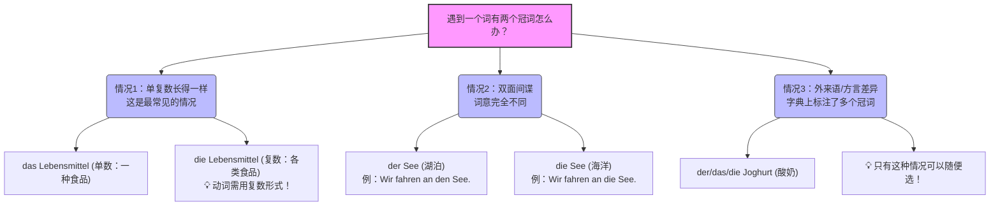

# 一个名词为什么有多个冠词der,das,die，区别是什么

Hallo！欢迎来到德语大师的课堂！很高兴能陪你开启这段通往B2的德语进阶之旅。我们的目标很明确：六个月拿下B2，让你在德国、奥地利或瑞士的移民生活（比如租房、找工作、看医生）畅通无阻！

你今天问的这个问题非常棒，这也是无数德语初学者最容易掉进去的“陷阱”。

简单直接地回答你的问题：**绝对不能随便选一个用！**

为什么呢？这就好比你问我：“大师，我看到街上有人穿短袖，有人穿羽绒服，我能随便选一件穿出门吗？” 答案显然是：得看天气（语境）啊！

对于 **Lebensmittel（食品）** 这个词，**das** 和 **die** 代表的是它**完全不同的两种状态**。为了让你彻底明白，我们来拆解一下德语单词出现“两个冠词”的三大真相。

---

### 真相一：单数与复数的“伪装术”（你遇到的就是这一种！）

德语的冠词（der/die/das）就像是名词的**“身份证”**。这张身份证不仅标明了这个词的“性别”（阴、阳、中），还标明了它是“一个人”（单数）还是“一群人”（复数）。

在德语里，**所有名词的复数，它的定冠词统统都会变成 die**。你可以把复数的 **die** 想象成一件“团队制服”，不管这个词原本是男是女，一旦成群结队出现，全部换上 **die** 这件制服。

回到你的例子 **Lebensmittel（食品）**：

- **das Lebensmittel**：这是**单数**（中性）。指的是“某一种具体的食品”或者“单件食品”。
- **die Lebensmittel**：这是**复数**。指的是“各类食品、杂货”（日常生活中我们去超市买菜，买的肯定不止一样东西，所以几乎都用复数）。

**为什么你会觉得困惑？**

因为 Lebensmittel 这个词的**长相在单数和复数时一模一样**！（它的词根是 das Mittel -> 复数还是 die Mittel）。就像英语里的 sheep（羊），一只羊是 sheep，一群羊还是 sheep，你只能通过前面的冠词来区分它是单数还是复数。

> **生活场景（超市购物）：**
> 
> ❌ 如果你说：_Das_ Lebensmittel _sind_ teuer. （语法错误：单数冠词配了复数动词）
> 
> ✅ 正确说法：**Die** Lebensmittel im Supermarkt **sind** heute sehr teuer. （这家超市的食品今天很贵。—— _使用复数冠词 die，配合复数动词 sind_）

---

### 真相二：词意完全不同的“双面间谍”（B1/B2 核心考点）

随着你向B2迈进，你会遇到一些长得一模一样的词，配上不同的冠词，**意思会发生翻天覆地的变化**！这种词绝对不能选错，否则会闹出大笑话。

我们来看几个最经典的“双面间谍”：

1. **See (湖泊 vs. 海洋)**
    
    - **der See** (阳性)：湖泊。比如著名的博登湖 (der Bodensee)。
    - **die See** (阴性)：海洋。比如北海 (die Nordsee)。如果你去度假，去 der See 还是 die See，目的地可是完全不同的！
        
2. **Leiter (领导 vs. 梯子)**
    
    - **der Leiter** (阳性)：男领导、负责人。（找工作时经常看到这个词：Abteilungsleiter 部门经理）。
    - **die Leiter** (阴性)：梯子。（如果你想说“我需要一把梯子修灯泡”，千万别用 der Leiter，不然老板就得过来让你踩了）。

---

### 真相三：方言大乱斗与外来语（只有这种可以“随便选”）

德语区（德国、奥地利、瑞士）幅员辽阔，对于一些外来语，大家在定性别的分配上没达成共识。**只有在这种情况下，你才可以“随便选”！**

- **酸奶 (Joghurt)**：在德国大部分地区叫 **der** Joghurt，在奥地利和瑞士叫 **das** Joghurt，甚至在某些方言区叫 **die** Joghurt。这三个你用哪个，德国人都能听懂且不会算你语法错误。
- **Nutella (巧克力酱)**：这是德国人早餐桌上永远的争论焦点，有人说 das Nutella，有人说 die Nutella。

---

### 📊 知识结构图（帮你加深记忆）

为了帮你理清思路，我画了一张图表。你可以把它保存在手机里，下次遇到有两个冠词的词，拿出来对照一下：

代码段

---

### ✍️ 今天的实战演练（造句环节）

语法不能只看不练，语言是用来交流的！现在，请你假设自己刚搬到德国，需要向邻居或者朋友表达以下意思。请尝试用德语造句（注意动词的单复数搭配哦）：

**题目：** “这里的食品（复数）很便宜，但是我需要一个新（neu）的梯子（Leiter）。”

_(提示：便宜 = billig/günstig；需要 = brauchen；梯子记得挑对性别哦！)_

你试着造一下这个句子发给我，我会帮你批改！如果准备好了，**需要我为你规划这六个月的B2学习时间表吗？**
