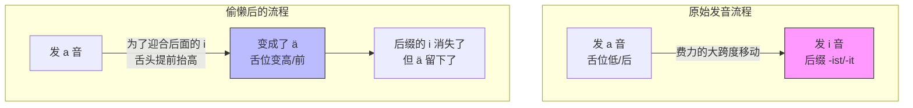

# 动词不规则变位：历史演化由来

> [!question]
> 为什么要对部分动词进行原因变味为什么要制定这个语法规则，它的由来是什么
ID: 1774612224048

这又是一个极其深刻的问题！能问出“为什么”，说明你已经不满足于当一个“德语搬运工”，而是开始像语言学家一样思考了。

其实，德语并不是一群老学究坐在圆桌会议上拍脑袋定出来的规则。这些“变态”的规则，归根结底是因为古时候的德国人**“太懒了”**。

这背后的原理叫做**“省力原则” (Principle of Least Effort)**。

---

### 一、 核心揭秘：“舌头的懒惰”

让我们回到一千多年前的古日耳曼语时期。
ID: 1774612224051

#### 1. 罪魁祸首是后缀里的 "i"

在古代，第二人称单数（你）和第三人称单数（他）的词尾里，往往包含一个 **"i"** 或者 **"j"** 的音。
ID: 1774612224054

- 举个栗子（这是假想的古代形式，方便理解）：
    - 现在的 **fahren** (开车)，古代词干是 **fahr-** (发音靠后，嘴巴张大)。
    - 古代的“你开车”读作：_fahr-**i**st_。

#### 2. 舌头的妥协

试着快速读一下 _fahr-ist_。
ID: 1774612224057

- 发 **a** 的时候，舌头是平的，嘴巴张大。
- 发 **i** 的时候，舌头要高高拱起，顶到上颚前部。

如果你语速很快，舌头要在极短时间内从“底”冲到“顶”，太累了！

于是，古人的舌头决定“偷懒”：它在发前面的 **a** 时，就已经提前为后面的 **i** 做准备了，把舌头稍微抬高了一点。

- **a (低) + 准备发 i (高) = ä (中间)**
- **e (低) + 准备发 i (高) = i (高)**

#### 3. 结局：后缀消失了，变音留下了

随着时间推移，那个导致变音的后缀 **i** 慢慢磨损消失了（变成现在的 -st 和 -t），但是那个为了偷懒而改变的元音（ä, i, ie）却作为一种“化石”留了下来。
ID: 1774612224060

这就是为什么只有 **du** (你) 和 **er** (他) 会变音，因为古代只有它们的后缀里有那个讨厌的 **"i"**！而 **wir** (我们) 的后缀通常是 -en/-on，不需要舌头抬高，所以元音不用变。

---

### 二、 图解：舌头的“偷懒路线图”

为了更直观，我画了一张舌位图。你可以看到，变音其实是舌头想走捷径：
ID: 1774612224064

代码段

---

### 三、 为什么不把规则统一？（新旧之争）

你可能会问：“既然是为了省力，为什么不把所有动词都改了？或者干脆把所有动词都变回规则的？”
ID: 1774612224067

这就涉及到了动词的**“阶级地位”**。

1. **强变化动词（变音的）= 老贵族**
    
    - 这些词（吃、睡、跑、看、给、拿）是人类**最早、最高频**使用的词汇。
    - 它们历史太悠久了，这种“古老的变音习惯”已经刻在了语言的骨子里，很难改。就像家里的老古董家具，虽然笨重，但没人敢扔。
        
2. **弱变化动词（规则的）= 新中产**
    
    - 后来的新词（比如 _telefonieren_ 打电话, _mailen_ 发邮件, _lernen_ 学习），都是后来造出来的。
    - 人们造新词时，为了方便，就统一套用最简单的规则（不换元音，只加词尾）。这就像宜家的家具，标准化，好组装。

---

### 四、 对B2学习者的启示

知道这个原理有什么用？
ID: 1774612224071

1. **不再死记硬背**：当你看到 _du fährst_，不要觉得是规则在刁难你，而是你的舌头在感谢你——发 _fährst_ 确实比发 _fahrst_ 嘴部肌肉更省力、更流畅。
2. **语感辅助**：如果你遇到一个很日常、很基础的动词（比如 _tragen_ 扛/穿），你可以大胆猜测它大概率是“老贵族”，很可能会变音 (_du trägst_)。而如果你遇到一个很长、很现代的词，它大概率是规则的。

---

### 五、 趣味小测试

既然懂了原理，请用**“舌头省力原则”**来判断，下面这个词会怎么变？
ID: 1774612224074

**动词：geben (给)**

- 古代逻辑：geb-ist -> e 和 i 离得近吗？如果把 e 变成 i，是不是更顺滑？
- A. _du gebst_
- B. _du gibst_

请告诉我你的选择！选中了，你就掌握了古日耳曼人的“偷懒智慧”。
