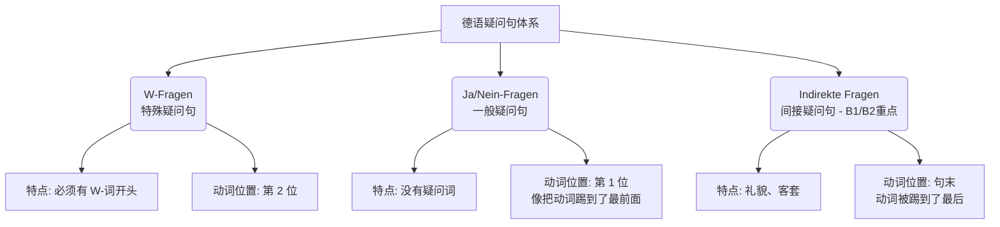

# 各种疑问句区别

你好！很高兴能陪伴你踏上这半年的德语 B2 冲刺之旅。作为你的“德语大师”，我的任务就是让你在最短的时间内，不仅“会做题”，更能“会生存”。

在德国，无论是去外管局（Ausländerbehörde）延签，还是找房东谈合同，**“提问”**是你手中最锋利的武器。如果你不会提问，就无法获取信息，更无法解决问题。

德语的疑问句体系其实非常有逻辑，我们可以把它想象成**“三把不同的钥匙”**，每一把钥匙开门的姿势（语序）都不一样。为了让你一目了然，我为你总结了三大核心类别。

我们先看一张逻辑导图，理清它们的结构关系：

代码段

---

### 特殊疑问句：侦探的“W”放大镜 (W-Fragen)

这是最常用的“开放式提问”，用来获取具体信息（谁、哪里、什么时候）。

- **形象类比**：想象一辆火车。**火车头**是疑问词（W-词），**驾驶室**是动词。在德语陈述句中，动词永远雷打不动地坐在**第 2 位**。在 W-Fragen 中，这个规则依然适用！
- **结构**：`疑问词(W-Wort)` + `动词` + `主语` + `...` ?
- **核心规则**：**W-词占第1位，动词紧随其后占第2位。**

> **移民生活场景 - 市政厅登记 (Anmeldung):**
> - **Wo** _wohnen_ Sie jetzt? (您现在住在哪里？)
> - **Wann** _beginnt_ Ihr Arbeitsvertrag? (您的工作合同什么时候开始？)

---

### 一般疑问句：不是“是”就是“非”的开关 (Ja/Nein-Fragen)

当你只需要确认一个事实，比如“有没有”、“是不是”的时候，就用这把钥匙。

- **形象类比**：**“动词大挪移”**。为了表示强调和疑问，我们把原本坐在第 2 位的动词，一把抓起来，直接**扔到了句首（第 1 位）**！
- **结构**：`动词` + `主语` + `...` ?
- **核心规则**：**没有疑问词，动词直接冲锋陷阵在第1位。**

> **移民生活场景 - 看医生 (Beim Arzt):**
> - _Haben_ Sie eine Krankenversicherung? (您有医疗保险吗？)
> - _Nehmen_ Sie Medikamente? (您在吃药吗？)

---

### 间接疑问句：绅士的“礼貌包装” (Indirekte Fragen)

**注意！这是 B1-B2 级别最重要的考点，也是体现你德语修养的关键。** 直接问别人“你赚多少钱？”很粗鲁，所以我们要把它“包装”进一个主句里。

- **形象类比**：**“动词的流放”**。当你前面加了一句客套话（比如“我想知道...”）时，后面的疑问句就变成了从句。在德语从句中，动词非常害羞，它会**跑到句子的最后面去躲起来**。
- **结构**：`主句(客套话)`，+ `疑问词/ob` + `主语` + `...` + `动词`。
    - 如果是 W-Fragen 变来的，保留 W-词。
    - 如果是 Ja/Nein-Fragen 变来的，用 **`ob` (是否)** 连接。
- **核心规则**：**逗号隔开，变位动词踢到句末。**

> **移民生活场景 - 找工作 (Jobsuche):**
> 
> - **直接问**：Wie hoch ist das Gehalt? (薪水多少？) -> 略显生硬
> - **间接问**：Können Sie mir sagen, wie hoch das Gehalt **ist**? (您能告诉我，薪水是多少吗？)
> - **直接问**：Haben Sie die Stelle schon besetzt? (这职位有人了吗？)
> - **间接问**：Ich möchte wissen, **ob** Sie die Stelle schon besetzt **haben**. (我想知道，您是否已经招到人了。)

---

### 🎯 让我们来实战演练一下

理论讲完了，现在轮到你动手了。请想象你正在**租房 (Wohnungssuche)**，眼前站着房东。

请用德语完成以下任务：

1. **W-Fragen**: 问房东“这套公寓多少钱（租金）？” (`kosten`, `die Wohnung`)
2. **Ja/Nein-Fragen**: 问房东“这套公寓有阳台吗？” (`haben`, `einen Balkon`)
3. **挑战题 (B2 Level)**: 把第 2 句变成间接提问，开头用 _"Darf ich fragen, ..."_ (请问，...)

请试着写出这三句话，我会帮你纠正并讲解其中的细节！
