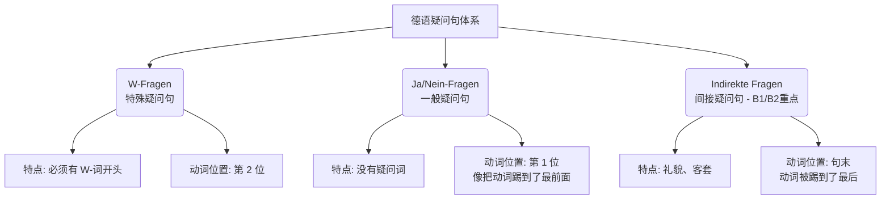
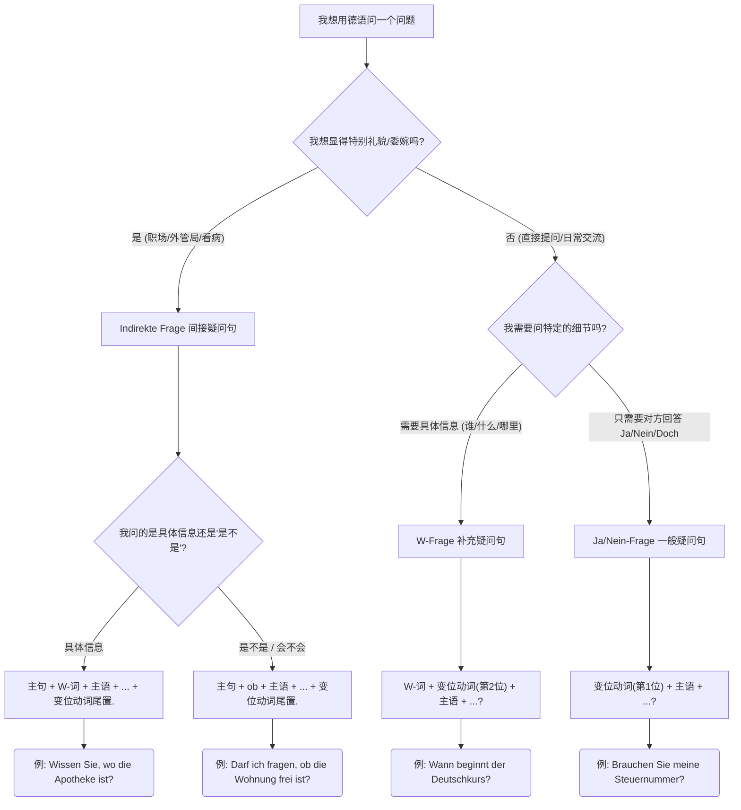

# 各种疑问句区别

你好！很高兴能陪伴你踏上这半年的德语 B2 冲刺之旅。作为你的“德语大师”，我的任务就是让你在最短的时间内，不仅“会做题”，更能“会生存”。

在德国，无论是去外管局（Ausländerbehörde）延签，还是找房东谈合同，**“提问”**是你手中最锋利的武器。如果你不会提问，就无法获取信息，更无法解决问题。

德语的疑问句体系其实非常有逻辑，我们可以把它想象成**“三把不同的钥匙”**，每一把钥匙开门的姿势（语序）都不一样。为了让你一目了然，我为你总结了三大核心类别。

我们先看一张逻辑导图，理清它们的结构关系：

代码段

```mermaid
graph TD
    A[德语疑问句体系] --> B(W-Fragen <br>特殊疑问句)
    A --> C(Ja/Nein-Fragen <br>一般疑问句)
    A --> D(Indirekte Fragen <br>间接疑问句 - B1/B2重点)
    
    B --> B1[特点: 必须有 W-词开头]
    B --> B2[动词位置: 第 2 位]
    
    C --> C1[特点: 没有疑问词]
    C --> C2[动词位置: 第 1 位 <br> 像把动词踢到了最前面]
    
    D --> D1[特点: 礼貌、客套]
    D --> D2[动词位置: 句末 <br> 动词被踢到了最后]
```

---

### 特殊疑问句：侦探的“W”放大镜 (W-Fragen)

这是最常用的“开放式提问”，用来获取具体信息（谁、哪里、什么时候）。

- **形象类比**：想象一辆火车。**火车头**是疑问词（W-词），**驾驶室**是动词。在德语陈述句中，动词永远雷打不动地坐在**第 2 位**。在 W-Fragen 中，这个规则依然适用！
- **结构**：`疑问词(W-Wort)` + `动词` + `主语` + `...` ?
- **核心规则**：**W-词占第1位，动词紧随其后占第2位。**

> **移民生活场景 - 市政厅登记 (Anmeldung):**
> - **Wo** _wohnen_ Sie jetzt? (您现在住在哪里？)
> - **Wann** _beginnt_ Ihr Arbeitsvertrag? (您的工作合同什么时候开始？)

---

### 一般疑问句：不是“是”就是“非”的开关 (Ja/Nein-Fragen)

当你只需要确认一个事实，比如“有没有”、“是不是”的时候，就用这把钥匙。

- **形象类比**：**“动词大挪移”**。为了表示强调和疑问，我们把原本坐在第 2 位的动词，一把抓起来，直接**扔到了句首（第 1 位）**！
- **结构**：`动词` + `主语` + `...` ?
- **核心规则**：**没有疑问词，动词直接冲锋陷阵在第1位。**

> **移民生活场景 - 看医生 (Beim Arzt):**
> - _Haben_ Sie eine Krankenversicherung? (您有医疗保险吗？)
> - _Nehmen_ Sie Medikamente? (您在吃药吗？)

---

### 间接疑问句：绅士的“礼貌包装” (Indirekte Fragen)

**注意！这是 B1-B2 级别最重要的考点，也是体现你德语修养的关键。** 直接问别人“你赚多少钱？”很粗鲁，所以我们要把它“包装”进一个主句里。

- **形象类比**：**“动词的流放”**。当你前面加了一句客套话（比如“我想知道...”）时，后面的疑问句就变成了从句。在德语从句中，动词非常害羞，它会**跑到句子的最后面去躲起来**。
- **结构**：`主句(客套话)`，+ `疑问词/ob` + `主语` + `...` + `动词`。
    - 如果是 W-Fragen 变来的，保留 W-词。
    - 如果是 Ja/Nein-Fragen 变来的，用 **`ob` (是否)** 连接。
- **核心规则**：**逗号隔开，变位动词踢到句末。**

> **移民生活场景 - 找工作 (Jobsuche):**
>
> - **直接问**：Wie hoch ist das Gehalt? (薪水多少？) -> 略显生硬
> - **间接问**：Können Sie mir sagen, wie hoch das Gehalt **ist**? (您能告诉我，薪水是多少吗？)
> - **直接问**：Haben Sie die Stelle schon besetzt? (这职位有人了吗？)
> - **间接问**：Ich möchte wissen, **ob** Sie die Stelle schon besetzt **haben**. (我想知道，您是否已经招到人了。)

---

### 🎯 让我们来实战演练一下

理论讲完了，现在轮到你动手了。请想象你正在**租房 (Wohnungssuche)**，眼前站着房东。

请用德语完成以下任务：

1. **W-Fragen**: 问房东“这套公寓多少钱（租金）？” (`kosten`, `die Wohnung`)
2. **Ja/Nein-Fragen**: 问房东“这套公寓有阳台吗？” (`haben`, `einen Balkon`)
3. **挑战题 (B2 Level)**: 把第 2 句变成间接提问，开头用 _"Darf ich fragen, ..."_ (请问，...)

请试着写出这三句话，我会帮你纠正并讲解其中的细节！

# 各种疑问句

你好！很高兴看到你对德语语法有着如此系统化的追求。掌握了疑问词只是第一步，知道**如何把疑问词正确地放进句子里，以及如何根据不同场合选择正确的提问方式**，才是 B 1–B 2 阶段真正拉开差距的地方。

在德国的实际生活中（尤其是在外管局、诊所或面试中），你不仅需要直接提问，更需要学会“委婉提问”。为了让你清晰地掌握这一切，我为你系统梳理了德语中所有的疑问句类型。

我们遵循“准确第一”的原则：德语疑问句的核心区别永远在于**动词的位置 (Position des Verbs)**。请务必记住这个铁律。

### 德语核心疑问句型对比与应用总表 (Vergleich der Fragesätze)

|**疑问句类型 (Fragesatz-Typ)**|**句法结构 (Wortstellung)**|**语用作用 (Funktion)**|**回答方式 (Antwortart)**|**移民生活例句与翻译 (Beispiele)**|
|---|---|---|---|---|
|一般疑问句         (Ja/Nein-Frage / Entscheidungsfrage)|**动词第一位**         变位动词 + 主语 + 其他成分 + ?|确认某事是否属实，用于直接的请求、提议或核实。|**封闭式回答**         Ja (是)         Nein (否)         Doch (用于肯定地回答“否定形式的提问”)|**Haben** Sie meine Bewerbungsunterlagen erhalten?         (您收到我的求职材料了吗？)|
|补充疑问句         (W-Frage / Ergänzungsfrage)|**动词第二位**         疑问词 + 变位动词 + 主语 + 其他成分 + ?|询问具体细节（如时间、地点、人物、原因等），直奔主题。|**开放式回答**         必须提供具体信息，绝对不能仅用 Ja 或 Nein 回答。|**Welche** Dokumente **brauche** ich für die Anmeldung?         (登记户口我需要哪些文件？)|
|间接疑问句 - 是非型         (Indirekte Frage mit "ob")|**动词尾置 (从句结构)**         主句, + **ob** + 主语 + 其他 + **变位动词**.|B 1/B 2 核心语法。在正式场合（如面对政府官员）极其委婉、礼貌地询问是非问题。|根据主句的意思，通常需要给出确认或否定的答复。|Ich möchte gerne wissen, **ob** meine Aufenthaltserlaubnis verlängert **wird**.         (我想了解一下，我的居留许可是否会被延长。)|
|间接疑问句 - 细节型         (Indirekte Frage mit W-Wort)|**动词尾置 (从句结构)**         主句, + **疑问词** + 主语 + 其他 + **变位动词**.|委婉地询问具体细节。常跟在礼貌的开场白之后，职场邮件或电话必备。|提供对方所需的具体细节信息。|Könnten Sie mir bitte sagen, **wann** der Arzt Zeit **hat**?         (您能告诉我医生什么时候有空吗？)|
|修辞疑问句/反问句         (Rhetorische Frage)|语序同一般/补充疑问句。常加入情态小品词 (Modalpartikeln) 如 _denn, doch, eigentlich_。|表达惊讶、不满、强调或引发思考，**发话者心里已有答案，不期待对方真正回答**。|不需要回答，或顺着对方的语气附和/辩解。|**Ist** die Kaltmiete **denn** wirklich so hoch?         (这冷租难道真有这么高吗？)|
|回声/确认疑问句         (Echofrage)|**通常保留原陈述句语序**，或将疑问词放在句末，句尾升调。|在口语中没听清、没听懂，或者对听到的内容感到极其震惊时，向对方求证。|澄清刚才说过的话，或者重复一遍具体信息。|Ich muss die Kaution **bis wann** überweisen?         (我得在什么时候之前转完押金？)|

### 疑问句的核心法则（请直接背诵）：

1. **只要有 W-疑问词（独立成句）：** 动词永远在**第 2 位**。
2. **只要没有疑问词（直接提问）：** 动词永远在**第 1 位**。
3. **只要是间接疑问句（前面有主句铺垫）：** 它就是从句，动词永远被踢到**最后 1 位**。

### 语法结构逻辑导图 (Mermaid 可视化)

^ftoikz

正如我们之前提到的，Mermaid 是一种基于 JavaScript 的工具，它可以像写 Markdown 一样，通过文本和代码直接生成图表和可视化内容。为了让你更直观地在脑海中建立德语疑问句的判断逻辑，我为你制作了下面这个决策树流程图。

你可以把它保存在手机里，每次开口前在脑子里走一遍这个流程：

代码段

```mermaid
graph TD
    A[我想用德语问一个问题] --> B{我想显得特别礼貌/委婉吗?}
    
    B -->|"是 (职场/外管局/看病)"| C[Indirekte Frage 间接疑问句]
    C --> C1{我问的是具体信息还是'是不是'?}
    C1 -->|具体信息| C2[主句 + W-词 + 主语 + ... + 变位动词尾置.]
    C2 --> C3(例: Wissen Sie, wo die Apotheke ist?)
    C1 -->|是不是 / 会不会| C4[主句 + ob + 主语 + ... + 变位动词尾置.]
    C4 --> C5(例: Darf ich fragen, ob die Wohnung frei ist?)
    
    B -->|"否 (直接提问/日常交流)"| D{"我需要问特定的细节吗?"}
    D -->|"需要具体信息 (谁/什么/哪里)"| E[W-Frage 补充疑问句]
    E --> E1["W-词 + 变位动词(第2位) + 主语 + ...?"]
    E1 --> E2(例: Wann beginnt der Deutschkurs?)
    
    D -->|"只需要对方回答 Ja/Nein/Doch"| F["Ja/Nein-Frage 一般疑问句"]
    F --> F1["变位动词(第1位) + 主语 + ...?"]
    F1 --> F2("例: Brauchen Sie meine Steuernummer?")
```

### 导师的特别提醒：关于 "Doch" 的必考用法

在 B 1-B 2 考试的口语和听力中，**Doch** 是一个极高频的考点。

当别人用**否定词**（nicht, kein, nie 等）向你提问时：

- 如果你要**肯定（反驳他的否定）**，你必须用 **Doch**。
- 例句场景（租房）：
    - 房东问：_Haben Sie **keinen** Arbeitsvertrag? (您没有工作合同吗？)_
    - 你回答：_**Doch**, ich habe einen unbefristeten Arbeitsvertrag._ (不/我有，我有一份无限期工作合同。)

这套表格和图表已经涵盖了你应对任何德语提问场景的所有武器。请反复对比不同句型中**动词位置**的变化。你对这部分的理解还有没有任何死角？如果没有，我们下次就可以开始利用这些结构，进入“从句系统”的深度训练了！
