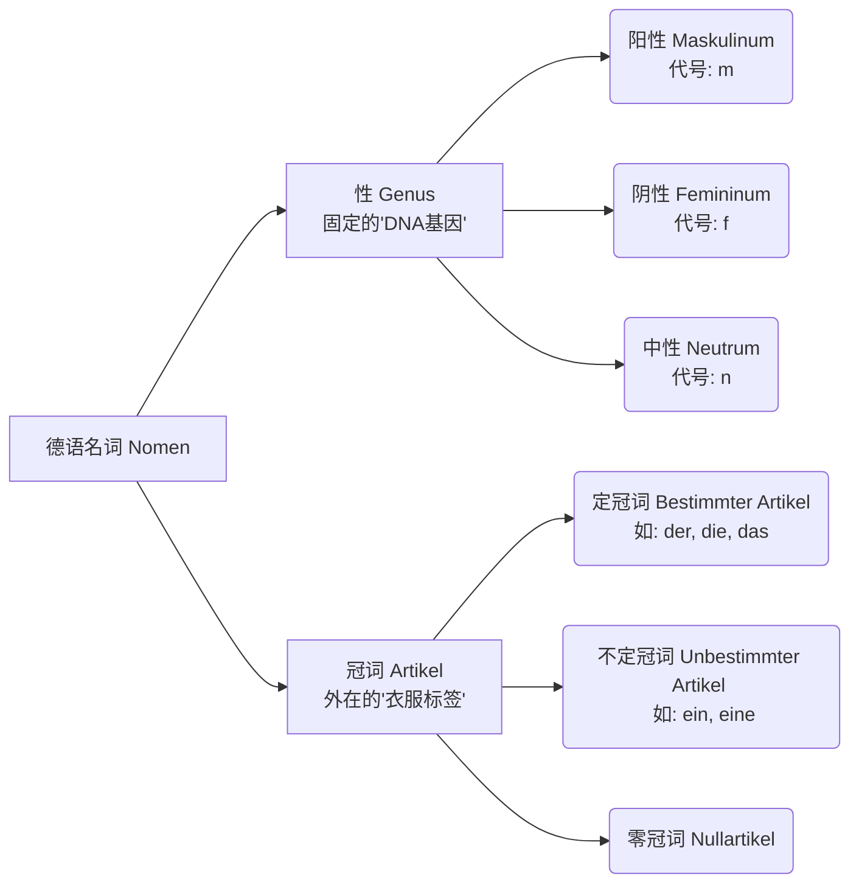
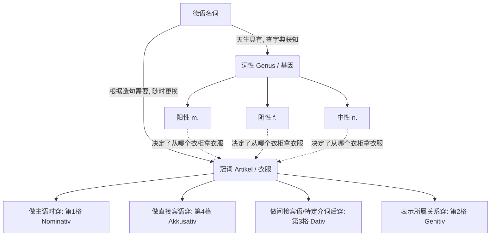

# 性与冠词 的 区别

Hallo！欢迎再次来到德语大师的课堂！
ID: 1774612223996

你提出的这个问题非常有深度，而且**极其关键**！很多同学哪怕学到了B1甚至B2阶段，在写从句或者变格的时候依然会频频出错，根本原因就是**在启蒙阶段，没有把“性”（Genus）和“冠词”（Artikel）这两个概念彻底分开。**

如果用一句话来概括它们的区别：**“性”是名词天生的“DNA基因”，永远不会变；而“冠词”是名词穿在身上的“衣服”，会随着场合（语法规则）随时更换！**

为了让你在六个月内顺利冲刺B2，我们必须在今天把这块地基打得坚如磐石。

我们先用一张图表来看看它们的关系：

代码段

接下来，我们用生动的例子来详细拆解这两个概念：

### 1. 性 (Genus)：名词的“绝对基因”

在德语的宇宙里，每一个名词在诞生的那一刻，上帝就给它分配了一个固定的“性别基因”。这个基因分为三种：
ID: 1774612223999

- **阳性 (Maskulinum, 简称 m.)**
- **阴性 (Femininum, 简称 f.)**
- **中性 (Neutrum, 简称 n.)**

**核心要点：这个“性”是长在肉里的，一辈子都不会改变！**

- **场景（找工作）：** 简历这个词 **Lebenslauf**，它的“基因”就是阳性（m.）。无论它走到天涯海角，在句子里做主语还是宾语，它的内里永远是个“阳性汉子”。
- **场景（租房）：**

    房间这个词 **Zimmer**，它的“基因”就是中性（n.）。它永远是中性，不会因为住进来一个女孩就变成阴性。

初学者最大的误区，就是试图用人类的自然性别去理解德语的词性。请记住，在德语里，“女孩”（Mädchen）的基因是中性（n.），而“月亮”（Mond）是阳性（m.），“太阳”（Sonne）是阴性（f.）。所以，**不要问为什么，这就是它们的DNA！**

### 2. 冠词 (Artikel)：名词的“外在制服”

如果说“性”是名词的基因，那么“冠词”就是名词出门时穿的**“衣服”**或者戴的**“身份铭牌”**。
ID: 1774612224002

名词自己不能“裸奔”出门，它需要穿上冠词，来告诉别人两件事：

1. **它是什么基因（性）？** 2. **它在这个句子里扮演什么角色（格 Kasus，也就是主语、宾语等）？**

最常见的基础款“制服”就是我们在第一格（主语）时看到的定冠词：**der（男装）, die（女装）, das（童装/中性装）**。

- **找工作的阳性汉子 (Lebenslauf)：** 穿上第一格的男装，就是 **der Lebenslauf**。
- **租房的阴性女士 (Wohnung)：** 穿上第一格的女装，就是 **die Wohnung**。

### 为什么区分它们在B1/B2阶段如此重要？(大师的敲黑板时间)

在初学阶段（A1），因为名词通常都在做主语，阳性就穿 **der**，阴性就穿 **die**，中性就穿 **das**。这时候，“衣服”（冠词）和“基因”（性）看起来是一一对应的，所以大家很容易把它们混为一谈，以为 `der = 阳性`。
ID: 1774612224005

**但这是极其危险的错觉！**

到了A2/B1阶段，名词要在句子里扮演不同的角色（比如做宾语，或者跟在介词后面），这就需要**变格（Deklination）**。

**变格的本质，就是名词在不同的场合，要换上不同的“冠词衣服”，但它的“基因（性）”绝对没有变！**

我们来看一个极其经典的**医疗场景**例子：

> 医生（女）的德语是：**Ärztin**。它的基因是**阴性（f.）**。
> 
> - 当她是句子的**主语**时（第一格 Nominativ）：
>     
>     - **Die Ärztin** ist sehr nett. (这位女医生很好。) -> _阴性基因，穿上了标准的 die 外套。_
>         
> - 当你去诊所看病，你想说“我在帮助这位女医生”时（德语中 helfen '帮助' 后面必须加**第三格 Dativ**）：
>     
>     - Ich helfe **der Ärztin**. (我在帮助这位女医生。) -> _注意看！这里的冠词变成了 **der**！_

如果你把“冠词”和“性”混为一谈，看到 **der Ärztin**，你的大脑就会死机：“天呐！女医生怎么变成阳性（der）了？！”

但现在你是德语大师的学生，你立刻就能明白：

**Ärztin 的基因依然是绝对的阴性！她只是因为走进了“第三格”这个特定的房间（跟在 helfen 后面），按照语法规则，阴性名词在第三格时，必须脱掉 die 外套，换上 der 外套！**

这里的 **der** 根本不是阳性的意思，它是一件名为“阴性-第三格”的特殊制服！

---

### 总结一下：

1. **性 (Genus)** 是字典里标定的 m. / f. / n.，是名词的灵魂，**永远不变**。
2. **冠词 (Artikel)** 是写在名词前面的 der/die/das/ein/eine，是名词的衣服，会随着语法规则**千变万化**。
ID: 1774612224007

所以，以后背单词，不要说“这个词是 der”，而要说“这个词的性是阳性，它的第一格定冠词是 der”。

### 现在的实战演练时间！

为了检验你是否真的悟透了“基因”和“衣服”的区别，请看下面这个**行政事务场景**的句子：
ID: 1774612224011

> **场景：** 你去外管局（Ausländerbehörde）办事，工作人员对你说：
> 
> _"Geben Sie mir bitte **den Pass**."_ (请把护照给我。)

**请你像个侦探一样，回答我两个问题：**

1. 护照 (**Pass**) 在这里的冠词（衣服）是什么？
2. 请你推测一下，**Pass** 这个名词，它本来的“性”（基因）是什么？（提示：在这句话里，它扮演的是第四格 Akkusativ，也就是直接宾语角色。）

大胆说出你的推理，我会为你提供即时的反馈！准备好迎接挑战了吗？

# 所以名词它的姓并不由背单词的时候但是软件给他定的der das die决定,而是由他自己在句子中出现的位置决定?

Hallo！别急，深呼吸！作为你的德语大师，看到你的这个回复，我必须要立刻“踩一脚刹车”！
ID: 1774612224014

你刚才得出的结论，**刚好完完全全说反了！** 不过千万别气馁，你能把这个逻辑推演出来并向我提问，说明你在真正地思考语言的底层逻辑。这恰恰是90%的德语学习者在通往B2路上必定会绊倒的“鬼门关”。今天我们只要把这层窗户纸彻底捅破，你以后的德语进阶之路将畅通无阻！

请务必牢记大师的这句黄金法则：

**名词的“性”（DNA），绝对是由字典和背单词软件里的出厂设置决定的，永远不变！而它前面的“冠词”（衣服），才是由它在句子里的位置和角色决定的！**

为了让你彻底看清它们的运作方式，我们再来看一个结构图：

代码段

### 为什么背单词软件要给你定 der/die/das？

字典或软件里标注的 `der / die / das`，其实是名词穿上**第一格（做主语时）的标准制服**。
ID: 1774612224017

德国人之所以用第一格的冠词来标记单词，是因为**这是识别名词“基因（性）”最直观的标签**：

- 看到字典里写 `der`，你就知道它的出厂基因是**阳性**。
- 看到字典里写 `die`，你就知道它的出厂基因是**阴性**。
- 看到字典里写 `das`，你就知道它的出厂基因是**中性**。

如果你连它的出厂基因都不知道，当它走到句子里需要变格（换衣服）的时候，你就根本不知道该去“阳性衣柜”、“阴性衣柜”还是“中性衣柜”里找衣服！

### 场景实战：见证“基因不变，衣服变”的奇迹

我们拿德国移民生活中最让人头疼的一个词来举例：**Termin（预约/档期）**。
ID: 1774612224020

1. **查字典确认基因：**

    背单词软件告诉你，它是 **der Termin**。这就意味着，上帝给它敲定了**阳性（m.）**的基因。这辈子它都是阳性了，不可能变成阴性或中性。

2. **在句子中疯狂换衣服（变格）：**

    现在，这个阳性的 Termin 要去不同的句子里“跑龙套”了：

- **场景A（做主语 - 第1格）：**
    - _"**Der Termin** ist sehr wichtig."_ (这个预约很重要。)
    - _大师解析：_ 在这里它是主语，所以从阳性衣柜里拿出了第一格的衣服 **der**。
- **场景B（做直接宾语 - 第4格）：**

    _你去外管局办事，你想说：_ _"Ich brauche dringend **einen Termin**."_ (我急需一个预约。)

    - _大师解析：_ 这里的 Termin 还是阳性！但是因为它是动词 brauchen (需要) 的直接宾语（第四格），它必须脱掉 der 的外套，换上第四格的衣服 **einen** (或者定冠词 den)。
- **场景C（跟在特定介词后面 - 第3格）：**
    - _"Nach **dem Termin** gehe ich zur Arbeit."_ (在这个预约之后，我去上班。)
    - _大师解析：_ 这里的 Termin 依然是阳性！但是德语规定，介词 nach (在...之后) 后面必须穿第三格的衣服。所以阳性名词在这里要换上 **dem** 这件衣服。

### 给你的六个月 B2 学习规划建议 (关于语法地基)：

在接下来的两周里，你的首要任务是**死磕“四个格”的变格表**。
ID: 1774612224024

在B1和B2级别，你会学到极其复杂的“形容词词尾变化”和“关系从句”。如果你不知道名词的“天生词性”，或者不知道动词/介词要求它穿第几格的“衣服”，你的德语句子就会像穿错了衣服出门一样，显得非常奇怪。

### 现在的实战演练时间！

刚刚我们重新纠正了底层逻辑，现在让我来考考你！

假设你在租房场景中，遇到了这样一个名词：**Mietvertrag (租房合同)**。

背单词软件告诉你，它的字典原形是：**der Mietvertrag** (阳性名词)。

现在，房东把合同递给你，动词是 **unterschreiben** (签署)。这个动词要求后面的名词做**直接宾语（第四格 Akkusativ）**。

请问，如果你想用德语表达 **“我签署这份租房合同”** (Ich unterschreibe ... )，

Mietvertrag 应该穿上什么冠词衣服？它的“性”发生改变了吗？

请告诉我你的答案，如果答对，我们就顺利通关，向下一个B1核心语法点进发！
