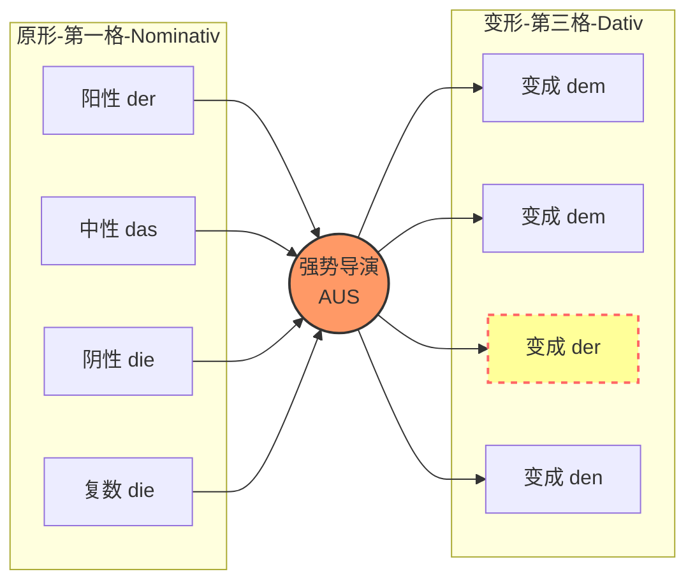
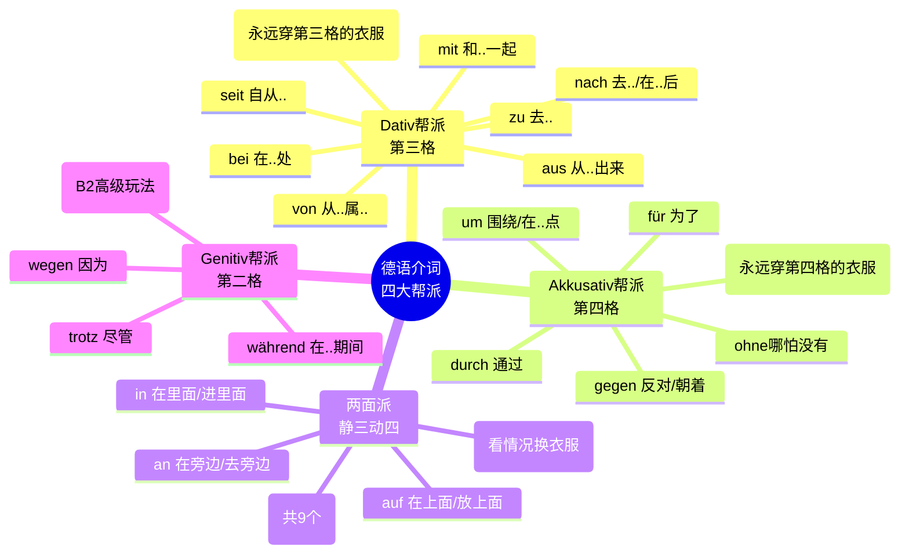

## 问题由来
 **Hallo. Ich heiße Kasimir. Seid ihr im Deutschkurs B?** 你好。我叫卡西米尔。你们是在 B 级德语班吗？
- **Nein, wir sind im Kurs C.** 不，我们在 C 班。

## 问题

> [!question]
> . Seid ihr im Deutschkurs B?** im 是什么

## 解答

你好！很高兴看到你这么敏锐地观察到了这个现象。我是你的“德语大师”。

直接回答你的问题：**是的，完全正确！这就是原来的定冠词 `der`, `das`, `die` 的“变形”（在语法上我们称之为“变格”）。**

而且你触碰到了德语B1-B2阶段最核心、也最容易让人头晕的概念——**格（Kasus）**。

别担心，我们不背枯燥的表格。为了让你在六个月内搞定B2，我们要用一种“角色扮演”的思路来理解它。

---

### 1. 核心概念：`aus` 是一个强势的“导演”

想象一下，德语的单词（名词）是一群演员。

- **Der / Die / Das** 是他们原本穿的“便服”（这时候叫第一格/Nominativ，主格）。

但是，介词 `aus`（意思是：从...出来/来自...）是一个非常强势的导演。在这个导演的片场里，有一条铁律：

**所有跟在他屁股后面的演员，必须立刻换上“第三格（Dativ）”的戏服！**

不管你愿不愿意，只要 `aus` 出现，后面的定冠词就必须变形。

### 2. 变形逻辑图解

为了让你看得更清楚，我们来看一下这套“换装规则”。你会发现，你列出的公式其实就是这套规则的体现。

代码段

### 3. 为什么你会觉得困惑？（重点！）

你最大的困惑可能在于：**为什么阴性（原本是 die）变成了 der？这不是男人的词吗？**

这就是德语最像“卧底”的地方：

- 在第一格（主语）里，`der` 是阳性（男人）。
- 在第三格（Dativ）里，`die` 会穿上 `der` 的衣服，伪装成男人！

所以，当你看到 `aus der ...` 时，千万不要以为后面接的是阳性名词。如果在 `aus` 后面看到 `der`，那只有一种可能：**后面跟的是一个阴性名词（如门、厨房、公寓）。**

### 4. 结合移民场景的实战记忆法

作为未来的德国移民，我们要把这些规则用到生活里。我们来修正和扩充你的“三种公式”，加上中性（das）：

#### 场景一：租房与搬家 (Wohnen)

- **公式 1：aus + dem (阳性 Der / 中性 Das 变身)**
    - _原文：_ Der Keller (地下室), Das Haus (房子)
    - _变形：_ Ich komme **aus dem** Keller. (我从地下室出来。)
    - _变形：_ Er kommt **aus dem** Haus. (他从房子里出来。)
    - _口诀：_ **男(Der)和中(Das)，遇到 aus 变成姆(m)。**

#### 场景二：找工作与行政 (Arbeit & Behörde)

- **公式 2：aus + der (阴性 Die 变身 -> 你的困惑点)**
    - _原文：_ Die Firma (公司), Die Wohnung (公寓)
    - _变形：_ Ich gehe **aus der** Firma. (我走出公司。)
    - _变形：_ Wir ziehen **aus der** Wohnung aus. (我们搬出这间公寓。)
    - _口诀：_ **女(Die)变男(Der)，只因 aus 在前边拦。**

#### 场景三：自我介绍 (Vorstellung)

- **公式 3：aus + den (复数 Die 变身)**
    - _原文：_ Die USA (美国 - 复数国名)
    - _变形：_ Ich komme **aus den** USA. (我来自美国。)
    - _口诀：_ **复数(Die)变蛋(den)，后面名词常加 n。** (注意：如果是普通名词复数，词尾通常还要加个n，比如 aus den Kinder**n** - 选自孩子们)。

---

### 5. 大师的总结与下一步

你的直觉很准！这就是定冠词在第三格（Dativ）下的变形。

**规律总结：**

1. **阳性/中性** 是一对好基友，都变成了 **dem**。
2. **阴性** 变成了 **der** (这是最容易搞混的！)。
3. **复数** 变成了 **den**。

---

### 💡 下一步行动：趁热打铁

为了确保你完全掌握这个“换装游戏”，我给你三个单词，请你用 `Ich komme aus ...` (我从...出来/来自...) 来造句，注意定冠词的变化：

1. **das Büro** (办公室 - 中性)
2. **die Küche** (厨房 - 阴性)
3. **der Supermarkt** (超市 - 阳性)

试着写出答案，我会帮你检查！

# 到底只是aus所以一个介词有变革还是所有介词都有变格

非常棒！这正是一个想在六个月内攻克B2的学习者该有的敏锐度。你不仅仅是在“学”，你是在“审视”这个语言系统。

直接回答你：**你的直觉完全正确。所有的介词都有“变格”要求！**

之前只讲 `aus` 是为了让你先尝尝味道（遵循咱们“每次只讲一个点”的规则），但既然你已经看破了红尘，那我们就把**德语介词的完整版图**铺开来看看。

在德语中，介词就是**独裁者**。每一个介词都有它固定的“地盘”和“着装要求”。根据它们要求的格（Case），我们可以把介词分为**四大帮派**。

为了让你一目了然，我为你画了这张战略地图：

代码段

---

### 详细拆解：移民生活中的“潜规则” #ak

为了让你在六个月内达到B2，我们暂时不需要死记硬背所有单词，但必须掌握前三个帮派的核心逻辑。
<!--ID: 1771319860478-->
#### 1. Dativ 帮派（第三格）：`aus` 的兄弟们

这个帮派最固执，不管动作怎么变，只要见到它们，后面的名词必须变成第三格（Dativ）。

- **口诀：** `aus, bei, mit, nach, seit, von, zu` （这七个最常用，一定要背熟！）
- **变化复习：** * Der (阳) $\rightarrow$ **dem**
    - Das (中) $\rightarrow$ **dem**
    - Die (阴) $\rightarrow$ **der** (你的痛点)
    - Die (复) $\rightarrow$ **den**
- **生活场景（看病）：**
    - Ich gehe **zu dem** Arzt. (我去医生那里。) -> `zu` 强制后面变 `dem`。

#### 2. Akkusativ 帮派（第四格）：比较友好的帮派

这个帮派稍微仁慈一点。为什么？因为在第四格里，**只有阳性（男人）需要变，其他人都不变！**

- **常用词：** `für` (为了), `ohne` (没有), `um` (围绕/时间)
- **变化规则：**
    - Der (阳) $\rightarrow$ **den** (注意！这里是den，不是dem)
    - Das $\rightarrow$ Das (不变)
    - Die $\rightarrow$ Die (不变)
    - Die (复) $\rightarrow$ Die (不变)
- **生活场景（求职）：**
    - Das ist **für den** Chef. (这是给老板的。) -> 老板是阳性 `der Chef`，`für` 让他变成了 `den Chef`。
    - Das ist **für die** Firma. (这是给公司的。) -> 公司是阴性，在第四格里不用变！

#### 3. “两面派” (Wechselpräpositionen)：B1-B2 的分水岭

这是最让中国人头疼，也是考试必考的。这9个介词（如 `in`, `an`, `auf`）没有固定立场，它们看**动作**：

- **静止 (Wo? 在哪里?) $\rightarrow$ 第三格 (Dativ)**
- **移动 (Wohin? 去哪里?) $\rightarrow$ 第四格 (Akkusativ)**
- **生活场景（租房/位置）：**
    - **情况A（移动）：** 我走进厨房。 (动作：从外到内)
        - Ich gehe **in die** Küche. (厨房是阴性，第四格不变，还是 `die`)
    - **情况B（静止）：** 我站在厨房里。 (状态：没动窝)
        - Ich stehe **in der** Küche. (厨房是阴性，第三格变成了 `der`！)

---

### 大师的总结

你之前看到的 `aus + der/dem` 只是**Dativ帮派**的一个缩影。

现实是：

1. **Dativ 帮派**：总是把后面的词变成第三格（dem/der/den）。
2. **Akkusativ 帮派**：总是把后面的词变成第四格（den/das/die）。
3. **两面派**：看你是动还是静。

### 💡 下一步挑战

为了验证你是否理解了“不同介词有不同规则”，请看下面两个句子，虽然都是“父亲 (der Vater)”，但因为介词不同，变化也不同。

请填空（填 **dem** 还是 **den**？）：

1. **Dativ帮派 (mit = 和...一起):**

    Ich spreche mit ______ Vater. (我和父亲说话。)

2. **Akkusativ帮派 (für = 为了/给):**

    Das Geschenk ist für ______ Vater. (这礼物是给父亲的。)

试着填一下？这两个填对了，你就迈过了德语语法的第一道坎！
