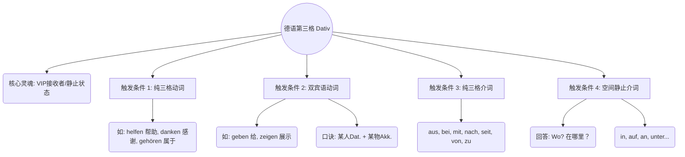
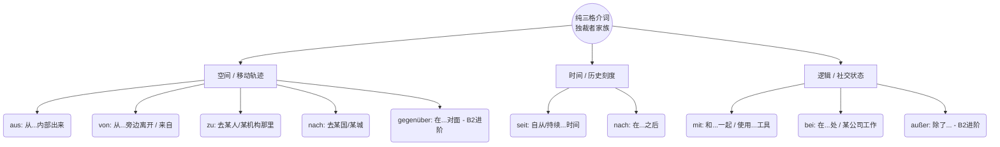

[[四个格]]
# 第三格

![[Pasted image 20260224191908.png]]
ID: 1774612223758

![[Pasted image 20260224192327.png]]

## 使用第三格的情况：

### 常见要求加第三格宾语的动词：

![[Pasted image 20260224192453.png]]
ID: 1774612223761

![[Pasted image 20260224192714.png]]

![[Pasted image 20260224192745.png]]

![[Pasted image 20260224193518.png]]

![[Pasted image 20260224193614.png]]

![[Pasted image 20260224202518.png]]

### 人三物四：第三格作双宾语动词的间接宾语

注意只有宾语是人和物品同时存在的时候才有人三物四的这个真理，在其他句子中可能只有一个人称代词或物品，都有可能是第三个格或第四格。
ID: 1774612223764

[[10 第三格 Dativ#第三格只能是人，第四格只能是物吗？]]

![[Pasted image 20260224202632.png]]

![[Pasted image 20260224210257.png]]

### 第三格作介词宾语

[[10 第三格 Dativ#所有第三格介词]]
ID: 1774612223767

![[Pasted image 20260224212854.png]]

![[Pasted image 20260224212925.png]]

#### 2. 根据句意判断格的介词：

![[Pasted image 20260224213004.png]]
ID: 1774612223770

### 小结：使用第三格的情况

![[Pasted image 20260224213020.png]]
ID: 1774612223773

### 三格变化

#### 人称代词

![[Pasted image 20260224221603.png]]
ID: 1774612223776

#### 冠词

![[Pasted image 20260224221621.png]]
ID: 1774612223780

#### 物主代词

![[Pasted image 20260224221656.png]]
ID: 1774612223783

#### 指示代词
![[Pasted image 20260225201601.png]]
ID: 1774612223786

![[Pasted image 20260225201731.png]]

### 练习

![[Pasted image 20260224221744.png]]

![[Pasted image 20260224221801.png]]

# 对话练习

![[Pasted image 20260225154441.png]]
ID: 1774612223792

# Ai 解析第三格教程

今天，我们要集中火力攻克德语语法中的一座大山——**第三格（Dativ，简称 Dat.）**。
ID: 1774612223795

别怕，很多初学者听到“变格”就头疼，但其实你可以把德语的“格”想象成一场**戏剧中的角色分配**：

- **第一格（Nominativ）**：**导演/主角**（动作的发出者——“谁干的？”）。
- **第四格（Akkusativ）**：**直接道具**（被动作直接影响的东西——“干了什么？”）。
- **第三格（Dativ）**：**VIP受益人 / 接收者**（动作的最终指向——“为了谁？给谁？”）。

为了让你一目了然，我为你准备了一张“第三格全景触发图”：

代码段

接下来，我们把这些知识点拆解，融入你未来的移民生活场景中！

---

### 第一步：第三格的“变装规则”（形态变化）

在第三格的舞台上，名词前面的冠词（定冠词、不定冠词）以及代词，都需要换上特定的“戏服”。
ID: 1774612223798

**1. 冠词的变身（请记住这个谐音口诀：“男中m，女r，复数n”）**

- **阳性 (der) & 中性 (das)** $\rightarrow$ **dem** / **einem** (尾巴是 **-m**)
- **阴性 (die)** $\rightarrow$ **der** / **einer** (尾巴是 **-r**)
- **复数 (die)** $\rightarrow$ **den** + **名词词尾加 -n** (尾巴全是 **-n**)

> ⚠️ **大师的救命提醒（生死攸关的复数-n）：**
> 
> 在第三格的复数形式中，不仅冠词变成 **den**，**名词本身也必须在词尾加个“-n”**！（除非名词复数已经以 -n 或 -s 结尾）。
> 
> _例如：die Kinder (孩子们) $\rightarrow$ **den** Kinder**n**._

**2. 人称代词的变身（我是我，你是你，但在第三格里我们不一样）**

- ich $\rightarrow$ **mir** (给我)
- du $\rightarrow$ **dir** (给你)
- er/es $\rightarrow$ **ihm** (给他/它)
- sie $\rightarrow$ **ihr** (给她)
- wir $\rightarrow$ **uns** (给我们)
- ihr $\rightarrow$ **euch** (给你们)
- sie/Sie $\rightarrow$ **ihnen/Ihnen** (给他们/给您)

---

### 第二步：四大“召唤”第三格的场景（核心用法）

什么时候该让第三格出场？只要满足以下四个条件之一，第三格就必须无条件现身！
ID: 1774612223800

#### 场景 1：死忠粉——“纯三格动词” (Verben mit Dativ)

有些动词天生就“偏爱”人，它们代表一种人际互动。当你使用这些动词时，后面的对象必须是第三格。
ID: 1774612223803

- **helfen (帮助)** / **danken (感谢)** / **gehören (属于)** / **passen (合适)** / **gefallen (讨人喜欢)** / **gratulieren (祝贺)**

> 🏢 **移民生活实战（找工作 & 融入）：**
> 
> - Ich helfe **dem neuen Kollegen**. (我帮助这位新同事。阳性 der Kollege $\rightarrow$ dem Kollegen，注意这里还有N-Deklination的变化)
>     
> - Das Auto gehört **meinem Chef**. (这辆车属于我的老板。阳性 $\rightarrow$ meinem)
>     
> - Die Wohnung gefällt **mir** sehr! (这套公寓太合我心意了！代词 $\rightarrow$ mir。_找房必备神句！_)

#### 场景 2：左拥右抱——“双宾语动词” (Dativ + Akkusativ)

很多表示“给予、传递”的动词，需要两个宾语。
ID: 1774612223806

**黄金法则：人三物四 (Dat. 给某人 + Akk. 某物)**。把“物”当做被传递的道具（第四格），把“人”当做高高在上的VIP接收者（第三格）。

- **geben (给)** / **schenken (赠送)** / **zeigen (展示)** / **erklären (解释)** / laden

> 🏥 **移民生活实战（医疗 & 行政）：**
> 
> - Ich gebe **der Ärztin** (Dat. VIP接收者) **meine Versichertenkarte** (Akk. 道具物). (我把医保卡交给女医生。)
>     
> - Der Beamte erklärt **mir** (Dat.) **das Formular** (Akk.). (签证官向我解释这份表格。)

#### 场景 3：铁哥们——“纯三格介词” (Präpositionen mit Dativ)

德语里有七个最常用的介词，只要它们一出现，后面的词就像被施了魔法，必须100%变成第三格。
ID: 1774612223810

**请像背诵咒语一样记住它们：aus, bei, mit, nach, seit, von, zu，**

_(提示：你可以用著名儿歌《两只老虎》或《蓝色多瑙河》的调子把这七个词唱出来，我保证你一辈子忘不掉！)_

> 🚌 **移民生活实战（日常出行 & 租房）：**
> 
> - **mit (和...一起 / 乘坐...)**: Ich fahre **mit dem Bus** (der Bus $\rightarrow$ dem) zum Rathaus. (我坐公交车去市政厅。)
>     
> - **bei (在...某人处 / 某公司工作)**: Ich wohne **bei meiner Tante** (die Tante $\rightarrow$ meiner). (我住在我阿姨家。)
>     
> - **seit (自从...)**: Ich lebe **seit einem Jahr** (das Jahr $\rightarrow$ einem) in Deutschland. (我在德国生活一年了。)
>     
> - **zu (去某人那里 / 去某机构)**: Ich muss **zum Arzt** (zu + dem = zum) gehen. (我得去看医生。)

#### 场景 4：沙发土豆——“表示静止的介词” (Wechselpräpositionen + Wo?)

德语里有一组特殊的介词（in, an, auf, unter, über, vor, hinter, neben, zwischen），它们非常“墙头草”。
ID: 1774612223813

- 如果表示**移动、方向 (Wohin? 去哪里？)** $\rightarrow$ 它们用**第四格 (Akk.)**。
- 如果表示**静止不动、状态 (Wo? 在哪里？)** $\rightarrow$ 它们用**第三格 (Dat.)**。

**大师的类比：**

如果你“正在往沙发上坐”（动作还在进行），这是第四格；如果你已经像个沙发土豆一样“瘫坐在沙发上”（状态静止），这就是第三格！

> 🛋️ **移民生活实战（租房买家具）：**
> 
> - _静止状态 (Wo? 问地点)：_ Der Tisch steht **in der Küche** (die Küche $\rightarrow$ der). (桌子放在厨房里。——状态，用第三格)
>     
> - _对比移动 (Wohin? 问方向)：_ Ich stelle den Tisch **in die Küche**. (我把桌子搬到厨房去。——移动，用第四格)
>     
> - _找东西：_ Mein Pass liegt **auf dem Schreibtisch** (der Schreibtisch $\rightarrow$ dem). (我的护照躺在书桌上。)

---

### 第三步：固定表达（背下来就能装作是母语者）

在德语中，表达主观感受（冷、热、好、坏）时，我们不把“我”当主角（不用ich），而是把“我”当做感受的接收者（用 mir）。
ID: 1774612223816

- **Wie geht es dir / Ihnen?** (你/您过得怎么样？直译：情况对你来说走得如何？) —— 回答：Es geht **mir** gut.
- **Mir ist kalt / warm / schlecht.** (我觉得冷/热/恶心。千万别说 Ich bin kalt，那是“我性冷淡/我死了”的意思，会闹笑话的！🥶)

---

### 大师的实战演练时间！

好了，理论结合实际才是王道。为了在六个月内达到B2，你现在就需要张开嘴、动手写。请根据我们刚才讲的“第三格”规则，试着把下面这三个属于你未来移民生活的句子翻译成德语：
ID: 1774612223819

1. **场景：看病** —— 我给医生（男医生 der Arzt）我的保险卡（die Versichertenkarte）。_(提示：geben, 双宾语)_
2. **场景：交通** —— 我坐火车（die Bahn）去柏林。_(提示：mit, 纯三格介词)_
3. **场景：租房** —— 我的床（das Bett）在卧室里（das Schlafzimmer, 静止状态）。_(提示：stehen, in + 静止)_

**请给出你的翻译，我会像阅卷考官一样为你批改，并给出改进建议！我们下一步想先复习一下答案，还是继续推进到“虚拟式”的学习？**

# 所有第三格介词

Hallo！德语大师为你这种“死磕到底”的学习精神起立鼓掌！👏
ID: 1774612223822

既然你下定决心要彻底拿下这些“独裁者”——**纯第三格介词**，那我们就把它们扒个底朝天！在B1到B2的通关之路上，除了最经典的“七大金刚”（aus, bei, mit, nach, seit, von, zu），我还为你额外准备了两个B2级别的“隐藏关卡”（außer, gegenüber）。掌握了这9个词，你的德语表达将会有质的飞跃。

为了让你在大脑中建立清晰的索引，我为你画了一张“纯三格介词家族图谱”：

代码段

接下来，我们依次进入你的**德国移民生活模拟器**，逐一攻克它们！

---

### 第一组：空间与轨迹的“传送门”

#### 1. aus —— “破茧而出”（从封闭空间/国家内部出来）

- **大师类比：** 想象你是一个从盒子里跳出来的杰克（Jack-in-the-box）。只要你是从一个有边界的地方“里面”出来，就用 aus。它也用来表达你的国籍或材质。
- **移民实战（自我介绍 & 出门）：**
    - Ich komme **aus China**. (我来自中国。—— _国家默认无冠词，特殊国家如 die Türkei 除外_)
    - Ich gehe um 8 Uhr **aus dem Haus** (das Haus $\rightarrow$ dem). (我8点钟离开家/从房子里出来。)
ID: 1774612223825

#### 2. von —— “发送者 / 离开表面”（来自某人/某个开放地点）

- **大师类比：** 就像一封信上的“寄件人 (Absender)”，或者你从一个平面的广场上走开。
- **高频缩写：** von + dem = **vom**
- **移民实战（行政信件 & 下班）：**
    - Das ist ein Brief **von der Ausländerbehörde** (die Behörde $\rightarrow$ der). (这是一封来自外管局的信。—— _你接下来几年最熟悉的机构_)
    - Ich komme gerade **vom Chef** (der Chef $\rightarrow$ dem). (我刚从老板那儿过来。)
ID: 1774612223829

#### 3. zu —— “精准导航仪”（去某人那里 / 去某个具体建筑物）

- **大师类比：** 它是你的“市内出租车”。当你在城市里移动，目标是去见**某个人**（医生、朋友）或者去某个**具体的机构/地点**（超市、火车站）时，请毫不犹豫地叫这辆“zu”牌出租车。
- **高频缩写：** zu + dem = **zum** ; zu + der = **zur**
- **移民实战（看病 & 办事）：**
    - Ich muss heute **zum Arzt** (der Arzt $\rightarrow$ dem) gehen. (我今天得去看医生。)
    - Wir fahren **zur Apotheke** (die Apotheke $\rightarrow$ der). (我们开车去药房。)
ID: 1774612223832

#### 4. nach —— “宏观传送门”（去城市/国家，以及“在...之后”）

- **大师类比：** 它是你的“国际航班”或“城际高铁”。去没有冠词的城市或国家时用它。同时，它也是时间上的“里程碑”（在...之后）。
- **移民实战（旅行 & 日程安排）：**
    - _空间：_ Wir fliegen nächste Woche **nach Berlin**. (我们下周飞往柏林。)
    - _时间：_ **Nach der Arbeit** (die Arbeit $\rightarrow$ der) gehe ich einkaufen. (下班后我去购物。)
ID: 1774612223835

> ⚠️ **大师防坑警告（nach vs. zu）：**
> 
> 很多人常犯的错误是说 "Ich gehe nach Supermarkt." ❌ 错！
> 
> 去超市（具体建筑）必须用 **zum** Supermarkt。去柏林（城市）才用 **nach** Berlin。

---

### 第二组：时间与状态的“计时器”

#### 5. seit —— “还在滴答响的秒表”（从过去一直持续到现在）

- **大师类比：** 想象按下一个秒表，从过去某个点开始计时，直到你说话的这一刻，动作**还在继续**。
- **移民实战（谈论居留时间）：**
    - Ich lerne **seit einem Monat** (der Monat $\rightarrow$ einem) Deutsch. (我学德语一个月了。—— _现在还在学_)
    - Wir wohnen **seit einem Jahr** (das Jahr $\rightarrow$ einem) in München. (我们在慕尼黑住了一年了。)
ID: 1774612223838

#### 6. bei —— “驻扎营地”（在某人处 / 某公司 / 某状态中）

- **大师类比：** 想象你在地上画了一个圈，你正舒服地待在这个圈里。比如在朋友家借宿，或者作为员工“驻扎”在某家公司。
- **高频缩写：** bei + dem = **beim**
- **移民实战（找工作 & 租房）：**
    - Ich arbeite **bei Siemens** (公司名无冠词). (我在西门子工作。)
    - Mein Pass liegt **beim Beamten** (der Beamte $\rightarrow$ dem). (我的护照在签证官那里。—— _注意Beamte是弱变化名词加-n_)
ID: 1774612223840

#### 7. mit —— “万能副驾驶 / 神兵利器”（和...一起 / 乘坐交通工具）

- **大师类比：** 它是你的“伴侣”或“工具”。只要你不是一个人在战斗（有朋友陪，或者有交通工具载着你），就召唤它。
- **移民实战（通勤 & 社交）：**
    - Ich fahre **mit der U-Bahn** (die U-Bahn $\rightarrow$ der) zur Arbeit. (我坐地铁去上班。)
    - Ich spreche **mit meinem Vermieter** (der Vermieter $\rightarrow$ meinem). (我在和我的房东谈话。)
ID: 1774612223843

---

### 第三组：B2 进阶“大Boss”（让你的德语听起来极其地道）

#### 8. gegenüber —— “面对面的对峙”（在...对面）

- **大师类比：** 两军对垒。特别之处在于，**它通常放在名词的后面**！
- **移民实战（指路 & 找房）：**
    - Die Post ist **dem Bahnhof gegenüber** (der Bahnhof $\rightarrow$ dem). (邮局在火车站对面。—— _B2口语考试指路神句_)
ID: 1774612223848

#### 9. außer —— “孤岛”（除了...之外）

- **大师类比：** 把所有人圈在一个圈里，把某个人/某物踢出去。
- **移民实战（团队沟通）：**
    - **Außer mir** (ich $\rightarrow$ mir) sprechen alle Deutsch. (除了我之外，大家都在说德语。)
ID: 1774612223851

---

### 🎓 德语大师的“通关测试”

深呼吸，你已经掌握了这9个纯三格独裁者。现在，为了巩固你的肌肉记忆，请帮我翻译以下三个属于你未来生活的句子。
ID: 1774612223854

_请注意冠词的第三格变化（男中m，女r，复数n+n）！_

1. **场景：看病归来** —— 我（ich）刚从（von）医生（der Arzt）那里出来。
2. **场景：交通通勤** —— 下班后（nach + die Arbeit），我乘坐（mit）公交车（der Bus）去（zu）火车站（der Bahnhof）。_(大师挑战：这句话里藏着三个第三格介词！)_
3. **场景：行政沟通** —— 除了（außer）我的妻子（meine Frau），没有人（niemand）收到这封信。

**请交出你的答卷吧！你会尝试把这三句话翻译出来吗？我会为你仔细批改！**

# 第三格只能是人，第四格只能是物吗？

Hallo！德语大师敏锐地捕捉到了你的这个疑问！
ID: 1774612223858

首先，我要给你一个大大的拥抱和肯定！这是一个**超级、超级经典的误区**！你能得出这个结论，说明你把我之前教你的“人三物四”（某人 Dat. + 某物 Akk.）这个口诀深深地印在了脑子里。在学习初期，大脑本能地寻找这种“绝对化公式”是非常聪明的做法。

但是，作为你的导师，今天我必须温柔但坚定地打破你这个观念：

**错！第三格绝对不只能是人，第四格也绝对不只能是物！**

千万不要把“格”和“人/物”死死绑定。我们来重新洗牌，看看真正的底层逻辑是什么：

---

### 1. 第四格 (Akkusativ) 也可以是“人”！

第四格的本质是**“动作的直接承受者（直接宾语）”**。
ID: 1774612223862

难道我们就不能对“人”直接做出动作吗？当然可以！当一个人直接承受了你的动作时，他就是第四格。

**大师的灵魂发问：**

- **爱 (lieben):** 我爱你。这里的“你”是直接被爱的对象吧？

    $\rightarrow$ Ich liebe **dich**. (dich 就是第四格！你总不能说“你”是个物品吧？😂)

- **看 (sehen):** 我看见了那个男医生。男医生直接落入我的视线。

    $\rightarrow$ Ich sehe **den Arzt**. (den Arzt 是阳性第四格！)

- **问 (fragen):** 我问那个警察。

    $\rightarrow$ Ich frage **den Polizisten**. (第四格！)

**结论：** 只要这个人是动作的**直接标靶**，他就是第四格！

---

### 2. 第三格 (Dativ) 也可以是“物”！

第三格的本质是**“动作的受益者/指向目标”**，或者纯粹是被**“纯三格动词/介词”**强行要求的。
ID: 1774612223865

难道一个物品、一个机构、一个概念就不能受益，或者被强行要求用第三格吗？完全可以！

**移民生活实战（第三格是“物”）：**

- **帮助 (helfen - 纯三格动词):** 我帮助这家公司（das Unternehmen）。公司是个死物/机构，但它受了益。

    $\rightarrow$ Ich helfe **dem Unternehmen**. (中性第三格！)

- **属于 (gehören - 纯三格动词):** 这个车库（die Garage）属于这栋房子（das Haus）。房子是物！

    $\rightarrow$ Die Garage gehört **dem Haus**. (中性第三格！)

- **介词强行召唤 (mit - 纯三格介词):** 我用这把钥匙（der Schlüssel）开门。钥匙是纯纯的物品！

    $\rightarrow$ Ich öffne die Tür mit **dem Schlüssel**. (阳性第三格！)

---

### 3. 那为什么会有“人三物四”的错觉？

你之所以会有这个错觉，是因为**“双宾语动词” (比如 geben 给, zeigen 展示, schicken 发送)** 的特殊舞台设定。
ID: 1774612223868

当一个动作**同时**需要一个“人”和一个“物”来配合演出时（比如：我给你一封信）：

- 那个被递来递去、没有任何自主权的死物（信），就委屈一下，充当**直接道具（第四格 Akk.）**。
- 那个高高在上、坐等收信的人（你），就享受VIP待遇，充当**受益人（第三格 Dat.）**。

**所以，“人三物四”仅仅是在“一个句子里同时出现两个宾语”时的分工捷径，绝不是整个德语的宇宙真理！**

---

### 🎯 大师的“破冰”测试题

为了彻底粉碎这个误区，帮你的大脑重新建立正确的神经回路，请帮我翻译下面这两句话（注意体会谁是直接标靶，谁是受益者/被介词控制）：
ID: 1774612223871

1. **证明“第四格可以是人”：**
    我（主语）正在寻找（suchen + Akk.直接标靶）这位**房东（der Vermieter）**。
2. **证明“第三格可以是物”：**
    这辆自行车（das Fahrrad/主语）属于（gehören + Dat.纯三格动词）这所**学校（die Schule）**。

**勇敢地给出你的答案吧！看看你是不是真的跳出了这个思维陷阱？**

# 所以怎么区分第三格第四格？

- 以下两句判断符合 95%以上的场景正确
	- 第四格：动作的承受者就可以考虑
	- 第三格：动作定义为宾语的收益/损失，比如正向的帮助属于给予/损失和固定的第三格搭配
ID: 1774612223874

---

**“核心四法则”**：

1. **直接受事者定律（第四格）：** 动作的直接承受者、被消耗/创造/移动的客体，用第四格。（_Ich schlage den Ball._）
2. **利益与接收定律（第三格）：** 动作的接收者，或者动作带来的利益/损害的承受方，用第三格。（_Ich schenke ihm ein Auto. / Das schadet ihm._）
3. **双宾语让步定律：** 当一个动词同时有两个宾语时，通常“物”是直接承受者（第四格），“人”是接收/受益者（第三格）。（_Ich erkläre **dir** (Dat.) **die Regel** (Akk.)._）
4. **绝对规则覆盖定律：** 当出现“特定介词”或“不讲道理的固定动词（如 unterstützen）”时，无视前三条逻辑，遵从硬性语法规定。
