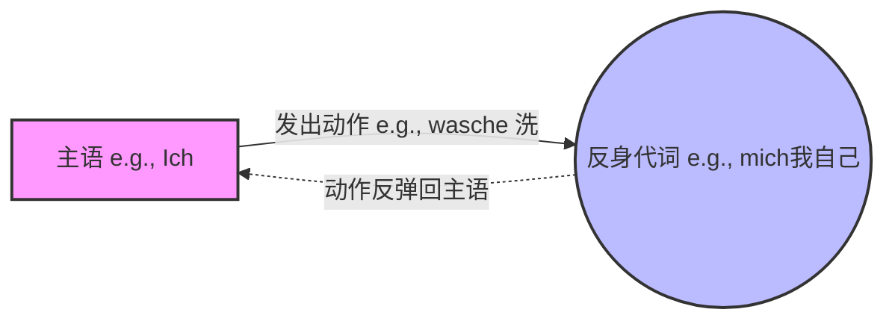

---
aliases:
  - mich
  - dish
  - sich
  - uns
  - euch
  - mir
  - dir
---
# 反身动词和反身代词区别

# 反身代词

### 第一部分：什么是反身代词？——“回旋镖效应”

想象一下你在公园里扔飞盘。如果你把飞盘扔给你的小狗，那是普通的动词（动作发给别人）。但如果你扔的是一个**回旋镖（Boomerang）**，它飞出去之后，最后会“啪”地一下打回到你自己身上。

**反身代词，就是德语语法里的“回旋镖”。** 它表示主语发出的动作，最终又作用回了主语自己身上。

我们用一张图来直观感受一下这个“回旋镖效应”：

代码段

**德语例句：**

- _Ich wasche **mich**._ (我洗**我自己**。-> 中文我们只说“我洗澡”。)

---

### 第二部分：反身代词的“变身魔法”（表格速记）

德语的反身代词其实非常友好，你只需要记住**第三格（Dativ）和第四格（Akkusativ）**。而且，好消息是：**除了“我（ich）”和“你（du）”，其他的反身代词几乎全长得一样！** 第三人称（他/她/它/他们/尊称您）统统用一个万能词：**sich**。

| **人称 (主语)**           | **第四格 (Akkusativ) - 直接宾语** | **第三格 (Dativ) - 间接宾语** | **记忆口诀 / 发现规律** |
| --------------------- | -------------------------- | ---------------------- | --------------- |
| **ich** (我)           | **mich** (我自己)             | **mir** (我自己)          | 和人称代词变化一样       |
| **du** (你)            | **dich** (你自己)             | **dir** (你自己)          | 和人称代词变化一样       |
| **er/sie/es** (他/她/它) | **sich**                   | **sich**               | **万能词 sich！**   |
| **wir** (我们)          | uns                        | uns                    | 没变化             |
| **ihr** (你们)          | euch                       | euch                   | 没变化             |
| **sie/Sie** (他们/您)    | **sich**                   | **sich**               | **万能词 sich！**   |

---

### 第三部分：反身动词的三大门派（结合移民生活场景）

在德国生活，反身代词无处不在。我们将它们分为三个“门派”来理解。

#### 门派一：天生连体婴儿 —— 真反身动词 (Echte reflexive Verben)

这类动词生下来就和反身代词绑在一起，像连体婴儿一样，**绝对不能分开**。如果去掉了反身代词，这个句子就毫无意义甚至语法错误。

- **场景：找工作 (Jobsuche)**
    - **sich bewerben um** (申请...)
    - _Ich bewerbe **mich** um die Stelle als Ingenieur._ (我申请工程师的职位。) -> _你不能只说 Ich bewerbe，必须带上 mich。_
- **场景：生病就医 (Beim Arzt)**
    - **sich erkälten** (感冒)
    - _Der Arzt sagt, ich habe **mich** erkältet._ (医生说，我感冒了。)

#### 门派二：兼职打工仔 —— 假反身动词 (Unechte reflexive Verben)

这类动词平时有自己的工作（带普通宾语），但有时也会“兼职”做反身动词。也就是说，动作既可以对别人做，也可以对自己做。

- **场景：市政厅落户登记 (Anmeldung beim Bürgeramt)**
    - **anmelden** (登记/注册)
    - 对别人做 (普通动词)：_Ich melde **mein Auto** an._ (我给我的车登记上牌。)
    - 对自己做 (反身动词)：_Ich melde **mich** beim Bürgeramt an._ (我去市政厅给自己落户登记。)
- **场景：准备出门**
    - **anziehen** (穿衣)
    - _Die Mutter zieht **das Kind** an._ (妈妈给孩子穿衣服。)
    - _Ich ziehe **mich** an._ (我给自己穿衣服。)

#### 门派三：第四格还是第三格？—— “抢副驾驶座”游戏 (Akkusativ vs. Dativ)

这是B1/B2考试中最爱考的陷阱！很多人分不清什么时候用 mich，什么时候用 mir。其实逻辑非常简单，我们玩个**“抢副驾驶座”**的游戏：

一个动词就像一辆车，它的“副驾驶座”是留给**第四格直接宾语 (Akkusativ)** 的。

1. 如果车上只有你一个人（没有其他宾语），那么**反身代词**就大摇大摆地坐在副驾驶座上（**第四格 Akkusativ**）。
2. 但是！如果你手里拿着一个东西（比如身体部位、物品），这个“东西”必须抢占副驾驶座（作为第四格宾语）。这时候，**反身代词只能委屈地坐到后排去，变成第三格 (Dativ)！**

**对比来看（极其重要！）：**

- **场景：个人卫生**
    - _Ich wasche **mich**._ (我洗澡。 -> 没带东西，mich 坐副驾驶/第四格)
    - _Ich wasche **mir** die Hände._ (我洗手。 -> **die Hände** 抢了副驾驶/第四格，反身代词退居后排变成 **mir**/第三格)
- **场景：面试求职 (Vorstellungsgespräch) - 经典易错点！**
    - **sich etwas (Dat.) vorstellen** = 想象 (imagine)
    - **sich (Akk.) vorstellen** = 自我介绍 (introduce oneself)
    - 面试官对你说：_Können Sie **sich** bitte vorstellen?_ (您能**自我介绍**一下吗？ -> 第四格)
    - 你对租房中介说：_Die Wohnung ist zu teuer. Das kann ich **mir** nicht vorstellen!_ (这房子太贵了，这我无法**想象**！ -> Das 抢了第四格，所以用 mir)

---

### 第四部分：导师验收时间 (Deine Aufgabe!)

掌握了理论，咱们必须马上演练。要达到B2的流利度，就是靠一次次造句积累起来的肌肉记忆。

请你尝试结合我们刚才学的知识，把下面三个你在德国肯定会遇到的生活场景翻译成德语。大推测一下，哪怕写错了也没关系，我会立刻帮你纠正！

1. **场景 - 租房：** 我对这套三居室（die 3-Zimmer-Wohnung）很感兴趣。（提示：对...感兴趣 = _sich interessieren für_，这是一个真反身动词哦）
2. **场景 - 看病：** 我伤到了我的腿（das Bein）。（提示：伤害 = _verletzen_，想想抢座游戏，腿是具体的部位！）
3. **场景 - 职场：** 我们明天下午两点在办公室见。（提示：互相见面 = _sich treffen_，反身代词在这里表示“互相”）

请给出你的答案或者想法，有任何不理解的地方也可以随时向我发问。Would you like me to give you a hint for any of these sentences? (需要我给你一些小提示吗？)

# 柏林广场

## 表

![[Pasted image 20260227151800.png]]

![[Pasted image 20260227152404.png]]

![[Pasted image 20260227152445.png]]

![[Pasted image 20260227152605.png]]

![[Pasted image 20260227152622.png]]

![[Pasted image 20260227152717.png]]

![[Pasted image 20260227153120.png]]

![[Pasted image 20260227153104.png]]

![[Pasted image 20260227153240.png]]

![[Pasted image 20260227153310.png]]

![[Pasted image 20260227153414.png]]

![[Pasted image 20260227153501.png]]

### 练习

![[Pasted image 20260227154123.png]]

![[Pasted image 20260227154315.png]]

![[Pasted image 20260227154331.png]]

![[Pasted image 20260227154347.png]]

# 形容词变名词

![[Pasted image 20260227154536.png]]

![[Pasted image 20260227154640.png]]
