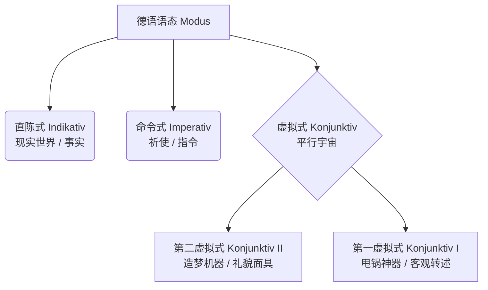

# 虚拟式

### 🌟 核心概念：什么是虚拟式？

你可以把德语的语态想象成**“漫威宇宙”**：

1. **直陈式（Indikativ）**：这是**“现实世界”**。你陈述的是发生的事实。（例：我没有钱。_Ich habe kein Geld._）
2. **虚拟式（Konjunktiv）**：这是**“平行宇宙”**。你谈论的是愿望、假设、如果不那么做会怎样，或者你在客气地请求，亦或是你在转述别人的话。

为了让你一目了然，我们来看下面这张“德语语态家族树”：

德语的虚拟式分为两位大将：**第二虚拟式（Konjunktiv II）和第一虚拟式（Konjunktiv I）**。我们今天系统地把它们挨个拿下！

---

### 🛡️ 第一部分：第二虚拟式（Konjunktiv II）—— 你的“造梦机器”与“礼貌面具”

在德国生活，**第二虚拟式是你每天都会用到的保命技能**。外管局（Ausländerbehörde）办事员的脸有多臭，你的第二虚拟式就要有多礼貌！

它主要用于表达：**非真实的条件（假如...）、美好的愿望（但愿...）、委婉的请求（您能不能...）、以及建议（你应该...）。**

#### 1. 结构大揭秘：怎么变？

不要去背繁琐的词尾变化，大师教你一个B1/B2阶段最实用的“偷懒法则”：

- <mark style="background:#d4b106">**黄金万能公式**</mark>：`würden + 动词原形` （就相当于英语里的 would do）
- **四大金刚（必须记特殊变形）**：
    - **sein (是)** 变成 $\rightarrow$ **wäre** (ich wäre, du wärst, er wäre...)
    - **haben (有)** 变成 $\rightarrow$ **hätte** (ich hätte, du hättest, er hätte...)
    - **werden (成为)** 变成 $\rightarrow$ **würde**
    - **情态动词** (können, müssen, dürfen...) $\rightarrow$ 加乌姆劳特音变（变音符），如 **könnte, müsste, dürfte**。

#### 2. 实战场景应用（移民生活必备）

**🎬 场景一：外管局 / 市民中心（委婉请求 Höfliche Bitte）**

在德国办签证或落户（Anmeldung），直接用直陈式（Ich will... 我要...）会显得像来砸场子的。戴上“礼貌面具”：

> ❌ _Ich will einen Termin._ (太生硬了，办事员可能会翻白眼)
> 
> ✅ **Ich hätte gern einen Termin.** (我想要一个预约。— _hätte_ 瞬间拉满好感度)
> 
> ✅ **Könnten Sie mir bitte helfen?** (您能帮帮我吗？— _könnten_ 比 _können_ 听起来柔和十倍)

**🎬 场景二：找工作与租房（非真实条件 Irrealer Bedingungssatz）**

你在“平行宇宙”里幻想自己条件更好：

> 🏠 **Wenn ich einen unbefristeten Arbeitsvertrag hätte, würde ich diese Wohnung sofort mieten.**
> 
> (如果我有一份无限期工作合同（现实是我没有），我就会马上租下这套公寓（现实是我租不到）。)

**🎬 场景三：看医生（给出建议 Ratschlag）**

医生给你开药，或者你给朋友建议：

> 🩺 **Sie sollten mehr Wasser trinken und sich ausruhen.**
> 
> (您应该多喝水多休息。 — _sollten_ 是 _sollen_ 的虚拟式，表达温和的建议，而不是强制命令。)

#### 3. 进阶：过去的第二虚拟式（B2必考点！）

如果你要抱怨**过去**搞砸的事情（早知道我就...），你需要用到：

`wäre/hätte + 动词的过去分词 (Partizip II)`

> 🏢 找工作被拒后的顿悟：
> 
> **Wenn ich mich besser vorbereitet hätte, hätte ich den Job bekommen.**
> 
> (如果我当时准备得更好，我就拿到那个工作了。—— 现实是：没准备好，工作黄了。)

---

### 📰 第二部分：第一虚拟式（Konjunktiv I）—— 你的“甩锅神器”

进入B2阶段，你会接触到大量的新闻报道，或者你需要跟律师、房东交涉。这时候，**第一虚拟式（Konjunktiv I）**就登场了。

它的核心功能只有一个：**间接引语（Indirekte Rede）**。

为什么叫“甩锅神器”？因为它传递了一个潜台词：**“这是别人说的，是不是真的我可不保证，出了事别找我。”**

#### 1. 结构大揭秘：怎么变？

很简单：`动词现在时的词干 + 虚拟式词尾 (-e, -est, -e, -en, -et, -en)`

最最最常见的是第三人称单数（er/sie/es）：

- **sein** $\rightarrow$ **sei** (全德语最常用的KI，必须死记！)
- **haben** $\rightarrow$ **habe**
- **kommen** $\rightarrow$ **komme**
- **können** $\rightarrow$ **könne**

#### 2. 实战场景应用

**🎬 场景四：租房纠纷（转述房东的话）**

你看中一套房，房东吹得天花乱坠，你回家跟伴侣转述：

> 🗣️ 房东原话 (直陈式)：“Die Heizung **ist** neu und die Nachbarn **sind** sehr ruhig.” (暖气是新的，邻居很安静。)
> 
> 🗣️ 你的转述 (使用第一虚拟式甩锅)：
> 
> **Der Vermieter sagt, die Heizung sei neu und die Nachbarn seien sehr ruhig.**
> 
> (房东说暖气是新的，邻居很安静。—— 潜台词：要是冬天冻成狗或者邻居天天开派对，那都是房东骗人的，不怪我没看好房子！)

**🎬 场景五：看新闻（了解德国时事）**

听Tagesschau（每日新闻）时，播音员经常用：

> 🗞️ **Der Bundeskanzler betont, die Wirtschaft wachse weiter.**
> 
> (总理强调，经济正在继续增长。)

_B2避坑指南（Pro-Tip）_：如果在第一虚拟式里，变位后的长相和“直陈式（现实世界）”一模一样，大家分不清你是在转述还是在陈述事实怎么办？

**答案：用第二虚拟式来代替！**（这个知识点在B2写作中非常加分！）

---

### 📝 大师的随堂测试（你的舞台）

语言是练出来的！现在，请你扮演一位刚到德国，正在准备租房的租客。尝试用今天学到的虚拟式知识，把下面三个句子翻译/改写成德语（不用怕出错，大师会给你批改）：

1. **（委婉请求 - KII）** 尊敬的穆勒先生，您能不能把租房合同发给我？
2. **（非真实条件 - KII）** 如果这套公寓带一个阳台（Balkon, m.），我就（会）租下它。
3. **（客观转述 - KI）** 前租客说，这套公寓非常明亮（hell）。（提示：前租客 der Vormieter；是 sei）

**你准备好交卷了吗？请把你的答案发给我，我们一起来打磨！Would you like me to wait for your sentences, or would you prefer I provide the answers so you can check them yourself?**

# k 17-53-10

动词变化
![[Pasted image 20260226162057.png]]

![[Pasted image 20260226162203.png]]

![[Pasted image 20260226162431.png]]

