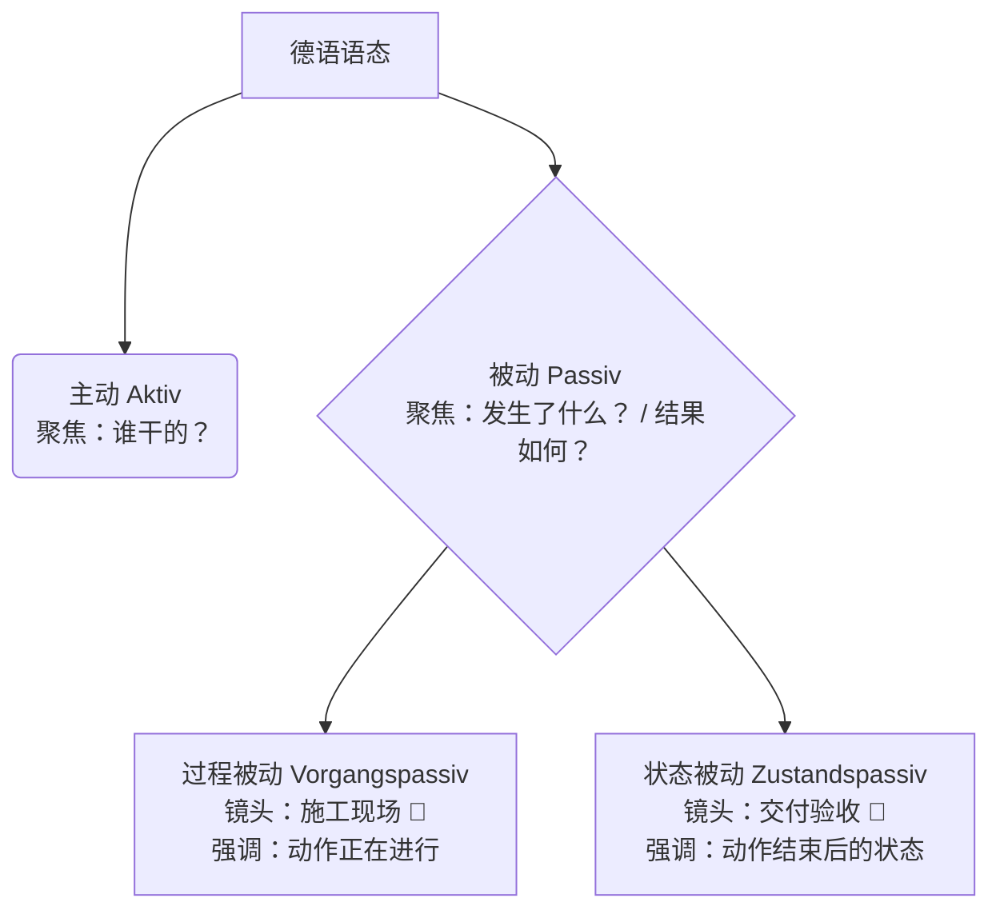

# Ai 被动态：分状态被动和过程被动

---

### 🎥 核心概念：什么是被动态？

想象你手里有一台摄像机。

- **主动语态（Aktiv）**：摄像机的镜头对准了**“做事的人（施动者）”**。比如：“修理工在修暖气。”（重点是修理工这个人）
- **被动语态（Passiv）**：你把镜头猛地一转，对准了**“承受动作的事物（受动者）”**或者**“动作本身”**。比如：“暖气正在被修理。”（重点是暖气，至于谁修的？可能是修理工，也可能是你邻居，不重要，或者我们根本不知道）。

在德国生活，被动态简直是官方文件、新闻报道和推卸责任的“灵魂语言”！

为了让你一目了然，大师给你画了一张“镜头聚焦路线图”：

代码段

下面，我们把这两个分身拆开来揉碎了讲。

---

### 🚧 类型一：过程被动（Vorgangspassiv）什么 被 动作完成 了。

顾名思义，过程被动强调的是**动作的过程**。就像你走进了一个热火朝天的施工现场，耳边是电钻的声音，眼前是正在搬砖的工人。一切都在“正在进行中”或者“经常发生”。

#### 1. 结构大揭秘：黄金公式

> **`werden` (各种时态的变位) + `Partizip II` (动词的过去分词，放在句末)**

#### 2. 实战场景应用（移民生活必备）

**🎬 场景一：外管局等签证（现在时 - Präsens）**

你把材料交上去了，每天都在焦急等待。此时外管局内部的“施工现场”是这样的：

> 🛂 **Der Antrag wird geprüft.**
> 
> (申请**正在被**审查。)
> 
> _解析：`wird` 是 werden 的第三人称单数，`geprüft` 是 prüfen 的过去分词。镜头聚焦在“申请”上，动作正在发生。_

**🎬 场景二：看病就医（过去时 - Präteritum，常用于书面或讲述）**

你跟朋友讲述昨天在医院的经历：

> 🏥 **Ich wurde gestern operiert.**
> 
> (我昨天**被**动了手术。)
> 
> _解析：`wurde` 是 werden 的过去时。_

**🔥 B2必考避坑点：过程被动的完成时（Perfekt）**

这是无数中国学生会栽跟头的地方！大师敲黑板了：

在主动语态里，werden 的过去分词是 geworden。**但是**，在过程被动里，为了避免发音太啰嗦，德国人把 ge- 去掉了，变成了 **`worden`**！

公式：`sein (变位) + Partizip II + worden`

**🎬 场景三：找房/租房（完成时 - Perfekt，常用于口语）**

房东骄傲地对你说，这个房子上个月刚翻新过：

> 🏠 **Die Wohnung ist letzten Monat renoviert worden.** (注意！绝对不能说 renoviert _geworden_)
> 
> (这套公寓上个月**被**翻新了。——强调“翻新”这个动作发生过了。)

---

### 📸 第二部分：状态被动（Zustandspassiv）—— 你的“交付验收”

刚才我们看了“施工现场”，现在施工结束了，工人们都撤了，灰尘也落定了。这时候你拍了一张照片，这就是**状态被动**。它强调的是**动作完成后的结果和状态**。

它的翻译通常不是“正在被...”，而是“**已经是...了**”。

#### 1. 结构大揭秘：白银公式

> **`sein` (各种时态的变位) + `Partizip II` (动词的过去分词，放在句末)**

_大师提示：你看，它长得和带有sein的现在完成时一模一样，但它表达的是一个现在的状态！你可以把这里的过去分词直接当成一个形容词来理解。_

#### 2. 实战场景应用

**🎬 场景四：找工作（残酷的现实）**

你在网上看到一个心仪的职位，打电话过去问，HR冷冰冰地告诉你：

> 💼 **Die Stelle ist leider schon besetzt.**
> 
> (这个职位遗憾地**已经被**占了/满员了。)
> 
> _解析：动作（招人）已经结束，现在的状态是“客满”。_

**🎬 场景五：银行或行政办事（结果确认）**

你问银行柜员你的账户是不是关了，柜员查了一下系统：

> 🏦 **Ihr Konto ist jetzt geschlossen.**
> 
> (您的账户现在**已经是**关闭状态了。)

---

### 🪄 大师的魔法时刻：一组对比，看透本质！

为了让你彻底顿悟，我们用同一个场景（修暖气）来演示“主动 $\rightarrow$ 过程被动 $\rightarrow$ 状态被动”的完整演变。想象现在是德国寒冷的冬天：

1. **主动（聚焦修理工）：**

    👨‍🔧 _Der Hausmeister repariert die Heizung._

    (宿管员正在修暖气。—— 重点在表扬宿管员。)

2. **过程被动（聚焦施工现场）：**

    🚧 **Die Heizung wird repariert.**

    (暖气正在被修理。—— 此时此刻，房间里叮叮当当，暖气还是冷的，但希望就在眼前！)

3. **状态被动（聚焦最终结果）：**

    📸 **Die Heizung ist repariert.**

    (暖气修好了！—— 房间里安安静静，暖气片热乎乎的，你可以舒舒服服躺在沙发上了。)

看懂这三句话的区别，你的被动态就正式从B1毕业，迈向B2了！

---

### 📝 大师的随堂测试（你的舞台）

光听不练假把式。现在，请你结合我们在德国的生活场景，尝试用今天学到的知识，把下面三个句子翻译成德语。判断一下，哪个该用“施工现场（过程被动）”，哪个该用“照片结果（状态被动）”？

1. **（场景：租房入户 - 状态被动）**

    这扇门是锁着的。（提示：锁 abschließen $\rightarrow$ abgeschlossen）

2. **（场景：等快递 - 过程被动，现在时）**

    我的包裹正在被派送（递交）。（提示：派送/递交 zustellen $\rightarrow$ zugestellt）

3. **（场景：外管局 - 过程被动，现在完成时 - 挑战题！）**

    我的签证（das Visum）已经被延长了。（提示：延长 verlängern $\rightarrow$ verlängert。记住那个特殊的完成时词尾哦！）

**放轻松，大胆造句！请把你的答案发给我，我会为你逐一纠错并给出地道的改进建议。Would you like to try translating these three sentences now?**

# 柏林广场

![[Pasted image 20260226163633.png]]

![[Pasted image 20260226164311.png]]

![[Pasted image 20260226164438.png]]

1. 简单来说就是主动换成被动来说，将宾语变为主语，主语不在重要。
	- 我爱她，-》 她被爱，但是人不一定是我。

## 例子

![[Pasted image 20260226172229.png]]

![[Pasted image 20260226172310.png]]

![[Pasted image 20260226173038.png]]

![[Pasted image 20260226173218.png]]

![[Pasted image 20260226173617.png]]

![[Pasted image 20260226193334.png]]

### 练习

将主动变为被动很简单，就是将原来主动去的宾语用来充当主语说明他 被 需要

![[Pasted image 20260226193407.png]]

![[Pasted image 20260226201127.png]]

![[Pasted image 20260226201316.png]]

![[Pasted image 20260226201452.png]]

![[Pasted image 20260226201727.png]]
## 被动态的时态
![[Pasted image 20260226201600.png]]

![[Pasted image 20260226202152.png]]

### 情态动词的时态与实义动词与助动词
![[Pasted image 20260226202300.png]]

![[Pasted image 20260226202333.png]]

![[Pasted image 20260226202508.png]]

![[Pasted image 20260226202609.png]]

### 所有本动态的结构
![[Pasted image 20260226202711.png]]

### übung
![[Pasted image 20260226203243.png]]

![[Pasted image 20260226204528.png]]

![[Pasted image 20260226204545.png]]

![[Pasted image 20260226204624.png]]
