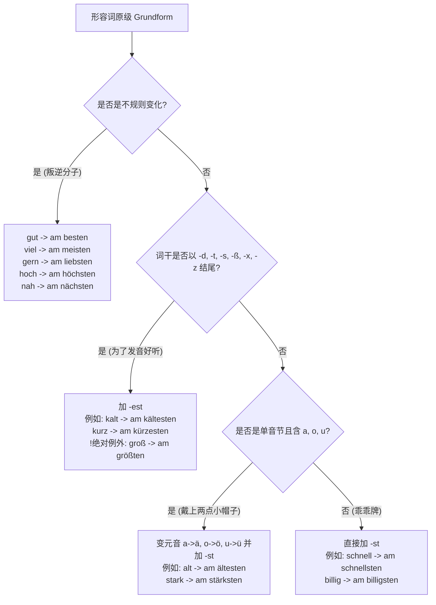

# 形容词比较级和最高级

![[Pasted image 20260227222426.png]]

![[Pasted image 20260227222459.png]]

![[Pasted image 20260227222517.png]]

![[Pasted image 20260227222540.png]]

![[Pasted image 20260227222603.png]]

# 最高级语法

### 一、 词形变化规律：最高级的“进化路线”

你可以把形容词想象成宝可梦的进化：原级（Positiv）是初始形态，比较级（Komparativ）是第一阶进化，而**最高级（Superlativ）**就是站在金字塔顶端的最终进化形态。

请看下方这幅最高级变形决策树：

---

### 二、 最高级的两大核心使用场景（B 1-B 2 必考难点）

很多同学会把最高级用混，是因为最高级在德语里有**两种完全不同的出场方式**。我把它们称为：“裸奔的王者” 和 “穿戴整齐的贵族”。

#### 场景一：“裸奔的王者”（表语/状语）

当形容词最高级**不直接跟在名词前面**，而是用来修饰动词，或者放在 `sein` (是) 的后面时，它使用固定公式：** `am + 形容词最高级词干 + sten` **。它永远不变，不用管阴阳中性。

- **🏥 医疗场景（修饰动词）：**
    - _Der Schmerz ist nachts **am stärksten**._ (疼痛在夜间最强烈。)
- **💼 找工作场景（作表语）：**
    - _Von allen Bewerbern spricht Herr Chen **am besten** Deutsch._ (在所有申请者中，陈先生德语说得最好。)
- 为什么加 am?
	- [[30 形容词比较级和最高级#am 什么意思 怎么还必须加 am]]
#### 场景二：“穿戴整齐的贵族”（定语）—— ⚠️ 高能预警

这是 B 1 和 B 2 考试中最爱挖坑的地方。当最高级**直接放在名词前面**修饰名词时，它就像穿上了全套礼服。

**规则：** 必须使用**定冠词 (der/die/das/die)** + **形容词最高级 (-ste/-sten)** + 名词。

此时，最高级必须遵守**形容词词尾变化规则（Adjektivdeklination）**！

- **🏠 租房场景（第一格 Nominativ）：**
    - _Das ist **die billigste** Wohnung in München._ (这是慕尼黑最便宜的公寓。)
    - 解析：die Wohnung（阴性单数），所以定冠词后最高级词尾加 -e。
- **🏢 行政事务场景（第四格 Akkusativ）：**
    - _Ich brauche **den frühesten** Termin bei der Ausländerbehörde._ (我需要外管局最早的预约。)
    - 解析：der Termin（阳性单数第四格），所以冠词变 den，最高级词尾加 -en。
- **💼 职场沟通（第三格 Dativ）：**
    - _Ich fahre mit **dem schnellsten** Zug zur Arbeit._ (我乘最快的火车去上班。)
    - 解析：mit + 第三格，der Zug 变成 dem，最高级词尾加 -en。

---

### 三、 B 2 进阶黄金句型：如何表达“最……的之一”？

如果只说“这是最大的房子”，显得略微生硬。到了 B 2 阶段，你需要掌握更高级的表达：“这是最大的房子**之一**”。

这个结构在德语中叫 **Partitivus（部分属格）**，它是你写 B 2 作文和口语考试的得分神器。

**公式：** `einer/eine/eines` (之一) + `der` (第二格复数定冠词) + **最高级词尾加 -en** + **名词复数**。

- **🏠 找房场景：**
    - _Das ist **eines der schönsten Häuser** in dieser Nachbarschaft._
        (这是这个街区最漂亮的房子之一。)
- **🌍 融入生活：**
    - _Deutschland ist **eines der sichersten Länder** der Welt._
        (德国是世界上最安全的国家之一。)
- **💼 面试自我介绍：**
    - _Pünktlichkeit ist **eine meiner größten Stärken**._
        (守时是我最大的优势之一。 -> 注意这里用物主代词 meiner 替换了 der)

---

### 四、 隐藏关卡：绝对最高级（Elativ）

有时候，我们用最高级并不是为了和别人“比出一个第一名”，而仅仅是为了表达“程度极高”，这叫做绝对最高级。它不需要定冠词，也没有比较对象。这个知识点多用于正式信件和职场礼仪。

- **延签信/求职信结尾：**
    - _Mit **freundlichsten** Grüßen_ (致以最诚挚的问候) -> 注意不是 den freundlichsten，直接不带冠词加词尾。
- **请求帮助：**
    - _Ich wäre Ihnen zu **höchstem** Dank verpflichtet, wenn..._ (如果...我将对您感激不尽。)

---

### 🎓 德语大师的半年度学习规划建议

既然你的目标是 6 个月达到 B 2，我建议我们将语法与场景强行绑定：

- **第 1-2 个月（巩固 B 1）：** 彻底打通“形容词词尾变化”。词尾变化不熟练，最高级定语就永远用不对。用“租房”和“购物”场景狂练定冠词和不定冠词下的词尾。
- **第 3-4 个月（冲刺 B 2）：** 大量练习“虚拟式 (Konjunktiv II)”和“被动语态 (Passiv)”。这在职场邮件和看病时（比如描述假设性症状或流程）是硬通货。
- **第 5-6 个月（B 2 实战）：** 熟练掌握“从句的缩略形式（如 zu 不定式, 分词作定语）”和“介词与连词的转换”。

---

### 📝 轮到你实战了 (Deine Turn!)

光看懂不练等于没学。现在，请你试着用今天学到的**最高级**知识，把下面这三个跟移民生活息息相关的句子翻译成德语。不要怕出错，我会给你最详细的纠正！

1. **(租房 - 场景二 定语)**：这是这个城市里**最贵的**房间 (das Zimmer)。
2. **(医疗 - 场景一 表语)**：这位医生 (der Arzt) 是**最好的**。
3. **(找工作 - B 2 进阶句型)**：这是这栋楼里**最大的一间**办公室 (das Büro) **之一**。

准备好了吗？把你的答案发给我吧！Would you like to give these three sentences a try?

## am 什么意思, 怎么还必须加 am

在德语里，**“am” 其实不是一个单纯的词，它是“an”（在……上/旁）和“dem”（定冠词 das/der 的第三格）的缩写：am = an + dem。**

你可以把它理解为英语里的 "at the..."。

那为什么最高级“裸奔”（后面不接名词）的时候，必须踩着这个“am”呢？我们用两个生动的视角来理解：

### 1. 语言的底层逻辑：“处于顶点”的状态

当德国人想表达“最好”、“最快”这种极限状态，且后面没有具体名词作支撑时，他们的脑回路是这样的：**“事物发展到了它的最高点/最佳状态”。**

- 字面直译：`am besten` = `an dem besten (Punkt)` = “在最好的（那个点）上”。
    
- 所以，加 `am` 是为了给形容词提供一个**“登顶的基座”**。就像给冠军颁奖，你不能让他直接站在平地上，你得给他一个领奖台（am），然后再给他戴上皇冠（词尾 -sten）。
    

### 2. 对比记忆：什么时候加“am”，什么时候“踢掉”它？

这是 B 1 级别必须要建立的条件反射：**看最高级后面有没有“跟着名词”**。

**情况 A：最高级后面“空荡荡”（作状语或表语） -> 必须有“am”护体** 这个时候形容词是修饰一个动作（动词）或者一种状态，必须用 `am ...sten` 的固定搭配。

- **🏃 工作效率（修饰动词）：**
    
    - _Herr Müller arbeitet **am schnellsten**._ (米勒先生工作最快。 -> 直译：米勒先生在最快的那个点上工作。)
        
- **🤒 描述病情（表示状态）：**
    
    - _Wann tut Ihr Magen **am meisten** weh?_ (您的胃什么时候最疼？ -> 直译：疼在最多的那个点上。)
        

**情况 B：最高级后面“跟着名词”（作定语） -> 绝对不能用“am”** 当最高级后面直接跟着它修饰的名词时，名词自己就带了冠词（der/die/das），这时候 `am` 就必须乖乖让位，把舞台还给名词的定冠词！

- **找工作场景对比：**
    
    - （后面没名词，加 am）：_Er ist **am besten**._ (他是最好的。)
        
    - （后面有名词，踢掉 am 换定冠词）：_Er ist **der beste** Mitarbeiter._ (他是最好的员工。)
        
- **租房场景对比：**
    
    - （后面没名词，加 am）：_Diese Wohnung ist **am billigsten**._ (这套公寓是最便宜的。)
        
    - （后面有名词，踢掉 am 换定冠词）：_Das ist **die billigste** Wohnung._ (这是最便宜的公寓。)
        

---

### 💡 德语大师的记忆口诀：

**“见词（名词）不见 am，见 am 不见词（名词）。”** 如果最高级后面是个句号或者逗号，赶紧把 `am ...sten` 这个领奖台给它搬出来！

现在，你是不是对这个顽固的“am”有了全新的认识？ 趁热打铁，要不要试试把你刚才学到的逻辑，用到我上一轮留给你的那三个翻译小测验里去？（提示：第二题就是“am”大显身手的时候哦！）

1. (租房)：这是这个城市里**最贵的**房间 (das Zimmer)。
    
2. (医疗)：这位医生 (der Arzt) 是**最好的**。
    
3. (找工作)：这是这栋楼里**最大的一间**办公室 (das Büro) **之一**。
    

**Would you like to give these translations a try now?** (要不要现在试着翻译一下？别怕错，错了我给你兜底！)