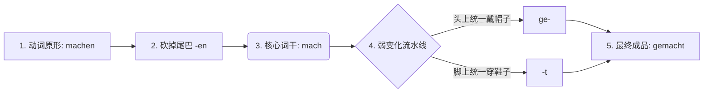

# 阳性弱变化动词

在德语的动词世界里，所有的“老板（实义动词）”基本分为两大帮派：**强变化动词（Starke Verben）** 和 **弱变化动词（Schwache Verben）**。

今天我们要搞定的，就是德语里数量最多、脾气最好、也是最容易掌握的帮派——**弱变化动词**。

### 弱变化动词的本质：“流水线上的标准件”与“乖宝宝”

为什么叫它“弱”？这里的“弱”不是指力量小，而是指它**“性格软弱，没有主见，绝对服从规则”**。

如果说强变化动词是喜欢天天换发型、性格叛逆的“变色龙”（比如：gehen 变成 gegangen，连根基都变了），那么**弱变化动词就是流水线上生产出来的“标准件”**，或者说是穿统一校服的“乖宝宝”。

不管在什么时态下，**弱变化动词的“词干（核心躯干）”永远不会发生改变**。它只需要在头上戴一顶统一的帽子，或者在脚上穿一双统一的鞋子。

我们以我们在德国找工作、租房时最常用的动作——组装家具或者做事 **“machen” (做/干)** 为例，来看看它的“二分词（Partizip II）”是怎么在流水线上加工出来的：

### 核心公式： `ge` + 词干 + `t`

这就是所有弱变化动词变身“二分词”（也就是坐在句子最后面的那个形态）的万能公式。

**移民生活实战场景：**

当你刚搬进新租的公寓（Wohnung），你需要去宜家买家具，你需要向房东报告你都干了什么。

* **kaufen (买):** 词干是 kauf -> 戴帽子穿鞋 -> **gekauft**
* Ich habe ein Bett **gekauft**. (我买了一张床。)
* **suchen (寻找):** 词干是 such -> 戴帽子穿鞋 -> **gesucht**
* Ich habe lange einen Job **gesucht**. (我找工作找了很久。)
* **fragen (询问):** 词干是 frag -> 戴帽子穿鞋 -> **gefragt**
* Ich habe den Beamten **gefragt**. (我询问了那个公务员。)

你看，是不是超级简单？不管这些词怎么用，它们的核心 (kauf, such, frag) 稳如泰山，绝对不玩花样。

---

### B 1/B 2 进阶预警：乖宝宝群体里的“两个小特例”

虽然弱变化动词很乖，但有两类词在流水线上享有“特权”。它们**不需要戴 `ge-` 这顶帽子**，只需要穿 `-t` 这双鞋子。这是你在 B 级别考试和外管局实战中必须避开的坑：

#### 特权 1：“外来海归派” —— 以 `-ieren` 结尾的动词

德语里有很多从法语、英语借来的词，它们都以 `-ieren` 结尾。德国人觉得它们是“外宾”，自带洋气，所以免去了戴传统德国帽子 `ge-` 的义务。

* **telefonieren (打电话):** -> ~~getelefoniert~~ -> **telefoniert**
* **studieren (读大学):** -> ~~gestudiert~~ -> **studiert**
* **reservieren (预订):** -> ~~gereserviert~~ -> **reserviert**

> *场景（去外管局前）：* Ich habe einen Termin **reserviert**. (我预订了一个预约。)

#### 特权 2：“自带连体帽的词” —— 不可分前缀动词

有些动词天生就带有“不可拆散的前缀”（如：**be-, emp-, ent-, er-, ge-, ver-, zer-**，简称“不可分前缀”）。既然头上已经长了一顶帽子（前缀），流水线就不会再硬给它扣一顶 `ge-` 了。

* **besuchen (拜访):** 带有 be- -> ~~gebesucht~~ -> **besucht**
* **bezahlen (支付):** 带有 be- -> ~~gebezahlt~~ -> **bezahlt** (这就是为什么上一课里，“老板”bezahlen 的二分词还是 bezahlt 的原因！)
* **verkaufen (卖):** 带有 ver- -> ~~geverkauft~~ -> **verkauft**

> *场景（买卖二手车）：* Ich habe mein Auto **verkauft**. (我把我的车卖了。)

---

**大师总结：** 弱变化动词的本质就是“省心”。只要你判断出一个词是弱变化，直接套用 **`ge + 词干 + t`** 的公式（注意 `-ieren` 和不可分前缀的免帽特权），你就能瞬间造出完美的完成时和被动语态句子！

**下一步（Nächster Schritt）：**

是时候验收这台“组装流水线”了。假设你刚到德国，在市政厅（Bürgeramt）办理完了登记手续（Anmeldung），你想用德语给家里人发个消息汇报：

**“我已经登记了我的住址（die Adresse），并且也预订了网络（das Internet）。”**

*提示词：*

* 登记：melden（弱变化：戴帽子穿鞋子）
* 预订：reservieren（外来派：只穿鞋不戴帽）
* 助动词都是 haben（我已经...）

你能用今天学的流水线规则，加上我们上节课“司机在第二位，老板在最后一位”的框架，把这句话造出来吗？试一试，写对写错都没关系，大胆开麦！
