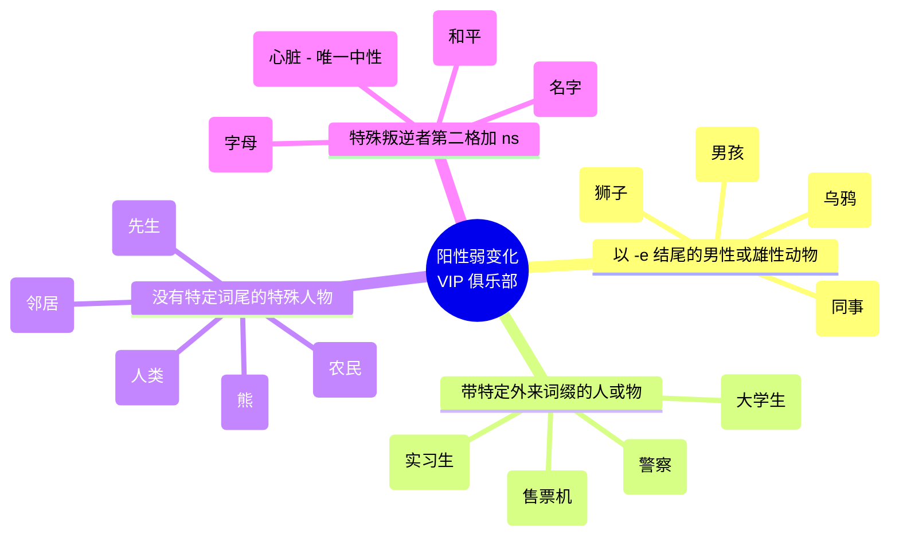
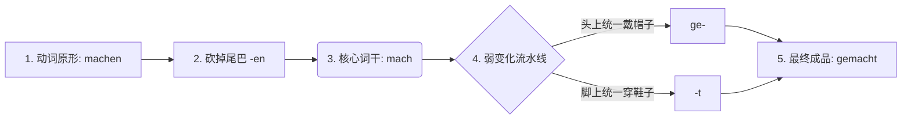

# 阳性弱变化动词

Guten Tag! 欢迎来到德语大师的课堂。要在 6 个月内顺利通关 B 2，融入德国的真实生活，我们需要把语法从“枯燥的规则”变成“生活中的工具”。

今天我们要彻底攻克的这座大山叫做——**阳性弱变化名词（N-Deklination）**。

很多同学一看到“变格”就头疼，但其实，**你可以把阳性弱变化名词想象成一群“缺乏安全感的 VIP 大佬”**。普通的阳性名词（比如 `der Mann`）在不同的格（第一、二、三、四格）会有不同的变化，像个独立自主的成年人。而这群“VIP 大佬”非常娇气，它们只要一离开家门（离开第一格/主语的安全区），不论去哪（变成第二、三、四格），都必须要带上它们的“专属保镖”——**词尾 `-n` 或 `-en` **。

我们先来看一个核心对比图表，一秒看懂它们有多“粘人”：

| **格 (Kasus)**  | **正常阳性名词 (硬汉代表)** | **阳性弱变化名词 (VIP 代表)** |
| -------------- | ----------------- | -------------------- |
| **第一格 (Nom.)** | der Mann (男人)     | der Herr (先生)        |
| **第四格 (Akk.)** | den Mann          | den Herr**n**        |
| **第三格 (Dat.)** | dem Mann          | dem Herr**n**        |
| **第二格 (Gen.)** | des Mann**es**    | des Herr**n**        |

你看，`der Herr` 除了在第一格是原形，到了第四、第三、第二格，全都粘上了 `-n`。而且，**它们所有复数形式的词尾也统一是 `-(e)n` **。

为了让你更直观地记住哪些词属于这个“VIP 俱乐部”，我为你制作了一张分类图表：

代码段

---

### 核心知识点拆解与 B 2 实战应用

想要在 6 个月内达到 B 2，你不能死记硬背，必须把它们放进**德国移民的真实生活场景**中去。我们分门别类来击破：

#### 1. 以 `-e` 结尾的男性或雄性动物

这是最好记的一类。只要是阳性，词尾是 `-e`，且代表生物，大概率就是弱变化。

- **常见词：** `der Kollege` (同事), `der Junge` (男孩), `der Experte` (专家), `der Löwe` (狮子)。
- **职场场景 (Job)：** * _错误：_ Ich habe gestern mit dem neue Kollege gesprochen.
    - _正确：_ Ich habe gestern mit dem neuen **Kollegen** gesprochen. (昨天我和新来的同事聊过了。) -> _第三格，必须加 -n。_

#### 2. 带有国际范儿外来词缀的名词 (主要指人)

这些词通常来自拉丁语或法语，结尾重读。只要看到这些词缀，直接给它们配上保镖 `-en`。

- **词缀雷达：** `-and`, `-ant`, `-ent`, `-at`, `-ist`
- **常见词：** `der Doktorand` (博士生), `der Praktikant` (实习生), `der Patient` (病人), `der Polizist` (警察), `der Automat` (自动机器 - 这是少见的死物弱变化)。
- **医疗/生活场景 (Gesundheit/Alltag)：**
    - Der Arzt untersucht den **Patienten**. (医生正在给病人做检查。) -> _第四格，加 -en。_
    - Ich habe das Ticket am **Automaten** gekauft. (我在自动售票机上买了票。) -> _第三格，加 -en。_

#### 3. “硬汉外表，弱小内心”的少数派名词

这类词没有明显的后缀特征，需要作为特殊词汇单独记忆。

- **常见词：** `der Mensch` (人类), `der Herr` (先生), `der Nachbar` (邻居), `der Bär` (熊), `der Architekt` (建筑师), `der Fotograf` (摄影师)。
- **租房场景 (Wohnen)：**
    - Ich verstehe mich sehr gut mit meinem neuen **Nachbarn**. (我和我的新邻居相处得很好。) -> _第三格，加 -n。_

#### 4. “叛逆者”：第二格要多加一个 `-s`

在 B 2 级别的写作（如写投诉信或正式邮件）中，第二格（Genitiv）是展示你语言高级感的利器。有几个抽象名词在弱变化的基础上，**第二格还要再加一个 `-s` **（变成 `-ns`）。

- **常见词：** `der Name` (名字), `der Friede` (和平), `der Gedanke` (思想), `der Buchstabe` (字母)。
- **⚠️ 特殊卧底：** `das Herz` (心脏)。它是**唯一一个混进阳性弱变化队伍里的中性词**！(第一/四格: das Herz; 第三格: dem Herzen; 第二格: des Herzens)
- **行政事务场景 (Behörde)：**
    - Können Sie bitte den **Namen** des **Herrn** buchstabieren? (您能拼写一下这位先生的名字吗？) -> _den Namen 是第四格加 -n，des Herrn 是第二格加 -n。_
    - Wegen des **Namens** auf dem Dokument gibt es ein Problem. (因为文件上的名字，出现了一点问题。) -> _第二格，加 -ns。_

---

### 💡 德语大师的独家提分 Tips

1. **口语与书面语的区别：** 正如你提供的资料中所说，“口语中，词尾 n 常常被省去不说”。在德国街头，你可能会听到德国人说 "Ich frage den Kollege"。**但是！** 你的目标是半年后通过 B 2 考试。在歌德/TELC 考试的口语和写作中，省略 `-n` 会被扣除语法分。请务必养成肌肉记忆，逢弱变化必加 `-n`！
2. **字典里的秘密：** 当你查字典时，如果看到一个阳性名词后面写着 `(der) Mensch, -en, -en`。这就代表它在第二格和复数都加 `-en`，这是字典在悄悄告诉你：“嘿，我是阳性弱变化名词！”
3. **自测法：** 每次遇到 `der Herr`, `der Kollege`, `der Mensch` 做宾语时，立刻在脑海里亮起红灯 🚨，强迫自己多发一个 "n" 的音。

德语语法就像搭乐高，一开始找零件很痛苦，但只要分类清晰，很快就能拼出宏伟的城堡。把这些带有 `-n` 尾巴的 VIP 词汇用进你明天的造句里，搞定它们，你的 B 2 证书就稳了一大半！Viel Erfolg! (祝你成功！)

# 2

在德语的动词世界里，所有的“老板（实义动词）”基本分为两大帮派：**强变化动词（Starke Verben）** 和 **弱变化动词（Schwache Verben）**。

今天我们要搞定的，就是德语里数量最多、脾气最好、也是最容易掌握的帮派——**弱变化动词**。

### 弱变化动词的本质：“流水线上的标准件”与“乖宝宝”

为什么叫它“弱”？这里的“弱”不是指力量小，而是指它**“性格软弱，没有主见，绝对服从规则”**。

如果说强变化动词是喜欢天天换发型、性格叛逆的“变色龙”（比如：gehen 变成 gegangen，连根基都变了），那么**弱变化动词就是流水线上生产出来的“标准件”**，或者说是穿统一校服的“乖宝宝”。

不管在什么时态下，**弱变化动词的“词干（核心躯干）”永远不会发生改变**。它只需要在头上戴一顶统一的帽子，或者在脚上穿一双统一的鞋子。

我们以我们在德国找工作、租房时最常用的动作——组装家具或者做事 **“machen” (做/干)** 为例，来看看它的“二分词（Partizip II）”是怎么在流水线上加工出来的：

### 核心公式： `ge` + 词干 + `t`

这就是所有弱变化动词变身“二分词”（也就是坐在句子最后面的那个形态）的万能公式。

**移民生活实战场景：**

当你刚搬进新租的公寓（Wohnung），你需要去宜家买家具，你需要向房东报告你都干了什么。

* **kaufen (买):** 词干是 kauf -> 戴帽子穿鞋 -> **gekauft**
* Ich habe ein Bett **gekauft**. (我买了一张床。)
* **suchen (寻找):** 词干是 such -> 戴帽子穿鞋 -> **gesucht**
* Ich habe lange einen Job **gesucht**. (我找工作找了很久。)
* **fragen (询问):** 词干是 frag -> 戴帽子穿鞋 -> **gefragt**
* Ich habe den Beamten **gefragt**. (我询问了那个公务员。)

你看，是不是超级简单？不管这些词怎么用，它们的核心 (kauf, such, frag) 稳如泰山，绝对不玩花样。

---

### B 1/B 2 进阶预警：乖宝宝群体里的“两个小特例”

虽然弱变化动词很乖，但有两类词在流水线上享有“特权”。它们**不需要戴 `ge-` 这顶帽子**，只需要穿 `-t` 这双鞋子。这是你在 B 级别考试和外管局实战中必须避开的坑：

#### 特权 1：“外来海归派” —— 以 `-ieren` 结尾的动词

德语里有很多从法语、英语借来的词，它们都以 `-ieren` 结尾。德国人觉得它们是“外宾”，自带洋气，所以免去了戴传统德国帽子 `ge-` 的义务。

* **telefonieren (打电话):** -> ~~getelefoniert~~ -> **telefoniert**
* **studieren (读大学):** -> ~~gestudiert~~ -> **studiert**
* **reservieren (预订):** -> ~~gereserviert~~ -> **reserviert**

> *场景（去外管局前）：* Ich habe einen Termin **reserviert**. (我预订了一个预约。)

#### 特权 2：“自带连体帽的词” —— 不可分前缀动词

有些动词天生就带有“不可拆散的前缀”（如：**be-, emp-, ent-, er-, ge-, ver-, zer-**，简称“不可分前缀”）。既然头上已经长了一顶帽子（前缀），流水线就不会再硬给它扣一顶 `ge-` 了。

* **besuchen (拜访):** 带有 be- -> ~~gebesucht~~ -> **besucht**
* **bezahlen (支付):** 带有 be- -> ~~gebezahlt~~ -> **bezahlt** (这就是为什么上一课里，“老板”bezahlen 的二分词还是 bezahlt 的原因！)
* **verkaufen (卖):** 带有 ver- -> ~~geverkauft~~ -> **verkauft**

> *场景（买卖二手车）：* Ich habe mein Auto **verkauft**. (我把我的车卖了。)

---

**大师总结：** 弱变化动词的本质就是“省心”。只要你判断出一个词是弱变化，直接套用 **`ge + 词干 + t`** 的公式（注意 `-ieren` 和不可分前缀的免帽特权），你就能瞬间造出完美的完成时和被动语态句子！

**下一步（Nächster Schritt）：**

是时候验收这台“组装流水线”了。假设你刚到德国，在市政厅（Bürgeramt）办理完了登记手续（Anmeldung），你想用德语给家里人发个消息汇报：

**“我已经登记了我的住址（die Adresse），并且也预订了网络（das Internet）。”**

*提示词：*

* 登记：melden（弱变化：戴帽子穿鞋子）
* 预订：reservieren（外来派：只穿鞋不戴帽）
* 助动词都是 haben（我已经...）

你能用今天学的流水线规则，加上我们上节课“司机在第二位，老板在最后一位”的框架，把这句话造出来吗？试一试，写对写错都没关系，大胆开麦！
